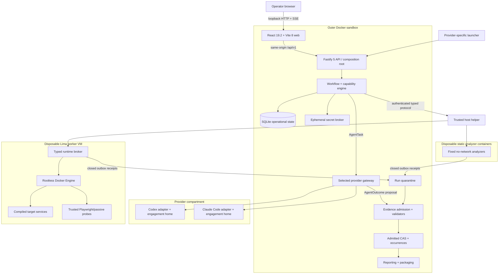

# Repository Assessment Kit — Architecture Specification

**Status:** final, implementation-ready  
**Target:** `repo-assessment-kit`  
**Architecture strategy:** adapter/plugin-first cross-agent platform  
**Contract profile:** `rak-contract/1.0.0`  
**Workflow profile:** `rak-workflow/1.0.0`  
**Export profile:** `rak-export-profile/1.0.0`  
**Date:** 2026-07-27

## 1. Architectural thesis and scope

Repository Assessment Kit (RAK) is a local, single-operator control plane around
nondeterministic agents and analyzers. Codex and Claude Code are replaceable reasoning
providers. Static and dynamic analyzers are replaceable, release-owned plugins. Neither
provider prose nor scanner output is authoritative: the trusted engine owns lifecycle,
capability policy, evidence admission, coverage, validation, redaction, and package release.

The architecture has five invariants:

1. Both provider paths must satisfy the same versioned outcomes, discovery topics,
   assessment-domain matrix, schemas, state transitions, evidence rules, independent
   reviews, validation gates, and package inventory. Their prose and ZIP bytes need not be
   identical.
2. Capabilities are declared, attested, approved, and resolved by the engine. A provider,
   plugin, target, or operator-facing request cannot grant itself a capability.
3. The static assessment and a valid customer package are the dependable core. Dynamic
   runtime coverage is additive; unsafe or unavailable runtime becomes honest `blocked`,
   `not applicable`, or `not tested` coverage.
4. Every retry is a new fenced attempt. Every evidence capture is a distinct occurrence,
   even when its bytes deduplicate to an existing content blob. Completed revisions and
   admitted evidence are immutable.
5. No assessed application receives a physical-host Docker socket, provider credential,
   SSH material, live source mount, operational database, or package staging tree.

This is an MVP architecture. It does not add a hosted service, message broker, external
database, arbitrary agent runtime, arbitrary plugin marketplace, remediation executor, or
cross-run dashboard.

## 2. Requirements to components

| Requirement | Owning components | Enforcement |
|---|---|---|
| Guided discovery and explicit unknowns | Web, workflow, contracts | Fixed discovery matrix; every topic answered or explicitly unknown; seven provenance labels only |
| Immutable SSH/local target | Source acquisition, host helper | Registered handles, isolated acquisition worker, full commit plus snapshot digest, atomic export, before/after live-source check |
| Complete static assessment | Workflow, analyzer adapters, provider adapters | Required domain matrix; fixed no-network analyzers; unavailable depth becomes coverage, never empty success |
| Safe dynamic assessment | Capability resolver, host helper, in-VM broker | Disposable mount-free Lima VM, compiled Compose policy, rootless Docker, default-deny runtime egress |
| Evidence and provenance | Evidence admission, contracts | Blob/occurrence split, Entity–Activity–Agent provenance, materiality and cross-reference gates |
| Decision support | Provider adapter, decision validator | Same criteria for remediation, incremental replacement, and rebuild; evidence/unknown required per factor |
| Security baseline | Control planner, analyzers, independent reviewer | Pinned ASVS/WSTG/Top 10/SSDF/CWE/CVSS profiles; technical coverage, never compliance inference |
| Customer-ready output | Reporting, redaction, packaging | One-way artifact flow, static HTML/Markdown/native JSON/SARIF/CycloneDX/CSV, JCS manifest, SHA-256, reopened ZIP |
| Codex/Claude compatibility | Agent adapters, conformance harness | Common task/outcome DTOs and equivalence certificate; pinned separate homes/images |
| Portable operation | P4 container/launcher assets, host helper | Node 24 and multi-arch images; loopback UI; native four-host release matrix; WSL best effort |

## 3. System overview

### 3.1 Context and component diagram



### 3.2 Trust zones and residual risks

The trusted computing base is the physical host, Docker/Lima installation, RAK host helper,
server, ephemeral secret broker, locked schemas/policies/tool manifests, evidence
admission, validators, packager, pinned worker-VM image, and in-VM broker. Provider models,
provider output, repository bytes and instructions, scanner parsers/output, Compose,
Dockerfiles, images, target processes, and target-generated web content are untrusted.

The VM limits the blast radius of target/container/worker-daemon compromise. It does not
claim protection against a hypervisor or physical-host kernel escape. An approved provider,
Git, dependency, or optional-service egress destination remains a possible exfiltration
channel. Checksums prove integrity relative to a trusted digest, not authorship.

### 3.3 Credential compartments

| Component | Provider home | SSH input | Snapshot | Sandbox secret | SQLite | Quarantine/outbox | Package staging | Docker/Lima |
|---|---:|---:|---:|---:|---:|---:|---:|---:|
| Web | no | no | no | writes one-time secret channel only | no | no | safe metadata only | no |
| Server/workflow | no | handle metadata only | index/read | broker handle only | repository port | admission metadata | package metadata | typed host-helper client only |
| Codex job | its engagement home | no | task view read-only | no | no | own proposal outbox | no | no |
| Claude job | its engagement home | no | task view read-only | no | no | own proposal outbox | no | no |
| Acquisition worker | no | exact selected key/socket/known-hosts only | creates | no | no | acquisition outbox | no | no |
| Static analyzer | no | no | one snapshot read-only | no | no | one job outbox | no | no |
| Host helper | no | exact registered source inputs | transfers by object ID | encrypted envelope only | no | transfers declared receipts | no | fixed operations |
| Runtime broker | no | no | copied verified snapshot | purpose-scoped one-use value | no | one runtime outbox | no | worker socket only |
| Target/probe | no | no | read-only copy/work volume | declared service/probe only | no | no direct export | no | no |
| Packager | no | no | identity metadata | age secret by protected channel | no | admitted/redacted only | sole writer until freeze | no |

Provider homes are distinct by `{engagementId, provider}`. An explicit launcher action may
seed a new engagement volume from an authenticated base, but sessions, project indexes,
MCP configuration, and local settings never cross engagements. Release equivalence runs
disable host-global instructions.

### 3.4 Network classes

Network identities are distinct and separately audited:

- `provider-inference`: selected provider hostnames only from the provider compartment;
- `git-acquisition`: the approved Git host only from acquisition;
- `tool-update`: build/release time only, never silent during assessment;
- `build-acquisition`: approved registries/dependency hosts through a logged proxy;
- `target-runtime`: denied by default; exact endpoint exceptions require approval;
- `optional-service`: exact hosted analyzer destination plus data/retention disclosure;
- `internal-runtime`: target services and trusted probes on an internal VM network only.

There is no generic “internet enabled” capability.

## 4. Repository layout, ownership, and dependencies

### 4.1 Paths and single owners

The layout aligns exactly with `PLAN.md`:

```text
apps/
  web/                         P6 frontend owner
  server/                      P5 backend owner
packages/
  contracts/                   P5
  workflow/                    P5
  persistence/                 P5
  evidence/                    P5
  analyzers/                   P5
  runtime/                     P5
  agent-adapters/              P5
  reporting/                   P5
  packaging/                   P5
container/                     P4
scripts/                       P4
fixtures/                      P4 scaffold/harness; P5/P6 add owned test data below assigned paths
docs/                          P4 initial operator scaffold; P7 final release docs
package.json                   P4 only
pnpm-workspace.yaml            P4 only
pnpm-lock.yaml                 P4 only
tsconfig*.json                 P4 only
eslint.config.*               P4 only
prettier.config.*             P4 only
vitest*.config.*              P4 only
start-codex.sh                 P4 only
start-cc.sh                    P4 only
generated/                    gitignored runtime output
state/                        gitignored cross-run operational state
```

P5 and P6 request dependency changes through the tech lead; neither edits root manifests or
`pnpm-lock.yaml`. P6 does not edit shared backend packages. P5 does not edit `apps/web`.

### 4.2 Dependency direction

`packages/contracts` is the leaf and contains public JSON Schemas, TypeScript DTOs,
OpenAPI, event names, and fixtures. It imports no other workspace package.

```text
apps/web -> contracts (generated API client/types only)
apps/server -> workflow + persistence + evidence + analyzers + runtime
            + agent-adapters + reporting + packaging + contracts
workflow -> contracts and port interfaces declared in workflow
persistence -> contracts
evidence -> contracts
analyzers -> contracts
runtime -> contracts
agent-adapters -> contracts
reporting -> contracts
packaging -> contracts
```

Concrete adapters implement workflow ports in `apps/server`; `workflow` never imports a
concrete persistence, provider, analyzer, runtime, report, or package package. Packages
never import `apps/*`, and no package imports `apps/web`. CI rejects dependency cycles and
forbidden edges.

### 4.3 Runtime filesystem

```text
state/rak.sqlite
state/backups/
state/source-handles.json        IDs and paths; mode 0600; never customer content
generated/.control/intake/<runId>/
generated/<project>-<commit>-<YYYYMMDDTHHMMSSZ>/
  internal/
    snapshot/
    quarantine/<attemptId>/
    provider-exchange/
    runtime-exchange/
    operational-logs/
  objects/sha256/<first2>/<digest>
  canonical/<revision>/
  staging/<revision>/
  package/<revision>/
```

All run-specific output is under its one run root. `state/` is cross-run operational state,
gitignored and excluded from packages. The operational database, source handles, provider
homes, raw credentials, and unredacted quarantine are never customer artifacts.

## 5. Components and boundaries

| Component | Responsibility | Public/internal interface | Boundary |
|---|---|---|---|
| React web | Discovery, source selection, approvals, progress, limitations, findings/evidence, reviews, package download | OpenAPI client + SSE | No filesystem, provider, source, DB, or raw evidence access |
| Fastify composition root | Local session, request validation, API DTO mapping, safe downloads/previews | `/api/v1`, `/health/*` internal | No arbitrary shell/Docker/Lima/provider flags |
| Workflow engine | State reducers, phase DAG, durable scheduler, leases/fences, retry/pause/cancel/resume, outbox | typed ports in `packages/workflow` | Only component changes current run/phase/job state |
| Capability resolver | Combines release support, host/plugin attestations, operator approvals, task needs | `CapabilitySnapshot` | Plugins declare requirements; engine resolves effective state |
| Persistence worker | One serialized SQLite writer and paginated queries | message port from server | SQLite only; no long-running work in transaction |
| Source acquisition | SSH/local isolated capture, target identity, snapshot atomicity and live-source integrity | typed host-helper operations | Live source exists only here, read-only |
| Agent adapters | Map common task to pinned Codex/Claude CLI, stream events, normalize result | `AgentTask`/`AgentOutcome` | Output is proposal; no policy/state/package authority |
| Analyzer adapters | Locked manifest, fixed invocation and exact native normalizer | `AnalyzerManifest`/`AnalyzerOutcome` | No target config, shell, network, credentials, or mutable source |
| Host helper | Runs fixed acquisition/analyzer jobs and Lima lifecycle | authenticated framed protocol | Only process using physical Docker/Lima; no web exposure |
| Runtime broker | Compile allowed runtime, operate rootless Docker, egress/resource enforcement, evidence collection | typed in-VM protocol | Sole worker Docker client |
| Secret broker | Store scoped values in memory/tmpfs, one-use redemption, revocation | opaque handles and typed redemption | No SQLite/list/readback; provider credentials excluded |
| Evidence admission | Verify fenced receipts, blob/occurrence provenance, redaction, schema/semantic admission | `AdmissionRequest/Result` | Sole promoter from quarantine to admitted record |
| Reporting | Typed projections to Markdown, static HTML, CSV, SARIF, CycloneDX | renderer inputs from canonical docs | Cannot invent evidence/control state |
| Packaging | Storage preflight, frozen staging, manifest/checksums/ZIP/age verification | `PackageRequest/Result` | Only admitted/redacted artifacts; fail closed |

### 5.1 Provider launchers

`start-codex.sh` and `start-cc.sh` expose the same verbs: `login`, `status`,
`interactive`, `run`, and `resume`. They select pinned provider images, create/select a
private engagement home, preserve process exit/signal status, use a TTY only for interactive
verbs, start the same server/UI/helper contract, and publish only the UI port to
`127.0.0.1`. Unknown provider CLI flags are rejected.

Codex maps unattended work to `codex exec --sandbox workspace-write
--ask-for-approval never --json`; Claude maps to `claude -p --permission-mode dontAsk
--output-format stream-json --verbose` with an explicit allowlist. Bypass modes are not a
product capability.

### 5.2 Evidence display boundary

Target-derived bytes are **attachment-only by default**. The API never serves raw HTML,
SVG, XML, JavaScript, CSS, PDF, archives, scanner HTML, or unknown media inline. Download
responses use a server-generated filename, `Content-Disposition: attachment`,
`X-Content-Type-Options: nosniff`, `Cache-Control: no-store`,
`Cross-Origin-Resource-Policy: same-origin`, and
`Content-Security-Policy: default-src 'none'; sandbox`.

Safe preview is a new redaction/transformation occurrence, not the raw evidence:

- UTF-8 plain text, JSON, CSV, SARIF, CycloneDX, and Markdown are parsed under limits and
  returned as structured JSON/text; the UI renders with `textContent`, never
  `dangerouslySetInnerHTML` and never Markdown-to-HTML.
- PNG, JPEG, and WebP are decoded under pixel/byte/time limits, metadata stripped, and
  re-encoded by the trusted preview worker. GIF, SVG, PDF, and unknown images are attachment
  only.
- Screenshots follow the same decode/re-encode rule before preview/package admission.

The privileged UI CSP is:

```text
default-src 'self'; script-src 'self'; style-src 'self';
img-src 'self' data:; connect-src 'self'; object-src 'none';
base-uri 'none'; form-action 'self'; frame-ancestors 'none'
```

Target pages are never loaded in the operator UI, same-origin iframe, or new privileged
window. Runtime browsing happens only inside the worker VM. If a future format requires an
iframe, it must use an opaque sandbox without scripts, same-origin, forms, popups, top
navigation, or downloads; this is not needed in MVP.

## 6. Durable lifecycle and scheduling

### 6.1 Run states

Canonical enum values and legal transitions are:

```text
DRAFT -> RESOLVING_TARGET
RESOLVING_TARGET -> READY | RECOVERABLE_FAILURE | CANCELLING
READY -> EXECUTING | CANCELLING
EXECUTING -> WAITING_INPUT | PAUSING | VALIDATING
           | RECOVERABLE_FAILURE | FAILED | CANCELLING
WAITING_INPUT -> EXECUTING | PAUSING | FAILED | CANCELLING
PAUSING -> PAUSED | RECOVERABLE_FAILURE | CANCELLING
PAUSED -> EXECUTING | CANCELLING
RECOVERABLE_FAILURE -> READY | EXECUTING | FAILED | CANCELLING
VALIDATING -> REVIEW_REQUIRED | RECOVERABLE_FAILURE | FAILED | CANCELLING
REVIEW_REQUIRED -> PACKAGING | EXECUTING | FAILED | CANCELLING
PACKAGING -> COMPLETED | RECOVERABLE_FAILURE | FAILED | CANCELLING
CANCELLING -> CANCELLED
```

`COMPLETED`, `CANCELLED`, and `FAILED` are terminal. Continuing after a terminal state or
changing target/discovery/profile/policy creates a new run revision with `parentRunId`;
terminal data is never reopened. Every transition is compare-and-swap on `rowVersion` and
writes a transactional event. Illegal transitions return `409 RUN_STATE_CONFLICT`.

### 6.2 Phase graph and phase states

The versioned phase graph is:

1. `discovery`
2. `target-snapshot`
3. `static-inventory`
4. `static-security-quality` (parallel controls)
5. `runtime-capability`
6. `dynamic-assessment` (conditional actions; planned controls always resolved)
7. `product-code-traceability`
8. `decision-synthesis`
9. `independent-security-review`
10. `independent-decision-review`
11. `deterministic-validation`
12. `technical-human-review`
13. `lay-human-review`
14. `package`

Phase states:

```text
PENDING -> READY
READY -> RUNNING | SKIPPED | CANCELLED
RUNNING -> WAITING_INPUT | RETRYABLE_FAILURE | SUCCEEDED | FAILED | CANCELLED
WAITING_INPUT -> RUNNING | CANCELLED
RETRYABLE_FAILURE -> READY | FAILED | CANCELLED
```

`SKIPPED` is legal only for a phase marked conditional by the workflow profile. Dynamic
assessment is not silently skipped: every planned dynamic control gets a coverage result,
then the phase may succeed with limitations.

### 6.3 Fenced attempts, leases, and completion

Every dispatch creates immutable:

```ts
type PhaseAttempt = {
  attemptId: string;
  phaseId: string;
  attemptNumber: number;
  phaseRevision: number;
  inputDigest: Digest;
  leaseOwner: string;
  leaseExpiresAt: Timestamp;
  fenceToken: string;            // decimal monotonic integer
  startedAt: Timestamp;
  deadlineAt: Timestamp;
  endedAt?: Timestamp;
  outcome?: "SUCCEEDED"|"FAILED"|"TIMED_OUT"|"CANCELLED"|"INTERRUPTED";
  supersedesAttemptId?: string;
  completionDigest?: Digest;
};
```

`inputDigest` is SHA-256 of JCS over target snapshot digest, workflow/export/contract
profiles, discovery revision, approved capability objects, tool/standards locks, policy,
and sorted upstream completion digests. Default lease duration is 90 seconds, heartbeat
every 30 seconds. Receipts include the current fence; admission rejects a late or superseded
fence even if its process succeeded.

Completion requires a closed outbox, admitted occurrences, reconciled controls/coverage,
and a deterministic `CompletionCertificate`. Process exit or model assertion alone cannot
complete work.

### 6.4 Idempotency, outbox, pause/cancel/resume

All API mutations require `Idempotency-Key`. The stored key includes principal, operation,
run, normalized request digest, response, and expiry. Same key/body replays the response;
same key/different body returns `409 IDEMPOTENCY_CONFLICT`.

Internal `commandId` is deterministic from `attemptId + operation + ordinal`. Re-dispatch
returns/resumes prior status. SQLite state mutation and `run_events` insertion occur in the
same transaction. An SSE publisher reads the transactional outbox and may redeliver after a
crash; event sequence IDs make this safe.

Pause stops new dispatch. Safe static work may close its outbox; provider/runtime work is
checkpointed or cancelled according to adapter capability. Cancel increments the fence,
signals providers/analyzers, revokes run secrets, stops/destroys runtime, closes outboxes,
and records cleanup residues. It never deletes admitted evidence or a validated package.

Provider resume is allowed only when adapter, session ID, target snapshot, task schema,
instruction digest, evidence view digest, and prior fence match. Otherwise a new task
attempt starts. Host-helper `status`, `heartbeat`, and `reconcile` recover analyzer and VM
commands. Startup expires leases, runs SQLite integrity checks, reconciles only resources
tagged with this installation ID, finalizes valid atomic admissions, and never deletes an
unrecognized resource.

## 7. Canonical contract conventions and matrices

### 7.1 Primitive rules

- IDs are prefixed UUIDv7 strings (`run_`, `phs_`, `att_`, `act_`, `blb_`, `evd_`,
  `fnd_`, `ctl_`, `apr_`, `art_`, `pkg_`).
- `Digest` is `sha256:` plus 64 lowercase hexadecimal characters.
- Timestamps are UTC RFC 3339 with milliseconds.
- Paths are normalized repository- or package-relative POSIX paths. Absolute paths,
  backslashes, `.`/`..`, NUL, control characters, and Unicode/case collisions are invalid.
- Byte lengths are decimal strings to stay JCS/I-JSON safe.
- Public objects are strict Draft 2020-12 JSON Schema objects. Extension data exists only
  below reverse-DNS keys in `extensions`.
- Duplicate JSON member names are rejected before parsing. Hashable JSON obeys I-JSON.
- Every document includes `schemaVersion` and an immutable schema `$id` through validation
  context.

### 7.2 Required discovery matrix

Each topic has exactly one current `ProductClaim` or `UnknownClaim`:

```text
target-customers
buyers
user-roles
customer-pain
valuable-workflows
alternatives-differentiators
revenue-retention-critical-behavior
contractual-obligations
expected-scale
feature-parity-expectations
```

Unknowns include reason, confidence effect, coverage effect, and follow-up owner. Code
inference never upgrades an owner/context topic to owner-stated.

### 7.3 Required assessment-domain matrix

| Domain ID | Required baseline producer(s) | Completion rule |
|---|---|---|
| `repository-composition` | kit walker, scc | inventory occurrence plus exclusions/limits |
| `stack-detection` | kit walker, Syft, provider mapping | stack claims linked to occurrences |
| `architecture-boundaries` | provider task over admitted static evidence | substantive assessment or explicit unverified limitation |
| `engineering-maintainability` | scc, PMD/CPD, provider analysis | tool coverage and evidence-backed interpretation |
| `features-use-cases` | provider product/code trace | every critical workflow/parity item linked, missing, or unverified |
| `dependency-inventory` | Syft | CycloneDX projection with honest composition completeness |
| `dependency-vulnerabilities` | OSV-Scanner | offline DB provenance; resolver gaps partial |
| `secret-detection` | Gitleaks plus Trivy correlation | matched values never retained; clean is technique-limited |
| `sast` | Opengrep kit-owned rules | rule-pack/domain coverage per ecosystem |
| `iac-container-license` | Trivy | findings plus legal-analysis limitation |
| `runtime-readiness` | deterministic capability gate | capable/blocked/not-applicable with attempted steps |
| `dynamic-browser-security` | Playwright/passive probe if capable | all planned controls resolved; absence does not fail static |
| `security-independent-review` | fresh review task | distinct recorded validation of material security conclusions |
| `modernization-decision` | synthesis and independent review | all three options use identical criteria |
| `evidence-package-integrity` | deterministic validators/packager | all release gates and ZIP reopen pass |

Every run has one `DomainCoverage` record per row. Provider paths cannot omit, rename, or
substitute domains.

### 7.4 Cross-agent equivalence certificate

Both real provider dry runs must produce:

```ts
type EquivalenceCertificate = {
  schemaVersion: "1.0.0";
  equivalencePairId: string;
  runId: string;
  provider: "codex"|"claude-code";
  pairedRunId: string;
  inputBindingDigest: Digest;
  inputBinding: {
    snapshotId:string;
    snapshotManifestDigest:Digest;
    discoveryRevisionDigest:Digest;
    workflowProfile:"rak-workflow/1.0.0";
    exportProfile:"rak-export-profile/1.0.0";
    contractProfile:"rak-contract/1.0.0";
    assessmentPlanDigest:Digest;
    policyDigest:Digest;
    toolchainLockDigest:Digest;
    standardsLockDigest:Digest;
    instructionBundleDigest:Digest;
    capabilityRequirementsDigest:Digest;
  };
  discoveryTopics: Record<DiscoveryTopic, "answered"|"unknown">;
  domains: Record<AssessmentDomain, CoverageStatus>;
  requiredSchemasValid: true;
  materialityValid: true;
  sourceIntegrityValid: true;
  controlReconciliationValid: true;
  securityReviewPresent: true;
  decisionReviewPresent: true;
  requiredArtifactsPresent: true;
  redactionValid: true;
  manifestAndZipValid: true;
  prohibitedActionsObserved: false;
  acceptanceHarnessVersion: string;
  validationReportId: string;
};
```

An `equivalence_pairs` row is allocated before either run starts and names exactly two run
IDs, one per provider. `inputBindingDigest` is SHA-256 of JCS of `inputBinding`. Pair
creation rejects any field difference other than provider adapter/image/session metadata.
The row is immutable after the first run enters `EXECUTING`; each run and package references
it. The equivalence validator requires both terminal package-validation reports and both
certificates to name each other and the same pair/binding digest. A retry using changed
discovery, snapshot, policy, profile, locks, instructions, plan, or capability requirements
creates a new pair, never updates the old one.

Equivalence passes only when binding and all fixed fields/domain/artifact keys validate.
Finding count, prose, tool order, timestamps, and package bytes are not compared.

## 8. Canonical RAK 1 DTOs

The following shapes are normative. P5 materializes equivalent strict JSON Schemas in
`packages/contracts/schemas/rak/1.0/`; field names and enum values do not drift without a
profile change.

### 8.1 Run, target, phase, and completion

```ts
type RunDocument = {
  schemaVersion: "1.0.0";
  runId: string;
  parentRunId?: string;
  projectSlug: string;
  revision: number;
  rowVersion: number;
  state: RunState;
  workflowProfile: "rak-workflow/1.0.0";
  exportProfile: "rak-export-profile/1.0.0";
  provider: "codex"|"claude-code";
  targetSnapshotId?: string;
  createdAt: Timestamp;
  updatedAt: Timestamp;
  terminalAt?: Timestamp;
  limitationIds: string[];
  packageId?: string;
};

type TargetSnapshot = {
  schemaVersion: "1.0.0";
  snapshotId: string;               // digest of JCS manifest
  sourceKind: "ssh-git"|"local";
  sanitizedLocator: string;
  gitObjectFormat: "sha1"|"sha256";
  commitSha: string;
  baseCommitSha: string;
  mode: "commit-only"|"frozen-working-tree";
  manifestBlobId: string;
  manifestDigest: Digest;
  archiveDigest: Digest;
  beforeSourceDigest: Digest;
  afterSourceDigest: Digest;
  includedDirtyPaths: string[];
  excludedDirtyPaths: string[];
  submodules: "not-present"|"pointers-only"|"explicitly-acquired";
  lfs: "not-present"|"pointers-only"|"explicitly-acquired";
  createdAt: Timestamp;
};

type PhaseDocument = {
  schemaVersion: "1.0.0";
  phaseId: string;
  runId: string;
  phaseKey: PhaseKey;
  phaseRevision: number;
  state: PhaseState;
  currentAttemptId?: string;
  required: boolean;
  dependsOn: string[];
  limitationIds: string[];
};

type CompletionCertificate = {
  schemaVersion: "1.0.0";
  certificateId: string;
  runId: string;
  phaseId: string;
  attemptId: string;
  fenceToken: string;
  inputDigest: Digest;
  outputOccurrenceIds: string[];
  outputDigests: Digest[];
  controlResultIds: string[];
  coverageIds: string[];
  validationReportId: string;
  limitationIds: string[];
  completionDigest: Digest;
  completedAt: Timestamp;
};
```

### 8.2 Product claims

```ts
type ClaimProvenance =
  | "owner-stated" | "documented" | "observed"
  | "analytics-supported" | "code-inferred"
  | "unverified" | "conflicting";

type ProductClaim = {
  schemaVersion: "1.0.0";
  claimId: string;
  runId: string;
  topic: DiscoveryTopic;
  statement?: string;
  unknown?: {reason: string; confidenceEffect: string; coverageEffect: string; followUp: string};
  provenance: ClaimProvenance;
  speakerRole?: string;
  capturedAt?: Timestamp;
  analytics?: {dataset: string; query: string; windowStart: Timestamp; windowEnd: Timestamp};
  inferenceReasoning?: string;
  confidence: "high"|"medium"|"low";
  evidenceOccurrenceIds: string[];
  conflictsWithClaimIds: string[];
  supersedesClaimId?: string;
  revision: number;
};
```

Exactly one of `statement` and `unknown` is present. `owner-stated` requires speaker role
and capture time; `analytics-supported` requires analytics; `code-inferred` requires
reasoning; `conflicting` requires at least two conflicting claims/evidence references.

### 8.3 Evidence blob, occurrence, provenance, and redaction

Content identity and evidence identity are deliberately separate:

```ts
type EvidenceBlob = {
  schemaVersion: "1.0.0";
  blobId: string;
  runId: string;
  sha256: Digest;
  byteLength: string;
  mediaType: string;
  storageRelPath: string;
  storageState: "QUARANTINED"|"ADMITTED"|"REDACTED"|"DELETED";
  createdAt: Timestamp;
};

type EvidenceOccurrence = {
  schemaVersion: "1.0.0";
  evidenceId: string;
  runId: string;
  blobId: string;
  evidenceType: string;
  title: string;
  snapshotId: string;
  activityId: string;
  capturedAt: Timestamp;
  sourceLocator?: {
    repoRelPath: string;
    startLine?: number; startColumn?: number;
    endLine?: number; endColumn?: number;
  };
  packageRelPath?: string;
  externalLocator?: string;
  sensitivity: "public"|"customer-confidential"|"secret-suspected"|"restricted";
  redactionState: "none-required"|"pending"|"redacted"|"excluded";
  validationState: "unreviewed"|"validated"|"disputed"|"invalidated";
  collectionLimitations: string[];
  derivedFromEvidenceIds: string[];
  linkedClaimIds: string[];
  linkedFindingIds: string[];
  linkedControlIds: string[];
  supersedesEvidenceId?: string;
};

type ProvenanceAgent = {
  agentId: string;
  kind: "operator"|"provider"|"tool"|"system";
  name: string;
  version?: string;
  digest?: Digest;
  providerRole?: string;
};

type ProvenanceActivity = {
  activityId: string;
  runId: string;
  attemptId: string;
  agentId: string;
  kind: string;
  captureMethod: string;
  sanitizedCommand?: string[];
  configDigest?: Digest;
  startedAt: Timestamp;
  endedAt: Timestamp;
  outcome: "succeeded"|"failed"|"partial"|"cancelled";
};

type RedactionDerivation = {
  schemaVersion: "1.0.0";
  derivationId: string;
  sourceEvidenceId: string;
  resultEvidenceId: string;
  activityId: string;
  policyVersion: string;
  transformations: Array<{
    kind: "remove"|"replace"|"crop"|"reencode"|"truncate"|"metadata-strip";
    locator?: string;
    replacement?: string;
    reasonCode: string;
  }>;
  sourceDigestRetained: boolean;
  reviewerState: "automated"|"reviewed";
};
```

Blob deduplication is per run and only on bytes. Every capture, source location, tool
invocation, redaction, and review creates its own occurrence/activity relationship, even
when multiple occurrences reference the same blob. A unique blob digest never collapses
provenance or finding relationships.

### 8.4 Controls, coverage, findings, and decisions

```ts
type CoverageStatus =
  | "pass" | "fail" | "partial"
  | "blocked" | "not applicable" | "not tested";

type ControlResult = {
  schemaVersion: "1.0.0";
  controlResultId: string;
  runId: string;
  plannedControlId: string;
  profileId: string;
  controlId: string;                 // versioned framework/native ID
  plannedScope: string;
  status: CoverageStatus;
  reasonCode?: string;
  reason?: string;
  techniqueIds: string[];
  evidenceOccurrenceIds: string[];
  limitationId?: string;
  activityId: string;
  reviewedBy?: string;
  completedAt: Timestamp;
};

type DomainCoverage = {
  schemaVersion: "1.0.0";
  coverageId: string;
  runId: string;
  domainId: AssessmentDomain;
  status: CoverageStatus;
  plannedControls: number;
  reconciledControls: number;
  counts: Record<CoverageStatus, number>;
  exclusions: string[];
  unsupportedEcosystems: string[];
  limitationIds: string[];
  evidenceOccurrenceIds: string[];
};

type Finding = {
  schemaVersion: "1.0.0";
  findingId: string;
  runId: string;
  fingerprint: {algorithm: "rak-finding/v1"; value: string};
  revision: number;
  supersedesFindingId?: string;
  title: string;
  description: string;
  category: string;
  technicalSeverity: "critical"|"high"|"medium"|"low"|"informational";
  businessPriority: "urgent"|"high"|"medium"|"low"|"unassigned";
  confidence: "high"|"medium"|"low";
  validationState:
    | "unreviewed" | "corroborated" | "independently reproduced"
    | "disputed" | "invalidated";
  evidenceOccurrenceIds: string[];
  locations: Array<{repoRelPath:string; startLine?:number; endLine?:number}>;
  cweMappings: Array<{
    cweId:string; catalogVersion:"4.20"; primary:boolean;
    method:"tool"|"analyst"|"imported"; confidence:"high"|"medium"|"low";
  }>;
  cvss: Array<{
    system:"CVSS"; version:string; vector:string; score:string; band:string;
    scorer:string; scoredAt:Timestamp; evidenceOccurrenceIds:string[]; imported:boolean;
  }>;
  remediationTheme?: string;
};

type DecisionComparison = {
  schemaVersion: "1.0.0";
  runId: string;
  criteria: Array<{
    criterion:
      | "recoverability" | "system-boundaries" | "security-risk"
      | "engineering-risk" | "critical-feature-parity"
      | "expected-scale" | "rebuild-feasibility";
    options: Record<"remediation"|"incremental-replacement"|"full-rebuild", {
      assessment: string;
      state: "evidenced"|"unverified"|"conflicting";
      confidence: "high"|"medium"|"low";
      claimIds: string[];
      evidenceOccurrenceIds: string[];
    }>;
  }>;
  recommendation:
    | {kind:"single"; option:"remediation"|"incremental-replacement"|"full-rebuild"}
    | {kind:"conditional-sequence"; options:Array<"remediation"|"incremental-replacement"|"full-rebuild">};
  rationale: string;
  confidence: "high"|"medium"|"low";
  assumptions: string[];
  dependencies: string[];
  reversalConditions: string[];
};
```

Each planned control has exactly one current result. `pass` may omit a reason; every other
status requires reason code/text and evidence or limitation. `not applicable` means the
subject is demonstrably absent. `blocked` means a prerequisite, safety boundary, or
authorization prevented an applicable/potentially applicable test. `not tested` means
applicable work was deliberately omitted, exhausted its safe budget, or was not selected.
`partial` means only a defined subset was exercised. Coverage counts must reconcile.

### 8.5 Agent task and outcome

```ts
type AgentTask = {
  schemaVersion: "1.0.0";
  taskId: string;
  runId: string;
  attemptId: string;
  fenceToken: string;
  taskKind:
    | "repository-map" | "product-code-trace" | "architecture-analysis"
    | "security-analysis" | "finding-review" | "decision-synthesis"
    | "decision-review" | "plain-language-review";
  providerRole: "author"|"independent-reviewer";
  target: {snapshotId:string; commitSha:string; manifestDigest:Digest};
  evidenceView: {viewId:string; digest:Digest; allowedEvidenceIds:string[]};
  instructionBundleDigest: Digest;
  requiredOutputSchemaId: string;
  acceptanceChecks: string[];
  allowedCommands: Array<
    "get-run-context"|"get-evidence-metadata"|"get-safe-evidence-text"
    |"submit-proposal"|"report-limitation"
  >;
  budget: {wallSeconds:number; outputBytes:number};
  deadlineAt: Timestamp;
};

type AgentOutcome = {
  schemaVersion: "1.0.0";
  taskId: string;
  runId: string;
  attemptId: string;
  fenceToken: string;
  provider: "codex"|"claude-code";
  adapterVersion: string;
  cliVersion: string;
  imageDigest: Digest;
  modelId?: string;
  providerSessionId?: string;
  outcome:
    | "succeeded"|"contract-invalid"|"permission-denied"
    | "provider-unavailable"|"budget-exhausted"|"cancelled"|"failed";
  proposalReceipt?: ArtifactReceipt;
  operationalLogReceipt: ArtifactReceipt;
  limitationIds: string[];
  startedAt: Timestamp;
  endedAt: Timestamp;
};
```

Independent-review tasks use a fresh session, no author transcript, read-only evidence, and
only a review outbox. Same-provider fresh-session review is acceptable when only one
provider is available but is labeled as a separate perspective, not organizational
independence.

### 8.6 Analyzer manifest and outcome

```ts
type AnalyzerManifest = {
  schemaVersion: "1.0.0";
  protocol: "rak-analyzer/1.0.0";
  pluginId: string;
  pluginVersion: string;
  engine: {name:string; version:string};
  imageDigests: {"linux/amd64":Digest; "linux/arm64":Digest};
  domains: AssessmentDomain[];
  ecosystems: Array<"node"|"python"|"go"|"java"|"dotnet"|"ruby"|"php"|"generic">;
  inputKinds: Array<"target-snapshot"|"runtime-origin"|"container-image">;
  nativeOutputSchemas: Array<{mediaType:string; version:string}>;
  network: "none"|"internal-runtime"|"operator-approved-hosted";
  mounts: Array<"snapshot-ro"|"outbox-rw"|"tool-assets-ro">;
  fixedEntrypoint: string[];
  configProfileId: string;
  limitsProfileId: string;
  normalizerId: string;
  licenseNoticeDigest: Digest;
};

type AnalyzerOutcome = {
  schemaVersion: "1.0.0";
  jobId: string;
  runId: string;
  attemptId: string;
  fenceToken: string;
  pluginId: string;
  pluginVersion: string;
  engineVersion: string;
  imageDigest: Digest;
  configDigest: Digest;
  rulesDigest?: Digest;
  databaseDigest?: Digest;
  outcome:
    | "completed-with-findings"|"completed-clean"|"tool-failure"
    | "timeout"|"policy-rejection"|"cancelled";
  rawReceipts: ArtifactReceipt[];
  exclusions: string[];
  truncations: string[];
  coverageEffects: Array<{domainId:AssessmentDomain; status:CoverageStatus; reason:string}>;
  startedAt: Timestamp;
  endedAt: Timestamp;
};

type ArtifactReceipt = {
  receiptId: string;
  outboxName: string;
  mediaType: string;
  byteLength: string;
  sha256: Digest;
  closed: true;
};
```

Plugins are checked-in manifests plus trusted normalizers; users cannot load arbitrary code
through the UI. Unknown native versions remain opaque occurrences and cause reduced
coverage, never a clean result.

### 8.7 Capabilities and approvals

```ts
type CapabilityResult = {
  capabilityId: string;
  scope: "installation"|"engagement"|"run"|"attempt";
  declaredBy: string[];
  support: "supported"|"unsupported";
  attestation: "passed"|"failed"|"missing"|"expired";
  approval: "approved"|"denied"|"not-required"|"missing";
  effective: "available"|"unavailable"|"blocked"|"denied"|"not-applicable";
  reasonCode: string;
  reason: string;
  evidenceOccurrenceIds: string[];
  coverageEffects: string[];
  checkedAt: Timestamp;
};

type Approval = {
  schemaVersion: "1.0.0";
  approvalId: string;
  runId: string;
  capabilityId: string;
  decision: "approved"|"denied";
  destinations: Array<{scheme:string; host:string; port:number; pathPrefix?:string}>;
  methods?: string[];
  dataCategories: string[];
  recipientServices: string[];
  credentialHandleId?: string;
  disclosureVersion: string;
  approverRole: string;
  approvedAt: Timestamp;
  expiresAt: Timestamp;
  revokedAt?: Timestamp;
};

type DynamicControlPlanPayload = {
  schemaVersion: "1.0.0";
  controlPlanId: string;
  runId: string;
  runtimeId: string;
  runtimeCreationNonce: string;
  attemptId: string;
  fenceToken: string;
  snapshotId: string;
  compiledPlanId: string;
  compiledPlanDigest: Digest;
  selectedProfileIds: string[];
  approvalIds: string[];             // may be empty for release-profile-authorized P0-P3 controls
  authorityDigest: Digest;           // JCS digest of selected profiles and applicable approvals
  internalOrigins: Array<{scheme:"http"|"https"; host:string; port:number}>;
  controls: Array<{
    plannedControlId: string;
    safetyClass:
      | "P0-passive" | "P1-anonymous-read"
      | "P2-authenticated-read" | "P3-session-bootstrap";
    internalOrigin: {scheme:"http"|"https"; host:string; port:number};
    method: "GET"|"HEAD"|"OPTIONS"|"POST";
    routeTemplate: string;
    principalPseudonym?: string;
    rolePseudonym?: string;
    tenantPseudonym?: string;
    secretPurpose?: "target-service"|"probe";
    secretRecipient?: string;
    fixtureIds: string[];
    expectedSideEffects: string[];
    budgets: {
      requests: number; bytes: string; requestsPerSecond: number;
      wallSeconds: number; redirects: number;
    };
    permittedOutputClass: "O0"|"O2"|"O3";
    abortTriggers: string[];
    cleanupAssertion: string;
    coverageOnDenyOrInterruption: "blocked"|"not tested"|"partial";
  }>;
  probeProfileId: string;
  issuedAt: Timestamp;
  expiresAt: Timestamp;              // no later than the attempt, approval, or runtime lease
  nonce: string;
};

type SignedDynamicControlPlan = {
  payload: DynamicControlPlanPayload;
  payloadDigest: Digest;             // SHA-256 of RFC 8785 JCS(payload)
  signatureAlgorithm: "Ed25519";
  signingKeyId: string;
  signature: string;                 // Ed25519 over domain || 0x00 || JCS(payload)
};
```

An approval with empty destinations cannot enable egress. Applicability is
`not-assessed`, `customer-stated`, or `customer-confirmed`, never auto-determined.

The signature domain is the UTF-8 string `rak-dynamic-control-plan/v1`. The trusted
control-plan signer is a host-helper service reachable only through a mode-`0600` typed
socket. Its private key is provisioned outside the repository and images and is never
mounted or exposed to provider, analyzer, acquisition, target, probe, request-guard,
generated-output, environment, or argv compartments. The release-pinned verification key
and key ID are present in the broker/request-guard image and attested by `vm.preflight`.

The workflow creates the unsigned payload only after `vm.compile` and `vm.start` have
returned the compiled-plan digest, runtime creation nonce, and exact internal origins. The
signer accepts only strict, size-bounded payloads that are a non-expansive projection of
the release control catalog, selected profiles, current capability, applicable DRAFT
approvals, current attempt/fence, and helper journal. It signs the canonical payload and
returns the envelope; it exposes no generic signing operation. A failed or unavailable
signer resolves affected controls as `blocked` and cannot be bypassed.

### 8.8 Events, errors, reports, and manifest

```ts
type RunEvent = {
  schemaVersion: "1.0.0";
  sequence: string;                 // decimal monotonic per run
  runId: string;
  rowVersion: number;
  type:
    | "run.state.changed"|"phase.state.changed"|"job.state.changed"
    | "capability.changed"|"coverage.changed"|"finding.admitted"
    | "review.required"|"artifact.admitted"|"package.state.changed"
    | "warning.raised";
  occurredAt: Timestamp;
  phaseId?: string;
  attemptId?: string;
  summary: string;
};

type ErrorEnvelope = {
  error: {
    code: string;
    message: string;
    requestId: string;
    retryable: boolean;
    details: Array<{path?:string; reason:string}>;
    operatorAction?: string;
    coverageEffects?: string[];
  };
};

type ReportDescriptor = {
  reportId: string;
  runId: string;
  kind: "executive"|"decision"|"technical"|"security"|"coverage-limitations";
  format: "markdown"|"html";
  templateVersion: string;
  inputDigest: Digest;
  outputEvidenceId: string;
  plainLanguageGate: "passed";
};

type Review = {
  schemaVersion: "1.0.0";
  reviewId: string;
  runId: string;
  kind: "independent-security"|"independent-decision"|"technical-human"|"lay-human";
  reviewerAgentId: string;
  inputDigest: Digest;
  verdict: "passed"|"passed-with-objections"|"failed";
  itemResults: Array<{
    itemId:string;
    outcome:
      |"corroborated"|"independently reproduced"
      |"disputed"|"invalidated"|"not assessed";
    objection?:string;
    evidenceOccurrenceIds:string[];
  }>;
  acceptedCorrectionIds: string[];
  limitationIds: string[];
  reviewEvidenceId: string;
  completedAt: Timestamp;
};

type PackageManifest = {
  schemaVersion: "1.0.0";
  profile: "rak-export-profile/1.0.0";
  runId: string;
  snapshotId: string;
  generatedAt: Timestamp;
  entries: Array<{
    path: string;
    role: "payload"|"manifest-self"|"checksums-self";
    artifactKind: string;
    mediaType: string;
    byteLength?: string;
    sha256?: Digest;
    schemaOrProfile?: string;
    sensitivity: string;
    redactionState: string;
    evidenceOccurrenceIds: string[];
  }>;
};
```

Manifest entries are sorted by normalized UTF-8 path bytes. Manifest and checksum self
entries omit self-referential size/hash. Error codes are enumerated in
`packages/contracts/errors.json`; unknown internal errors map to `INTERNAL_INVARIANT`.

## 9. Source acquisition and immutable snapshots

### 9.1 Source handles and no broad mounts

The launcher registers exact resources before the server starts:

- a local source root as `sourceHandleId`, mounted read-only only into acquisition;
- an exact SSH private-key regular file and exact known-hosts file; or
- an exact SSH agent socket plus exact known-hosts file.

It never mounts the host home, parent workspace, whole provider config, or arbitrary
`~/.ssh` directory into the server/provider/analyzer/runtime. The API accepts
`{sourceHandleId, relativePath}` rather than an arbitrary local path. The helper
canonicalizes the result beneath the registered root and rejects symlink/path escape.

SSH credentials are available only to one ephemeral acquisition worker. Key files mount
read-only at fixed paths; the agent socket is opt-in and is not forwarded to providers,
builds, or the VM. Known-host verification is strict. RAK stores only a fingerprint of the
selected input and host-key decision.

### 9.2 Acquisition algorithm

For SSH:

1. Validate `ssh://` or SCP-like Git syntax, normalized host, optional port, and approved
   known-host entry. Reject URL credentials and unknown schemes.
2. Create `generated/.control/intake/<runId>/<random>/` exclusively.
3. Start the locked acquisition image as numeric non-root, read-only rootfs, dropped
   capabilities, bounded resources/output, with only exact SSH mounts and one work volume.
4. Set empty tmpfs `HOME`, `GIT_CONFIG_NOSYSTEM=1`, `GIT_CONFIG_GLOBAL=/dev/null`,
   strict host checking, `core.hooksPath=/dev/null`, `protocol.file.allow=never`, no
   credential helper, no prompt, and disabled LFS smudge/filter execution.
5. Run fixed Git argv without a shell. Fetch only the requested ref/object and resolve the
   full object ID and Git object format.
6. Do not initialize submodules or fetch LFS by default. Preserve gitlinks/LFS pointers and
   create limitations. Explicit acquisition of either requires a separate approval,
   destination validation, bounded recursion/bytes, and another fixed acquisition attempt.
7. Export commit bytes without hooks, filters, submodule commands, or repository-owned
   executable configuration.

For local:

1. Resolve the registered root/relative path without following an escaping symlink.
2. Record `HEAD`, object format, `git status --porcelain=v2 -z`, tracked/untracked manifest,
   and source digest before capture.
3. `commit-only` exports the commit and records dirty paths as excluded.
4. `frozen-working-tree` requires explicit approval. Each file is opened no-follow,
   `fstat` checked before/after read, and the whole status/manifest is repeated. Any change
   during capture fails atomically.

For both modes, manifest entries contain normalized path, regular-file/symlink/gitlink type,
executable bit, byte length, SHA-256, and symlink target. Absolute/escaping symlinks,
hardlink ambiguity, special files, duplicate/case/Unicode collisions, invalid UTF-8 names,
or changes during capture fail. Symlinks are never followed. The normalized archive and
JCS manifest are hashed, fsynced, made read-only, verified from a fresh read, then atomically
renamed to the content-addressed snapshot path.

The helper returns a signed-by-protocol receipt. The server creates the final run root only
after commit/snapshot identity is known. The live source before/after digest is repeated at
assessment completion. A mismatch blocks package release even though the exported snapshot
remains intact.

The source-state digest algorithm is `rak-source-state/v1`:

```ts
type SourceStateV1 = {
  algorithm:"rak-source-state/v1";
  gitObjectFormat:"sha1"|"sha256";
  headCommit:string;
  indexEntries:Array<{
    path:string; stage:0|1|2|3; mode:string; objectId:string;
  }>;
  worktreeEntries:Array<
    |{path:string; type:"regular"; mode:string; byteLength:string; sha256:Digest}
    |{path:string; type:"symlink"; mode:string; target:string}
    |{path:string; type:"gitlink"; mode:"160000"; objectId:string}
    |{path:string; type:"directory"; mode:string}
  >;
};
```

`indexEntries` come from the index listing without invoking `git write-tree`.
`worktreeEntries` include every entry below the selected root except `.git/**`, including
ignored and untracked content; empty directories are included. Reads use no-follow,
pre/post `fstat`, and fail on mutation, special file, invalid UTF-8, escape, or
case/Unicode collision. Paths use NFC-normalized POSIX form and sort by their UTF-8 bytes;
index entries sort by `(path,stage)`. Numbers are JSON integers only where I-JSON safe;
lengths are decimal strings. `sourceStateDigest = SHA-256(JCS(SourceStateV1))`. The
before/after comparison uses the same implementation/profile and also compares the full Git
status porcelain-v2 bytes digest. No mtime, inode, uid/gid, absolute path, or host-specific
metadata enters the digest.

### 9.3 Snapshot transfer

No generic copy command exists. `vm.stageSnapshot` accepts only a registered `snapshotId`,
expected manifest/archive digests, and VM ID. The helper copies the normalized archive over
the loopback-only Lima control channel. The broker receives into a temporary bounded path,
verifies archive and every manifest entry, rejects unsafe types/paths, fsyncs, atomically
renames, and mounts the canonical result read-only. Receipt digests must match the server
record before runtime inspection.

## 10. Host-helper and runtime protocols

### 10.1 Framing, authentication, and lifecycle

The host helper is not a web service. The server reaches a mode-`0600` Unix socket mounted
only into the server container. A 256-bit per-launch key is written to separate mode-`0600`
files for server and helper, never argv/environment. Messages are a 4-byte big-endian
length followed by strict JSON:

```ts
type HostRequestBase = {
  protocolVersion: "1.0.0";
  installationId: string;
  requestId: string;
  commandId: string;
  runId: string;
  attemptId: string;
  fenceToken: string;
  idempotencyKey: string;
  counter: string;
  nonce: string;
  issuedAt: Timestamp;
  expiresAt: Timestamp;
  requestDigest: Digest;
  mac: string;                      // HMAC-SHA-256 over JCS without mac
};

type HostOperationRequestMap = {
  "source.acquire": {
    source:
      | {kind:"ssh-git"; sshHandleId:string; url:string; ref?:string}
      | {kind:"local"; sourceHandleId:string; relativePath:string};
    snapshotMode:"commit-only"|"frozen-working-tree";
    acquireSubmodules:boolean;
    acquireLfs:boolean;
    approvalIds:string[];
    limitsProfileId:string;
  };
  "source.status": {sourceCommandId:string};
  "source.cancel": {sourceCommandId:string; reason:string};
  "source.finalize": {
    sourceCommandId:string; expectedSnapshotId:string;
    expectedManifestDigest:Digest; expectedArchiveDigest:Digest;
  };
  "source.release": {sourceCommandId:string};
  "analyzer.start": {
    jobId:string; snapshotId:string; pluginId:string;
    configProfileId:string; limitsProfileId:string; outputQuotaBytes:string;
  };
  "analyzer.status": {jobId:string};
  "analyzer.pause": {jobId:string; deadlineAt:Timestamp};
  "analyzer.cancel": {jobId:string; reason:string; deadlineAt:Timestamp};
  "analyzer.finalize": {jobId:string; expectedReceipts:ArtifactReceipt[]};
  "vm.preflight": {
    nativeArchitecture:"amd64"|"arm64"; vmProfileId:string; guestImageDigest:Digest;
  };
  "vm.create": {
    runtimeId:string; snapshotId:string; vmProfileId:string;
    guestImageDigest:Digest; nativeArchitecture:"amd64"|"arm64";
  };
  "vm.stageSnapshot": {
    runtimeId:string; snapshotId:string; archiveDigest:Digest; manifestDigest:Digest;
  };
  "vm.compile": {
    runtimeId:string; candidateRelPaths:string[]; policyId:string; approvalIds:string[];
  };
  "vm.acquireBuildInputs": {runtimeId:string; compiledPlanId:string; approvalId:string};
  "vm.build": {runtimeId:string; compiledPlanId:string; limitsProfileId:string};
  "vm.start": {runtimeId:string; compiledPlanId:string; secretEnvelopeIds:string[]};
  "vm.probe": {
    runtimeId:string; signedControlPlan:SignedDynamicControlPlan;
    secretEnvelopeIds:string[];
  };
  "vm.collect": {runtimeId:string; declaredArtifactIds:string[]; totalByteLimit:string};
  "vm.status": {runtimeId:string};
  "vm.heartbeat": {runtimeId:string};
  "vm.pause": {runtimeId:string; deadlineAt:Timestamp};
  "vm.resume": {runtimeId:string; compiledPlanId:string};
  "vm.stop": {runtimeId:string; deadlineAt:Timestamp};
  "vm.destroy": {runtimeId:string; preserveDeclaredReceipts:boolean};
  "vm.emergencyStop": {runtimeId:string; reason:string};
  "request-guard.issue": {
    runtimeId:string; runtimeCreationNonce:string; snapshotId:string;
    compiledPlanId:string; compiledPlanDigest:Digest; internalOrigins:string[];
    selectedProfileIds:string[]; approvalIds:string[]; plannedControlIds:string[];
    probeProfileId:string; requestedExpiresAt:Timestamp;
  };
  "reconcile.list": {installationId:string; runIds:string[]};
};

type HostRequest = {
  [K in keyof HostOperationRequestMap]:
    HostRequestBase & {operation:K; payload:HostOperationRequestMap[K]}
}[keyof HostOperationRequestMap];

type HostResourceState =
  | "ACCEPTED"|"RUNNING"|"CHECKPOINTED"|"PAUSED"
  | "SUCCEEDED"|"REJECTED"|"FAILED"|"CANCELLED"|"INTERRUPTED";

type HostOperationResultMap = {
  "source.acquire": {
    sourceCommandId:string; state:HostResourceState; sanitizedLocator:string;
    resolvedCommitSha?:string; snapshotId?:string; manifestDigest?:Digest;
    archiveDigest?:Digest; beforeSourceDigest?:Digest; afterSourceDigest?:Digest;
    limitationCodes:string[];
  };
  "source.status": {
    sourceCommandId:string; state:HostResourceState; lastCheckpoint:string;
    progress:{filesSeen:string; bytesRead:string}; heartbeatAt:Timestamp;
  };
  "source.cancel": {sourceCommandId:string; state:"CANCELLED"|"FAILED"; cleanup:CleanupResult};
  "source.finalize": {
    sourceCommandId:string; state:"SUCCEEDED"; snapshotId:string;
    manifestDigest:Digest; archiveDigest:Digest; receipt:ArtifactReceipt;
  };
  "source.release": {sourceCommandId:string; state:"SUCCEEDED"; cleanup:CleanupResult};
  "analyzer.start": {jobId:string; workerId:string; state:"ACCEPTED"|"RUNNING"};
  "analyzer.status": {
    jobId:string; workerId:string; state:HostResourceState;
    heartbeatAt:Timestamp; outputBytes:string; checkpointId?:string;
  };
  "analyzer.pause": {
    jobId:string; state:"CHECKPOINTED"|"CANCELLED"; checkpointId?:string;
    closedReceipts:ArtifactReceipt[];
  };
  "analyzer.cancel": {jobId:string; state:"CANCELLED"|"FAILED"; cleanup:CleanupResult};
  "analyzer.finalize": {
    jobId:string; state:"SUCCEEDED"; outcome:AnalyzerOutcome; receipts:ArtifactReceipt[];
  };
  "vm.preflight": {state:"SUCCEEDED"|"REJECTED"; capability:RuntimeCapability};
  "vm.create": {
    runtimeId:string; workerInstanceId:string; creationNonce:string;
    state:"ACCEPTED"|"RUNNING"; brokerPublicKey:string;
  };
  "vm.stageSnapshot": {
    runtimeId:string; state:"SUCCEEDED"; snapshotId:string;
    verifiedManifestDigest:Digest; verifiedArchiveDigest:Digest;
  };
  "vm.compile": {
    runtimeId:string; state:"SUCCEEDED"|"REJECTED"; compiledPlanId?:string;
    compiledPlanDigest?:Digest; policyCheckIds:string[]; rejectionCodes:string[];
  };
  "vm.acquireBuildInputs": {
    runtimeId:string; state:"SUCCEEDED"|"REJECTED";
    fetchedDigests:Digest[]; egressAuditReceipt:ArtifactReceipt;
  };
  "vm.build": {
    runtimeId:string; state:"SUCCEEDED"|"FAILED"; imageDigests:Digest[];
    buildReceipt:ArtifactReceipt; limitationCodes:string[];
  };
  "vm.start": {
    runtimeId:string; state:"SUCCEEDED"|"FAILED"; serviceIds:string[];
    internalOrigins:string[]; consumedEnvelopeIds:string[];
  };
  "vm.probe": {
    runtimeId:string; state:"SUCCEEDED"|"FAILED"; controlPlanId:string;
    controlPlanDigest:Digest; controlResultReceipts:ArtifactReceipt[];
  };
  "vm.collect": {
    runtimeId:string; state:"SUCCEEDED"; receipts:ArtifactReceipt[];
    totalBytes:string; rejectedArtifactIds:string[];
  };
  "vm.status": {
    runtimeId:string; state:HostResourceState; phase:string; heartbeatAt:Timestamp;
    activeServiceIds:string[]; checkpointId?:string; cleanup:CleanupResult;
  };
  "vm.heartbeat": {runtimeId:string; state:HostResourceState; heartbeatAt:Timestamp};
  "vm.pause": {
    runtimeId:string; state:"PAUSED"|"FAILED"; checkpointId?:string; cleanup:CleanupResult;
  };
  "vm.resume": {runtimeId:string; state:"RUNNING"|"FAILED"; resumedCheckpointId?:string};
  "vm.stop": {runtimeId:string; state:"SUCCEEDED"|"FAILED"; cleanup:CleanupResult};
  "vm.destroy": {runtimeId:string; state:"SUCCEEDED"|"FAILED"; cleanup:CleanupResult};
  "vm.emergencyStop": {runtimeId:string; state:"SUCCEEDED"|"FAILED"; cleanup:CleanupResult};
  "request-guard.issue": {
    state:"SUCCEEDED"; runtimeId:string; controlPlanId:string;
    controlPlanDigest:Digest; signedControlPlan:SignedDynamicControlPlan;
    issuedAt:Timestamp; expiresAt:Timestamp;
  };
  "reconcile.list": {
    installationId:string;
    resources:Array<{
      kind:"source-worker"|"analyzer-worker"|"vm";
      resourceId:string; runId:string; attemptId:string; fenceToken:string;
      creationNonce:string; state:HostResourceState; heartbeatAt:Timestamp;
    }>;
  };
};

type CleanupResult = {
  state:"NOT_NEEDED"|"COMPLETE"|"RESIDUE";
  removedResourceIds:string[];
  residueIds:string[];
  checkedAt:Timestamp;
};

type HostSuccess<K extends keyof HostOperationResultMap> = {
  protocolVersion:"1.0.0"; requestId:string; commandId:string; operation:K;
  requestDigest:Digest; state:HostResourceState; heartbeatAt:Timestamp;
  result:HostOperationResultMap[K]; mac:string;
};
type HostFailure<K extends keyof HostOperationResultMap> = {
  protocolVersion:"1.0.0"; requestId:string; commandId:string; operation:K;
  requestDigest:Digest; state:"REJECTED"|"FAILED";
  error:{
    code:
      |"PROTOCOL_VERSION"|"AUTH_FAILED"|"REPLAY"|"EXPIRED"|"STALE_FENCE"
      |"IDEMPOTENCY_CONFLICT"|"UNKNOWN_REGISTERED_ID"|"INVALID_TRANSITION"
      |"POLICY_REJECTED"|"RESOURCE_LIMIT"|"NOT_CHECKPOINTABLE"
      |"RESOURCE_NOT_FOUND"|"INTERNAL";
    message:string; retryable:boolean; cleanupRequired:boolean;
  };
  heartbeatAt:Timestamp; mac:string;
};
type HostResponse = {
  [K in keyof HostOperationResultMap]: HostSuccess<K>|HostFailure<K>
}[keyof HostOperationResultMap];
```

The helper persists the highest counter and nonce replay cache per installation/run.
Unknown fields, operation/body mismatch, stale fence, request older than 60 seconds,
duplicate nonce with different request, bad MAC, unknown registered ID, or lock-digest
mismatch fails closed. Same `commandId` and request digest returns its current/prior result.

There is no `exec`, shell, arbitrary argv/image/environment/mount/path/destination,
Docker/Compose passthrough, generic copy, or generic delete. The helper destroys only a
resource whose installation/run/runtime tags and creation nonce match its journal.

`status` returns state, progress class, heartbeat, bounded diagnostic, receipts, and cleanup
state. A stale heartbeat causes `status`, then bounded cancel/stop, then a new fenced
attempt only after reconciliation.

The helper stores `(installationId, idempotencyKey, requestDigest, operation, result)` until
run retention expiry. Same key/digest replays; same key/different digest is
`IDEMPOTENCY_CONFLICT`. Its operation state machine is
`ACCEPTED -> RUNNING -> CHECKPOINTED|PAUSED|SUCCEEDED|FAILED|CANCELLED|INTERRUPTED`;
only `PAUSED -> RUNNING` and `INTERRUPTED -> RUNNING` through the same resumable command are
back-edges. Every state change is journaled and fsynced before reply.

Workflow transition effects are normative:

| Helper result | Workflow effect |
|---|---|
| source finalized | `RESOLVING_TARGET -> READY`; snapshot becomes immutable active target |
| source rejected/failed | run `RECOVERABLE_FAILURE` or `FAILED` for integrity/policy error |
| analyzer finalized | admit receipts, reconcile controls, then attempt completion |
| analyzer paused/cancelled | attempt checkpointed/interrupted; never complete from partial open outbox |
| VM preflight blocked | runtime coverage resolved blocked; static workflow continues |
| VM compiled/built/started/probed | update capability/job only after matching fence and receipt admission |
| VM cleanup residue | record limitation, block release fixture, never report clean teardown |
| stale fence/replay/idempotency conflict | reject without workflow state change; emit audit warning |

The server admits only receipts from finalized current-fence commands and closed outboxes.
Helper success does not imply evidence validity.

Checkpoint records are immutable and contain
`{checkpointId,commandId,operation,runId,attemptId,fenceToken,requestDigest,state,
resourceIds,closedReceiptDigests,brokerStateDigest,createdAt}`. They contain no secret,
plaintext environment, open outbox, provider session, or arbitrary process state. Only
analyzer manifests with `supportsCheckpoint=true` may return one; otherwise pause is a
bounded cancel and retry. VM checkpoint means compiled plan plus broker/service lifecycle
state, not a VM memory snapshot.

On server/helper restart, reconciliation runs under an installation-wide exclusive lease:

| Durable DB state | Helper journal/resource | Reconciliation |
|---|---|---|
| active command, same attempt/fence/digest | running/paused | reattach; refresh heartbeat; do not redispatch |
| active command, same fence, terminal result not recorded | finalized receipts/result | verify MAC/digest, persist result, run ordinary admission |
| active command | no matching resource/result | mark attempt `INTERRUPTED`; retry only after cleanup probe |
| current DB fence greater than resource fence | any live resource | cancel/destroy as stale; reject every receipt |
| no DB command but matching installation-tagged resource | live | quarantine identity, wait 60-second grace, then destroy and audit |
| helper resource with another installation ID or invalid creation nonce | any | never touch; report operator action |
| DB terminal command | live matching resource | issue idempotent stop/destroy; terminal evidence remains unchanged |

Reconciliation itself uses a monotonically fenced `reconcile.list` request. It completes
only after each matching resource is attached, destroyed, or represented by a cleanup
residue limitation. Helper journal entries and creation nonces are retained until the run
retention window ends and every matching resource has a complete cleanup result.

### 10.2 Runtime capability and policy compiler

```ts
type RuntimeCapability = {
  schemaVersion: "1.0.0";
  runtimeCapabilityId: string;
  runId: string;
  snapshotId: string;
  state: "capable"|"blocked"|"not applicable";
  nativeArchitecture: "amd64"|"arm64";
  attestations?: {
    hostOs: "macos"|"linux";
    lima: {version:string; digest:Digest};
    guestImage: {version:string; digest:Digest};
    kernel: string;
    docker: {version:string; digest:Digest; rootless:true};
    compose: {version:string; digest:Digest};
    rootlessKit: {version:string; digest:Digest};
    cgroupVersion: 2;
    delegatedControllers: Array<"cpu"|"memory"|"pids"|"io">;
    firewallPolicyDigest: Digest;
    brokerEphemeralPublicKey: string;
  };
  candidates: Array<{
    candidateId:string; kind:"compose"|"dockerfile"|"other";
    relPaths:string[]; requiredCapabilities:string[];
  }>;
  selectedCandidateId?: string;
  policyChecks: Array<{
    checkId:string; outcome:"accepted"|"rejected";
    reasonCodes:string[]; evidenceOccurrenceIds:string[];
  }>;
  browser: {chromium:"available"|"blocked"; playwrightVersion?:string};
  passiveScan: {kind:"zap-baseline"|"rak-passive-http"|"none"; state:string};
  attemptedSafeSteps: string[];
  blockingReasons: Array<{
    code:string; message:string; affectedControlIds:string[]; followUp:string;
  }>;
  approvalIds: string[];
  limitsProfileId: string;
};
```

The gate requires native guest architecture, pinned Lima/guest/broker/rootless Docker,
cgroup v2/delegated controllers, firewall policy, fixed VM limits, verified snapshot,
policy-compilable runtime, and browser/probe compatibility when planned. Failure does not
fail static assessment.

The broker first scans references without Compose, then resolves in a no-network/no-secret
parser, validates the merged model, and generates a different project. It rejects remote/
escaping include/extends/build contexts, privilege/capabilities/devices/custom runtimes,
Docker sockets, namespace sharing, disabled security labels, unsafe sysctls, providers/
hooks, bind mounts/external resources, host ports/gateways, metadata/LAN routes, unsafe
network drivers, mutable/unresolved images, uncontrolled replicas/resources, and
incompatible platforms.

The compiled plan forces all capabilities dropped, `no-new-privileges`, read-only roots,
bounded tmpfs, non-root where supported, PID/CPU/memory limits, broker-created scratch
volumes only, digest images, random project name, and internal networking. If the target
cannot tolerate those controls it is blocked; controls are never relaxed.

### 10.3 Network and VM secret delivery

The VM has a root-owned default-deny firewall. Build acquisition permits only an approved
proxy path and logs destination/bytes/approval. After build, the broker removes that
network. Runtime/test denies external IPv4/IPv6/DNS; services and probes use only an
internal network and publish no ports.

```ts
type SecretHandle = {
  secretHandleId:string; runId:string;
  purpose:"target-service"|"probe"|"age-passphrase";
  recipient:string; approvalId?:string; expiresAt:Timestamp; maxUses:1;
};
type VmSecretEnvelope = {
  envelopeId:string; runtimeId:string; secretHandleId:string;
  purpose:string; recipientService:string; approvalId:string;
  issuedAt:Timestamp; expiresAt:Timestamp; nonce:string;
  ephemeralPublicKey:string; ciphertext:string; authTag:string;
};
```

Before target data arrives the broker exposes a fresh X25519 key. The server redeems a
handle once and encrypts with ephemeral X25519, HKDF-SHA-256, and AES-256-GCM. Associated
data is JCS of envelope/runtime/run/purpose/recipient/approval/times/nonce. The helper sees
ciphertext only. The broker rejects replay, mismatch, or expiry, places plaintext in
root-owned tmpfs, exposes it read-only only to the declared service/probe, then zeroes and
unlinks it. Provider and SSH credentials are prohibited purposes. `safety.md` must review
this profile and replay/wrong-recipient/expiry/cleanup fixtures must pass.

### 10.4 In-VM broker request and result

The host helper relays strict broker messages over the loopback-only VM control channel; it
cannot translate them to shell:

```ts
type BrokerRequestMap = {
  attest:{expectedGuestDigest:Digest; expectedPolicyDigest:Digest};
  stage:{snapshotId:string; archiveDigest:Digest; manifestDigest:Digest};
  inspect:{snapshotId:string; candidateRelPaths:string[]};
  compile:{candidateId:string; policyId:string; approvalIds:string[]};
  acquire:{compiledPlanId:string; approvalId:string};
  build:{compiledPlanId:string; limitsProfileId:string};
  start:{compiledPlanId:string; secretEnvelopeIds:string[]};
  probe:{signedControlPlan:SignedDynamicControlPlan; secretEnvelopeIds:string[]};
  collect:{declaredArtifactIds:string[]; totalByteLimit:string};
  status:Empty;
  pause:{deadlineAt:Timestamp};
  resume:{compiledPlanId:string; checkpointId?:string};
  stop:{deadlineAt:Timestamp};
  destroy:{preserveDeclaredReceipts:boolean};
};
type BrokerRequest = {
  [K in keyof BrokerRequestMap]:{
    protocolVersion:"1.0.0"; operation:K; requestId:string; commandId:string;
    runtimeId:string; runId:string; attemptId:string; fenceToken:string;
    nonce:string; issuedAt:Timestamp; expiresAt:Timestamp;
    payload:BrokerRequestMap[K]; requestDigest:Digest; mac:string;
  }
}[keyof BrokerRequestMap];

type BrokerResultMap = {
  attest:{capability:RuntimeCapability};
  stage:{snapshotId:string; verifiedArchiveDigest:Digest; verifiedManifestDigest:Digest};
  inspect:{candidateIds:string[]; evidenceReceipts:ArtifactReceipt[]};
  compile:{compiledPlanId?:string; compiledPlanDigest?:Digest;
    policyCheckIds:string[]; rejectionCodes:string[]};
  acquire:{fetchedDigests:Digest[]; egressAuditReceipt:ArtifactReceipt};
  build:{imageDigests:Digest[]; buildReceipt:ArtifactReceipt; limitationCodes:string[]};
  start:{serviceIds:string[]; internalOrigins:string[]; consumedEnvelopeIds:string[]};
  probe:{controlPlanId:string; controlPlanDigest:Digest;
    controlResultReceipts:ArtifactReceipt[]};
  collect:{receipts:ArtifactReceipt[]; totalBytes:string; rejectedArtifactIds:string[]};
  status:{phase:string; serviceIds:string[]; checkpointId?:string; cleanup:CleanupResult};
  pause:{checkpointId?:string; cleanup:CleanupResult};
  resume:{resumedCheckpointId?:string};
  stop:{cleanup:CleanupResult};
  destroy:{cleanup:CleanupResult};
};
type BrokerResult = {
  [K in keyof BrokerResultMap]:{
    protocolVersion:"1.0.0"; operation:K; requestId:string; commandId:string;
    runtimeId:string; attemptId:string; fenceToken:string;
    state:HostResourceState; heartbeatAt:Timestamp;
    result?:BrokerResultMap[K];
    error?:{code:string; message:string; retryable:boolean};
    mac:string;
  }
}[keyof BrokerResultMap];
```

Every input ID must resolve to a staged snapshot, compiled plan, locked tool/image,
approval, declared artifact, or envelope already registered for that runtime. `probe`
transports the exact signed control-plan envelope inline through the MACed helper request;
the helper may not reconstruct, replace, or expand it. Before exposing the plan to the
request guard, the broker verifies strict schema and size limits, JCS digest, Ed25519
signature and pinned key ID, runtime creation nonce, run/runtime/attempt/fence/snapshot,
compiled-plan ID/digest, exact post-start internal origins, selected release profiles,
applicable approval digests, probe profile, expiry, and one-use nonce. It also rejects any
control that expands the release catalog or profile safety class/budget.

Successful admission is journaled and fsynced as
`{controlPlanId,payloadDigest,signatureDigest,runId,runtimeId,runtimeCreationNonce,
attemptId,fenceToken,compiledPlanDigest,internalOrigins,admittedAt,state}` before any probe
request. The request guard receives the admitted immutable bytes and digest, not an opaque
server assertion. ID/digest swaps, altered bytes, missing admission, stale fence, expired
plan, nonce replay, origin drift, or runtime restart without a matching admission record
fail closed and resolve affected controls as `blocked` or `not tested`; they never dispatch
a request. Cancellation, fence change, runtime stop/destroy, or approval/profile expiry
revokes the admission. Reconciliation may reattach only an identical current-fence
admission; otherwise it destroys probe state and requires a newly signed plan.

The broker journals every request digest/result before reply, rejects reused nonce or stale
fence, and never exports an undeclared artifact. Only `PAUSED` with a matching checkpoint
may resume. Destroy affects only the matching runtime creation nonce.

## 11. Operational data model and migrations

### 11.1 Driver and writer

Use pinned `better-sqlite3` behind Drizzle ORM in a dedicated persistence worker thread.
The API is the sole writer. Configure WAL, `foreign_keys=ON`, `busy_timeout=5000`, and
`synchronous=FULL`. Long work stays outside transactions.

Node 24 Linux ARM64/x86-64 install, concurrency, interruption, backup/restore, and
migrations are release gates. Failure requires an architecture amendment.

Drizzle TypeScript schemas are canonical. **Drizzle Kit generates committed migrations
from those schemas; generated migrations are never hand-authored or hand-edited.** Startup
backs up, verifies migration-chain digests, obtains an exclusive lease, applies forward
migrations, and refuses unknown/downgrade state.

### 11.2 Tables, constraints, and indexes

| Table | Required fields / constraints | Indexes |
|---|---|---|
| `engagements` | id, unique slug, retention policy, created/closed; no secret | unique slug |
| `runs` | engagement/parent/equivalence pair, project, revision, state, rowVersion, profiles, path, provider, times; terminal immutable | unique path; state/time; unique parent/revision |
| `equivalence_pairs` | two run IDs, input binding JSON/digest, provider assignments, state, validation report | unique run IDs; unique binding/pair |
| `target_sources` | run, kind, handle, sanitized locator, ref | one active/run |
| `snapshots` | run, commit/object format/mode, manifest/archive/source digests | run/id and run/digest |
| `product_claims` | run, topic, revision, provenance, statement/unknown, supersedes | unique run/topic/revision; current |
| `claim_conflicts` | claim pair | composite PK |
| `capability_results` | run/attempt, capability and four resolution states/reasons | unique current run/capability |
| `approvals` | run, capability, decision, destinations/data/recipients, handle, times; no secret | run/capability/expiry |
| `phases` | run, key, revision, state, current attempt | unique run/key/revision; state |
| `phase_attempts` | phase, number, digest, fence, lease/deadline/outcome/supersedes | unique phase/number; lease expiry |
| `commands` | attempt, operation, request digest, status, resource/result/heartbeat | status/heartbeat |
| `provenance_agents` | kind/name/version/digest | kind/name/version |
| `activities` | run/attempt/agent, kind, config, times/outcome | run/attempt |
| `evidence_blobs` | run, digest, length, media, CAS path/state | unique run/digest/length |
| `evidence_occurrences` | run/blob/activity/snapshot, type/title/locator/sensitivity/redaction/validation/supersedes | run/type, activity; no digest uniqueness |
| `evidence_derivations` | parent/child/transformation | composite PK; semantic no-cycle |
| `redaction_derivations` | source/result/policy/transformations | source/result |
| `planned_controls` | run, profile/control/version/scope/method | unique identity |
| `control_results` | planned/attempt/activity, status/reason/limitation | one current/planned control |
| `domain_coverage` | run/attempt/domain/status/counts/limits | one current run/domain |
| `findings` | run, fingerprint/revision/supersedes/severities/confidence/validation | unique run/fingerprint/revision; current |
| `finding_evidence`, `finding_controls` | typed relation rows | composite PK |
| `cvss_records` | finding, version/vector/score/band/scorer/time/imported | finding |
| `limitations` | run/domain/code/reason/effect/follow-up/evidence | run/domain |
| `decision_factors` | run/option/criterion/state/confidence/rationale/references | unique run/option/criterion |
| `recommendations` | run, kind/options/rationale/confidence/reversal | one current/run |
| `reviews` | run/attempt/agent, kind/input digest/verdict/occurrence | unique kind/input |
| `artifact_intents` | run/attempt/fence/expected path/digest/size/state | state/time |
| `artifacts` | run/occurrence/kind/path/digest/package state | unique run/path |
| `completion_certificates` | phase/attempt/input/output/completion digests | unique attempt |
| `idempotency_keys` | principal/operation/run/key/hash/response/expiry | unique composite; expiry |
| `leases` | resource/owner/fence/expiry | PK resource; expiry |
| `run_events` | run/sequence/rowVersion/type/public payload/time/published | PK run/sequence; unpublished |
| `package_releases` | run/revision/state/staging/ZIP/encryption/report | unique run/revision |
| `db_backups` | schema/profile/digest/path/times/verified | created |
| `deletion_jobs` | run/scope/confirmations/state/trash/expiry/result | state/expiry |

Checks enforce enums, nonnegative counts, row version, current uniqueness, and non-pass
reason. Triggers are limited to terminal immutability and monotonic sequence/fence.

### 11.3 Atomic admission, transactional events, backup

Admission creates `artifact_intent=STAGING`; preflights storage; opens the closed outbox
no-follow; checks type/path/fence/size/digest/schema; streams to a temp CAS object; fsyncs
and atomically renames. One transaction inserts/reuses the blob, creates a **new
occurrence**, writes provenance/links/artifact, marks the intent admitted, updates
control/completion state, and inserts `run_events`. Recovery finalizes only verified
intents; unindexed objects return to quarantine.

The SSE publisher reads committed events and may redeliver. Sequence IDs deduplicate.
`quick_check` runs at startup. Before migrations/packaging, an online backup is written to
temp, `integrity_check` verified, hashed/fsynced, and renamed. Retain latest five and one per
packaged run until explicit cleanup. Restore makes a safety copy and reconciles
artifacts/events/commands. Validated packages do not depend on SQLite.

## 12. HTTP/OpenAPI and SSE

### 12.1 Session and common behavior

Only the UI maps to host `127.0.0.1`. The launcher creates a 256-bit one-time token and
prints `http://127.0.0.1:<port>/#bootstrap=<token>`. The fragment is not sent by HTTP; the
UI posts it once, removes it from history, and receives an HttpOnly, SameSite=Strict cookie.
Token hashes are one-use; sessions expire after 12 hours or launcher shutdown.

Mutations require exact same origin, cookie, `Idempotency-Key`, and
`If-Match: "<rowVersion>"` for an existing run. JSON is strict; secret upload is bounded
octet stream. Lists use opaque cursors, maximum 200. Sensitive responses are `no-store`.

Status mapping: 400 schema, 401 session, 403 policy/capability, 404 unknown, 409 state/
idempotency, 412 row version, 413 limit, 415 media, 422 semantic/safety, 429 resource/rate,
500 invariant, 503 provider/helper. All use `ErrorEnvelope`.

### 12.2 Frozen operations

The OpenAPI source is generated from the following normative map, not handwritten route
types. `path`, `query`, `headers`, `body`, status, and response are all strict schemas.

```ts
type Empty = Record<string, never>;
type PageQuery = {cursor?:string; limit?:number};       // 1..200
type Page<T> = {items:T[]; nextCursor?:string};
type RunPath = {runId:string};
type AcceptedOperation = {
  operationId:string; runId:string; commandId:string;
  acceptedState:RunState; rowVersion:number;
};
type RunDetail = {
  run:RunDocument; phases:PhaseDocument[];
  currentCapabilities:CapabilityResult[]; coverageSummary:DomainCoverage[];
};
type SourceHandleView = {
  sourceHandleId:string; kind:"local"|"ssh"; displayName:string;
  allowedRootFingerprint:Digest; registeredAt:Timestamp;
};
type SecretHandleView = {
  secretHandleId:string; purpose:string; recipient:string;
  expiresAt:Timestamp; uploaded:boolean; remainingUses:0|1;
};
type PackageView = {
  packageId:string; runId:string; revision:number;
  state:"REQUESTED"|"STAGING"|"VALIDATING"|"VALIDATED"|"FAILED";
  zipByteLength?:string; zipSha256?:Digest;
  encrypted?:{kind:"age-v1"; byteLength:string; sha256:Digest};
  validationReportId?:string;
};
type DeletionJobView = {
  deletionJobId:string; runId:string;
  scope:"internal-only"|"run-except-packages"|"entire-run";
  state:"REQUESTED"|"PRECHECK"|"TRASHED"|"RESTORING"|"RESTORED"|"PURGING"|"PURGED"|"FAILED";
  trashPathDigest?:Digest; trashedAt?:Timestamp; purgeAfter?:Timestamp;
  removedClasses:string[]; recoveryPossible:boolean; failureCode?:string;
};
type ReviewInput = {
  kind:"technical-human"|"lay-human"; reviewerRole:string;
  inputDigest:Digest; verdict:"passed"|"passed-with-objections"|"failed";
  itemResults:Review["itemResults"]; notes?:string;
};

type HttpOperationMap = {
  bootstrapSession: {
    method:"POST"; path:"/api/v1/session/bootstrap";
    request:{path:Empty; query:Empty; headers:{"content-type":"application/json"};
      body:{token:string}};
    response:{status:204; body:null};
  };
  deleteSession: {
    method:"DELETE"; path:"/api/v1/session";
    request:{path:Empty; query:Empty; headers:Empty; body:null};
    response:{status:204; body:null};
  };
  getSystem: {
    method:"GET"; path:"/api/v1/system";
    request:{path:Empty; query:Empty; headers:Empty; body:null};
    response:{status:200; body:{
      productVersion:string; contractProfile:"rak-contract/1.0.0";
      workflowProfile:"rak-workflow/1.0.0"; exportProfile:"rak-export-profile/1.0.0";
      launcherProvider:"codex"|"claude-code"; hostOs:"macos"|"linux";
      hostArch:"arm64"|"x86_64"; prerequisites:CapabilityResult[];
    }};
  };
  listSourceHandles: {
    method:"GET"; path:"/api/v1/source-handles";
    request:{path:Empty; query:Empty; headers:Empty; body:null};
    response:{status:200; body:{items:SourceHandleView[]}};
  };
  createRun: {
    method:"POST"; path:"/api/v1/runs";
    request:{path:Empty; query:Empty; headers:{"idempotency-key":string}; body:{
      projectSlug:string; engagementId:string; provider:"codex"|"claude-code";
      source:
        |{kind:"ssh-git"; sshHandleId:string; url:string; ref?:string}
        |{kind:"local"; sourceHandleId:string; relativePath:string;
          mode:"commit-only"|"frozen-working-tree"};
      selectedProfiles:string[]; optionalServiceIds:string[];
    }};
    response:{status:201; body:RunDocument};
  };
  listRuns: {
    method:"GET"; path:"/api/v1/runs";
    request:{path:Empty; query:PageQuery&{state?:RunState}; headers:Empty; body:null};
    response:{status:200; body:Page<RunDocument>};
  };
  getRun: {
    method:"GET"; path:"/api/v1/runs/{runId}";
    request:{path:RunPath; query:Empty; headers:Empty; body:null};
    response:{status:200; body:RunDetail};
  };
  putDiscovery: {
    method:"PUT"; path:"/api/v1/runs/{runId}/discovery";
    request:{path:RunPath; query:Empty;
      headers:{"idempotency-key":string;"if-match":string};
      body:{claims:ProductClaim[]}};
    response:{status:200; body:{claims:ProductClaim[]; rowVersion:number}};
  };
  putApprovals: {
    method:"PUT"; path:"/api/v1/runs/{runId}/approvals";
    request:{path:RunPath; query:Empty;
      headers:{"idempotency-key":string;"if-match":string};
      body:{approvals:Approval[]}};
    response:{status:200; body:{
      approvals:Approval[]; capabilities:CapabilityResult[]; rowVersion:number;
    }};
  };
  createSecret: {
    method:"POST"; path:"/api/v1/runs/{runId}/secrets";
    request:{path:RunPath; query:Empty;
      headers:{"idempotency-key":string;"if-match":string};
      body:{purpose:"target-service"|"probe"; recipient:string;
        approvalId?:string; expiresAt:Timestamp}};
    response:{status:201; body:{
      handle:SecretHandleView; uploadPath:string; uploadTokenExpiresAt:Timestamp;
    }};
  };
  uploadSecret: {
    method:"PUT"; path:"/api/v1/secret-uploads/{uploadToken}";
    request:{path:{uploadToken:string}; query:Empty;
      headers:{"content-type":"application/octet-stream";"content-length":string};
      body:"binary<=65536"};
    response:{status:204; body:null};
  };
  revokeSecret: {
    method:"DELETE"; path:"/api/v1/runs/{runId}/secrets/{handleId}";
    request:{path:RunPath&{handleId:string}; query:Empty;
      headers:{"idempotency-key":string;"if-match":string}; body:null};
    response:{status:204; body:null};
  };
  resolveTarget: ActionOperation<"POST","/api/v1/runs/{runId}/actions/resolve-target",
    {expectedRowVersion:number},AcceptedOperation>;
  startRun: ActionOperation<"POST","/api/v1/runs/{runId}/actions/start",
    {snapshotId:string},AcceptedOperation>;
  pauseRun: ActionOperation<"POST","/api/v1/runs/{runId}/actions/pause",
    {reason:string},AcceptedOperation>;
  resumeRun: ActionOperation<"POST","/api/v1/runs/{runId}/actions/resume",
    {recoveryPlanId:string; retryAttemptIds:string[]},AcceptedOperation>;
  cancelRun: ActionOperation<"POST","/api/v1/runs/{runId}/actions/cancel",
    {reason:string},AcceptedOperation>;
  createRevision: {
    method:"POST"; path:"/api/v1/runs/{runId}/revisions";
    request:{path:RunPath; query:Empty;
      headers:{"idempotency-key":string;"if-match":string};
      body:{reason:string; copyDiscovery:boolean}};
    response:{status:201; body:RunDocument};
  };
  getCapabilities: GetRunOperation<"/api/v1/runs/{runId}/capabilities",
    {items:CapabilityResult[]}>;
  rerunRuntimeGate: ActionOperation<"POST",
    "/api/v1/runs/{runId}/actions/runtime-gate",Empty,AcceptedOperation>;
  listControls: {
    method:"GET"; path:"/api/v1/runs/{runId}/controls";
    request:{path:RunPath; query:PageQuery&{
      status?:CoverageStatus; profileId?:string}; headers:Empty; body:null};
    response:{status:200; body:Page<{
      plannedControlId:string; profileId:string; controlId:string;
      title:string; currentResult?:ControlResult;
    }>};
  };
  listCoverage: GetRunOperation<"/api/v1/runs/{runId}/coverage",
    {items:DomainCoverage[]; limitationIds:string[]}>;
  listFindings: {
    method:"GET"; path:"/api/v1/runs/{runId}/findings";
    request:{path:RunPath; query:PageQuery&{
      severity?:Finding["technicalSeverity"]; validationState?:Finding["validationState"];
      domainId?:AssessmentDomain}; headers:Empty; body:null};
    response:{status:200; body:Page<Finding>};
  };
  getFinding: {
    method:"GET"; path:"/api/v1/runs/{runId}/findings/{findingId}";
    request:{path:RunPath&{findingId:string}; query:Empty; headers:Empty; body:null};
    response:{status:200; body:{
      finding:Finding; evidence:EvidenceOccurrence[]; controls:ControlResult[];
      reviews:Review[];
    }};
  };
  listEvidence: {
    method:"GET"; path:"/api/v1/runs/{runId}/evidence";
    request:{path:RunPath; query:PageQuery&{
      type?:string; sensitivity?:EvidenceOccurrence["sensitivity"];
      validationState?:EvidenceOccurrence["validationState"]}; headers:Empty; body:null};
    response:{status:200; body:Page<EvidenceOccurrence>};
  };
  getEvidence: {
    method:"GET"; path:"/api/v1/runs/{runId}/evidence/{evidenceId}";
    request:{path:RunPath&{evidenceId:string}; query:Empty; headers:Empty; body:null};
    response:{status:200; body:{occurrence:EvidenceOccurrence; previewAvailable:boolean;
      downloadAvailable:boolean}};
  };
  previewEvidence: {
    method:"GET"; path:"/api/v1/runs/{runId}/evidence/{evidenceId}/preview";
    request:{path:RunPath&{evidenceId:string}; query:Empty; headers:Empty; body:null};
    response:{status:200; body:
      |{kind:"escaped-text"; mediaType:"text/plain"; text:string; truncated:boolean;
        derivativeEvidenceId:string}
      |{kind:"reencoded-image"; mediaType:"image/png"|"image/jpeg";
        path:string; width:number; height:number; derivativeEvidenceId:string}};
  };
  downloadEvidence: BinaryGetOperation<
    "/api/v1/runs/{runId}/evidence/{evidenceId}/download",
    RunPath&{evidenceId:string},"attachment">;
  getDecision: GetRunOperation<"/api/v1/runs/{runId}/decision",DecisionComparison>;
  createReview: {
    method:"POST"; path:"/api/v1/runs/{runId}/reviews";
    request:{path:RunPath; query:Empty;
      headers:{"idempotency-key":string;"if-match":string}; body:ReviewInput};
    response:{status:201; body:{review:Review; rowVersion:number}};
  };
  validateRun: ActionOperation<"POST","/api/v1/runs/{runId}/actions/validate",
    Empty,AcceptedOperation>;
  createPackage: ActionOperation<"POST","/api/v1/runs/{runId}/packages",{
    encryption?:{mode:"x25519";recipient:string}|{mode:"scrypt"}
  },AcceptedOperation>;
  listPackages: GetRunOperation<"/api/v1/runs/{runId}/packages",{items:PackageView[]}>;
  downloadPackage: BinaryGetOperation<
    "/api/v1/runs/{runId}/packages/{packageId}/download",
    RunPath&{packageId:string},"attachment">;
  downloadPackageDigest: {
    method:"GET"; path:"/api/v1/runs/{runId}/packages/{packageId}/digest";
    request:{path:RunPath&{packageId:string}; query:Empty; headers:Empty; body:null};
    response:{status:200; contentType:"text/plain"; body:string};
  };
  streamEvents: {
    method:"GET"; path:"/api/v1/runs/{runId}/events";
    request:{path:RunPath; query:Empty; headers:{"last-event-id"?:string}; body:null};
    response:{status:200; contentType:"text/event-stream"; body:"RunEvent stream"};
  };
  requestRunDeletion: {
    method:"POST"; path:"/api/v1/runs/{runId}/deletion";
    request:{path:RunPath; query:Empty;
      headers:{"idempotency-key":string;"if-match":string};
      body:{
        scope:"internal-only"|"run-except-packages"|"entire-run";
        includePackages:boolean; projectSlugConfirmation:string;
        packageDigestConfirmations:Digest[];
      }};
    response:{status:202; body:{deletionJobId:string; trashAt?:Timestamp;
      purgeAfter?:Timestamp; rowVersion:number}};
  };
  getDeletionJob: {
    method:"GET"; path:"/api/v1/runs/{runId}/deletions/{deletionJobId}";
    request:{path:RunPath&{deletionJobId:string}; query:Empty; headers:Empty; body:null};
    response:{status:200; body:DeletionJobView};
  };
  restoreRunDeletion: {
    method:"POST"; path:"/api/v1/runs/{runId}/deletions/{deletionJobId}/restore";
    request:{path:RunPath&{deletionJobId:string}; query:Empty;
      headers:{"idempotency-key":string;"if-match":string};
      body:{projectSlugConfirmation:string; trashPathDigest:Digest}};
    response:{status:202; body:{deletionJobId:string; state:"RESTORING"; rowVersion:number}};
  };
};

type ActionOperation<M extends "POST", P extends string, B, R> = {
  method:M; path:P;
  request:{path:RunPath; query:Empty;
    headers:{"idempotency-key":string;"if-match":string}; body:B};
  response:{status:202; body:R};
};
type GetRunOperation<P extends string, R> = {
  method:"GET"; path:P;
  request:{path:RunPath; query:Empty; headers:Empty; body:null};
  response:{status:200; body:R};
};
type BinaryGetOperation<P extends string, PP, D extends "attachment"> = {
  method:"GET"; path:P;
  request:{path:PP; query:Empty; headers:{"range"?:string}; body:null};
  response:{status:200|206; contentType:string; contentDisposition:D; body:"binary"};
};
```

The generic helpers above only factor identical transport fields; they cannot add operations
or weaken body/response schemas. `packages/contracts/openapi.json` must be generated from
this map and snapshot-tested. P6 consumes only that generated client.

Mutation transition effects are fixed:

| Operation | Allowed run state | Atomic effect |
|---|---|---|
| `putDiscovery`, `putApprovals` | `DRAFT` | append revisions, recompute capabilities, increment rowVersion/event |
| `resolveTarget` | `DRAFT` | validate discovery/source, create target attempt, `RESOLVING_TARGET` |
| `startRun` | `READY` | verify snapshot/profile inputs, queue first phase, `EXECUTING` |
| `pauseRun` | `EXECUTING|WAITING_INPUT` | increment fences for non-checkpointable dispatch, `PAUSING` |
| `resumeRun` | `PAUSED|RECOVERABLE_FAILURE` | validate recovery/input digests, queue/resume attempts, `EXECUTING` |
| `cancelRun` | `DRAFT` | revoke uploaded run secrets/session inputs, emit the bounded warning/audit event when applicable, and remain `DRAFT`; no assessment/runtime cleanup exists and the frozen graph forbids `DRAFT -> CANCELLING` |
| `cancelRun` | `RESOLVING_TARGET|READY|EXECUTING|WAITING_INPUT|PAUSING|PAUSED|RECOVERABLE_FAILURE|VALIDATING|REVIEW_REQUIRED|PACKAGING` | increment fences/revoke secrets/queue cleanup, `CANCELLING` |
| `rerunRuntimeGate` | `EXECUTING|WAITING_INPUT` before validation | new capability attempt; old result retained/superseded |
| `createReview` | `REVIEW_REQUIRED` | append review; when all pass, package becomes eligible |
| `validateRun` | `EXECUTING` after synthesis/reviews pending | queue validators, `VALIDATING` |
| `createPackage` | `REVIEW_REQUIRED` with all required pass | freeze revision and `PACKAGING` |
| `requestRunDeletion` | terminal only | durable deletion job/tombstone; run remains readable until trash |
| `restoreRunDeletion` | deletion job `TRASHED`, before purge | reserve storage, verify trash digest/path, queue atomic restore |

For every mutation, idempotency lookup, `If-Match`, state check, domain writes, rowVersion
increment, and `run_events` insertion are one SQLite transaction. `202` means durable
acceptance, not completion. Completion/failure arrives through state GET/SSE. Replayed
idempotent requests return the original status/body/ETag. Specific semantic failures use
`SOURCE_HANDLE_INVALID`, `DISCOVERY_INCOMPLETE`, `APPROVAL_SCOPE_INVALID`,
`SECRET_CHANNEL_REQUIRED`, `RUN_STATE_CONFLICT`, `ROW_VERSION_MISMATCH`,
`RUNTIME_POLICY_BLOCKED`, `REVIEW_GATES_INCOMPLETE`, `PACKAGE_VALIDATION_FAILED`, or
`DELETION_CONFIRMATION_INVALID`.

No operation accepts arbitrary mount, host command/path, Docker/Compose/provider flags,
secret in JSON, or raw evidence admission.

X25519 recipients are public and may use the package API. Scrypt requires a launcher
protected interactive channel; its passphrase is generated/read/displayed once there.
Web-only scrypt returns `422 SECRET_CHANNEL_REQUIRED`.

### 12.3 SSE replay

SSE uses event sequence as `id`, type as `event`, and `RunEvent` as `data`. Heartbeat
comments occur every 15 seconds. `Last-Event-ID` replays greater IDs then live streams.
Clients deduplicate and refetch canonical resources when `rowVersion` advances. Expired
history returns 410 with refetch instruction. Events contain no source body, raw output,
secret, cookie, host path, or unbounded diagnostic.

## 13. Static analyzers, standards, and validation

### 13.1 Baseline adapters

Built-ins are kit walker, scc, Syft, OSV-Scanner, Gitleaks, Trivy, Opengrep with kit-owned
rules, and PMD/CPD. ZAP Baseline and Playwright are dynamic plugins only after the runtime
gate. Each static job is numeric non-root, read-only rootfs/snapshot, own writable outbox,
bounded tmpfs/CPU/RAM/PIDs/time/output, all capabilities dropped,
`no-new-privileges`, and network none.

Baseline never runs package managers, dependency restore, builds, tests, hooks, plugins,
repository executable config/rules, custom reporters, autofix, or target validators.
Scanner finding exit and tool failure are distinct.

`toolchain.lock.json` records tool/version/source/signature/SHA-256, license and notice
digest, image digest per architecture, rules commit, database/check snapshot/time, adapter,
and normalizer. Updates are explicit; completed runs retain exact locks.

### 13.2 RAK standards profile

`config/standards/standards-lock.json` freezes:

- native JSON: JSON Schema Draft 2020-12, vendored offline;
- SARIF 2.1.0 Plus Errata 01;
- CycloneDX 1.7 repository-discovery, composition default `unknown`;
- CWE 4.20/catalog schema 7.3, prohibited mappings rejected;
- OWASP ASVS 5.0.0 applicable Level 1 baseline;
- WSTG 4.2 only for authorized safe runtime techniques;
- OWASP Top 10:2025 for grouping only;
- NIST SP 800-218 SSDF 1.1 for supplied repository/process evidence only;
- CVSS 4.0 vector and score only when facts suffice; imported older versions preserved;
- RFC 8785 JCS, SHA-256;
- optional age CLI 1.3.1/age v1, X25519 preferred and scrypt fallback.

Technical severity, business priority, confidence, and validation state remain separate.
There is no repository score. Framework results are “technical coverage against a selected
profile,” not certification/compliance/legal applicability.

### 13.3 Deterministic and judgment gates

Deterministic validators own schemas, duplicate keys, references, target identity, paths,
derivation cycles, materiality, state/reason rules, coverage reconciliation, tool/framework
versions, CVSS/CWE rules, SARIF, CycloneDX, redaction, secret/host-path scan, required
inventory, manifest/checksums, ZIP safety, and package tamper detection. A judgment review
cannot override deterministic failure.

Material findings and every decision factor resolve to occurrences/claims or are visibly
unverified/conflicting. Independent security and decision reviews use fresh context and
record corroborated/reproduced/disputed/invalidated outcomes. Technical and lay human
reviews are mandatory before `PACKAGING`.

## 14. Reporting and package contract

### 14.1 Shipped HTML and untrusted parser boundary

Reports are built from typed report AST nodes, not string-template interpolation. Target,
owner, scanner, and model text can create text/code/table-cell nodes only; the serializers
HTML-escape every text value and Markdown-escape raw HTML, link, and directive syntax.
Links are allowlisted to declared package-relative artifacts or displayed as inert text.
The renderer never evaluates target Markdown/HTML, syntax-highlighter plugins, template
expressions, Mermaid, SVG, CSS, URLs, or browser DOM. JSON/SARIF/CycloneDX parsing uses the
bounded duplicate-key-rejecting parser; XML, PDF, archives, and scanner HTML remain
attachments and are never parser inputs to reporting.

Every shipped HTML file:

- has no JavaScript, event handler, form, iframe, object/embed, SVG, external URL, base tag,
  meta refresh, active download, or inline target style;
- contains a CSP meta tag
  `default-src 'none'; img-src 'self' data:; style-src 'sha256-<release-css-hash>';
  object-src 'none'; base-uri 'none'; form-action 'none'; frame-ancestors 'none'`;
- uses one release-owned static CSS block whose exact hash is in the renderer lock;
- includes only trusted re-encoded PNG/JPEG evidence images by relative path;
- writes target text only through the escaping serializer.

Validation reparses output with a non-browser HTML parser under byte/node/depth limits and
rejects forbidden tags/attributes, external schemes, CSP/hash mismatch, unescaped sentinel
strings, or undeclared local resources. It never opens report HTML in the authenticated UI.
The UI downloads it as an attachment; `index.html` inside the customer ZIP is safe for
offline viewing under the same rules.

### 14.2 Required ZIP inventory

```text
index.html
reports/executive.{html,md}
reports/decision.{html,md}
reports/technical.{html,md}
reports/security.{html,md}
reports/coverage-limitations.{html,md}
data/run.json
data/target-snapshot.json
data/product-claims.json
data/findings.json
data/controls.json
data/coverage.json
data/evidence-index.json
data/decision.json
data/reviews.json
data/equivalence-certificate.json
exports/findings.sarif.json
exports/sbom.cdx.json
exports/findings.csv
evidence/**
screenshots/**                    only safely produced, redacted evidence
logs/**                           customer-relevant redacted logs only
licenses/**
manifest.json
SHA256SUMS
```

Operational DB, provider transcripts/homes, SSH, credentials, raw quarantine, unredacted
evidence, and internal debug logs are excluded. No screenshots is valid only with an
explicit coverage/manifest explanation.

Executive reports lead with scope, principal issue, business consequence, recommendation,
alternatives, confidence, and unknowns. Automated gates flag unexplained acronyms, overly
long prose, passive voice, unsupported absolutes, unexplained framework IDs, and prohibited
compliance/certification claims. High/Critical findings include consequence, affected party,
next action, evidence strength, and limits.

### 14.3 Auditable package stages

1. `ADMISSION_COMPLETE`: all planned domains/controls reconcile and occurrences validate.
2. `REDACTION_COMPLETE`: every included artifact is nonsecret or has a recorded redaction
   derivation; seeded values/host paths scan clean.
3. `REVIEWS_COMPLETE`: independent security/decision plus technical/lay reviews pass.
4. `STAGING_FROZEN`: only allowlisted artifacts copied; tree made immutable.
5. `MANIFESTED`: JCS manifest and `SHA256SUMS` generated.
6. `PREZIP_VALID`: fresh read validates schemas/semantics/content/inventory.
7. `ZIP_CREATED`: normalized archive produced.
8. `ZIP_REOPEN_VALID`: fresh process checks paths, duplicates, sizes, digests, references,
   decompression limits, and required content.
9. `RELEASED`: detached ZIP hash exists; optional age wrapper decrypts and matches ZIP.

Every stage writes a validation occurrence and state transition. A later stage cannot run
without the previous certificate.

### 14.4 Manifest/checksum/ZIP algorithm

Freeze staging and reject symlink/hardlink/special/absolute/`..` entries, duplicates, and
case/Unicode collisions. JCS manifest declares every payload, including manifest/checksum
self entries; ordinary entries contain normalized path, kind, media, length, SHA-256,
schema/profile, sensitivity/redaction, and occurrence IDs. Sort by normalized UTF-8 bytes.

`SHA256SUMS` covers every payload including manifest and excluding itself, with lowercase
hex and validated escaped names. Fresh-read everything, secret/placeholder scan, then ZIP.
Reopen in a fresh process and fail unsafe path, duplicate, size/ratio/entry limit,
undeclared/missing file, checksum/reference/schema mismatch. Emit `.zip.sha256`.

Always retain the validated plain ZIP. If requested, age-encrypt it, decrypt to scratch,
compare recovered ZIP hash, and emit `.zip.age.sha256`. Passphrases never enter arguments,
environment, logs, SQLite, manifest, shell history, or artifacts.

## 15. Storage admission, headroom, retention, and deletion

### 15.1 Quotas and ENOSPC behavior

The storage manager records filesystem ID, free/total bytes, configured reserve, predicted
write, and decision before source capture, analyzer dispatch, evidence admission, rendering,
staging, ZIP, and encryption.

Reserve is `max(5 GiB, 10% of volume capacity)`. Admission requires
`free >= reserve + 2 * declaredObjectBytes` for temp plus final. Packaging requires
`free >= reserve + stagingBytes + worstCaseZipBytes + optionalWrapperBytes`. Per-run,
per-attempt, file, artifact-count, and decompression quotas are named profiles.

When headroom is insufficient, dispatch stops with `STORAGE_HEADROOM_LOW`; existing admitted
evidence and packages remain. On `ENOSPC`, close/unlink only the current temp, fsync the
parent if possible, mark intent/attempt interrupted, stop SQLite mutation if durability is
uncertain, run integrity/reconciliation after space recovery, and never auto-delete
admitted blobs or packages.

### 15.2 Default retention

- failed pre-snapshot intake: 7 days;
- quarantined rejected/unadmitted bytes: 7 days after terminal run;
- operational logs and provider exchange: 30 days;
- admitted canonical evidence/snapshot: life of run;
- DB backups: latest five plus one per packaged run;
- provider engagement homes: until explicit engagement cleanup;
- validated plain ZIP and optional wrapper: until explicit package deletion.

Operators may shorten internal retention before a run, never silently remove the mandatory
plain ZIP after encryption, and see the exact consequence before deletion.

### 15.3 Deletion protocol

Deletion is a two-phase job. Active runs cannot be deleted. Request scopes are
`internal-only`, `run-except-packages`, or `entire-run`. Package deletion requires
`includePackages=true`, project slug confirmation, and each package digest confirmation.
The engine revokes secrets, ensures no lease/helper/VM resource, writes a tombstone audit
row, atomically moves selected paths into a run-specific trash directory, verifies no
cross-run hardlink/path escape, then deletes after a 24-hour recovery window. It reports
every removed path class and whether recovery remains possible.

## 16. Non-functional requirements

### 16.1 Performance and bounded scale

MVP is one operator, one active dynamic VM, four static jobs, and one provider task by
default. API metadata p95 is under 250 ms on a 100k-file/50k-finding fixture. Durable events
appear within 1 second; 10k replay under 5 seconds. Lists paginate; bodies stream; SQLite
transactions normally stay under 100 ms.

Default named limits: analyzer 2 CPU/2 GiB/30 min/100 MiB output; VM 4 CPU/8 GiB/40 GiB/2
hours. Exact profiles may be tuned by P4 benchmarks, but are release-owned and recorded;
users cannot send raw resource/Docker values.

### 16.2 Security and privacy

Default deny applies to mounts, commands, network, plugins, credentials, evidence display,
and Compose. Secrets use purpose-specific channels, never general `.env` forwarding.
Optional hosted services name destination, data sent, retention warning, credential, and
approval; no silent upload/fallback.

Provider inference is disclosed as external data flow. Logs are structured allowlists with
request/run/phase/attempt/activity IDs, duration/outcome/reason/redaction count, never
bodies, cookies, credentials, source, raw output, or passphrase.

### 16.3 Failure behavior

| Failure | Required behavior |
|---|---|
| source changed/identity mismatch | fatal; no assessment/package |
| analyzer crash/timeout/version | partial/blocked domain; other static work continues |
| runtime gate/policy unavailable | dynamic controls blocked; static path continues |
| provider interruption | typed resume or new fenced attempt; no implied success |
| evidence schema/hash/reference | reject occurrence; control cannot pass |
| missing independent/human review | blocks package |
| redaction/secret scan | blocks staging/download |
| manifest/ZIP validation | blocks package; diagnostics remain internal |
| SQLite corruption | stop writes; verified backup/reconciliation |
| VM cleanup residue | visible limitation; release fixture fails |
| browser disconnect | work continues; SSE replay restores UI |

### 16.4 Observability

Metrics: transitions, queue/lease age, plugin outcomes/duration, capability failures,
admission bytes/rejections, coverage states, validation failures, storage headroom, SSE lag,
VM cleanup, package stages. Internal `/health/live` checks process; `/health/ready` checks
DB migrated/locks verified/helper reachable or explicitly static-only. Per-run audit export
records policy/approval/cleanup/package decisions.

## 17. Test seams and acceptance harness

- pure run/phase/control reducers with exhaustive transition tables;
- deterministic clock/ID/digest/storage ports;
- OpenAPI request/response/error/SSE golden fixtures consumed by P5 and P6;
- fake persistence, provider, analyzer, host helper, runtime broker, secret broker;
- Codex and Claude real-image conformance: login, resume, structured failure, signals,
  permissions, canaries, prompt injection, equivalence certificate;
- seven ecosystem positive/negative fixtures and native-output version changes;
- hostile source: symlink/hardlink/FIFO/device, mutation during capture, executable config,
  huge/binary/invalid encoding/output flood/decompression bomb;
- host protocol: MAC/version/nonce/counter/fence/replay/status/heartbeat/reconcile/cancel;
- Compose policy corpus covering every rejected field before pull/build/create;
- runtime: egress, cgroup, privilege, source/output isolation, secret replay/cleanup,
  Playwright/passive scan, emergency stop/orphan cleanup;
- evidence: identical blob with distinct occurrences, cycles, supersession, stale fence,
  atomic-crash points, ENOSPC/headroom, redaction derivations;
- package: path/case/Unicode collisions, secret/host paths, duplicate/tamper/bomb, JCS/
  checksums/reopen/age recovery;
- native macOS ARM64/x86-64 and Linux ARM64/x86-64 smoke/adversarial matrix.

## 18. Sequencing and parallelization

1. **Freeze contracts:** `packages/contracts`, OpenAPI, state tables, schemas, fixture
   matrices, fake ports. This unblocks all lanes.
2. **P4 foundation:** root workspace/lockfile, container images, launchers, host-helper and
   VM scaffolds, CI, fixture harness. P4 is sole root manifest/lock owner.
3. **Trusted static vertical slice:** P5 implements persistence/workflow/source/admission/
   one analyzer/report/package; P6 builds against OpenAPI fixtures. Produce a valid
   static-only package before runtime work.
4. **Adapter breadth:** all static adapters and both provider adapters pass conformance.
5. **Runtime slice:** host protocol, Lima, broker/compiler, egress/secrets, probes, blocked
   path. Static behavior remains unchanged.
6. **Reporting/release:** all projections/reviews/storage/package stages and real provider
   dry runs.
7. **P7 proof:** complete platform, hostile fixture, acceptance, technical and lay review.

## 19. Architecture decisions

### ADR-001 — Adapter outcomes, not provider behavior, are canonical

Thin Codex/Claude adapters emit common tasks/outcomes; equivalence is deterministic. This
accepts prose variance and rejects provider-specific end-to-end workflows.

### ADR-002 — Release-owned plugin manifests, not arbitrary extensions

Replaceable analyzers use fixed images/entrypoints, explicit capabilities, native-version
normalizers, and conformance. This enables low-friction maintainer extension without an
unsafe marketplace or shell plugin API.

### ADR-003 — One modular control plane and durable SQLite scheduler

One Fastify application, one serialized `better-sqlite3` writer, transactional event
outbox, and filesystem artifacts fit a local single-operator product. Redis/Postgres/
microservices are rejected.

### ADR-004 — Evidence blob and occurrence are distinct

CAS deduplicates bytes within a run; every capture retains distinct activity, locator,
derivation, and links. This fixes provenance loss caused by digest-as-evidence identity.

### ADR-005 — Fenced immutable attempts and superseding revisions

Retries append; late fences cannot admit; corrections supersede rather than overwrite.
Extra storage is accepted for auditability and reliable resume.

### ADR-006 — Typed authenticated host helper

A nonce/counter/MAC framed protocol exposes only acquisition, locked analyzer, and VM
lifecycle operations including status/reconcile/finalize. Host Docker/Lima sockets and
generic proxies are rejected.

### ADR-007 — Disposable VM and compiled Compose

Hostile runtime uses Lima plain mode, broker-only rootless Docker, compiled policy, and
default-deny runtime egress. Host sockets, privileged/rootless DinD, and direct Compose are
rejected.

### ADR-008 — Static-first release path

Static assessment plus explicit blocked dynamic controls may be customer-ready. Runtime
capability never weakens a boundary to gain coverage.

### ADR-009 — Native RAK JSON and deterministic admission

Native contracts are canonical; SARIF/CycloneDX/reports are projections and native tool
output is evidence. Scanner formats cannot carry full provenance/coverage/decision state.

### ADR-010 — Target-derived content is attachment-only

Safe previews are trusted derived occurrences. Raw HTML/SVG/PDF/active content never shares
the privileged UI origin, preventing target script from invoking authenticated UI actions.

### ADR-011 — Auditable package pipeline and plain ZIP

Each package stage has a certificate; reopened ZIP and detached digest are mandatory.
Optional age wraps but never replaces the validated plain ZIP or redaction.

### ADR-012 — Bounded storage is a control

Headroom admission, quotas, atomic writes, explicit retention, and two-phase deletion make
ENOSPC/recovery behavior predictable. Automatic deletion of evidence/packages is rejected.

## 20. Open risks and release blockers

1. Native four-host Lima/rootless Docker/cgroup/egress/cleanup proof remains mandatory.
2. Claude Code CLI behavior is documentation-derived until its pinned image passes
   conformance.
3. `better-sqlite3` on Node 24 Linux ARM64/x86-64 is an empirical release gate.
4. Provider processes hold credentials while interpreting hostile context; a stronger
   compromised-provider guarantee needs workload identity/credential-broker research.
5. Linux ARM64 Chromium and multi-arch ZAP remain gates; the locked passive HTTP adapter may
   replace ZAP with explicit reduced technique coverage.
6. Useful licensed kit-owned Opengrep rules across seven ecosystems are product work and a
   release gate; Semgrep community rules are not silently redistributed.
7. Offline dependency depth may be partial, especially Maven; use approved acquisition or
   customer lock/SBOM, never fabricate completeness.
8. The internal VM secret envelope profile requires security review and adversarial
   fixtures before it carries customer sandbox secrets.
9. Allowed provider/build/optional egress remains an exfiltration channel and requires
   clear disclosure.
10. SHA-256 is not authorship/non-repudiation; a future signature requirement needs a
    separate key-lifecycle profile.

No blocker permits host Docker socket mounting, privileged DinD, broad source/home mounts,
production credentials, silent upload, floating tool/standard versions, fabricated pass,
inline target active content, or compliance claims as fallback.
