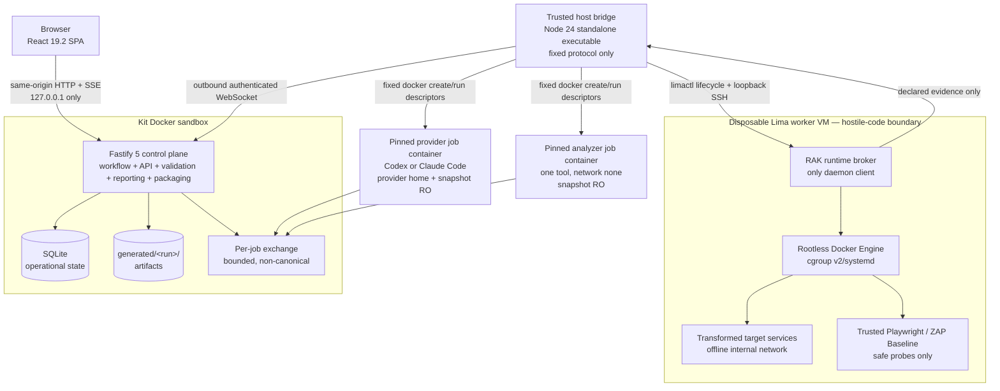

# Repository Assessment Kit — Architecture Contender 1

## Strategy and scope

This design is the **simplest portable control plane that still satisfies every customer-ready safety, evidence, and release gate**. The trusted application is one Fastify modular monolith serving one React single-page application. It uses one SQLite database, one filesystem run root, one in-process durable workflow scheduler, and one Server-Sent Events stream. It does not add Redis, a message broker, an object store, a separate report service, or a general-purpose plugin system.

Processes are separated only where a trust boundary requires it:

- Codex and Claude Code run in provider-specific, short-lived job containers with separate provider-home volumes.
- Static tools run as short-lived, pinned analyzer containers with no network and only a read-only target snapshot.
- A small trusted host bridge is the only process allowed to invoke host Docker and Lima.
- Hostile target builds and applications run inside a disposable Lima VM behind a narrow broker and a rootless Docker Engine.

Static assessment is the dependable product core. Dynamic coverage is additive. A missing or unsafe runtime becomes explicit `blocked` or `not applicable` coverage and never causes the system to weaken isolation or discard an otherwise valid static assessment.

The architecture is for the MVP in the brief: a single local operator, one active assessment at a time, no hosted control plane, no multi-tenancy, no remediation execution, and no arbitrary agent or analyzer extension marketplace.

## Requirement-to-component map

| Requirement | Owning component(s) | Architectural enforcement |
|---|---|---|
| Guided discovery and explicit unknowns | React UI, control plane, RAK schemas | Fixed discovery topic set; every topic is `answered` or `unknown`; assertions use only the seven allowed provenance labels |
| Immutable target intake | Host bridge, snapshot module | Full commit plus deterministic snapshot digest; live local source is never mounted into an assessment job; before/after source manifest comparison |
| Complete static assessment | Workflow module, analyzer jobs, provider jobs | Fixed required domain matrix and pinned tool descriptors; missing/failed tools become coverage, never an empty-success result |
| Safe runtime assessment | Runtime capability gate, host bridge, VM broker | Reject unsafe Compose before pull/build/create; no host socket; offline internal runtime network; strict resource and action policy |
| Evidence and coverage | Evidence module, RAK schemas, semantic validator | Native RAK JSON is canonical; referential integrity, provenance, six-state controls, materiality, and redaction are deterministic release gates |
| Three-way decision support | Provider synthesis job, decision validator, review module | Same criteria for remediation/incremental replacement/rebuild; every decision factor is evidenced or visibly uncertain |
| Independent security validation | Fresh review job, human technical review | Review job has a new provider session and no author transcript; human technical sign-off is mandatory for release |
| Customer package | Report renderer, validator, packager | One-way quarantine-to-release flow; JCS manifest, SHA-256, ZIP reopen verification, optional age wrapper |
| Codex/Claude parity | Provider adapters, shared job/output schemas, acceptance harness | Provider-specific invocation only; identical phase, schema, domain, and package gates |
| Four-platform portability | Pinned multi-arch images, Node 24 SEA host bridge, release matrix | Native macOS/Linux ARM64/x86-64 tests are release gates; WSL remains documented best-effort |

## System overview



### Trust zones

1. **Trusted control zone:** browser, control plane, SQLite, and the redacted run tree. The browser is an operator interface, not an authorization boundary.
2. **Provider zone:** a provider CLI necessarily holds provider authentication while reading hostile source. It receives no host control, SSH material, target sandbox secret, package signing/encryption secret, or SQLite access. This reduces but cannot eliminate prompt-injection risk through the provider's allowed inference channel.
3. **Static analyzer zone:** one disposable container per tool invocation. It has a read-only snapshot, kit-owned configuration, a bounded output directory, no network, no credentials, and no database.
4. **Host control zone:** the host bridge alone can invoke host Docker and Lima. It accepts typed, versioned operations and never a shell command, arbitrary image, arbitrary mount, Docker/Compose document, or host path from the web API.
5. **Hostile runtime zone:** the disposable VM is the primary containment boundary for target-controlled Dockerfiles, images, Compose, processes, and web content. The runtime broker alone can access the guest rootless Docker socket.
6. **Release zone:** admitted and redacted artifacts flow into a frozen staging tree. No agent, analyzer, target process, or VM can mutate staging or final package files.

### Resource access matrix

Unlisted access is denied.

| Resource | Control plane | Host bridge | Provider job | Analyzer job | VM broker | Target/probe |
|---|---:|---:|---:|---:|---:|---:|
| SQLite | RW | none | none | none | none | none |
| Redacted run root | RW | declared file transfer only | none | none | none | none |
| Job exchange | RW | route/mount by opaque job ID | job-local RW | job-local RW | none | none |
| Immutable snapshot | metadata/read | create and mount/copy | RO, one snapshot | RO, one snapshot | copied snapshot | RO canonical; optional disposable work copy |
| Codex/Claude home | none | opaque volume attachment only | own engagement/provider volume | none | none | none |
| Host SSH source | none | source-acquisition job only, RO | none | none | none | none |
| Sandbox credential value | none; stores handle metadata only | mounts approved handle only | none | none | handle routing only | only named target/probe consumer |
| Host Docker/Lima | none | invoke fixed operations | none | none | none | none |
| Guest Docker socket | none | none | none | none | RW | none |
| Frozen staging/package | packager RW then RO | none | none | none | none | none |

## Repository and deployable layout

The pnpm workspace should use:

```text
apps/
  web/                  React 19.2 + Vite 8 SPA
  server/               Fastify composition root and process entrypoint
  host-bridge/          TypeScript, bundled as Node 24 single executables
  runtime-broker/       TypeScript service provisioned in the worker VM
packages/
  contracts/            JSON Schemas, generated TS types, OpenAPI
  domain/               state machines and pure domain rules
  db/                   Drizzle schema, generated migrations, repositories
  workflow/             fixed phase graph and durable job scheduler
  evidence/             admission, normalization, provenance, validation
  policy/               static/runtime/network/action policies
  providers/            Codex and Claude command/result adapters
  analyzers/            fixed analyzer descriptors and normalizers
  reports/              Markdown/static-HTML rendering and language gates
  packaging/            staging, manifest, checksums, ZIP, age wrapper
schemas/
  rak/1.0/              vendored native JSON Schemas
  upstream/             pinned SARIF, CycloneDX, framework/catalog schemas
profiles/
  rak-export-profile-1.0.0/
  security/
rules/
  opengrep/             kit-owned rules and metadata
containers/
  server/
  provider-codex/
  provider-claude/
  analyzers/
  worker-vm/
fixtures/
  ecosystems/
  hostile/
  packaging/
scripts/
  start-codex.sh
  start-cc.sh
  rak-host              host bridge wrapper / operator CLI
toolchain.lock.json
standards-lock.json
generated/              gitignored
.rak/                   local operational state, gitignored
```

The two launcher scripts select a provider image and home volume but start the same UI, server, host bridge, phase graph, schemas, and acceptance gates. The host bridge is authored in strict TypeScript and bundled into per-platform Node 24 Single Executable Application artifacts so the host does not need a separately installed Node runtime. Building and smoke-testing those four artifacts is a release gate.

## Components

### React web application

**Responsibility:** guided discovery, source selection, policy/consent review, progress, limitations, finding review, decision review, human sign-off, package status, and package verification instructions.

**Interfaces:** only `/api/v1/*` and `/api/v1/runs/{runId}/events`. It never reads SQLite or run files directly. It renders technical detail progressively and treats API enums/schema descriptions as canonical.

**Boundary:** no arbitrary local-path picker, shell input, Compose editor, raw secret field, or provider credential UI. Local source paths and sandbox secret values are registered through the trusted host CLI and appear in the UI only as opaque handles plus non-secret metadata.

### Fastify control plane

One Node process contains focused modules with direct function calls:

- **Session/API:** loopback session, CSRF/origin enforcement, OpenAPI validation, errors.
- **Run coordinator:** run state machine, single active-run lease, idempotency, cancellation, resumption.
- **Discovery:** fixed topic coverage and product assertions.
- **Snapshot catalog:** immutable target identity and integrity attestations.
- **Job scheduler:** persists jobs, dispatches typed requests to the connected host bridge, and reconciles stale leases after restart.
- **Evidence admission:** validates, redacts, hashes, and moves job output into the run tree.
- **Assessment domain:** findings, control results, coverage, limitations, product traceability, and three-option decision model.
- **Review:** independent agent review records and human release sign-offs.
- **Report/export:** deterministic projections and report rendering around model-authored, schema-validated content.
- **Release validation/packaging:** all deterministic customer-delivery gates.

The scheduler is in-process because only one local run is active. Durable SQLite job rows, attempt records, and leases provide restart behavior; adding a queue service would not add a required capability.

### SQLite operational store

SQLite stores small operational records and indexes. It never stores source files, SSH/provider/sandbox secrets, raw screenshots, large logs, package bytes, or provider transcripts.

Use Node 24's built-in **`node:sqlite`** driver through Drizzle's Node SQLite adapter. This removes an external native add-on and is the smallest credible ARM64/x86-64 path. Pin the Node image digest and the Drizzle versions. Release is blocked until migrations, locking, interruption, backup/restore, and native Linux ARM64/x86-64 operation are proven.

Connection policy:

- one server process and one writer connection;
- `PRAGMA foreign_keys=ON`;
- `PRAGMA journal_mode=WAL`;
- `PRAGMA synchronous=FULL`;
- `PRAGMA busy_timeout=5000`;
- transactions are short and never include scanner, provider, VM, hashing, rendering, or ZIP work;
- rich/large payloads live as files; database rows hold identities, states, selected fields, and hashes.

### Host bridge

The host bridge is a trusted local companion started by `start-codex.sh` or `start-cc.sh`. It launches the Docker stack, then makes an **outbound** authenticated WebSocket connection to the server's loopback-published endpoint. This avoids exposing a privileged inbound host service and avoids mounting the physical host Docker socket into any container.

It:

- registers explicitly supplied local-source and secret handles;
- exports/clones immutable snapshots;
- runs only lockfile-known provider and analyzer containers with generated fixed mounts, networks, limits, users, and argv;
- creates, attests, controls, and destroys the Lima VM;
- transfers declared inputs/evidence to and from the VM;
- provides host-side emergency stop and orphan cleanup.

It does not interpret assessment content, validate findings, write final artifacts, or expose a generic subprocess method.

### Provider job containers

Provider adapters differ only at invocation:

- Codex: pinned `codex exec`, `workspace-write`, approval `never`, JSON output.
- Claude Code: pinned `claude -p`, permission mode `dontAsk`, stream JSON, checked-in narrow allow rules.

Each job uses a fresh session unless explicitly resuming the same interrupted job. A provider container receives:

- its engagement- and provider-specific private home volume;
- the kit instruction bundle read-only;
- one target snapshot read-only;
- a read-only admitted-evidence view selected for the job;
- one bounded writable job-output directory;
- provider inference/auth egress only.

The common allowlisted command surface is:

- `rak-source list|stat|read|search` — bounded, path-safe source access;
- `rak-evidence list|get` — bounded access to admitted evidence;
- `rak-job submit` — validates the phase output schema into the job-output directory.

No command starts tools, builds, tests, Docker, Lima, runtime probes, packaging, or arbitrary network access. Provider JSONL and transcripts are operational inputs, never canonical evidence until sanitized and explicitly admitted.

Separate independent-review jobs receive the original evidence and claims/findings, but not the author's transcript or hidden chain of reasoning. A reviewer may corroborate, independently reproduce from admitted evidence, dispute, or invalidate; it may not silently edit the original record.

### Static analyzer jobs

The host bridge starts one disposable container per invocation from a descriptor in `toolchain.lock.json`. The MVP descriptors are kit walker/scc, Syft, OSV-Scanner, Gitleaks, Trivy, Opengrep with kit-owned rules, and PMD/CPD.

Every descriptor fixes image digest by architecture, binary, argv template, config/rule digest, database digest, accepted exit codes, output schema/version, normalizer version, network policy, mounts, and resource limits. Repository-provided rules/config/plugins are never loaded. Baseline jobs never run package managers, builds, tests, scripts, hooks, autofix, dependency restore, or target executables.

Container policy: numeric non-root UID, read-only root, all capabilities dropped, `no-new-privileges`, seccomp, `/target:ro`, job output only as RW, bounded tmpfs, PIDs/CPU/memory/output/time limits, and no network. A malformed, unknown, truncated, timed-out, or unsupported result is `partial`/`blocked` with evidence; it cannot normalize to “zero findings.”

### Runtime capability and VM broker

The deterministic capability gate runs after static runtime-readiness discovery. It produces a `RuntimeCapability` document before any pull, build, container creation, ZAP, or Playwright operation.

The host bridge creates a native-architecture Lima VM in plain mode with no mounts, dynamic forwarding, guest/SSH-agent forwarding, or built-in containerd. The pinned guest has rootless Docker installed directly as a dedicated systemd user, cgroup v2 delegation, and root-owned default-deny firewall rules.

The broker is the only guest Docker client. It first parses references without Compose, rejects remote/escaping references, then renders in a no-network/no-secret parser sandbox, validates the merged document, and generates a new restricted Compose project. It never executes a target Compose document directly.

Dynamic execution is split:

1. **Acquisition/build:** only digest-resolved image pulls and explicitly approved dependency destinations through a logged proxy. No provider/SSH credentials. The approval records destination, data category, purpose, expiry, and coverage consequence.
2. **Runtime/probe:** build egress is disconnected. Target and trusted probes join only a broker-created `internal: true` network. No target host port is published. The guest firewall denies new outbound IPv4/IPv6, DNS, metadata, host, and LAN access.

The broker rejects at minimum: privilege/cap additions; devices/CDI/custom runtimes; Docker/Podman sockets; host/service namespace sharing; unsafe sysctls or disabled security profiles; provider/lifecycle hooks; host binds; external volumes/networks/configs/secrets; escaping/remote includes, extends, build contexts, or file references; host ports; host-gateway; non-broker networks; unbounded replicas/resources; and incompatible platforms.

Accepted services receive all-capability drop, `no-new-privileges`, read-only roots, bounded tmpfs/scratch volumes, non-root user where supported, PID/CPU/memory/wall-clock limits, and a random project identity. A service that cannot run under these constraints is `blocked` or `partial`; the broker never relaxes policy.

Playwright and ZAP Baseline are trusted probe containers inside the VM. They are restricted to one approved inner origin, read-only navigation and requests, no download/upload, no active ZAP/API/full scan, bounded URLs/time/body/screenshots, and final redaction. Mutating HTTP methods are denied unless a future separately specified safe action profile explicitly allows an individual operation; no such profile ships in MVP.

### Report renderer, validator, and packager

These are modules in the control process, not services. The report renderer produces Markdown and self-contained static HTML from validated native documents. Technical details remain linked appendices. The executive layer must state what was assessed, principal issue, business effect, all three choices, recommendation, confidence, limitations, unknowns, and next decision.

The deterministic validator, not a model, decides whether a release is structurally complete. Human technical and lay reviews remain mandatory because schema and readability checks cannot prove correctness or comprehension.

## Run identity, lifecycle, and recovery

### Run and target identity

- All IDs are server-generated UUIDv7 strings.
- Timestamps are RFC 3339 UTC with milliseconds.
- `runPath` is `generated/<projectSlug>-<fullCommitSha>-<YYYYMMDDTHHmmss.SSSZ>/`.
- `projectSlug` matches `^[a-z0-9][a-z0-9-]{0,62}$`.
- A Git target always records repository locator after credential stripping, object format, full commit SHA, and Git tree ID.
- A deterministic snapshot manifest contains `{path, type, mode, byteLength, sha256}` for every file and symlink, sorted by normalized UTF-8 POSIX path; `snapshotDigest` is SHA-256 over its RFC 8785 canonical JSON.

For local repositories:

- default `commit-only` exports the recorded commit and records that working-tree changes were excluded;
- optional `frozen-working-tree` requires explicit operator choice and records base commit plus the deterministic working-tree snapshot digest;
- the host bridge computes a non-following, metadata-aware manifest of the live source immediately before and after export/assessment; any change is a source-integrity failure;
- no assessment process receives the live local path.

For SSH sources, a dedicated acquisition job gets read-only SSH material and clone egress, resolves the commit, exports a snapshot, then exits. SSH paths, environment, config, agent material, and clone operational logs are excluded or sanitized before evidence admission.

### Run state machine

```text
draft -> ready -> running -> awaiting_review -> packaging -> completed
                  |   ^          |
                  v   |          v
                paused ----------+
                  |
                  v
               running

draft|ready|running|paused|awaiting_review|packaging
  -> cancelling -> cancelled

running|awaiting_review|packaging -> failed
failed -> running (recoverable resume) | cancelled
```

Rules:

- `draft -> ready` requires all discovery topics marked answered/unknown, a locked target snapshot, chosen provider/profile/policy, and all required acknowledgements.
- `ready -> running` freezes run identity and phase graph.
- `running -> awaiting_review` requires every required static domain to have an assessment outcome, every planned control to have one coverage state, synthesis complete, and independent reviews recorded. Dynamic controls may be `blocked`/`not applicable`.
- `awaiting_review -> packaging` requires passing deterministic pre-release validation plus technical and lay approval.
- `completed` is immutable. Any reassessment or substantive post-review change creates a new run revision with a new run ID and root.
- `cancel` is cooperative first and host emergency-stop after a deadline. Cancellation preserves admitted evidence and records unfinished controls as `not tested` with a cancellation reason.

### Fixed phase graph

1. `discovery`
2. `source-snapshot`
3. `repository-inventory`
4. `static-analyzers` (bounded parallel jobs)
5. `architecture-quality-product-trace`
6. `runtime-capability`
7. `dynamic-assessment` (conditional; never blocks static completion solely because unavailable)
8. `security-and-decision-synthesis`
9. `independent-review`
10. `customer-review`
11. `release-validation`
12. `package`

Phase execution state is separate from coverage state:

- phase/job: `pending | leased | running | succeeded | failed | cancelled`;
- control result: `pass | fail | partial | blocked | not applicable | not tested`.

Coverage semantics:

- `pass`: the planned control was performed and positive behavior was evidenced.
- `fail`: the control was performed and unacceptable behavior was evidenced.
- `partial`: some of the planned method/scope completed, but not enough for a full result.
- `blocked`: the control applies, but a prerequisite or safety policy prevented execution.
- `not applicable`: the control does not apply to the evidenced target shape/scope.
- `not tested`: it applies but was not attempted, including cancellation or explicit time/scope choice.

Every non-pass requires `reasonCode` and plain-language `reason`; `fail` and `partial` require evidence; `blocked` records attempted safe steps, blocking condition, coverage effect, and follow-up. Exactly one result exists per planned control.

### Jobs, leases, retries, and revisions

- A job is uniquely identified by `(runId, phaseKey, logicalJobKey, attempt)`.
- Dispatch uses a server-generated `requestId` as idempotency key. The bridge journals terminal results and returns the same result on duplicate dispatch.
- A lease has `leasedAt`, `heartbeatAt`, and `leaseExpiresAt`. On restart, expired `leased/running` jobs become `failed` with `WORKER_LOST`; the coordinator retries only retry-safe job types.
- Raw outputs remain in job quarantine until complete admission. An interrupted admission is deleted and repeated.
- Admitted evidence is immutable. A retry creates a new Activity and Evidence entities; it never overwrites a prior entity. One is selected for the current claim/control with history retained.
- Package creation is idempotent from a frozen staging-tree digest. A different digest requires a new package attempt; post-completion changes require a new run revision.

## Operational data model

All foreign keys use `ON DELETE RESTRICT` for completed-run evidence. Draft-only child rows may use explicit application-level cleanup. `createdAt`/`updatedAt` are UTC strings; enums have SQL `CHECK` constraints. JSON text columns are schema-validated on write and are never used for secret values.

| Table | Core fields | Relationships and constraints |
|---|---|---|
| `engagements` | `id`, `name`, `providerHomeId`, `provider`, `createdAt`, `closedAt?` | Provider home ID is opaque; unique `(provider, providerHomeId)`; no auth data |
| `source_handles` | `id`, `kind`, `displayName`, `bridgeRegistrationId`, `registeredAt`, `revokedAt?` | Local paths/secrets are not stored; handle must be active to create a run |
| `runs` | `id`, `revision`, `priorRunId?`, `projectSlug`, `engagementId`, `provider`, `state`, `policyId`, `exportProfile`, `runPath`, `createdAt`, `startedAt?`, `completedAt?`, `version` | Unique `runPath`; state check; optimistic `version`; completed rows immutable |
| `target_snapshots` | `id`, `runId`, `sourceKind`, `repositoryLocator`, `objectFormat`, `commitSha`, `gitTreeId`, `workingTreeMode`, `snapshotDigest`, `manifestArtifactId`, `preSourceDigest`, `postSourceDigest?`, `integrityState` | One locked snapshot per run; full SHA syntax; unique `(runId, snapshotDigest)` |
| `product_assertions` | `id`, `runId`, `topic`, `text`, `provenance`, `material`, `speakerRole?`, `capturedAt`, `reasoning?`, `state` | Provenance is exactly seven labels; `conflicting` must have links to competing claims; `unverified` cannot be used as positive evidence |
| `assertion_links` | `assertionId`, `evidenceId?`, `competingAssertionId?` | At least one target; no self-link; conflicts need both sides |
| `phases` | `id`, `runId`, `phaseKey`, `ordinal`, `state`, `startedAt?`, `endedAt?`, `failureCode?` | Unique `(runId, phaseKey)`; transitions enforced in domain layer |
| `jobs` | `id`, `phaseId`, `logicalKey`, `attempt`, `kind`, `state`, `requestId`, lease fields, `inputDigest`, `outputDigest?`, `failureCode?`, `retryable` | Unique logical attempt and request ID; no secret or arbitrary command fields |
| `prov_agents` | `id`, `runId`, `kind`, `name`, `version`, `digest?`, `providerRole?` | Represents tool, model role, or operator; no provider credential |
| `activities` | `id`, `runId`, `jobId?`, `type`, `agentId`, `startedAt`, `endedAt?`, `outcome`, `method`, `sanitizedInvocation`, `configDigest?` | Immutable after terminal; invocation cannot contain secret values/host paths |
| `evidence` | `id`, `runId`, `snapshotId`, `activityId`, `type`, `title`, `mediaType`, `byteLength`, `sha256`, `artifactId?`, `externalLocator?`, `sourceLocator?`, `capturedAt`, `sensitivity`, `redactionState`, `validationState`, `limitationsJson` | Exactly one package-relative artifact or redacted external locator; packaged evidence requires digest |
| `evidence_derivations` | `evidenceId`, `derivedFromId`, `transformation`, `redactionDescription?` | Unique edge; acyclic semantic check; same-run/snapshot unless explicit external relation |
| `control_results` | `id`, `runId`, `profileId`, `controlId`, `domain`, `state`, `reasonCode?`, `reason?`, `method`, `coverageEffect?`, `reviewState` | Unique `(runId, profileId, controlId)`; every non-pass has reason |
| `control_evidence` | `controlResultId`, `evidenceId` | Unique pair; commit identity must match |
| `findings` | `id`, `runId`, `ruleId?`, `title`, `description`, `kind`, `technicalSeverity`, `businessPriority?`, `confidence`, `validationState`, `cvssJson?`, `sourceLocator?`, `material`, `fingerprint`, `status` | Unique `(runId, fingerprint)`; CVSS fields validated; no aggregate score |
| `finding_evidence` | `findingId`, `evidenceId`, `role` | At least one evidence link for every material positive finding |
| `limitations` | `id`, `runId`, `domain`, `title`, `reasonCode`, `description`, `affectedControlIdsJson`, `confidenceEffect`, `followUp` | Required for blocked/untested material scope |
| `decision_comparisons` | `id`, `runId`, `criteriaVersion`, `recommendedOption`, `confidence`, `assumptionsJson`, `dependenciesJson`, `reversalConditionsJson`, `narrativeArtifactId?` | Exactly three options; recommendation may be conditional sequence |
| `decision_factors` | `id`, `comparisonId`, `option`, `criterion`, `assessment`, `impact`, `claimState` | Every factor has evidence links or `unverified/conflicting` state |
| `decision_factor_evidence` | `factorId`, `evidenceId` | Commit consistency enforced |
| `approvals` | `id`, `runId`, `type`, `scopeJson`, `destination?`, `dataCategoriesJson`, `secretHandleId?`, `approvedBy`, `approvedAt`, `expiresAt?`, `revokedAt?` | Never stores a secret; generic “internet enabled” approval is invalid |
| `reviews` | `id`, `runId`, `kind`, `reviewerAgentId?`, `reviewerDisplay`, `outcome`, `notesArtifactId?`, `attestationsJson`, `createdAt` | Kinds include independent-security, independent-decision, technical-human, lay-human |
| `artifacts` | `id`, `runId`, `stage`, `path`, `kind`, `mediaType`, `byteLength`, `sha256`, `schemaVersion?`, `sensitivity`, `redactionState`, `frozenAt?` | Relative normalized paths only; unique `(runId, stage, path)` |
| `packages` | `id`, `runId`, `stagingDigest`, `zipArtifactId`, `zipSha256`, `encryptedArtifactId?`, `encryptedSha256?`, `state`, `verifiedAt?` | Completed package immutable; one released package per run |
| `events` | `runId`, `seq`, `type`, `occurredAt`, `payloadJson` | Primary key `(runId, seq)`; append-only; operational, not canonical truth |
| `idempotency_keys` | `scope`, `key`, `requestDigest`, `status`, `responseCode`, `responseJson`, `expiresAt` | Same key with different request digest returns conflict |

### Migrations

Drizzle Kit is the migration framework. Migrations are generated from `packages/db/src/schema.ts`, committed, reviewed, and **never hand-authored or hand-edited**. CI regenerates into a temporary directory and fails if the committed output differs.

At startup:

1. acquire a process lock;
2. verify the database and latest backup checksums;
3. create a verified SQLite backup;
4. apply pending generated migrations in order;
5. run `foreign_key_check`, `integrity_check`, and schema-version verification;
6. refuse to start mutating workflows on failure.

The control plane creates a verified backup at each migration and before packaging. On corruption it preserves the damaged database, refuses package release, restores only from the latest verified backup after operator confirmation, reconciles filesystem artifacts by hash, and resumes only jobs whose admitted outputs remain valid.

## Canonical RAK 1 contracts

Native JSON is the portability boundary between provider jobs, analyzers, control-plane modules, reports, validators, and both launch paths. Every document uses JSON Schema Draft 2020-12, strict objects, I-JSON constraints, immutable `$id`, and `schemaVersion: "1.0.0"`. Unknown fields are rejected except reverse-DNS keys under `extensions`.

Canonical documents are generated beneath `data/`:

| Document | Required content |
|---|---|
| `run.json` | run ID/revision/state, profile/policy versions, provider/CLI/image digests, timestamps, phase outcomes |
| `target-snapshot.json` | source kind, sanitized locator, full commit, Git tree, working-tree mode, manifest digest, source before/after attestations |
| `product-assertions.json` | fixed discovery topics, assertions, seven-label provenance, evidence/conflict links, unknown/confidence effects |
| `provenance.json` | Entity/Evidence, Activity, Agent, derivation edges, tool/config/rule/DB versions and outcomes |
| `findings.json` | finding identity, locations, evidence, severity/priority/confidence/validation kept separate, versioned mappings |
| `controls.json` | planned profile/control set, exactly one six-state result per control, reasons/evidence/method/coverage |
| `coverage-limitations.json` | domains, techniques, exclusions, blocked/untested scope, tool/runtime limitations and follow-ups |
| `decision.json` | three options, common criteria, recommendation/conditional sequence, evidence, confidence, assumptions, dependencies, reversal conditions |
| `artifacts.json` | artifact identities, paths, hashes, sensitivity/redaction, evidence links |
| `export-profile.json` | exact schema/standard/catalog/tool lock digests and projection versions |

### Key canonical shapes

```ts
type AssertionProvenance =
  | "owner-stated" | "documented" | "observed"
  | "analytics-supported" | "code-inferred"
  | "unverified" | "conflicting";

type ControlState =
  | "pass" | "fail" | "partial" | "blocked"
  | "not applicable" | "not tested";

interface ControlResult {
  schemaVersion: "1.0.0";
  controlResultId: string;
  runId: string;
  profile: { id: string; version: string; applicability: "not-assessed" | "customer-stated" | "customer-confirmed" };
  controlId: string;
  domain: string;
  state: ControlState;
  method: string;
  evidenceIds: string[];
  reasonCode?: string;
  reason?: string;
  attemptedSafeSteps?: string[];
  coverageEffect?: string;
  reviewState: "unreviewed" | "corroborated" | "independently reproduced" | "disputed" | "invalidated";
}

interface EvidenceEntity {
  schemaVersion: "1.0.0";
  evidenceId: string;
  runId: string;
  targetSnapshotId: string;
  type: string;
  title: string;
  mediaType: string;
  byteLength: string;
  sha256: string;
  packagePath?: string;
  externalLocator?: { value: string; redacted: true };
  sourceLocator?: { path: string; startLine?: number; endLine?: number };
  capturedAt: string;
  activityId: string;
  derivedFrom: Array<{ evidenceId: string; transformation: string; redaction?: string }>;
  sensitivity: "public" | "customer-confidential" | "restricted";
  redactionState: "not-needed" | "redacted" | "excluded";
  validationState: "unreviewed" | "corroborated" | "independently reproduced" | "disputed" | "invalidated";
  linkedClaimIds: string[];
  linkedFindingIds: string[];
  linkedControlResultIds: string[];
  limitations: string[];
}

interface Finding {
  schemaVersion: "1.0.0";
  findingId: string;
  runId: string;
  title: string;
  kind: "vulnerability" | "configuration" | "design" | "process" | "maintainability" | "business";
  technicalSeverity: "informational" | "low" | "medium" | "high" | "critical";
  businessPriority?: "informational" | "low" | "medium" | "high" | "critical";
  confidence: "low" | "medium" | "high";
  validationState: "unreviewed" | "corroborated" | "independently reproduced" | "disputed" | "invalidated";
  evidenceIds: string[];
  location?: { path: string; startLine?: number; endLine?: number };
  cvss?: {
    system: "CVSS"; version: "4.0"; vector: string; score: string;
    band: "None" | "Low" | "Medium" | "High" | "Critical";
    scorer: string; scoredAt: string; rationaleEvidenceIds: string[];
  };
  importedScores: Array<{ system: string; version: string; vector?: string; score?: string; sourceEvidenceId: string }>;
  cweMappings: Array<{ id: string; catalogVersion: "4.20"; catalogSchema: "7.3"; method: "tool" | "analyst" | "imported"; confidence: string; primary: boolean }>;
  frameworkMappings: Array<{ framework: string; version: string; id: string }>;
}
```

If CVSS 4.0 Base inputs are insufficient, `cvss` is absent and the report says it was not scored due to insufficient evidence. Imported CVSS 2.0/3.x records are preserved, never converted in place. Configuration/design/process/business findings use named severity only. No repository aggregate score is calculated.

### External projections

- **SARIF:** OASIS SARIF 2.1.0 Plus Errata 01. One run per analyzer/logically homogeneous pass. Native finding/evidence/validation IDs go in `dev.repo-assessment-kit.*`; repository-relative URIs only. CWE 4.20 is a versioned taxonomy. Projection loss is recorded.
- **CycloneDX:** 1.7 JSON repository-discovery profile. Syft native output is input evidence; RAK generates and validates the delivery projection. Composition defaults to `unknown` unless completeness is proven.
- **Profiles:** ASVS 5.0.0 applicable L1 controls are the default web baseline; WSTG 4.2 is safe runtime technique reference only; Top 10:2025 is grouping only; SSDF 1.1 is repository/process evidence only.
- **Applicability:** only `not-assessed`, `customer-stated`, or `customer-confirmed`; never auto-determined. The phrase “technical coverage against a selected profile” is required.

`standards-lock.json` and `toolchain.lock.json` are checked in at repository root. They contain immutable source URLs, versions, dates, release/image/schema/rule/DB digests, licenses/notices, architecture artifacts, validator versions, and retrieval dates. Runs copy their exact lock digests. No assessment fetches `latest`.

## HTTP API contract

### Common rules

- Base path: `/api/v1`.
- JSON request/response content type; package downloads use fixed media types.
- Server-generated identifiers only.
- Every mutation accepts `Idempotency-Key` (1–128 printable ASCII characters). Reuse with a different body returns `409 IDEMPOTENCY_KEY_REUSED`.
- Optimistic updates include `If-Match: "<version>"`; stale updates return `412 VERSION_CONFLICT`.
- Timestamps are UTC RFC 3339; file paths are package-relative POSIX paths.
- Unknown request properties are rejected.
- List endpoints use opaque `cursor` and `limit` 1–100.

Error responses use `application/problem+json`:

```json
{
  "type": "https://schemas.repo-assessment-kit.dev/problems/runtime-policy-rejected",
  "title": "Runtime configuration was rejected",
  "status": 422,
  "code": "RUNTIME_POLICY_REJECTED",
  "detail": "The target requests a host Docker socket mount.",
  "instance": "/api/v1/runs/019.../actions",
  "traceId": "019...",
  "retryable": false,
  "errors": [{"path": "/compose/services/api/volumes/0", "code": "HOST_SOCKET", "message": "Host socket mounts are prohibited."}]
}
```

No error includes secret values, host absolute paths, raw tool output, or provider transcript content.

### Session

The UI and API are same-origin and published only at `127.0.0.1`. On each launch the server creates a 256-bit one-time bootstrap token. The launcher opens `http://127.0.0.1:<port>/#bootstrap=<token>`; fragments are not sent in HTTP requests. The SPA posts it once, then removes the fragment.

| Method/path | Request | Response |
|---|---|---|
| `POST /session/bootstrap` | `{ "token": "base64url" }` | `204`; sets `rak_session` HttpOnly, Secure-when-available, SameSite=Strict; returns CSRF token in `X-CSRF-Token` |
| `GET /session` | none | `{ "authenticated": true, "csrfToken": "...", "expiresAt": "..." }` |
| `DELETE /session` | CSRF header | `204` |

All mutations require the session cookie, exact `Origin`, and `X-CSRF-Token`. The host bridge and job callbacks use separate one-time machine credentials and cannot use browser sessions.

### System and source handles

| Method/path | Response |
|---|---|
| `GET /system` | stack/profile versions, connected host-bridge state, host/guest architecture attestations, provider readiness, static/runtime capabilities, and release-lock digests |
| `GET /source-handles` | active opaque local-source handles registered by `rak-host source add`; never returns a host path |
| `GET /secret-handles` | active handle ID, display label, intended consumer, approved destinations, expiry; never returns values |

The web API cannot create local source or secret handles. Host CLI commands require direct operator access:

```text
rak-host source add --path <absolute-path> --label <display>
rak-host secret add --file <path> --consumer <target|browser> --label <display>
rak-host source revoke <handle>
rak-host secret revoke <handle>
```

The CLI resolves and attests exact targets, accepts secret bytes through a file descriptor, stores them in mode-0600 bridge state, and returns only an opaque handle.

### Runs and discovery

`POST /runs`:

```json
{
  "projectSlug": "customer-app",
  "source": {
    "kind": "ssh-git",
    "url": "git@github.com:customer/app.git",
    "ref": "main"
  },
  "workingTreeMode": "commit-only",
  "provider": "codex",
  "engagementId": "019...",
  "policyId": "rak-safe-default/1.0.0",
  "profileIds": ["rak-general/1.0.0", "owasp-asvs-5.0.0-l1"],
  "exportProfile": "rak-export-profile/1.0.0"
}
```

`source` is either `{kind:"ssh-git", url, ref}` or `{kind:"local-handle", sourceHandleId}`. URLs must be SSH Git URLs; credentials/userinfo outside the SSH user are rejected. Response `201`:

```json
{
  "runId": "019...",
  "state": "draft",
  "version": 1,
  "projectSlug": "customer-app",
  "target": null,
  "discovery": {"answered": 0, "unknown": 0, "required": 10},
  "createdAt": "2026-07-27T12:00:00.000Z",
  "links": {"self": "/api/v1/runs/019...", "events": "/api/v1/runs/019.../events"}
}
```

| Method/path | Contract |
|---|---|
| `GET /runs?cursor&limit&state` | summaries |
| `GET /runs/{runId}` | current run, target identity, phase/control coverage summary, limitations, review/package state |
| `PUT /runs/{runId}/discovery` | replaces draft discovery using `If-Match`; body has all ten fixed topics, each `{topic, status:"answered"|"unknown", answer?, confidenceEffect?, assertions[]}` |
| `GET /runs/{runId}/discovery` | topic answers and assertion provenance/evidence/conflict links |
| `GET /runs/{runId}/target` | locked snapshot and integrity attestations |

Fixed discovery topics are target customers, buyers, user roles, customer pain, valuable workflows, alternatives/differentiators, revenue/retention-critical behavior, contractual obligations, expected scale, and feature-parity expectations.

### Actions

`POST /runs/{runId}/actions` uses a discriminated union:

```ts
type RunAction =
  | { action: "lock-target" }
  | { action: "start" }
  | { action: "pause"; reason: string }
  | { action: "resume" }
  | { action: "cancel"; reason: string }
  | { action: "retry-job"; jobId: string; reason: string }
  | { action: "request-package" }
  | { action: "create-revision"; reason: string };
```

Accepted asynchronous actions return `202` with:

```json
{"actionId":"019...","runId":"019...","acceptedAt":"...","state":"queued"}
```

Invalid state transitions return `409 INVALID_RUN_TRANSITION`. An action requiring approval/registration returns `422` with exact missing handles/approvals, not a prompt to bypass policy.

### Assessment and review

| Method/path | Contract |
|---|---|
| `GET /runs/{runId}/controls?domain&state&cursor&limit` | canonical control summaries with evidence/limitation links |
| `GET /runs/{runId}/evidence?type&validationState&cursor&limit` | safe metadata only |
| `GET /runs/{runId}/evidence/{evidenceId}` | metadata and a time-limited same-origin content link only if admitted/redacted |
| `GET /runs/{runId}/findings?severity&validationState&cursor&limit` | finding summaries |
| `GET /runs/{runId}/findings/{findingId}` | complete finding, evidence, mappings, review history |
| `PATCH /runs/{runId}/findings/{findingId}` | `{businessPriority?, status?, reviewerNote}`; cannot alter original technical evidence/severity |
| `GET /runs/{runId}/decision` | three-option comparison and evidence/confidence/reversal conditions |
| `GET /runs/{runId}/limitations` | coverage and limitation records |
| `POST /runs/{runId}/approvals` | scoped egress/profile/secret-use approval; body below |
| `POST /runs/{runId}/reviews` | human review sign-off; body below |

Approval:

```json
{
  "type": "build-egress",
  "scope": {"phase":"dynamic-assessment","destinations":["registry.npmjs.org:443"]},
  "dataCategories": ["dependency-request-metadata", "target-build-traffic"],
  "purpose": "Install locked fixture dependencies",
  "secretHandleId": null,
  "expiresAt": "2026-07-28T12:00:00.000Z",
  "acknowledgements": ["allowed destinations remain potential exfiltration channels"]
}
```

No wildcard destination or generic internet flag is valid.

Human review:

```json
{
  "kind": "technical-human",
  "reviewerDisplay": "Security lead",
  "outcome": "approve",
  "attestations": [
    "material conclusions match evidence",
    "plain-language simplification preserves meaning"
  ],
  "notes": "Reviewed finding reproductions and decision factors."
}
```

`kind` is `technical-human` or `lay-human`; required attestations are server-defined. Independent agent reviews are created by workflow jobs and cannot be forged through this endpoint. A rejection returns the run to `running` with review issues; correcting released content requires a new revision.

### Events

`GET /runs/{runId}/events` uses `text/event-stream`. The client supplies `Last-Event-ID` or `?after=<seq>`.

```text
id: 42
event: phase.progress
data: {"schemaVersion":"1.0.0","runId":"019...","seq":42,"occurredAt":"...","phase":"static-analyzers","message":"4 of 8 analyzers complete","progress":{"completed":4,"total":8}}
```

Events replay from SQLite in sequence, then stream live. A heartbeat comment is sent every 15 seconds. Reconnect is safe. Event payloads contain summaries and IDs, never secrets/raw evidence. Events are operational history; `GET /runs/{id}` is authoritative current state.

### Package

| Method/path | Contract |
|---|---|
| `GET /runs/{runId}/package` | package state, validation result, byte length, SHA-256, optional encrypted-wrapper metadata |
| `GET /runs/{runId}/package/download` | completed validated ZIP only; attachment filename fixed by server |
| `GET /runs/{runId}/package/digest` | plain text lowercase ZIP SHA-256 |
| `GET /runs/{runId}/package/encrypted` | optional age wrapper only after successful decrypt-and-digest verification |

A package is never downloadable while validation is incomplete or failed.

## Internal protocols

### Host bridge protocol

The bridge authenticates with a 256-bit per-launch token supplied to the server and bridge via separate mode-0600 files, not argv or environment. It opens an outbound WebSocket and performs a nonce challenge. Messages are strict JSON:

```ts
interface BridgeRequest {
  protocolVersion: "1.0";
  requestId: string;
  type:
    | "snapshot.acquire"
    | "job.analyzer.run"
    | "job.provider.run"
    | "runtime.create"
    | "runtime.call"
    | "runtime.destroy"
    | "emergency.stop";
  issuedAt: string;
  expiresAt: string;
  payload: object;
}

interface BridgeResponse {
  protocolVersion: "1.0";
  requestId: string;
  state: "accepted" | "running" | "succeeded" | "rejected" | "failed";
  occurredAt: string;
  resultCode?: string;
  result?: object;
  artifactDescriptors?: Array<{jobArtifactId:string; kind:string; byteLength:string; sha256:string}>;
}
```

Allowed payloads:

| Type | Payload |
|---|---|
| `snapshot.acquire` | `{runId, source:{sshUrl,ref,sshHandleId?}|{sourceHandleId}, workingTreeMode, limitsProfileId}` |
| `job.analyzer.run` | `{jobId, snapshotId, toolDescriptorId, configProfileId, limitsProfileId, outputQuotaBytes}` |
| `job.provider.run` | `{jobId, provider, providerImageId, engagementHomeId, snapshotId, evidenceViewId, instructionBundleDigest, promptArtifactId, outputSchemaId, limitsProfileId}` |
| `runtime.create` | `{runId, snapshotId, vmProfileId, guestImageDigest, nativeArchitecture}` |
| `runtime.call` | `{runtimeId, operation, inputArtifactIds, policyId, approvalIds}` |
| `runtime.destroy` | `{runtimeId, preserveDeclaredEvidence:boolean}` |
| `emergency.stop` | `{runId, reason}` |

`runtime.call.operation` is one of `attest`, `stage-snapshot`, `compile`, `build`, `start`, `probe`, `collect`, `stop`. No payload has arbitrary argv, shell, image, mount, host path, Compose text, environment, or destination. IDs resolve through bridge-owned registrations and lockfiles. Unknown versions/types/IDs fail closed. The bridge journals request and result digests for idempotency and audit.

### Provider job contract

The job input manifest is:

```json
{
  "schemaVersion": "1.0.0",
  "jobId": "019...",
  "runId": "019...",
  "phase": "security-and-decision-synthesis",
  "providerRole": "author",
  "snapshot": {"snapshotId":"019...","commitSha":"...","snapshotDigest":"sha256:..."},
  "evidenceViewId": "019...",
  "requiredOutputSchema": "https://schemas.repo-assessment-kit.dev/rak/1.0/synthesis-job.schema.json",
  "instructionBundleDigest": "sha256:...",
  "budgets": {"wallSeconds":3600,"outputBytes":10485760}
}
```

The result is `{jobId, outcome:"succeeded"|"failed", outputDocument?, limitations[], providerSessionId, invocationDigest}`. `outputDocument` must validate against the phase schema before admission. A model statement that work succeeded is not evidence of success.

### Analyzer result contract

The job result is `{jobId, tool, toolVersion, imageDigest, configDigest, databaseDigest?, startedAt, endedAt, exitKind:"completed-with-findings"|"completed-clean"|"tool-failure"|"timeout"|"policy-rejection", rawArtifacts[], truncations[], exclusions[], coverageEffects[]}`. Native output is retained only after immediate sanitization; normalizers produce new derived evidence. Unknown versions or schemas are preserved as opaque evidence and yield reduced coverage.

### Runtime capability contract

```ts
interface RuntimeCapability {
  schemaVersion: "1.0.0";
  runId: string;
  snapshotId: string;
  state: "capable" | "blocked" | "not applicable";
  detectedRuntime: Array<{kind:"dockerfile"|"compose"|"other"; paths:string[]}>;
  hostGuestAttestation?: {
    hostOs:"macos"|"linux"; hostArch:"arm64"|"x86_64";
    guestArch:"arm64"|"x86_64"; limaVersion:string; guestImageDigest:string;
    dockerVersion:string; composeVersion:string; rootless:true;
    cgroupVersion:2; delegatedControllers:string[];
  };
  policyChecks: Array<{checkId:string; outcome:"accepted"|"rejected"; reasons:string[]; evidenceIds:string[]}>;
  credentialHandleIds: string[];
  egressApprovalIds: string[];
  attemptedSafeSteps: string[];
  blockingReasons: Array<{code:string; message:string; affectedControlIds:string[]; followUp:string}>;
  limitsProfileId: string;
}
```

## Evidence, reporting, and package flow

### One-way artifact flow

```text
job-private tmpfs/output
  -> quarantine (untrusted, bounded)
  -> sanitize + schema/tool-version validation
  -> hash + admit as immutable raw evidence
  -> normalize/derive native RAK evidence
  -> render reports and projections
  -> redact + secret/path/placeholder scan
  -> frozen customer staging
  -> manifest/checksums
  -> ZIP
  -> fresh-process reopen and validation
  -> optional age wrapper
```

Unredacted scanner/browser output is kept only in the worker's bounded transient storage and is never copied into the run root. Gitleaks is configured for complete match redaction. Screenshots/traces/bodies are admitted only when evidentially useful and after content/size/redaction checks.

The run root contains:

```text
generated/<run>/
  evidence/             admitted sanitized raw and derived evidence
  screenshots/          only safely produced evidence-bearing images
  logs/                 sanitized customer-useful logs
  data/                 RAK native JSON
  reports/              Markdown and self-contained HTML
  exports/              SARIF, CycloneDX, CSV
  internal/             non-package validation records, never secrets
  package-staging/      frozen during packaging
  <run>.zip
  <run>.zip.sha256
  <run>.zip.age?        optional
  <run>.zip.age.sha256? optional
```

`generated/` and `.rak/` are gitignored. The SQLite database lives at `.rak/state/control.sqlite` and is not a customer artifact. Every run artifact is beneath its single run root; transient job scratch lives in tmpfs or bridge-managed temporary storage and is deleted after admission.

### Required customer ZIP inventory

- `index.html`
- `reports/executive.{md,html}`
- `reports/decision.{md,html}`
- `reports/product-and-feature-trace.{md,html}`
- `reports/architecture-and-engineering.{md,html}`
- `reports/security.{md,html}`
- `reports/runtime.{md,html}`
- `reports/coverage-and-limitations.{md,html}`
- `data/run.json`
- `data/target-snapshot.json`
- `data/product-assertions.json`
- `data/provenance.json`
- `data/findings.json`
- `data/controls.json`
- `data/coverage-limitations.json`
- `data/decision.json`
- `data/artifacts.json`
- `data/export-profile.json`
- `exports/findings.sarif.json`
- `exports/sbom.cdx.json`
- useful CSV exports
- admitted `evidence/`, customer-useful `logs/`, and `screenshots/` when produced
- `NOTICES`
- `manifest.json`
- `SHA256SUMS`

If screenshots are absent, coverage and runtime reports state why; no empty placeholder screenshot is created.

### Release validation

Deterministic gates:

- strict JSON parsing, official/vendored schemas, RAK schemas, semantic invariants;
- unique IDs, reference existence, acyclic derivation, matching snapshot identity;
- all required domains and exactly one result per planned control;
- reason/evidence rules for coverage states;
- material finding and decision-factor evidence or visible `unverified/conflicting`;
- SARIF Errata 01, CycloneDX 1.7, CWE/profile/CVSS checks;
- prohibited legal/compliance claims and unsupported absolutes;
- executive completeness, acronym/term rules, sentence/paragraph/readability signals;
- no placeholders, TODO-as-content, absolute host paths, known/seeded secrets, SSH/provider material;
- technical and lay approvals;
- package inventory and checksums.

Human/independent gates:

- a fresh independent security job reviews security findings and coverage;
- a fresh independent decision job reviews all material decision factors;
- a technical human confirms material conclusions/reproductions and that simplification preserved meaning;
- a lay human can state principal risks, business effects, recommendation, alternatives, confidence, and unknowns.

### Manifest/checksum/ZIP algorithm

1. Freeze staging and reject symlinks, hardlinks, devices, sockets, absolute/`..` paths, duplicates, and case/Unicode-normalization collisions.
2. Generate RFC 8785 JCS `manifest.json`, sorted by normalized UTF-8 path. Declare every payload including manifest/checksum special entries. Ordinary entries include kind, media type, byte length, SHA-256, profile/schema version, sensitivity/redaction state, and evidence IDs. Manifest/checksum entries omit self-referential digest/size.
3. Generate `SHA256SUMS` for every ZIP payload including `manifest.json`, excluding `SHA256SUMS`.
4. Fresh-read and revalidate all hashes, semantic references, secrets, paths, language, and placeholders.
5. Create the ZIP with normalized paths and bounded metadata.
6. Reopen in a fresh process; reject unsafe/duplicate entries, size/path mismatch, checksum mismatch, undeclared/missing files, broken references, or decompression-limit violations.
7. Write detached `<zip>.sha256`.
8. If requested, run pinned age 1.3.1 over the validated ZIP using confirmed X25519 recipient, or scrypt fallback. Secret/passphrase enters by file descriptor, never argv/env/SQLite/logs/artifacts. Decrypt to scratch, compare recovered ZIP SHA-256, then write the encrypted-wrapper digest.

The validated plain ZIP is always retained. Encryption never replaces redaction and makes no FIPS/compliance claim.

## Non-functional requirements

### Security and privacy

- UI binds physical-host `127.0.0.1` only; no host networking and no default all-interface publish.
- No physical-host Docker socket is mounted into any container.
- Provider, Git, tool-update, analyzer, optional hosted service, dependency-build, and target-runtime network classes are separately enforced and recorded.
- Optional hosted analyzers are not implemented in MVP. The approval and evidence models can describe them later, but no generic upload adapter ships.
- Secrets are referenced by opaque handles. Values never enter browser HTTP, SQLite, model prompts, manifests, logs, shell history, or package metadata.
- Source, finding, and provider data crossing the provider inference boundary is disclosed before run start; “local-first” is not represented as “source never leaves the machine.”
- Retention is operator-configured and visible. Automatic deletion never removes completed output silently.
- Residual risks are stated: provider-process credential exposure through allowed inference, VM/hypervisor/kernel escapes, and exfiltration through explicitly approved destinations.

### Performance and bounded scale

MVP supports one active run and one worker VM. Static analyzer concurrency defaults to two and is reduced to one under memory pressure. SQLite remains a single-writer store.

Default policy budgets, operator-visible and versioned:

| Boundary | Default |
|---|---|
| Snapshot | 1,000,000 entries, 10 GiB total, 100 MiB per ordinary file for deep parsing; larger files hash/index only with `partial` coverage |
| Static analyzer | 2 vCPU, 4 GiB RAM, 512 PIDs, 45 minutes, 512 MiB output |
| Provider job | 2 vCPU, 4 GiB RAM, 60 minutes, 10 MiB structured output; source/evidence reads separately bounded |
| Worker VM | 4 vCPU, 8 GiB RAM, 40 GiB disk, 120 minutes |
| Target service | 1 vCPU, 2 GiB RAM, 256 PIDs by default; total remains within VM |
| Browser/ZAP | 2 vCPU, 2 GiB RAM, 30 minutes, 500 URLs, 250 MiB admitted evidence |
| Package | 20 GiB uncompressed maximum, 5 GiB ZIP maximum, 10:1 per-entry and 20:1 total decompression-ratio review thresholds |

Budgets can be changed only by selecting a versioned policy profile before run start. Exclusions and timeouts become coverage limitations. Release benchmarks on representative medium/large repositories establish whether these defaults meet product expectations; they are bounds, not performance promises.

The UI should acknowledge mutations within 250 ms on a development reference host; progress events should appear within 2 seconds of a bridge/job update. Long work is always asynchronous. Evidence lists are paginated and database indexes cover run/state, phase/state, finding severity/validation, evidence type/validation, and event sequence.

### Availability and failure modes

| Failure | Required behavior |
|---|---|
| Control process restart | Reopen SQLite, validate integrity, expire stale leases, reconnect bridge, resume safe pending jobs |
| Host bridge loss | Mark dispatched jobs waiting; after lease deadline record `BRIDGE_LOST`; static results already admitted remain; no silent success |
| Analyzer/provider crash or timeout | Capture bounded diagnostics, record coverage/limitation, retry only under policy |
| Runtime prerequisite/policy failure | Static run continues; runtime controls get precise blocked/not-applicable results |
| VM/daemon escape suspicion | Emergency stop, disconnect bridge, destroy VM, quarantine returned evidence, mark run failed pending review |
| Source before/after mismatch | Stop run, set integrity failure, prevent packaging |
| Unknown tool/schema/profile version | Fail adapter or preserve opaque evidence with reduced coverage; never zero findings |
| SQLite integrity failure | Stop mutations/package release; preserve damaged DB; verified restore/reconcile path |
| Disk/output quota | Terminate offending job, retain truncation evidence, mark partial |
| Packaging/redaction/checksum failure | No download; preserve validation report; packaging may retry from unchanged frozen input |

### Observability

- Structured JSON logs include timestamp, level, component, run/job/activity/trace IDs, event code, duration, and outcome.
- A central redactor processes logs before persistence; known secret handles seed the final scan without revealing values in diagnostics.
- Tool/provider raw streams remain job-local until sanitized; customer logs contain only necessary operational evidence.
- `/api/v1/system` exposes local health/capability, not secret/config internals.
- Events are append-only and replayable. Phase/job/activity evidence establishes audit history.
- No remote telemetry is enabled by default.

### Accessibility and plain language

The SPA uses shadcn/ui with Radix primitives and Tailwind 4, targets WCAG 2.2 AA, supports keyboard-only use, visible focus, reduced motion, correct labels/live regions, 200% zoom, and responsive operation. Status never relies on color alone. Technical IDs/details are progressively disclosed. Executive output applies the defined plain-language gates but treats automated readability as a signal, not proof.

## Sequencing and parallelization

### Milestone 0 — Freeze contracts and fixtures

- Create RAK 1 schemas, OpenAPI, bridge protocol schemas, fixed phase/control catalog, policy profiles, standards/tool locks, and positive/negative fixtures.
- Spike `node:sqlite` + Drizzle on Linux ARM64/x86-64 and Node 24.
- Spike Node 24 host-bridge standalone executables on all four host targets.

**Unblocks all lanes.** Frontend builds against generated OpenAPI/types and mock SSE. Backend owns schemas/domain rules. DevOps owns images/host bridge packaging. No lane changes a frozen contract without an ADR and coordinated schema version.

### Milestone 1 — Local control plane vertical slice

- Fastify session/API, React shell, SQLite migrations, state machine, jobs/events, one dummy bridge job.
- Create run, complete discovery, lock fixture snapshot, stream progress, resume after process restart.

Frontend owns `apps/web`; backend owns `apps/server`, `packages/domain`, `packages/db`, `packages/workflow`; shared changes to `packages/contracts` are reviewed by both.

### Milestone 2 — Immutable intake and static baseline

- Host bridge source registration, SSH/local export, snapshot manifest/integrity.
- Pinned analyzer descriptors/containers and evidence admission.
- Seven-ecosystem and hostile-file fixtures.

DevOps/host lane owns `apps/host-bridge`, `containers/analyzers`, lockfile acquisition. Backend owns normalizers/admission. They meet only at bridge/analyzer result schemas.

### Milestone 3 — Provider equivalence

- Pinned Codex/Claude images, isolated engagement homes, common command surface, structured phase outputs, resume/cancel.
- Prompt-injection/credential-canary tests.
- Same static fixture produces schema/domain-equivalent outputs through both launch paths.

Provider adapter work can run in parallel for Codex and Claude after the job contract freezes.

### Milestone 4 — Canonical assessment and reports

- Product trace, findings, controls, coverage/limitations, security and decision synthesis, independent reviews.
- Native JSON, SARIF, CycloneDX, Markdown/static HTML, executive language gates.

Frontend review screens and backend synthesis/validation proceed in parallel against frozen canonical schemas.

### Milestone 5 — Dynamic plane

- Lima lifecycle, pinned guest, rootless Docker/cgroups/firewall, Compose compiler/broker, controlled build egress, Playwright/ZAP passive probes, teardown.
- Runtime capability and adversarial policy corpus.

This lane is isolated behind the runtime protocol. Static/report/package work continues even if the runtime spike reveals a platform blocker.

### Milestone 6 — Package and customer review

- Review sign-offs, freeze/redact, manifest/checksums/ZIP reopen verification, optional age wrapper, download/verification UX.
- Seeded-secret, host-path, placeholder, tamper, unsafe-ZIP, and decompression tests.

### Milestone 7 — Release evidence

- Native macOS ARM64, macOS x86-64, Linux ARM64, Linux x86-64 smoke/adversarial matrix.
- Both provider end-to-end paths; runnable and deliberately blocked fixtures.
- Technical and lay review; operator/customer documentation; license/NOTICE audit.

Missing native hardware or any unresolved mandatory gate blocks release unless the product owner explicitly narrows the corresponding requirement.

## Architecture decision records

### ADR-001 — Modular monolith control plane

**Context:** The product is a local, single-operator workflow with long external jobs, not a hosted multi-tenant service.

**Decision:** One Fastify process owns API, workflow, validation, reports, and packaging; one React SPA; SQLite jobs/events replace an external queue.

**Consequences:** Minimal deployment and coherent transactions. Only one active run is supported. If future hosted concurrency is approved, job dispatch can be extracted behind the existing job protocol.

**Rejected:** microservices/Redis/object storage, because they add operations without satisfying an MVP requirement.

### ADR-002 — Security boundaries, not domain microservices

**Context:** Provider credentials, hostile scanner inputs, host Docker/Lima, and hostile target execution cannot safely share one process.

**Decision:** Separate provider/analyzer jobs, host bridge, and VM broker only at these capability boundaries.

**Consequences:** More images and release tests, but privilege is explicit. Component count cannot be reduced further without violating researched safety constraints.

**Rejected:** one privileged agent container; host-socket proxy; rootless/rootful DinD; direct Compose execution.

### ADR-003 — Outbound host bridge connection

**Context:** The control plane needs typed host operations, but host sockets and inbound privileged daemons are unsafe and non-portable.

**Decision:** A signed Node 24 standalone host bridge connects outbound to the loopback server and accepts only fixed, schema-validated commands.

**Consequences:** Launchers supervise one host process. The bridge is security-critical and needs four-platform tests. No arbitrary command escape hatch exists.

### ADR-004 — Built-in Node SQLite driver

**Context:** SQLite is selected, while native addon portability is a known gate.

**Decision:** Use Node 24 `node:sqlite` through Drizzle, one writer, short transactions, WAL/FULL.

**Consequences:** No extra native addon. Synchronous operations are acceptable because large data stays on filesystem. Release remains blocked until both Linux architectures pass driver tests.

**Rejected:** PostgreSQL (extra service), libSQL server (extra service), and `better-sqlite3` (unnecessary external native ABI surface).

### ADR-005 — Native RAK JSON is canonical

**Context:** SARIF, CycloneDX, scanner outputs, model prose, and SQLite cannot each represent the entire assessment consistently.

**Decision:** Versioned RAK 1 JSON plus semantic validation is canonical. Raw tool data is evidence; SARIF/CycloneDX/reports are projections.

**Consequences:** Adapters and schemas are product-critical, but cross-provider equivalence becomes testable and completed runs remain immutable.

### ADR-006 — Static-first, runtime additive

**Context:** Safe runtime is impossible for some repositories/hosts and must not invite unsafe fallback.

**Decision:** Static assessment and a valid package can complete with explicit runtime blocked/not-applicable coverage. Dynamic execution never weakens policy.

**Consequences:** Packages may contain important runtime uncertainty, plainly reported. A launchable safe fixture still must run on every promised release platform.

### ADR-007 — Disposable VM for hostile target execution

**Context:** Host socket, generic proxy, and privileged DinD do not contain hostile Compose/daemon compromise.

**Decision:** Lima plain-mode VM, direct rootless Docker, fixed broker, generated restricted Compose, offline runtime.

**Consequences:** VM startup and four-host testing are material cost. If Lima fails a required platform, release blocks or the platform/threat-model promise changes; no weaker fallback.

### ADR-008 — Provider outcome equivalence, not byte identity

**Context:** Codex and Claude outputs are nondeterministic and provider-specific.

**Decision:** Both paths share schemas, phases, domain/control matrix, evidence rules, decision criteria, and package tests. Provider prose/order/volume may differ.

**Consequences:** Acceptance is deterministic where it can be and independently reviewed where judgment is required.

### ADR-009 — Immutable snapshots distinguish commits from dirty trees

**Context:** A commit does not identify local modifications/untracked files.

**Decision:** Default commit-only export; optional explicit frozen-working-tree snapshot with base commit and SHA-256 manifest digest.

**Consequences:** The package never mislabels dirty content as the commit. Cross-run comparisons use both commit and snapshot identity.

### ADR-010 — No aggregate repository score

**Context:** Combining severity, priority, confidence, coverage, and business importance creates false precision.

**Decision:** Keep those dimensions separate; compare modernization options through evidenced criteria and narrative confidence.

**Consequences:** Reports require more judgment but avoid a misleading number.

### ADR-011 — Validated plain ZIP first; age optional

**Context:** Integrity/redaction are mandatory; customer encryption policy varies.

**Decision:** Always produce/reopen/verify a plain ZIP and detached SHA-256. Optional pinned age wraps it after validation.

**Consequences:** Encryption cannot conceal an unredacted or invalid package and is never presented as compliance.

## Open risks and release gates

| Risk | Current posture | Retirement evidence |
|---|---|---|
| Lima/rootless Docker not spiked in research | Architecture is sound; release feasibility medium | Native four-host create/attest/policy/egress/resource/teardown suite |
| Node 24 `node:sqlite` + Drizzle portability | Selected to minimize native dependencies; not yet proven | ARM64/x86-64 migration, WAL, interruption, backup/restore, corruption fixtures |
| Node SEA host bridge portability | Keeps host prerequisites small but adds build artifacts | Signed per-host artifacts, exact-version checks, launch/update/rollback tests |
| Claude Code path documentation-only | Adapter contract isolated | Login reuse, structured output, resume, permission failure, signal, injection, and package equivalence tests |
| Provider credential isolation is bounded | Home only in provider job; read denied to tools; no target execution | Credential canary/injection suite; stronger claim would require credential broker/workload identity |
| Linux ARM64 Chromium/Playwright uncertain | Adapter boundary permits architecture-specific runner | Non-root sandbox/proxy/screenshots on both Linux architectures; otherwise platform promise must be revised |
| ZAP multi-arch image uncertain | Build pinned multi-arch image; researched passive fallback only if product accepts reduced techniques | Passive-scan fixtures on both architectures or explicit profile revision |
| Kit-owned SAST rules are substantial product work | Ship only licensed, high-confidence rules for seven ecosystems | Positive/negative rules fixtures, coverage metadata, false-positive security review, license audit |
| Offline dependency depth varies | Record partial coverage; never auto-resolve | Ecosystem fixtures, approved-egress path, supplied-lock/SBOM path |
| macOS x86-64 hardware availability | Mandatory under current AC-10 | Physical native-host evidence or explicit product-owner requirement revision |
| Checksums do not establish authorship | Integrity claim only | A customer requirement would trigger a separate signature/key-lifecycle ADR |

Mandatory pre-release gates also include provider/analyzer credential isolation, tool/image/license locks, static analyzer matrix on both Linux architectures, Compose policy corpus, browser/runtime security, canonical schema/semantic fixtures, CVSS reference vectors, final redaction/package tamper tests, and successful human technical/lay review. A failed mandatory gate is not a backlog item disguised as a limitation; it blocks the production-ready release.

