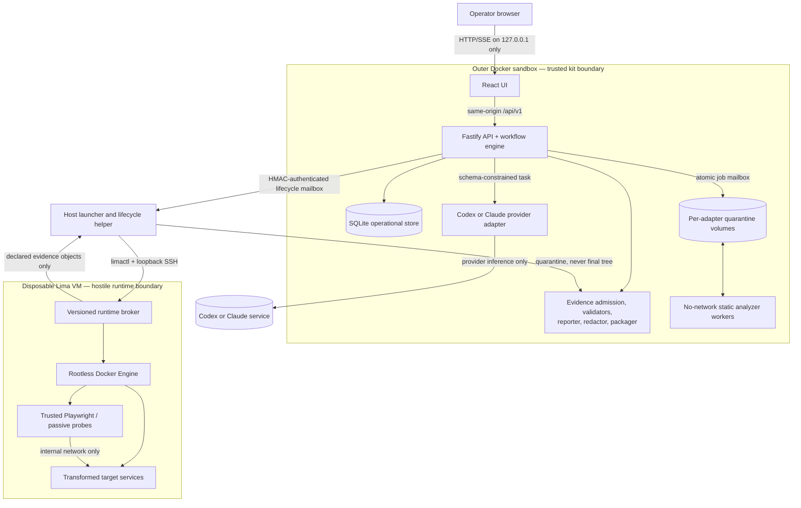

# Repository Assessment Kit — Architecture Contender 2

## Strategy

**Contract-and-schema-first resumable engine:** the product is a deterministic control plane around nondeterministic agents and analyzers. Every phase has versioned inputs, an explicit state machine, a fenced attempt, immutable outputs, and deterministic completion gates. A retry never overwrites admitted evidence, a resume never silently changes inputs, and a polished report can never make missing coverage look successful.

This architecture implements the researched split: the kit UI, API, provider adapters, and static analyzers run in the outer Docker sandbox; hostile target Docker/Compose execution runs only in a disposable Lima VM behind a narrow broker. Static assessment and a valid package remain possible when that runtime is blocked.

## 1. System overview

### 1.1 Context and trust boundaries



Trust rules are default-deny:

- Only the browser-facing UI port is published, explicitly to physical-host `127.0.0.1`. CORS is disabled.
- Only the API process opens SQLite and the final run tree. Workers and provider adapters never open the database.
- Provider authentication homes are separate per provider and engagement. They are mounted only into that provider adapter and never into analyzers, the worker VM, the API, or customer artifacts.
- Static analyzer workers receive a copied immutable snapshot, a per-adapter quarantine volume, pinned kit configuration, and no network, SSH, provider home, credentials, Docker API, or final artifact tree.
- The host lifecycle helper accepts only the protocol in §6. It is not routable from the browser or provider adapter and never accepts shell, Lima, Docker, Compose, or arbitrary filesystem commands.
- The VM broker is the only client of the worker's rootless Docker socket. Agents, probes, and target containers receive no Docker API.
- Target services see neither the physical host nor `generated/`; only declared evidence crosses back into quarantine.
- Provider inference is an external data boundary. Intake names the selected provider and data categories before start. “Local-first” does not mean source never leaves the machine.

### 1.2 Repository layout and ownership

The pnpm workspace is:

```text
apps/
  web/                 React 19.2 + Vite 8 local UI
  server/              Fastify 5 API, workflow scheduler, single DB writer
  provider-codex/      Codex CLI adapter
  provider-claude/     Claude Code CLI adapter
  analyzer-*/          fixed offline worker wrappers/images
  host-helper/         trusted host-side lifecycle executable
  runtime-broker/      broker installed in the disposable VM
packages/
  contracts/           RAK JSON Schemas, API schemas, generated TS types
  db/                  Drizzle schema and generated migrations
  workflow/            pure state machine and phase definitions
  policy/              capability, Compose, egress, and action policies
  evidence/            admission and semantic validation
  adapters/            scanner normalizers and provider-neutral task schemas
  reports/             Markdown/static-HTML renderers
  packaging/           manifest, checksums, ZIP, optional age wrapper
  test-fixtures/       seven-ecosystem, hostile-source, and package fixtures
schemas/               vendored official schemas and RAK 1 public schemas
standards-lock.json
toolchain.lock.json
generated/             gitignored
```

`packages/contracts` is the dependency root. Frontend and backend import generated types from the same schemas; neither defines transport types locally. Dependency direction is one way: apps → packages; `contracts` and `workflow` import no app package; report generators read canonical RAK documents, never UI view models or SQLite rows.

## 2. Components

| Component | Responsibility | Interfaces | Dependencies / prohibited access |
|---|---|---|---|
| Web UI | Guided discovery, target selection, run control, progress, limitations, evidence/findings review, decision and package review | Same-origin REST and SSE only | No filesystem, provider, helper, or worker access |
| Fastify API | Session security, REST validation, optimistic concurrency, read models | §5 HTTP contract | Binds to container network; published only through loopback mapping |
| Workflow engine | Executes the state machines, dependency graph, idempotency, leases, retry/resume, cancellation, and outbox | Pure transition functions plus worker/provider/helper protocols | Does not infer success from prose or process exit alone |
| SQLite repository | Operational source of current run state, indices, transitions, approvals, reviews, leases, and event outbox | Drizzle repository methods, API process only | No secrets, source, screenshots, raw logs, or large evidence blobs |
| Snapshot service | Resolves commit, exports commit or explicitly approved working-tree snapshot, hashes before/after, creates read-only content-addressed snapshot | `TargetSnapshot` contract | SSH is intake-only and never copied into output |
| Provider adapters | Map one provider-neutral task into pinned Codex/Claude commands, preserve session ID, return schema-constrained output | §6.1 | Provider home + inference network; no DB, Docker API, final tree, sandbox credentials |
| Static analyzer workers | Run the pinned baseline tools against snapshot copies | Atomic mailbox §6.2; native output receipts | No network and no shared volume with another analyzer |
| Evidence admission | Safely reads quarantine, verifies producer receipt/digest/limits, redacts, stores content-addressed evidence, records provenance | §7 admission protocol | It alone promotes bytes from quarantine |
| Deterministic validators | JSON Schema, semantic references, state/reason rules, policy, redaction, package integrity, source integrity | RAK validation reports | Validation failure cannot be overridden by an agent |
| Runtime capability service | Produces deterministic runtime feasibility and coverage effects | `RuntimeCapability` schema | Does not weaken policy to achieve launch |
| Host lifecycle helper | Creates/attests/destroys Lima VM, copies snapshot/evidence, emergency stop | §6.3 HMAC mailbox | No web exposure or free-form command execution |
| VM runtime broker | Rejects unsafe Compose before resolution, compiles a restricted runtime, controls rootless Docker, probes and cleanup | §6.4 broker protocol | Only worker Docker client; no provider or host credentials |
| Report/decision generator | Builds native decision model, plain-language Markdown and static HTML from admitted canonical data | Versioned renderer inputs/outputs | Generated prose cannot create evidence or change control status |
| Independent review coordinator | Starts fresh, transcript-isolated security and decision reviews and records proposals | `Review` schema | Review produces an immutable record; corrections create new entity revisions |
| Packager | Freezes redacted staging, JCS manifest, checksums, ZIP reopen verification and optional age wrapper | §8 package algorithm | Cannot package from mutable quarantine or the operational DB |

## 3. Lifecycle, resumability, and evidence-drift prevention

### 3.1 Run state machine

Canonical run states are uppercase enum values:

```text
DRAFT -> READY -> RUNNING -> COMPLETED
                    |  ^
                    v  |
             WAITING_OPERATOR
                    |
                    v
                  PAUSED

RUNNING|WAITING_OPERATOR|PAUSED -> RECOVERABLE_FAILURE -> RUNNING
RUNNING|WAITING_OPERATOR|PAUSED|RECOVERABLE_FAILURE -> CANCELLING -> CANCELLED
RUNNING|RECOVERABLE_FAILURE -> FAILED
```

Rules:

- `DRAFT → READY` only after discovery-topic, target, provider disclosure, policy, and output-path validation.
- `READY → RUNNING` only through `start`, after the immutable run identity is allocated.
- `RUNNING → WAITING_OPERATOR` only for a typed `OperatorRequest` such as missing discovery, scoped egress approval, sandbox credential handle, or review.
- `RUNNING|WAITING_OPERATOR → PAUSED` stops new dispatch; in-flight safe jobs finish or reach their declared checkpoint.
- `RECOVERABLE_FAILURE → RUNNING` requires a recovery plan, a new phase attempt, and unchanged deterministic input digest. If inputs changed, the engine creates a new phase revision and invalidates downstream completions.
- `FAILED`, `CANCELLED`, and `COMPLETED` are terminal. Continuing from them clones inputs into a new run ID; it never reopens the terminal run.
- `COMPLETED` requires all mandatory phases, deterministic package validation, independent security/decision reviews, technical review, and lay review.
- Every transition is a compare-and-swap on `run.revision`; rejected transitions return `409 state_conflict`.

The ordered phase graph is:

1. `discovery`
2. `target-snapshot`
3. `static-inventory`
4. `static-security-and-quality` (parallel analyzer controls)
5. `runtime-capability`
6. `dynamic-assessment` (may complete entirely with `blocked`/`not applicable` controls)
7. `product-code-traceability`
8. `decision-synthesis`
9. `independent-security-review`
10. `independent-decision-review`
11. `deterministic-release-validation`
12. `technical-human-review`
13. `lay-human-review`
14. `package`

The phase graph is versioned as `workflowProfile: "rak-workflow/1.0.0"`. A completed phase is reused only when its `completion.inputDigest`, `workflowProfile`, schema/profile locks, and upstream completion digests all match.

### 3.2 Phase and attempt state

Phase states are `PENDING`, `READY`, `RUNNING`, `WAITING_OPERATOR`, `RETRYABLE_FAILURE`, `SUCCEEDED`, `FAILED`, `SKIPPED`, `CANCELLED`. Only these transitions are legal:

- `PENDING → READY`
- `READY → RUNNING|SKIPPED|CANCELLED`
- `RUNNING → WAITING_OPERATOR|RETRYABLE_FAILURE|SUCCEEDED|FAILED|CANCELLED`
- `WAITING_OPERATOR → RUNNING|CANCELLED`
- `RETRYABLE_FAILURE → READY|FAILED|CANCELLED`

`SKIPPED` is allowed only when the workflow profile marks the phase conditional. Dynamic assessment is not silently skipped: its planned controls receive `blocked` or `not applicable`, with reasons, and the phase then succeeds with limitations.

Each dispatch creates an immutable `phaseAttempt` with:

- `attemptId` UUID, `attemptNumber`, `phaseRevision`
- `inputDigest` = SHA-256(JCS of target snapshot digest, workflow/profile versions, policy, approved capability objects, tool/standards locks, discovery revision, and sorted upstream completion digests)
- `leaseOwner`, `leaseExpiresAt`, monotonically increasing `fenceToken`
- `startedAt`, `deadlineAt`, `endedAt`, `outcome`, sanitized failure
- output evidence IDs and a `completionDigest`

Leases default to 30 seconds and renew every 10 seconds. Every output receipt includes the current fence token. Admission rejects output from an expired or superseded fence, even if a late worker exits successfully.

### 3.3 Retry, resume, cancellation, and recovery

- HTTP actions require an `Idempotency-Key`; the server stores the request hash and response for 24 hours or the run lifetime, whichever is longer. Reuse with a different request is `409 idempotency_conflict`.
- Worker/provider/helper `commandId` is deterministic from `attemptId + commandKind + ordinal`. Re-dispatch returns the prior status or resumes the same command; it does not start a duplicate.
- Retry creates a new attempt directory and records `supersedesAttemptId`. It never overwrites native output, normalized evidence, findings, screenshots, or logs from an earlier attempt.
- Cancellation first sets `CANCELLING`, increments the fence, sends typed cancel commands, then runs cleanup. A 30-second graceful deadline is followed by provider termination, worker termination, and host emergency-stop. Cleanup outcome is recorded even if the run becomes `CANCELLED`.
- On server restart, the engine verifies SQLite, lock digests, snapshot digest, admitted evidence digests, and active leases. Expired `RUNNING` attempts become `RETRYABLE_FAILURE`; live external tasks are reconciled by `commandId`. Unknown external tasks are cancelled.
- A changed target snapshot, policy, discovery assertion, tool lock, standard lock, or upstream evidence set creates a new phase revision and invalidates that phase plus all transitive dependants. Old evidence remains addressable and marked superseded; it is never relabeled as current.
- Recovery never infers completion from a directory or exit code. A phase is complete only with an admitted `CompletionCertificate` that passes schema and semantic validation.

### 3.4 Control-result semantics

Every planned control has exactly one status:

- `pass`: the stated control was positively verified in the declared scope.
- `fail`: executed and evidence shows the expected condition was not met.
- `partial`: some but not all declared scope or technique completed.
- `blocked`: applicable, but an external prerequisite or safety policy prevented execution.
- `not applicable`: deterministic scope facts show the control does not apply.
- `not tested`: applicable or applicability unknown, but not attempted; always a coverage limitation.

Every state except `pass` requires a non-empty reason and coverage impact. `blocked` requires attempted safe steps; `not applicable` requires the applicability facts; `not tested` requires an owner and follow-up. Tool failure, unknown output schema, timeout, stale database, or parser truncation can never become `pass` or “zero findings.”

## 4. Canonical contracts and data model

### 4.1 Contract rules

`RAK 1` uses strict I-JSON-compatible JSON validated by vendored JSON Schema Draft 2020-12 plus semantic validators. Each document has:

```json
{
  "schemaVersion": "1.0.0",
  "profile": "rak-export-profile/1.0.0",
  "id": "UUID",
  "createdAt": "RFC3339 UTC timestamp",
  "extensions": {}
}
```

Boundary objects reject unknown properties except reverse-DNS keys within `extensions`. Parsers reject duplicate member names before parsing. IDs and digests are strings. All paths are normalized package- or repository-relative POSIX paths; absolute host paths are prohibited.

The immutable schema catalog contains:

| Schema | Required domain fields and constraints |
|---|---|
| `run.schema.json` | `runId`, `projectSlug`, `workflowProfile`, `exportProfile`, `provider`, `state`, `revision`, `targetSnapshotId`, `startedAt?`, `completedAt?`, `limitations[]`; completed run must reference a validated package |
| `target-snapshot.schema.json` | source kind, sanitized repository locator, full commit SHA, `snapshotMode` (`commit`/`working-tree`), base commit, tree digest, file-manifest digest, dirty-change inclusion/exclusion, before/after supplied-source digests |
| `assertion.schema.json` | topic, statement or explicit unknown, exactly one provenance label from `owner-stated`, `documented`, `observed`, `analytics-supported`, `code-inferred`, `unverified`, `conflicting`; conflicts reference both sides |
| `provenance.schema.json` | Entity/Activity/Agent records, immutable IDs, `wasGeneratedBy`, `wasAssociatedWith`, acyclic `derivedFrom`, exact tool/provider/version/digest |
| `evidence.schema.json` | evidence type, title, media type, byte length string, SHA-256, relative path or redacted external locator, snapshot ID, source locator, activity ID, sensitivity, redaction state, validation state, linked domain IDs |
| `finding.schema.json` | title, description, category, technical severity, business priority, confidence, validation state, evidence IDs, locations, CWE mappings, optional CVSS records, remediation theme; no aggregate repository score |
| `control-result.schema.json` | profile/control/version, planned scope, one six-state status, reason rules, technique, evidence IDs, limitation ID, reviewer |
| `tool-invocation.schema.json` | adapter/tool/version/image digest/rules/DB digest, sanitized argv/config, start/end/exit class, resource/truncation data, native evidence digest, coverage effect |
| `runtime-capability.schema.json` | decision, host/guest attestations, prerequisites, Compose policy result, browser/passive-tool support, credentials by opaque handle, attempted steps, coverage effects |
| `coverage.schema.json` | required domains and controls, planned/executed/state counts, exclusions, unsupported ecosystems, limitations; totals must reconcile |
| `decision.schema.json` | all three options, common criteria, factor value/rationale/evidence or unverified/conflicting state, recommendation/conditional sequence, confidence, assumptions, dependencies, reversal conditions |
| `artifact.schema.json` | kind, media type, relative path, size, digest, profile/schema, sensitivity/redaction, source evidence IDs |
| `review.schema.json` | review type, independent reviewer identity, input digest, verdict, objections, proposed corrections, accepted corrections, evidence IDs, time |
| `completion-certificate.schema.json` | phase/attempt/fence, input digest, sorted output IDs/digests, validation report ID, limitations, completion digest |
| `manifest.schema.json` | JCS profile, every payload path, special self entries, SHA-256 metadata, evidence links, package profile |

Projections are SARIF 2.1.0 Plus Errata 01 and CycloneDX 1.7 repository-discovery JSON. Native RAK documents remain canonical. Unsupported imported versions are preserved as opaque raw evidence and produce reduced coverage.

### 4.2 Operational relational model

SQLite holds workflow state and indices, not canonical customer bytes.

| Entity | Key fields | Relationships and constraints |
|---|---|---|
| `engagements` | `id`, unique `slug`, provider-home key hash, timestamps | Provider homes are scoped to one engagement; no credential value |
| `runs` | `id`, `engagementId`, `projectSlug`, `state`, `revision`, `workflowProfile`, `exportProfile`, `outputRelPath`, timestamps | unique output path; terminal rows immutable except retention metadata |
| `target_sources` | `id`, `runId`, kind, sanitized locator, requested ref, mount ID | one active source/run; no SSH config or key |
| `snapshots` | `id`, `runId`, full commit, mode, tree/file-manifest digests, source integrity digests, relpath | digest uniqueness per run; one active snapshot |
| `assertions` | `id`, `runId`, topic, revision, provenance, statement/unknown reason, conflict refs | unique active `(run, topic, logicalId)`; revisions append |
| `phases` | `id`, `runId`, phase key, graph version, state, revision, currentAttemptId | unique `(run, phase key, revision)` |
| `phase_attempts` | `id`, `phaseId`, number, input digest, fence, lease fields, outcome, completion ID | unique `(phaseId, number)`; immutable after end |
| `commands` | `id`, `attemptId`, kind, request digest, status, external task/session ID, timestamps | deterministic ID; one command result |
| `controls` | `id`, `runId`, profile/version/control ID, planned scope | unique planned control identity |
| `control_results` | `id`, `controlId`, attemptId, status, reason, impact, evidence refs | one active result/control; revisions append |
| `capability_results` | `id`, `runId`, attemptId, decision, document evidence ID | one active runtime capability revision |
| `provenance_agents` | `id`, type, provider/tool/operator identity, version/digest | no secret or raw credential |
| `activities` | `id`, `runId`, attemptId, type, agentId, times, outcome | producer for evidence |
| `evidence_entities` | `id`, `runId`, `activityId`, digest, byteLength, relpath, sensitivity, redaction/validation states, supersedes ID | unique `(run, digest, evidence type)`; admitted rows immutable |
| `evidence_derivations` | parent ID, child ID, transformation | composite PK; validator enforces acyclic graph |
| `findings` | `id`, `runId`, logical fingerprint, revision, severity, priority, confidence, validation, supersedes ID | unique active logical fingerprint; no score aggregation |
| `finding_evidence` | finding ID, evidence ID, relation | composite PK |
| `limitations` | `id`, `runId`, domain, reason, impact, follow-up, state | referenced by coverage/control/package |
| `decision_factors` | `id`, `runId`, option, criterion, value, confidence, assertion/evidence refs | all three options must cover identical criterion set |
| `approvals` | `id`, `runId`, type, exact scope/destination/action, expiry, approver, status | immutable decision; no secret value; no generic internet approval |
| `reviews` | `id`, `runId`, type, input digest, reviewer agent, verdict, document evidence ID | mandatory independent security/decision and human technical/lay rows |
| `artifact_intents` | `id`, `runId`, attemptId, expected digest/path, state | two-phase filesystem admission journal |
| `artifacts` | `id`, `runId`, kind, digest, relpath, package inclusion, validation state | admitted immutable objects only |
| `leases` | resource key, owner, fence, expiry | unique resource; fence strictly increases |
| `idempotency_keys` | principal, key, request hash, response code/body, expiry | unique principal/key |
| `run_events` | run ID, sequence, kind, payload JSON, occurredAt, run revision | unique `(run, sequence)`; transactionally appended |
| `db_backups` | id, run ID?, digest, relpath, schema version, createdAt, verifiedAt | operational and excluded from package |

The API process is the sole writer, serializing mutations through one in-process queue. `better-sqlite3` is the selected Drizzle driver because its synchronous transaction model makes the single-writer boundary explicit and avoids an embedded network service. It is a mandatory release gate on Node.js 24, Linux ARM64, and Linux x86-64; failure reverses the driver choice rather than shipping an unproved binary.

SQLite uses WAL mode, foreign keys on, `synchronous=FULL`, a 5-second busy timeout, and explicit transactions. Startup runs `quick_check`; scheduled phase-boundary backups use the driver's online backup API to a temporary file, verify `integrity_check`, hash, fsync, and atomically rename. A corrupt DB restores only from the newest verified compatible backup, then revalidates artifact intents and evidence digests. Completed customer exports are recoverable independently of SQLite.

Schema changes use **Drizzle Kit** migrations generated from the TypeScript Drizzle schema and committed. Generated migration files are never hand-authored or hand-edited. Startup backs up the database, verifies the migration chain digest, applies forward migrations once under an exclusive migration lease, then records the resulting schema version. Migration failure leaves the old DB and backup untouched and blocks startup.

The operational database lives at `generated/.control/rak.sqlite`; its verified backups and pre-snapshot acquisition workspaces remain under `generated/.control/`. This directory is operational, gitignored, excluded from every customer package, and never mounted into a provider, analyzer, or target runtime.

### 4.3 Filesystem model and atomic admission

Run paths are:

```text
generated/<project>-<full-commit>-<YYYYMMDDTHHMMSSZ>/
  internal/
    snapshot/
    quarantine/<adapter>/<attempt-id>/
    provider-exchange/
    runtime-exchange/
    db-backups/
  evidence/
    raw/sha256/<first2>/<digest>
    normalized/
  reports/
  exports/
  staging/                 frozen only during packaging
  package/
```

The project slug is lowercase `[a-z0-9][a-z0-9-]{0,62}`; the commit is the full resolved Git object ID. The timestamp is allocated once in UTC and the directory is created with exclusive semantics.

Before the commit is resolved, acquisition uses `generated/.control/intake/<runId>/`. Immediately after snapshot verification, the engine atomically reserves the final run path above and moves only the verified snapshot and declared run state into it. Failed pre-snapshot intake remains operational state under `.control` and cannot be mistaken for a customer run.

Admission is two-phase:

1. In a DB transaction insert `artifact_intent(STAGING)` with expected producer, attempt, fence, path, maximum size, and expected digest from the signed receipt.
2. Open the quarantine file without following symlinks; reject non-regular files, unsafe names, size/ratio limits, duplicate JSON keys, prohibited paths, and stale fences. Hash, redact where required, schema-validate, semantic-validate, write a content-addressed temporary object, fsync file and directory, then atomically rename.
3. In one DB transaction insert immutable evidence/provenance/artifact rows, mark the intent `ADMITTED`, append the run event, and update phase state.

After a crash, a `STAGING` intent with a verified final object is finalized; without it, the command retries. Unreferenced objects are quarantined for later deletion and never become evidence by directory discovery.

## 5. HTTP and event contracts

### 5.1 Common rules, authentication, and errors

- Base path: `/api/v1`; JSON media type `application/json`; contract version is never inferred from UI build version.
- On launch, a 256-bit one-time token is printed in a URL fragment. `POST /api/v1/session` exchanges it once for an `HttpOnly; SameSite=Strict; Path=/` random session cookie and a CSRF token. The bootstrap token exists only in server memory and is rotated after exchange.
- Every endpoint except `POST /api/v1/session` requires the session cookie. `GET /api/v1/system/status` returns full status only after authentication; before bootstrap the launcher, not an unauthenticated API route, reports readiness.
- All non-GET requests require the cookie, exact `Origin` match, and `X-RAK-CSRF`. CORS is disabled. Sessions expire after 8 hours idle/24 hours absolute and can be revoked. EventSource uses the same-origin cookie.
- `If-Match: W/"run:<runId>:<revision>"` is required for run mutations. `Idempotency-Key: <UUID>` is required for action POSTs.
- The server returns `X-Request-Id` and `ETag` where applicable.
- List endpoints use opaque `cursor` and `limit` (default 50, maximum 200).

Success is:

```json
{"data": {}, "meta": {"requestId": "UUID", "schemaVersion": "1.0.0"}}
```

Errors use `application/problem+json`:

```json
{
  "type": "https://repo-assessment-kit.dev/problems/state-conflict",
  "title": "Run state does not allow this action",
  "status": 409,
  "code": "state_conflict",
  "detail": "Expected revision 12; current revision is 13.",
  "instance": "/api/v1/runs/...",
  "requestId": "UUID",
  "errors": [{"path": "/state", "code": "invalid_transition", "message": "..."}]
}
```

Stable codes are `validation_failed` (400), `unauthenticated` (401), `forbidden` (403), `not_found` (404), `state_conflict` (409), `idempotency_conflict` (409), `precondition_required` (428), `rate_limited` (429), `capability_blocked` (422), and `internal_error` (500). Details and logs are sanitized.

### 5.2 Public endpoints

The following are the exact API view contracts. All named document fields use the enums and semantic rules in §4; nullable fields are explicitly `null`, never omitted. `UUID`, `Timestamp`, and `Digest` are strings validated by `packages/contracts`.

```ts
type RunState =
  | "DRAFT" | "READY" | "RUNNING" | "WAITING_OPERATOR" | "PAUSED"
  | "RECOVERABLE_FAILURE" | "CANCELLING" | "CANCELLED" | "FAILED" | "COMPLETED";

type AllowedAction = "prepare" | "start" | "pause" | "resume" | "cancel";

interface RunSummary {
  runId: UUID;
  projectSlug: string;
  state: RunState;
  revision: number;
  provider: "codex" | "claude";
  target: null | {
    fullCommit: string;
    snapshotMode: "commit" | "working-tree";
    snapshotDigest: Digest;
  };
  createdAt: Timestamp;
  updatedAt: Timestamp;
  lastEventSequence: number;
  allowedActions: AllowedAction[];
}

interface RunDetail extends RunSummary {
  source: {kind: "git-ssh"; sanitizedUrl: string; requestedRef: string}
        | {kind: "local"; mountId: string; displayName: string};
  workflowProfile: string;
  exportProfile: string;
  policyProfile: string;
  runtimePreference: "attempt-if-safe" | "static-only";
  outputRelativePath: string | null;
  phases: PhaseSummary[];
  limitationCounts: Record<"critical" | "material" | "minor", number>;
  activeOperatorRequest: OperatorRequest | null;
  packageArtifactId: UUID | null;
}

interface PhaseSummary {
  phaseId: UUID;
  key: string;
  revision: number;
  state: "PENDING" | "READY" | "RUNNING" | "WAITING_OPERATOR"
       | "RETRYABLE_FAILURE" | "SUCCEEDED" | "FAILED" | "SKIPPED" | "CANCELLED";
  currentAttemptId: UUID | null;
  attemptNumber: number;
  startedAt: Timestamp | null;
  endedAt: Timestamp | null;
  progress: {completed: number; total: number; unit: string} | null;
  limitationIds: UUID[];
}

interface AttemptView {
  attemptId: UUID;
  attemptNumber: number;
  phaseRevision: number;
  state: string;
  inputDigest: Digest;
  completionDigest: Digest | null;
  supersedesAttemptId: UUID | null;
  startedAt: Timestamp;
  endedAt: Timestamp | null;
  failure: null | {code: string; message: string; retryable: boolean};
}

interface ControlView {
  controlId: UUID;
  profile: string;
  profileVersion: string;
  externalControlId: string;
  title: string;
  domain: string;
  plannedScope: string;
  status: "pass" | "fail" | "partial" | "blocked" | "not applicable" | "not tested";
  reason: string | null;
  coverageImpact: string | null;
  evidenceIds: UUID[];
  limitationId: UUID | null;
  updatedAt: Timestamp;
}

interface EvidenceView {
  evidenceId: UUID;
  type: string;
  title: string;
  mediaType: string;
  byteLength: string;
  sha256: Digest;
  packageRelativePath: string | null;
  sourceLocator: null | {path: string; startLine: number | null; endLine: number | null};
  sensitivity: "public" | "customer-confidential" | "restricted" | "secret";
  redactionState: "not-required" | "redacted" | "withheld";
  validationState: "unreviewed" | "corroborated" | "independently reproduced" | "disputed" | "invalidated";
  previewAvailable: boolean;
  linkedFindingIds: UUID[];
  linkedControlIds: UUID[];
}

interface FindingView {
  findingId: UUID;
  logicalFingerprint: string;
  revision: number;
  title: string;
  category: string;
  technicalSeverity: "critical" | "high" | "medium" | "low" | "informational";
  businessPriority: "urgent" | "high" | "normal" | "low" | "unassigned";
  confidence: "high" | "medium" | "low";
  validationState: "unreviewed" | "corroborated" | "independently reproduced" | "disputed" | "invalidated";
  disposition: "open" | "accepted" | "deferred" | "not-a-finding";
  evidenceIds: UUID[];
  controlIds: UUID[];
  supersedesFindingId: UUID | null;
  updatedAt: Timestamp;
}

interface ArtifactView {
  artifactId: UUID;
  kind: string;
  title: string;
  mediaType: string;
  byteLength: string;
  sha256: Digest;
  validationState: "pending" | "valid" | "invalid";
  includedInPackage: boolean;
  downloadAvailable: boolean;
}

interface OperatorRequest {
  requestId: UUID;
  kind: "discovery" | "approval" | "credential-handle" | "technical-review" | "lay-review";
  prompt: string;
  requiredFields: string[];
  createdAt: Timestamp;
  deadlineAt: Timestamp | null;
}

interface Page<T> {
  items: T[];
  nextCursor: string | null;
  total: number | null;
}
```

`GET /runs` returns `Page<RunSummary>`; phases include `PhaseSummary` plus `attempts: AttemptView[]`; controls, evidence, findings, and artifacts return the corresponding paged views. `GET /decision` and `GET /coverage` return the canonical RAK documents without a UI-specific transformation.

| Method/path | Request | Response / state effect |
|---|---|---|
| `POST /session` | `{bootstrapToken}` | `201 {csrfToken, expiresAt}`; sets cookie |
| `DELETE /session` | none | `204`; revokes session |
| `GET /system/status` | none | versions, architecture, provider login status, host-helper availability, lock verification; no secret values |
| `GET /source-mounts` | none | launcher-declared `{mountId, displayName, readOnly}` only |
| `GET /credential-handles` | none | declared sandbox-safe handle metadata `{handleId, purpose, destinations, expiresAt}`; never values |
| `POST /runs` | `CreateRun` below | `201 Run`; creates `DRAFT` |
| `GET /runs` | filters/cursor | paged `RunSummary[]` |
| `GET /runs/:runId` | none | current `RunDetail`, phase summary, limitations, allowed actions |
| `PATCH /runs/:runId/intake` | partial `{provider, policyProfile, runtimePreference, discovery}` | new run revision; `DRAFT` only |
| `POST /runs/:runId/actions/prepare` | `{}` | validates intake and moves `DRAFT→READY` |
| `POST /runs/:runId/actions/start` | `{}` | `READY→RUNNING`, allocates snapshot phase |
| `POST /runs/:runId/actions/pause` | `{reason}` | moves eligible state to `PAUSED` |
| `POST /runs/:runId/actions/resume` | `{recoveryPlanId?}` | `PAUSED|RECOVERABLE_FAILURE→RUNNING` after digest checks |
| `POST /runs/:runId/actions/cancel` | `{reason}` | sets `CANCELLING`, returns `202` |
| `POST /runs/:runId/operator-inputs` | typed response below | resolves exactly one active typed request |
| `POST /runs/:runId/approvals` | `ApprovalInput` below | immutable scoped approval; may unblock phase |
| `GET /runs/:runId/phases` | cursor | phase and immutable attempt history |
| `GET /runs/:runId/controls` | domain/status/cursor | planned controls and active results |
| `GET /runs/:runId/evidence` | filters/cursor | evidence metadata and safe preview availability |
| `GET /runs/:runId/evidence/:evidenceId/content` | none | redacted admitted content only; raw sensitive evidence is never browser-served |
| `GET /runs/:runId/findings` | filters/cursor | finding revisions and evidence links |
| `PATCH /runs/:runId/findings/:findingId` | `{businessPriority?, disposition?, reviewNote}` | appends a finding revision before staging freeze |
| `POST /runs/:runId/reviews` | human review attestation below | immutable technical/lay `Review`; internal independent reviews are workflow commands, not public API requests |
| `GET /runs/:runId/decision` | none | canonical three-option comparison and recommendation |
| `GET /runs/:runId/coverage` | none | domain/control matrix, exclusions and limitations |
| `GET /runs/:runId/artifacts` | cursor | customer artifacts plus validation/inclusion state |
| `GET /runs/:runId/artifacts/:artifactId/content` | none | admitted redacted report/export/package stream with `Content-Disposition` |
| `GET /runs/:runId/events` | `after` query or `Last-Event-ID` | SSE replay then live stream |

`CreateRun`:

```json
{
  "projectSlug": "acme-app",
  "source": {
    "kind": "git-ssh",
    "url": "git@host:org/repo.git",
    "ref": "main"
  },
  "snapshotMode": "commit",
  "provider": "codex",
  "policyProfile": "rak-baseline/1.0.0",
  "runtimePreference": "attempt-if-safe"
}
```

For local input, `source` is `{"kind":"local","mountId":"opaque-launcher-id"}`. `snapshotMode` defaults to `commit`; `working-tree` is allowed only for local input with explicit confirmation. Discovery is a list of:

```json
{
  "topic": "valuable-workflows",
  "statement": "Checkout is revenue-critical.",
  "unknownReason": null,
  "provenance": "owner-stated",
  "speakerRole": "software owner",
  "capturedAt": "..."
}
```

All required topics must have either `statement` or `unknownReason`.

Operator input is a discriminated union and must match the active request kind:

```json
{
  "requestId": "UUID",
  "response": {
    "kind": "credential-handle",
    "handleId": "opaque-launcher-handle"
  }
}
```

Other response variants are `{"kind":"discovery","assertions":[...]}`, `{"kind":"approval","approvalId":"UUID"}`, `{"kind":"technical-review","reviewId":"UUID"}`, and `{"kind":"lay-review","reviewId":"UUID"}`. A mismatched or already-resolved request returns `409 state_conflict`.

`ApprovalInput` is:

```json
{
  "type": "build-egress",
  "scope": {
    "phaseAttemptId": "UUID",
    "destinations": ["registry.example.com:443"],
    "methods": ["CONNECT"],
    "maxBytes": "1073741824",
    "expiresAt": "..."
  },
  "reason": "Fetch digest-pinned build dependencies."
}
```

Types are `build-egress`, `runtime-endpoint`, `optional-hosted-service`, `working-tree-snapshot`, and `sandbox-credential-use`. Generic internet, production, destructive, wildcard destination, or unbounded approval is schema-invalid.

Human review input is:

```json
{
  "type": "technical-human",
  "verdict": "approved",
  "reviewer": {"displayName":"A. Reviewer","role":"security lead"},
  "inputDigest": "sha256...",
  "comments": "Material conclusions are supported in the declared scope.",
  "attestations": [
    "material-findings-reviewed",
    "plain-language-preserves-meaning"
  ]
}
```

`type` is `technical-human|lay-human`; `verdict` is `approved|changes-required`. Required attestations are type-specific in the schema. The submitted `inputDigest` must equal the current review bundle or the server returns `409 state_conflict`.

### 5.3 SSE contract

Events are operational notifications, not canonical current state. The canonical state is obtained from GET endpoints.

```text
id: 184
event: phase.state.changed
data: {"eventId":"UUID","sequence":184,"runId":"UUID","occurredAt":"...","runRevision":23,"kind":"phase.state.changed","payload":{"phase":"static-security-and-quality","state":"RUNNING","attemptId":"UUID"}}
```

Kinds are `run.state.changed`, `phase.state.changed`, `phase.progress`, `operator.requested`, `control.updated`, `finding.updated`, `limitation.updated`, `artifact.admitted`, `review.completed`, and `package.validated`. Payloads contain IDs and redacted summaries only.

`sequence` is monotonically increasing per run and allocated in the same SQLite transaction as the state change. The server replays events strictly greater than `Last-Event-ID`/`after`, then tails live events. It sends a comment heartbeat every 15 seconds. An invalid or unavailable cursor returns `409 event_cursor_expired`; the client refetches `RunDetail` and reconnects from its returned `lastEventSequence`.

## 6. Internal interface contracts

### 6.1 Provider task

Server to adapter:

```json
{
  "protocolVersion": "rak-provider-task/1.0.0",
  "taskId": "deterministic UUID",
  "runId": "UUID",
  "attemptId": "UUID",
  "fenceToken": "42",
  "provider": "codex",
  "taskKind": "decision-synthesis",
  "inputBundle": {"relativePath":"in/task.json","sha256":"..."},
  "outputSchemaId": "https://schemas.../decision.schema.json",
  "sessionMode": "new",
  "resumeSessionId": null,
  "deadlineAt": "...",
  "allowedKitCommands": ["evidence.lookup","coverage.lookup"]
}
```

The adapter validates the request, verifies the input digest, invokes the pinned CLI, captures JSONL/session ID, and writes a receipt:

```json
{
  "protocolVersion": "rak-provider-result/1.0.0",
  "taskId": "...",
  "attemptId": "...",
  "fenceToken": "42",
  "status": "succeeded",
  "providerSessionId": "opaque",
  "output": {"relativePath":"out/result.json","sha256":"...","schemaId":"..."},
  "log": {"relativePath":"out/provider.jsonl","sha256":"...","truncated":false},
  "startedAt": "...",
  "endedAt": "..."
}
```

Status is `running|succeeded|failed|cancelled`. Adapter output is quarantined until deterministic admission. Codex maps unattended tasks to `codex exec --sandbox workspace-write --ask-for-approval never --json`; Claude maps to `claude -p --permission-mode dontAsk --output-format stream-json --verbose` with narrow allow rules. Dangerous bypass modes are excluded from production paths.

Independent security and decision review use a fresh session, no author transcript, the same canonical evidence snapshot, and a review schema. Prefer the alternate provider when authenticated; otherwise use a fresh isolated session of the same provider and disclose that limitation. A model review cannot satisfy the mandatory human technical and lay gates.

### 6.2 Static analyzer mailbox

Each predeclared offline analyzer container has a distinct named exchange volume. The server atomically renames `job.tmp` to `job.request.json`; the worker writes `job.result.tmp` then renames to `job.result.json`. Request fields are protocol version, command ID, attempt/fence, copied snapshot digest/path, fixed adapter operation, pinned tool/rule/DB digests, budgets, and output limits. No request contains argv or a configuration path chosen by the target.

The worker wrapper maps operation to a compiled argv array, runs as numeric non-root with read-only root, all capabilities dropped, `no-new-privileges`, tmpfs scratch, and network disabled. Result distinguishes `findings`, `clean`, `unsupported`, `partial`, `timeout`, `tool_error`, and `policy_rejected`; only the normalizer maps these to control coverage.

Baseline operations are kit walker/scc, Syft, OSV-Scanner, Gitleaks, Trivy, Opengrep with kit-owned rules, and PMD/CPD. Native output is preserved. No baseline worker runs package managers, builds, tests, project plugins/config, autofix, registry rules, or target executable configuration.

### 6.3 Host-helper mailbox

The launcher creates a `0700` per-engagement host-helper directory and a 256-bit HMAC key in a read-only secret mount available only to the API and helper. Requests/responses are atomic files containing protocol version, UUID request ID, run/attempt/fence, operation, strictly typed parameters, expiry, nonce, and HMAC-SHA-256 over JCS bytes. Replays, expired requests, invalid fences, unknown fields, and unknown operations are rejected.

Allowed operations:

- `CREATE_VM {templateDigest, nativeArch, cpu, memoryBytes, diskBytes, deadline}`
- `ATTEST_VM {vmId}`
- `LOAD_SNAPSHOT {vmId, snapshotDigest, approvedHostRelativePath}`
- `BROKER_COMMAND {vmId, brokerRequest}`
- `COLLECT_DECLARED {vmId, declarationIds, quarantinePath}`
- `DESTROY_VM {vmId}`
- `EMERGENCY_STOP {vmId, reason}`

The helper permits paths only under the current run's internal exchange roots and invokes binaries with argv arrays, never a shell. It records sanitized lifecycle evidence. It refuses any operation whose run/attempt/fence is not active.

### 6.4 VM broker protocol and runtime capability

Broker commands are `ATTEST`, `COMPILE_PLAN`, `ACQUIRE`, `BUILD`, `START`, `PROBE`, `STOP`, `EXPORT_EVIDENCE`, and `CLEANUP`. They operate on opaque plan IDs; there is no generic Docker/Compose command.

`COMPILE_PLAN` first parses references without invoking Compose, rejects remote/escaping include/extends/build contexts and symlinks, then resolves accepted local configuration in a no-network/no-secret parser sandbox. It rejects privilege, added capabilities, devices, socket/API mounts, namespace sharing, LSM disabling, unsafe sysctls, provider hooks, host binds/ports, external resources, host gateway/metadata routes, arbitrary networks, unlimited replicas, and incompatible platform. Accepted services are rewritten with all capabilities dropped, no-new-privileges, read-only root, non-root user where supported, bounded tmpfs/scratch, CPU/memory/PID/disk/wall limits, and only broker-created resources.

Acquisition/build and runtime are separate states. Build egress is proxy-allowlisted and audited by destination, DNS, bytes, and approval ID. Runtime starts on an internal network with guest firewall default-deny and no published port. Any endpoint exception is a scoped `runtime-endpoint` approval. Playwright permits allowlisted-origin read-only navigation and blocks mutating methods, uploads, downloads, cross-origin requests, and destructive actions. ZAP is Baseline/passive only.

The runtime capability decision is deterministic from:

- native host/guest architecture and pinned Lima/template versions
- rootless Docker, cgroup v2/systemd and delegated controller attestations
- VM/helper/broker health and resource enforcement
- snapshot validity and Compose compile result
- declared sandbox credential handles and endpoint policy
- Chromium/Playwright and ZAP/passive fallback support on the architecture
- application-shape applicability

A missing VM, unsafe Compose feature, unsupported architecture, prohibited production endpoint, unapproved egress, or failed controller attestation yields precise `blocked` controls. It never triggers host-socket or privileged-DinD fallback.

## 7. Validation and independent review

### 7.1 Deterministic gates

The engine, not an agent, decides whether a phase or package is valid. Required deterministic gates are:

1. official offline schema validation for RAK JSON, SARIF Errata 01, and CycloneDX 1.7;
2. duplicate-key, I-JSON, strict-version, and format validation;
3. unique/resolvable IDs, matching target identity, acyclic derivation, repository-relative locations, and active-attempt fences;
4. exactly one status per planned control, reason/attempt/applicability rules, and coverage-total reconciliation;
5. every material finding and decision factor linked to evidence or visibly `unverified`/`conflicting`;
6. all three decision options evaluated against the identical criterion set;
7. tool/rule/DB/standard lock digest and output-version validation;
8. prohibited compliance/absolute claims, placeholder markers, host paths, secrets, SSH/provider material, and known credential canaries;
9. source before/after integrity;
10. manifest/checksum/ZIP post-open integrity and declared payload completeness.

`technicalSeverity`, `businessPriority`, `confidence`, and `validationState` are independent. CVSS 4.0 is emitted only with sufficient facts, score, vector, and evidence; older imported vectors remain unchanged. No aggregate repository score exists.

### 7.2 Judgment gates

Deterministic gates cannot decide whether reasoning is persuasive or prose is understandable:

- A transcript-isolated independent security review checks decision-critical security findings, coverage claims, false negatives implied by limitations, and control mappings.
- A transcript-isolated independent decision review challenges the three-option comparison, parity burden, evidence strength, assumptions, and reversal conditions.
- A technical human reviewer accepts/rejects material findings and verifies that plain-language simplification preserved meaning.
- A lay human reviewer must be able to explain the risks, business effect, options, recommendation, confidence, and unknowns.

Reviewers append records; they do not mutate source evidence. Accepted corrections create new finding/decision/report revisions, invalidate downstream completion digests, and rerun deterministic validation.

## 8. Reporting, redaction, and packaging

The one-way artifact flow is:

```text
worker/provider/VM quarantine
  -> admitted immutable raw evidence
  -> normalized RAK documents
  -> reviewed reports and projections
  -> redacted frozen staging
  -> validated ZIP
```

The package includes plain-language executive and decision reports (Markdown and self-contained HTML), technical assessment, distinct security report, product/workflow traceability, coverage/limitations, RAK JSON, SARIF, CycloneDX, useful CSV, admitted evidence, relevant redacted screenshots/logs, manifest, and checksums. Screenshots are included only when safely produced and evidentially useful; their absence requires a capability/coverage explanation.

Packaging follows this exact algorithm:

1. Materialize a redacted staging tree from admitted artifacts; no component writes it afterward.
2. Reject symlinks, hardlinks, special files, absolute/`..` paths, duplicate paths, case collisions, and Unicode-normalization collisions.
3. Secret/host-path/placeholder scan every format and file metadata.
4. Generate an RFC 8785 JCS `manifest.json` declaring every payload, including special entries for manifest and checksums without self-referential size/digest.
5. Generate `SHA256SUMS` for every payload including `manifest.json`, excluding itself.
6. Fresh-read all bytes and semantic references, then create the ZIP with normalized safe relative paths and bounded compression.
7. Reopen in a fresh process; enforce entry count, per-entry/total uncompressed size and ratio limits, reject duplicates/unsafe paths, verify every checksum/reference/profile, and compare the inventory to the manifest.
8. Write detached `<package>.zip.sha256`.
9. If requested, use pinned age 1.3.1 with X25519 or scrypt to wrap the validated ZIP, decrypt to scratch, compare the recovered ZIP digest, and write the wrapper digest. Secrets never enter argv, environment, SQLite, logs, manifest, or artifacts. The plain validated ZIP remains mandatory.

Reports say “technical coverage against a selected profile,” never certification or legal compliance. ASVS 5.0.0 L1 is the default applicable web baseline; WSTG 4.2 provides safe techniques; Top 10:2025 is grouping only; SSDF 1.1 applies to supplied repository/process evidence. Applicability is only `not-assessed`, `customer-stated`, or `customer-confirmed`.

## 9. Non-functional requirements

### Security and privacy

- Treat source, Compose/Dockerfiles, scanner input, model content, web content, and tool output as hostile.
- No host Docker socket, host network mode, provider credential in child environments, production endpoint, destructive action, silent upload, or target-selected executable scanner configuration.
- Optional hosted services require per-run destination/data disclosure and scoped approval.
- SQLite, logs, and API errors must not store or emit credential values. Logs use field allowlists and redact path/user/secret patterns before writing.
- Residual risks are disclosed: provider inference receives selected context; an approved egress destination is an exfiltration channel; VM/hypervisor escape and provider-process compromise are not eliminated.

### Performance and scale

Release benchmarks must prove:

- UI/API read p95 under 200 ms and mutation p95 under 500 ms at 10,000 findings, 100,000 evidence metadata rows, and 1,000,000 events on a 4-core/8-GiB reference host.
- SSE state events become visible within one second under normal local load; reconnect/replay does not lose committed events.
- Listing is cursor-paginated and evidence content streams; the server never loads packages or large logs entirely into memory.
- Static analyzer concurrency defaults to `min(2, floor(hostCpu/2))`; the SQLite single writer is never held while hashing, scanning, rendering, or waiting on a worker.
- Recorded default budgets are 10 GiB/1,000,000 files per snapshot, 512 MiB native output per analyzer, 2 vCPU/4 GiB/30 minutes per static job, and 4 vCPU/8 GiB/40 GiB/2 hours per VM. Operators may choose stricter or approved larger bounds before start; exceeding a bound becomes explicit `partial`/`blocked`, never truncation presented as success.

### Availability and recovery

- A process kill at every lifecycle point must recover to a valid state without duplicate attempts or admitted-evidence mutation.
- SQLite backup/restore, stale-lease recovery, host-helper reconciliation, VM orphan cleanup, source integrity, and post-crash package verification are acceptance tests.
- Static work continues when runtime is blocked. Provider failure preserves deterministic static evidence and produces a recoverable failure rather than a fabricated report.
- Completed packages and their digests are immutable; comparison or changed inputs create a new run.

### Observability

- Pino structured JSON logs contain request, run, phase, attempt, command, and event IDs; no raw request body or evidence content.
- Local metrics cover state/phase durations, queue depth, lease expiry, retries, tool outcomes, evidence bytes, validation failures, redactions, helper/VM cleanup, SSE connections, and package verification.
- An append-only audit view is derived from state transitions, approvals, commands, reviews, and artifact admission. Events are transactionally consistent but not substituted for current state.
- Diagnostic bundles are separate, redacted, and excluded from customer packages unless explicitly admitted.

### Portability and reproducibility

- Node.js 24 LTS, pnpm, CLIs, images, VM template, scanners, rules, databases, schemas, and validators are exact-version/digest pinned.
- Build images for Linux ARM64 and x86-64. Native smoke/adversarial tests are mandatory on macOS ARM64, macOS x86-64, Linux ARM64, and Linux x86-64. WSL is documented best-effort.
- Both provider launchers run the identical workflow, schemas, domain/control matrix, validators, and acceptance harness. Equivalent required outcomes—not byte-identical prose—define parity.

## 10. Sequencing and parallelization

### Milestone 0 — Freeze contracts and executable fixtures

- Publish RAK 1, API, SSE, provider, worker, helper, broker, and state-machine schemas.
- Generate TypeScript types and contract fixtures.
- Freeze `toolchain.lock.json`, `standards-lock.json`, workflow/control matrices, and negative fixtures.
- Spike `better-sqlite3` on Node 24 ARM64/x86-64 and the Lima/rootless runtime on all four native hosts.

**Gate:** no backend/frontend parallel implementation starts until schema fixtures and state-transition tests pass. An unproved SQLite driver or native runtime is a loud release blocker.

### Milestone 1 — Control-plane skeleton

- Backend: Drizzle schema/migrations, single-writer repository, workflow reducer, idempotency, leases, outbox/SSE, session security.
- Frontend in parallel: build against generated types and a fixture-backed mock API/SSE stream.
- DevOps: pinned Node/pnpm images, loopback-only Compose, provider-home isolation, CI for schemas/migrations.

**Boundary:** frontend owns only `apps/web`; backend owns API behavior and shared contract implementation. Changes to `packages/contracts` require contract review and regenerated fixtures.

### Milestone 2 — Immutable snapshot and static evidence

- Implement Git/local intake, commit/working-tree identity, content-addressed snapshots, per-analyzer mailboxes and fixed offline workers.
- Implement two-phase evidence admission, native normalizers, provenance, controls, findings, coverage, and source-integrity checks.
- UI adds intake, progress, coverage, limitations, evidence, and finding review using frozen endpoints.

**Gate:** seven-ecosystem and hostile-source fixtures prove no execution/egress/write/silent-empty result on both Linux architectures.

### Milestone 3 — Provider equivalence and synthesis

- Implement Codex and Claude adapters, engagement-scoped homes, structured new/resume/cancel tasks, prompt-injection/credential canaries.
- Implement product-code traceability, decision comparison, independent reviews, report generation, and cross-agent acceptance.

**Gate:** one runnable and one runtime-blocked fixture produce schema-equivalent required outcomes through both providers.

### Milestone 4 — Dynamic runtime boundary

- Implement host helper mailbox, Lima lifecycle, broker protocol, Compose compiler, rootless daemon attestation, egress states, Playwright and passive scan.
- UI adds capability, approvals, runtime controls, and cleanup state.

**Gate:** four-host adversarial matrix proves limits, no socket/mount/port/egress escapes, precise blocked behavior, and orphan cleanup. No privileged-DinD or host-socket fallback exists.

### Milestone 5 — Release pipeline

- Implement semantic validators, independent/human review workflow, redaction, static HTML, SARIF/CycloneDX projections, staging freeze, JCS manifest, checksums, ZIP reopen verification, optional age.
- Complete technical and lay reviews and the full release dry runs.

**Gate:** all Must acceptance criteria pass through both launchers; zero placeholders, broken references, secret canaries, checksum mismatches, or unavailable required native hosts.

## 11. Architecture decision records

### ADR-001 — Native RAK JSON is canonical

- **Context:** Agents and scanners emit varying prose and formats.
- **Decision:** Versioned strict RAK JSON plus semantic validation is canonical; SARIF/CycloneDX/reports are projections.
- **Consequences:** More adapter work, but deterministic parity, migration, and package gates are possible.
- **Rejected:** model prose or scanner SARIF as source of truth; neither models the complete run.

### ADR-002 — Append-only attempts and content-addressed evidence

- **Context:** Resume/retry can otherwise mix old and new outputs.
- **Decision:** Every retry creates an immutable fenced attempt; admission is content-addressed and revisions use `supersedes`.
- **Consequences:** More retained internal data and explicit cleanup; no evidence drift or overwrite ambiguity.
- **Rejected:** resume in place or “latest file wins.”

### ADR-003 — SQLite with one writer and `better-sqlite3`

- **Context:** Local resumability needs transactions without a hosted database.
- **Decision:** API-owned SQLite, Drizzle, synchronous single-writer queue, WAL/FULL durability, verified backups.
- **Consequences:** Simple deployment and strong transaction semantics; write scaling is intentionally bounded to a local single-operator product.
- **Rejected:** Postgres/service DB (unneeded operations), multi-process SQLite writes (contention), and a driver not proven on the required Node/architecture matrix.

### ADR-004 — Generated migrations only

- **Context:** Schema and recovery behavior must remain reproducible.
- **Decision:** Drizzle Kit generates committed migrations from TypeScript schema; generated migrations are never hand-authored or hand-edited.
- **Consequences:** Model changes are reviewed at source and tested as a chain; exceptional SQL requires a modeled supported mechanism, not patching output.

### ADR-005 — SSE for one-way progress

- **Context:** The browser needs replayable progress, not bidirectional realtime commands.
- **Decision:** Same-origin SSE backed by transactional outbox; REST performs all commands.
- **Consequences:** Simple reconnect/replay and auditability; clients refetch canonical state after gaps.
- **Rejected:** WebSockets (unnecessary bidirectionality) and transient in-memory events (loss on restart).

### ADR-006 — Fixed offline static workers

- **Context:** Baseline scanners parse hostile bytes, but the control plane cannot expose Docker.
- **Decision:** Predeclared, pinned, no-network workers use distinct atomic mailbox volumes and kit-owned configuration.
- **Consequences:** More Compose services and fixed tool set; a scanner compromise cannot reach credentials, DB, final tree, another analyzer, or network.
- **Rejected:** executing scanners in the agent/API process, target configs, and runtime container creation through a socket.

### ADR-007 — Disposable VM for hostile runtime

- **Context:** Compose is trusted input and rootless DinD still requires privileged outer Docker.
- **Decision:** Plain-mode Lima VM, direct rootless Docker, restrictive broker, no mounts/forwarding, native architecture.
- **Consequences:** Higher startup cost and mandatory host helper/four-host testing; static-only output remains valid if blocked.
- **Rejected:** host socket, socket proxy, privileged/rootless DinD, and untransformed Compose.

### ADR-008 — Scoped approvals and separated network states

- **Context:** Builds may need acquisition, while runtime must not reach production.
- **Decision:** Distinct egress identities, build proxy allowlists, offline runtime, exact expiring approvals.
- **Consequences:** Some repositories are blocked; the product preserves safety and honest coverage.
- **Rejected:** generic “internet enabled” and silent hosted-service upload.

### ADR-009 — Deterministic validation plus independent judgment

- **Context:** A second model cannot prove hashes, schemas, or completeness, while validators cannot assess reasoning/readability.
- **Decision:** Engine gates all mechanical invariants; fresh independent reviews challenge security/decision reasoning; human technical and lay reviews gate release.
- **Consequences:** Release needs reviewer participation; responsibilities are explicit.
- **Rejected:** self-validation by the author agent or deterministic-only customer readiness.

### ADR-010 — Separate provider adapters and engagement homes

- **Context:** Codex and Claude have different auth, permission, session, skill, and output surfaces.
- **Decision:** Thin pinned adapters over a provider-neutral task/schema contract; separate full-home volume per provider and engagement.
- **Consequences:** Adapter tests are duplicated, canonical workflow is not. Login convenience does not create cross-engagement leakage.
- **Rejected:** shared home/image, blanket bypass, and byte-identical output requirement.

### ADR-011 — Validated plain ZIP is mandatory

- **Context:** Encryption does not replace redaction or prove package integrity.
- **Decision:** Freeze/redact/JCS-manifest/checksum/reopen-verify the plain ZIP, then optionally wrap with age and verify decryption.
- **Consequences:** Plain ZIP retention requires operator policy; every customer gets a verifiable baseline artifact.
- **Rejected:** legacy ZIP encryption, CRC as integrity, or packaging directly from mutable generated output.

## 12. Open risks and retirement plan

| Risk | Effect | Retirement / reversal condition |
|---|---|---|
| Lima/rootless Docker not yet proven on all four native hosts | Dynamic runtime and AC-10 remain release-blocking | Run the full adversarial matrix before Milestone 4 exit. Failure narrows the product/platform promise with owner approval; never fall back to socket/privileged DinD. |
| `better-sqlite3` Node 24/native matrix unresolved | Control-plane critical path | Spike migrations, concurrency, backup, interruption on Linux ARM64/x86-64 in Milestone 0. If it fails, select another maintained Drizzle-supported local driver through an ADR and rerun all persistence tests. |
| Claude Code path is documentation-only research | Cross-agent parity uncertain | Pin and execute login, resume, structured output, permission failure, signal, canary, and equivalence tests. Adapter changes may not change canonical contracts. |
| Linux ARM64 Chromium/ZAP uncertain | Runnable ARM64 web targets could lose required depth | Prove hardened Chromium; build/test multi-arch ZAP or ship the researched kit-controlled passive analyzer and state its reduced technique set. |
| Kit-owned Opengrep rules are a maintenance obligation | SAST could be shallow or legally unsafe | License audit, positive/negative fixtures, rule metadata, and seven-language coverage gate. If inadequate, narrow the declared profile or make a commercial local engine an explicit product decision. |
| Provider process necessarily holds a credential | Prompt injection may target provider state | Deny-read policy, no target execution, canary tests, engagement homes, minimal context. A stronger hostile-provider-process guarantee requires a separately validated credential broker/workload identity. |
| Approved acquisition endpoint is still exfiltration-capable | Source confidentiality residual risk | Disclose destination/data risk, prefer pinned caches, log traffic, scope approval. A customer requiring zero egress must accept offline partial dependency/build coverage. |
| Native macOS x86-64 hardware availability | Current acceptance criterion may be impossible to prove | Obtain native test evidence or have the product owner explicitly revise AC-10; emulation is not substituted silently. |
| Checksums do not establish authorship | Customer may misread integrity as signature | Use precise language and detached trusted delivery. Add a signed-package/key-lifecycle profile only for a confirmed requirement. |
| Large repository defaults may be insufficient | Partial coverage or resource pressure | Benchmark representative medium/large fixtures on both architectures, tune recorded budgets, and make exclusions/overrides explicit before release. |

## 13. Acceptance traceability

| Brief requirement | Architectural enforcement |
|---|---|
| Guided product/customer discovery | Required-topic assertion schema, unknown handling, prepare gate |
| Immutable target | commit/working-tree snapshot contract, content-addressed export, before/after integrity |
| Complete static assessment | fixed seven-ecosystem tool matrix, planned domains/controls, honest unsupported coverage |
| Safe runtime | deterministic capability gate, disposable VM/broker, separated egress, six-state controls |
| Evidence/provenance | RAK schemas, immutable admission, Entity/Activity/Agent, materiality validator |
| Decision support | identical three-option criteria, evidence/conflict rules, confidence and reversal conditions |
| Security baseline/overlays | pinned ASVS/WSTG/Top10/SSDF profiles, applicability boundary, independent review |
| Customer-ready package | one-way artifact flow, plain-language/human gates, manifest/checksum/ZIP verification |
| Codex and Claude compatibility | provider-neutral tasks and shared acceptance harness, separate thin adapters |
| Portable release | pinned multi-arch images and mandatory four-native-host release matrix |
