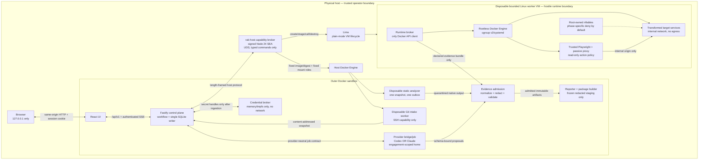

# Repository Assessment Kit — Architecture Specification

**Architecture strategy:** isolation-first hostile-repository design  
**Status:** proposed MVP architecture  
**Target:** `repo-assessment-kit`  
**Contract profile:** `rak/1.0.0`  
**Date:** 2026-07-27

## 1. System overview

The Repository Assessment Kit (RAK) is a local, single-operator control plane for assessing a repository that may be malicious. The assessed repository, its instructions, Dockerfiles, Compose files, dependencies, generated web content, and scanner inputs are all untrusted. Static assessment is the required baseline. Dynamic execution is an additive capability that crosses a disposable virtual-machine boundary and may be denied without invalidating the static assessment or customer package.

The core architectural rule is:

> No component receives a capability merely because another component needs it.

Repository acquisition can use SSH but cannot write reports. Provider agents can use their own inference credentials but cannot use SSH, target credentials, the Docker API, the operational database, or the customer package staging tree. Static analyzers can read one immutable snapshot and write one quarantined result directory but have no network or credentials. The dynamic runtime broker can use a rootless Docker socket inside a disposable VM but cannot reach provider homes, the operator's source tree, or the final package. The packager can read only admitted, redacted artifacts and cannot execute target code or access any credential store.

The trusted computing base is deliberately explicit: the physical host and its virtualization/container kernel, the pinned Docker and Lima installations, the signed `rak-host` helper, the RAK server and credential broker, the pinned worker VM image, the in-guest runtime broker, the schema/semantic validators, and the release-pinned tool and standards lock files. Provider models, provider-generated prose, repository contents, scanner parsers, target containers, and target web pages are not trusted policy authorities.

### 1.1 Context and component diagram



### 1.2 Requirement-to-component trace

| Brief requirement | Owning components |
|---|---|
| Guided product/customer discovery and unknowns | Web UI, control plane, RAK contracts |
| SSH/local intake, full commit identity, no source mutation | Host broker, Git intake worker, snapshot service |
| Complete static assessment | Workflow engine, analyzer adapters, provider jobs, evidence admission |
| Safe runtime and browser checks | Runtime capability gate, disposable VM, runtime broker, Playwright/passive proxy |
| Provenance, coverage, evidence validation | RAK contracts, semantic validator, evidence admission |
| Remediate/replace/rebuild decision support | Provider synthesis job, deterministic decision validator, independent review |
| Security baseline and overlays | Profile registry, control planner, analyzer/runtime adapters, reviewer job |
| Redacted, verifiable customer package | Reporter, redactor, package builder, package validator |
| Codex/Claude equivalence | Provider-neutral job contract, two thin adapters, common acceptance harness |
| macOS/Linux and ARM64/x86-64 | Multi-architecture outer images, signed host helper builds, pinned native VM images, release matrix |

### 1.3 Deployment shape

- `start-codex.sh` and `start-cc.sh` are operator entry points. Each verifies lock-file digests, starts the same outer control-plane Compose project, selects exactly one provider bridge, and binds the UI only as `127.0.0.1:<port>:8080`.
- `rak-host` is distributed as a signed Node.js 24 Single Executable Application for macOS/Linux on ARM64/x86-64. It runs as the invoking user, not root, and owns a mode-`0600` Unix-domain socket plus a per-launch 256-bit capability token. This avoids requiring Node on the host while preserving the chosen TypeScript runtime.
- The outer control plane is unprivileged, has a read-only root filesystem, does not mount the host Docker socket, and reaches `rak-host` only through the dedicated socket. `rak-host` itself is the narrowly trusted client of host Docker and Lima.
- Static scanner and Git intake containers are created per invocation by `rak-host` from an allowlisted image digest and a fixed mount/network profile. No API field can supply an image, command, mount, environment variable name, or Docker option.
- Dynamic target execution always uses a fresh, mount-free Lima VM in plain mode. There is no privileged-Docker-in-Docker or host-socket fallback.

## 2. Trust, capability, and data-flow boundaries

### 2.1 Capability matrix

Blank cells mean denied. “Handle” means an opaque identifier, never the underlying secret.

| Component | Provider home | SSH source | Snapshot | Sandbox secret | SQLite | Quarantine | Frozen staging | Docker/Lima | Network |
|---|---:|---:|---:|---:|---:|---:|---:|---:|---|
| Browser/UI |  |  | metadata | submits once | through API |  | downloads final |  | loopback API only |
| Fastify control plane |  |  | metadata/index | transient request, then handle | read/write | metadata | metadata | host-protocol capability | none except internal services |
| Credential broker |  |  |  | plaintext in memory/tmpfs |  |  |  |  | none |
| Codex bridge/job | own engagement home |  | read-only |  |  | role outbox only |  |  | provider allowlist only |
| Claude bridge/job | own engagement home |  | read-only |  |  | role outbox only |  |  | provider allowlist only |
| Git intake worker |  | read-only selected mount or agent socket | creates export |  |  | acquisition outbox |  |  | Git destination only |
| Static analyzer |  |  | one snapshot, read-only |  |  | one tool outbox |  |  | none |
| Host broker |  | configured source path metadata | transfer by declared ID | sealed envelope only when staging VM |  | declared transfer roots |  | fixed Docker/Lima operations | loopback control; approved acquisition proxy |
| Runtime broker |  |  | copied snapshot | scoped handle material in tmpfs |  | declared VM outbox |  | in-VM rootless socket | build proxy only; runtime denied |
| Target service |  |  | read-only or disposable copy | only service-scoped values |  |  |  |  | internal network; exceptions exact and approved |
| Playwright/passive proxy |  |  | test plan only | probe-scoped values |  | bounded evidence outbox |  |  | one internal origin |
| Evidence admission |  |  | identity/index | redaction sentinels only | through API | read selected object | writes admitted store |  | none |
| Packager |  |  | identity/index |  | read exported records | admitted/redacted only | exclusive write then read |  | none |

### 2.2 Credential compartments

There are four non-interchangeable credential classes:

1. **Provider authentication** lives only in an engagement- and provider-specific Docker volume named from an opaque engagement ID. Codex and Claude never share a home. A home is reusable only within the same engagement and is destroyed only by an explicit operator cleanup action.
2. **Git SSH material** is an opt-in, read-only mount into one disposable acquisition worker. The default source is selected by the launcher, not an API-supplied arbitrary path. Agent sockets are not forwarded by default; if an approved socket is used, it is mounted only in that worker. SSH output is scanned before evidence admission.
3. **Sandbox runtime credentials** enter through `POST /runs/{runId}/secrets`, are immediately transferred to the credential broker, and are represented elsewhere only by a `secretHandle`. The broker holds plaintext in locked process memory where supported and in a size-bounded `tmpfs` only when a subprocess requires a file. Handles are bound to a run, recipient, purpose, destination, maximum-use count, and expiry. They cannot be listed or read back.
4. **Optional encryption material** is supplied directly to the packager through a one-use credential-broker handle. It never enters arguments, environment, SQLite, logs, manifests, or the plain ZIP.

The Fastify process necessarily sees a browser-submitted sandbox secret transiently. The request route has body logging disabled, an 8 KiB per-secret limit, no retries, and immediately streams the value to the broker. JavaScript memory zeroization is best effort and is not claimed as a hard boundary. Provider jobs never call this endpoint and never receive handles.

### 2.3 Network classes

Every outbound flow belongs to exactly one policy identity:

- `provider-auth-inference`: only the selected provider bridge; pinned provider domains/proxy policy; repository code is never executed in that process.
- `git-acquisition`: one acquisition worker; only the declared SSH host and resolved addresses, with host-key verification.
- `tool-update`: release/engagement preparation only; never during a scan; exact sources and digests from `toolchain.lock.json`/`standards-lock.json`.
- `build-acquisition`: disposable VM, explicit operator-approved destinations through a logging proxy; no direct DNS/IP egress.
- `optional-service`: explicit per-run approval naming destination, data categories, retention warning, and scoped credential.
- `target-runtime`: denied by default at root-owned guest nftables and by an inner `internal: true` network. An exception names scheme, host, resolved IP set, port, HTTP methods, purpose, expiry, and recipient service; there is no “internet enabled” option.

Allowed destinations remain exfiltration channels. The UI and package state that fact. Agent authentication/inference is also external data processing and is disclosed before the run; “local-first” never means that provider inputs remain on the machine.

### 2.4 One-way artifact flow

```text
live input (never writable)
  -> immutable content-addressed snapshot
  -> per-tool/per-job quarantine
  -> parser + schema normalization
  -> redaction + sensitivity classification
  -> admitted immutable evidence store
  -> generated reports/projections
  -> redaction again
  -> frozen customer staging tree
  -> manifest/checksums
  -> validated ZIP + detached digest
```

No reverse edge exists. Agents and target runtimes cannot edit admitted evidence. Packaged files are never used as scanner inputs. A failed parser, unknown tool output version, truncation, or redaction uncertainty produces `partial` or `blocked` coverage and preserves the quarantined object for operator review; it never becomes “zero findings.”

## 3. Components and repository placement

The repository is a pnpm workspace:

```text
apps/
  web/                   React 19.2 + Vite 8 local UI
  server/                Fastify 5 API, workflow owner, SQLite owner
  credential-broker/     isolated no-network secret-handle service
  provider-bridge/       provider-neutral job supervisor
packages/
  contracts/             RAK 1 TypeScript types + JSON Schemas
  domain/                state machines and invariant checks
  db/                    Drizzle schema and generated migrations
  workflow/              phase plans, leases, retry/cancel logic
  host-protocol/         host helper and VM broker message schemas
  provider-contract/     job inputs/results and Codex/Claude adapters
  analyzer-adapters/     fixed adapter definitions and normalizers
  runtime-policy/        Compose parser, policy compiler, action policy
  evidence/              admission, provenance, redaction
  profiles/              baseline/overlay control catalogs
  reporting/             Markdown/static HTML and projections
  packaging/             freeze, manifest, checksums, ZIP verification
  validation/            offline schema and semantic validators
host/
  rak-host/              TypeScript source for signed Node 24 SEA
runtime/
  broker/                in-VM typed broker
  lima/                  pinned plain-mode templates/image lock
  images/                outer/worker image definitions
schemas/rak/1.0/          immutable published RAK schema bundle
standards/               vendored official schemas/catalog slices
rules/                   kit-owned versioned SAST/PMD/control rules
fixtures/                ecosystem, malicious-input, runtime fixtures
generated/               gitignored run output
.rak/                    gitignored operational DB/workspaces/cache
```

### 3.1 Web UI

**Responsibility:** guided discovery, target selection, capability/approval disclosure, progress, limitations, finding/evidence review, independent review capture, and package download.

**Interfaces:** public `/api/v1` contracts and authenticated server-sent event stream. It never reads the filesystem directly and never receives provider, SSH, or encryption credentials.

**Dependencies:** shared generated API types from `packages/contracts`; shadcn/ui, Radix primitives, Tailwind CSS 4.

**Boundary:** UI text uses plain-language names first and progressively reveals technical identifiers. An unavailable runtime is shown as additive coverage loss, not as overall run failure.

### 3.2 Fastify control plane and workflow engine

**Responsibility:** sole owner of run state and SQLite writes; validates API requests; schedules immutable jobs; holds leases; applies state transitions; indexes evidence; controls retries, cancellation, and resume; emits events.

**Interfaces:** public HTTP/SSE API; credential-broker UDS; provider-job protocol; host-broker UDS.

**Dependencies:** Drizzle ORM, `better-sqlite3`, RAK validators, workflow/domain packages.

**Boundary:** it cannot issue arbitrary shell/Docker/Lima commands. It sends only versioned discriminated messages. It never accepts scanner-native results as canonical until evidence admission succeeds.

The MVP runs exactly one server replica. All database mutation is serialized through an in-process write queue; long work is external. This is simpler and more reliable than distributed workers for a local application.

### 3.3 Credential broker

**Responsibility:** accept, scope, expire, and one-time-deliver sandbox and packaging secrets.

**Interface:** length-framed JSON over a mode-`0600` UDS:

- `PutSecret {runId,purpose,recipients,destinations?,expiresAt,maxUses,valueBytes}`
- `RedeemSecret {handle,runId,recipient,attestationNonce}`
- `RevokeRun {runId}`

Responses never echo values except a successful `RedeemSecret` to the authenticated declared recipient. It exposes no list or inspect-value operation.

**Dependencies:** operating-system memory locking where available; `tmpfs` for bounded file material.

**Boundary:** no SQLite, repository, package, provider home, or network.

### 3.4 Provider bridge and adapters

**Responsibility:** map a provider-neutral `AssessmentJob` to pinned Codex or Claude CLI invocation; capture JSONL, session ID, tool failures, and a schema-bound proposal.

**Interface:**

```ts
type AssessmentJob = {
  schemaVersion: "1.0.0";
  jobId: string;
  runId: string;
  role:
    | "repository-analyst"
    | "product-mapper"
    | "security-analyst"
    | "decision-synthesizer"
    | "independent-reviewer";
  snapshotId: string;
  inputArtifactIds: string[];
  requiredOutputSchemaId: string;
  allowedRakCommands: (
    | "get-run-context"
    | "get-evidence"
    | "submit-proposal"
    | "report-limitation"
  )[];
  deadline: string;
  attempt: number;
};

type AssessmentJobResult = {
  jobId: string;
  provider: "codex" | "claude";
  cliVersion: string;
  modelId: string;
  sessionId: string;
  status: "succeeded" | "failed" | "timed-out" | "permission-denied" | "cancelled";
  proposalArtifactId?: string;
  operationalLogArtifactId: string;
  startedAt: string;
  endedAt: string;
};
```

Each job gets a disposable workspace containing read-only provider-neutral instructions, the read-only snapshot, selected admitted evidence, and one writable outbox. The kit repository and customer staging tree are read-only or absent. Codex uses `workspace-write` plus `never`; Claude uses `dontAsk` with explicit allow rules. Dangerous bypass modes are excluded from product flows and acceptance runs.

Provider homes are distinct by `{engagementId, provider}`. CLI images and versions are pinned. Provider output is a proposal, never an accepted finding or final package by itself.

### 3.5 Target intake and snapshot service

**Responsibility:** acquire from an SSH Git URL or registered local source root, resolve immutable identity, capture before/after integrity state, and create the analyzer snapshot.

For an SSH source, the acquisition worker:

1. validates `ssh://` or SCP-like Git syntax and a declared host;
2. verifies the host key against operator-approved known hosts;
3. fetches only the requested repository/ref without submodules by default;
4. resolves a full object ID and records Git hash algorithm;
5. exports that commit without executing hooks, filters, LFS smudge, submodule commands, or repository configuration; and
6. records omitted LFS/submodule content as a coverage limitation unless separately, explicitly acquired.

For a local source, the launcher registers an allowed root. The API accepts `{sourceRootId, relativePath}`, never an arbitrary host path. The source is mounted read-only to the intake worker. The default mode exports `HEAD` and records that dirty tracked/untracked content was excluded. With explicit approval, `working-tree` mode captures a deterministic snapshot excluding `.git` internals and declared exclusions while retaining base commit identity.

Snapshot manifests use normalized UTF-8 POSIX paths, object type, executable bit, byte length as a decimal string, content SHA-256, and symlink target without following it. Special files, escaping symlinks, duplicate/case/Unicode-colliding paths, or changed content during capture fail the snapshot. The snapshot ID is the SHA-256 of the JCS-canonical manifest. Before and after assessment, the intake service repeats a non-mutating live-tree manifest/status check; a difference fails source-integrity validation even though the canonical exported snapshot remains unchanged.

### 3.6 Host capability broker

**Responsibility:** perform the small set of host operations that cannot safely occur inside the ordinary sandbox: launch fixed disposable outer workers, create/control/delete Lima VMs, and transfer declared snapshot/evidence objects.

**Interface:** 4-byte big-endian length followed by strict JSON over a UDS. Every message has `{protocolVersion:"1.0", requestId, runId, operation, body, mac}`. The MAC covers the JCS representation and a monotonic nonce. Unknown fields, versions, operations, image IDs, paths, or stale nonces fail closed.

Allowed operations are:

- `worker.run` with an enum adapter ID from the signed tool lock and a snapshot/output object ID;
- `worker.cancel` with a broker-issued worker ID;
- `vm.preflight`;
- `vm.create` with one named resource profile;
- `vm.stageSnapshot` with one snapshot ID;
- `vm.inspectRuntime` with repository-relative candidate files;
- `vm.acquireBuildInputs` with one approval ID;
- `vm.build`;
- `vm.start`;
- `vm.probe` with one validated control-plan ID;
- `vm.collectEvidence` with broker-declared artifact IDs and size limits;
- `vm.stop`;
- `vm.destroy`;
- `vm.emergencyStop`.

There is no `exec`, `shell`, `docker`, `compose`, generic file-copy, arbitrary path, arbitrary image, or arbitrary environment operation.

### 3.7 Static analyzer runner and adapters

**Responsibility:** invoke the fixed baseline tool suite against one immutable snapshot and normalize native output.

Baseline adapters are kit walker, scc, Syft, OSV-Scanner, Gitleaks, Trivy, Opengrep with kit-owned rules, and PMD/CPD. Each worker has:

- numeric non-root user;
- read-only root filesystem and `/target`;
- one fresh writable `/out`;
- bounded tmpfs;
- no network;
- all Linux capabilities dropped and `no-new-privileges`;
- CPU, memory, PID, wall-time, file-size, and output-byte limits;
- fixed executable and argv template, never a shell;
- kit-owned configuration only.

Repository package managers, builds, tests, hooks, plugins, validators, executable configs, autofixes, and remote rules are not baseline operations. A scanner finding exit code is distinct from adapter failure. Native output, exact binary/rule/database digests, sanitized argv, timestamps, stderr, exclusions, truncation, and resource outcome are captured.

### 3.8 Runtime capability gate and in-VM runtime broker

**Responsibility:** decide whether a target can run without weakening policy, compile accepted target intent into a generated restricted project, operate rootless Docker, and return only declared evidence.

The gate is deterministic. Its result contains:

```ts
type RuntimeCapability = {
  schemaVersion: "1.0.0";
  runId: string;
  capabilityId: string;
  status: "available" | "blocked" | "not-applicable";
  nativeArchitecture: "amd64" | "arm64";
  attestations: {
    lima: VersionDigest;
    guestImage: VersionDigest;
    kernel: string;
    docker: VersionDigest;
    compose: VersionDigest;
    rootlessKit: VersionDigest;
    cgroupVersion: "2";
    controllers: ("cpu" | "memory" | "pids" | "io")[];
    firewallPolicyDigest: string;
  };
  candidates: RuntimeCandidate[];
  selectedCandidateId?: string;
  acceptedFeatures: string[];
  rejectedFeatures: {path: string; code: string; explanation: string}[];
  requiredApprovalIds: string[];
  attemptedSafeSteps: string[];
  affectedControlIds: string[];
  reason?: string;
  followUp?: string;
};
```

`available` requires native guest architecture, a pinned image, rootless Docker, cgroup v2/systemd with all required controllers, root-owned firewall enforcement, adequate resource budget, accepted local Compose/Docker references, and required sandbox credentials/approvals. `not-applicable` means the repository has no web/API runtime relevant to planned controls. `blocked` means an applicable runtime exists but prerequisites, policy, credentials, build inputs, platform support, or safety are insufficient.

Compose handling is compile, not sanitize-and-pass-through:

1. A non-Compose parser rejects remote or escaping includes/extends/build contexts and unsafe path/file references before resolution.
2. A no-secret, no-network parser sandbox renders the remaining local configuration.
3. The broker validates the fully merged/interpolated model.
4. The policy compiler rejects privilege, capabilities, devices, host namespaces/network, socket mounts, arbitrary binds, external resources, unsafe security options/sysctls, host publishing, custom runtimes, providers/hooks, unsupported platforms, and absent limits.
5. It generates a new project with a random name, `cap_drop: [ALL]`, `no-new-privileges`, read-only roots, bounded tmpfs/scratch volumes, non-root users where compatible, per-service resource/PID/replica limits, no published ports, and only broker-created internal networks.

If controls make the app inoperable, the result is `blocked` or `partial`; controls are never silently relaxed.

The VM has fixed vCPU/RAM/disk/deadline ceilings. Rootless Docker is installed directly as a dedicated systemd user; it is not a privileged DinD container. Acquisition/build traffic can use only an approved proxy. Before start, the broker disconnects build networking, switches the root-owned firewall to runtime-deny, and attaches targets and probes only to an `internal: true` network. Neither target nor probe gets the Docker socket.

### 3.9 Dynamic probes

**Responsibility:** execute safe, non-destructive browser/API observations against one internal origin and produce bounded evidence.

The action policy is:

- allowed by default: `GET`, `HEAD`, `OPTIONS`, same-origin navigation, DOM/accessibility inspection, response/header/cookie observation;
- allowed only when a control plan explicitly marks the operation read-only and names a sandbox account: `POST` used solely for login/session creation;
- denied: all other mutating methods, uploads, downloads, payments, invitations, messaging, deletion, external callbacks, destructive state transitions, cross-origin navigation, and arbitrary script supplied by an agent;
- limits: one allowlisted origin, URL count, depth, request count, response/body bytes, total time, screenshot count/bytes, and redirects.

Kit-authored Playwright flows are schema data interpreted by a fixed runner, not arbitrary JavaScript. ZAP Baseline is passive only, behind the same origin/request limits. If the release-gated multi-architecture ZAP image fails, the architecture permits the researched kit-owned passive header/HTTP analyzer behind the same adapter contract, with the reduced technique set made explicit. Playwright traces, bodies, and screenshots enter quarantine and are included only after redaction and evidential-utility checks.

### 3.10 Evidence admission, reporting, and packaging

**Evidence admission** validates native tool versions, parses with output-size/depth limits, normalizes into RAK 1, establishes provenance, correlates duplicates, classifies sensitivity, and creates redacted derivatives. Overlapping findings are correlated, not counted as independent corroboration.

**Reporting** generates Markdown and self-contained static HTML from canonical RAK data. Required reports are executive decision summary, technical assessment, security assessment, decision comparison, and coverage/limitations. Security remains independently reviewable.

**Packaging** is the only writer to the frozen customer staging tree. It implements the exact algorithm in section 10 and cannot access quarantine originals that have not been admitted/redacted.

## 4. Run identity, lifecycle, and recovery

### 4.1 Identity

- `engagementId`, `runId`, job/evidence/finding/control/artifact IDs are UUIDv7 strings with type prefixes in external data, for example `run_019...`.
- `projectSlug` is lower-case ASCII `[a-z0-9][a-z0-9-]{0,62}`.
- A Git target records repository locator (redacted if sensitive), full object ID, hash algorithm, requested/ref-resolved values, and acquisition evidence.
- Every run has one `snapshotId` and `snapshotDigest`. A commit-mode snapshot is identified by commit plus manifest digest. A working-tree snapshot additionally records base commit, dirty status digest, and an approval ID. It is never described as the commit alone.
- Run directory:
  `generated/<projectSlug>-<fullCommit>-<YYYYMMDDTHHMMSSZ>/`.
  A working-tree run retains the full base commit in the name and surfaces the snapshot digest prominently in every report and machine-readable artifact.
- A rerun that changes snapshot, profile, approvals, or inputs is a new run. Retrying an identical failed job increments its attempt under the same run. Completed packaged runs are immutable.

### 4.2 Run state machine

```text
draft -> ready -> queued -> running -> validating -> awaiting-review -> packaging -> packaged
   |       |        |         |            |               |
   +------>cancelled<---------cancelling<---+---------------+
                    \-> failed
running <-> waiting-input
failed -> queued            (resume only if snapshot/profile/input digests match)
waiting-input -> queued     (after the named requirement is satisfied)
```

Terminal states are `cancelled`, `failed`, and `packaged`; `failed` can resume only through a recorded resume transition. `packaged` cannot reopen. A post-package correction is a new run revision with `supersedesRunId`.

Phase/check states are `pending`, `runnable`, `running`, `waiting-input`, `succeeded`, `partial`, `blocked`, `failed`, `cancelled`, and `skipped`. A phase can complete `partial` while the overall run continues. Runtime `blocked` does not fail static, synthesis, validation, or packaging.

Every planned assessment control ends with exactly one of:

- `pass`: the planned test produced positive evidence;
- `fail`: the planned test produced evidence that the control is not satisfied;
- `partial`: only part of the planned scope or method was completed;
- `blocked`: applicable and intended, but a prerequisite or safety boundary prevented execution;
- `not applicable`: the control does not apply to the evidenced target shape/scope;
- `not tested`: applicable or applicability unresolved, but the engagement did not execute it for a stated reason.

All statuses require evidence. Every status other than `pass` also requires a non-empty reason; `blocked` requires attempted safe steps and follow-up, and `not applicable` requires applicability evidence.

### 4.3 Jobs, idempotency, leases, retry, and cancellation

- Every mutation endpoint requires `Idempotency-Key`, 16–128 printable ASCII characters. The server stores the key, route, actor, canonical request digest, response code/body digest, and 24-hour expiry. Reuse with a different request returns `409 IDEMPOTENCY_CONFLICT`.
- Jobs are persisted before dispatch with immutable input digests. A job attempt has a lease owner, 30-second heartbeat, and 90-second expiry. Only the single server can own workflow leases; external workers carry broker-issued attempt tokens.
- Retry is allowed only for transient adapter, infrastructure, timeout, or provider failures and never changes inputs. Default maximum is two attempts for provider jobs and one retry for deterministic analyzers. Policy rejection, invalid output, source mutation, redaction uncertainty, and package validation failures require operator action or a new revision.
- `cancel` transitions to `cancelling`, revokes run secrets, stops accepting evidence, signals jobs, invokes `worker.cancel`/`vm.stop`, and then destroys the VM. Evidence already admitted remains. Failure to clean up creates a critical operational limitation and blocks packaging until cleanup or an authorized emergency-stop record.
- On startup the server runs database integrity checks, expires stale leases, asks the host broker to enumerate only RAK-tagged workers/VMs for this installation, reconciles them by run/attempt token, and destroys or quarantines orphans. It never deletes an unrecognized VM/container.

## 5. Operational data model

SQLite is operational state, not the customer exchange format. Customer artifacts are regenerated from versioned native exports and admitted files. Large logs, screenshots, source, SSH/provider material, and secret values never enter SQLite.

### 5.1 Driver and concurrency

Use pinned `better-sqlite3` behind Drizzle ORM. It fits the one-process, serialized-writer model and avoids an unnecessary database service. Release is blocked until the selected exact version passes Node.js 24 migration, WAL, interruption, backup/restore, and native Linux ARM64/x86-64 tests. No alternative driver is selected silently if that gate fails; a driver change requires an ADR amendment.

Set `journal_mode=WAL`, `foreign_keys=ON`, `synchronous=FULL`, `busy_timeout=5000`, and a bounded WAL checkpoint policy. One Fastify process owns the connection. Reads may occur concurrently on the same process; writes go through one queue and short transactions. Never hold a transaction while awaiting a provider, scanner, host broker, or filesystem operation.

### 5.2 Tables and constraints

All timestamps are RFC 3339 UTC. JSON columns contain schema-versioned strict objects and are validated at ingress. Primary IDs are text UUIDv7/type-prefixed IDs.

| Table | Important fields | Constraints/relationships |
|---|---|---|
| `engagements` | `id`, `name`, `createdAt`, `closedAt`, `providerPolicyJson` | Provider homes scoped by ID; no credentials |
| `runs` | `id`, `engagementId`, `projectSlug`, `state`, `revision`, `profileId`, `profileDigest`, `provider`, `sourceId`, `snapshotId`, `runDir`, `supersedesRunId`, timestamps | Unique `runDir`; packaged immutable; state checked by domain layer |
| `source_inputs` | `id`, `kind`, `redactedLocator`, `sourceRootId`, `relativePath`, `requestedRef`, `integrityBeforeDigest`, `integrityAfterDigest` | `kind` = `ssh-git` or `local`; no SSH material/absolute local path in exports |
| `snapshots` | `id`, `sourceId`, `mode`, `gitHashAlgorithm`, `commitSha`, `baseCommitSha`, `manifestDigest`, `dirtyStatusDigest`, `approvalId`, `fileCount`, `byteCount`, `artifactId` | One immutable snapshot per run; full SHA; working-tree mode requires approval |
| `discovery_topics` | `runId`, `topic`, `status`, `unknownImpact`, `updatedAt` | Composite PK; all required topics must exist before `ready` |
| `assertions` | `id`, `runId`, `topic`, `text`, `provenance`, `speakerRole`, `capturedAt`, `confidence`, `reasoning`, `material`, `state` | Provenance exactly one of seven required labels; conflicts reference both sides |
| `assertion_evidence` | `assertionId`, `evidenceId`, `relation` | Composite PK/FKs |
| `phases` | `id`, `runId`, `kind`, `state`, `ordinal`, `inputDigest`, timestamps, `reason` | Unique `(runId,kind)` |
| `checks` | `id`, `phaseId`, `adapterId`, `state`, `attempt`, `budgetJson`, `coverageImpact`, `reason` | Immutable attempt input digest |
| `jobs` | `id`, `runId`, `checkId`, `kind`, `state`, `inputDigest`, `attempt`, `leaseOwner`, `leaseExpiresAt`, timestamps, `failureCode` | Unique `(checkId,attempt)` |
| `tool_invocations` | `id`, `jobId`, `toolId`, `toolVersion`, `imageDigest`, `ruleDigest`, `databaseDigest`, `sanitizedArgvJson`, timestamps, exit/timeout/truncation/resource fields | No secrets; links raw and normalized artifacts |
| `agents` | `id`, `kind`, `provider`, `modelId`, `cliVersion`, `sessionIdHash` | Session ID itself only in restricted operational log if needed |
| `activities` | `id`, `runId`, `type`, `agentId`, `startedAt`, `endedAt`, `outcome`, `configDigest` | PROV-aligned activity |
| `evidence` | `id`, `runId`, `snapshotId`, `activityId`, `type`, `title`, `mediaType`, `byteLength`, `sha256`, `packagePath`, `sourceLocatorJson`, `sensitivity`, `redactionState`, `validationState`, `material` | Unique `(runId,sha256,packagePath)`; packaged evidence must have path/hash |
| `evidence_derivations` | `evidenceId`, `derivedFromId`, `transformation`, `redactionDescription` | Composite PK; semantic validator rejects cycles |
| `findings` | `id`, `runId`, `domain`, `title`, `description`, `technicalSeverity`, `businessPriority`, `confidence`, `validationState`, `material`, `fingerprint`, `cvssJson`, `status` | Unique versioned fingerprint within run; no aggregate score |
| `finding_evidence` | `findingId`, `evidenceId`, `relation` | Material finding needs evidence unless visibly unverified/conflicting |
| `control_plans` | `id`, `runId`, `profileId`, `profileVersion`, `controlId`, `applicability`, `method`, `material` | Unique `(runId,profileId,controlId)` |
| `control_results` | `id`, `controlPlanId`, `status`, `reason`, `attemptedStepsJson`, `followUp`, `validationState` | Exactly one final result per plan; reason rules enforced |
| `control_evidence` | `controlResultId`, `evidenceId` | At least one evidence reference required |
| `limitations` | `id`, `runId`, `domain`, `title`, `reason`, `coverageEffect`, `followUp`, `material`, `sourceCheckId` | Exported in all report layers where material |
| `approvals` | `id`, `runId`, `type`, `scopeJson`, `disclosureDigest`, `actorJson`, `grantedAt`, `expiresAt`, `revokedAt` | No credentials; exact scope; immutable grant record |
| `runtime_capabilities` | `id`, `runId`, `status`, `attestationJson`, `acceptedJson`, `rejectedJson`, `reason`, `evidenceId` | One selected final gate result per runtime attempt |
| `decision_options` | `id`, `runId`, `option`, `summary`, `confidence` | Exactly remediation/incremental-replacement/full-rebuild |
| `decision_factors` | `id`, `optionId`, `criterion`, `assessment`, `effect`, `material`, `assertionState` | Same criterion set required across all options |
| `decision_factor_evidence` | `factorId`, `evidenceId` | Material factor must resolve or be unverified/conflicting |
| `recommendations` | `id`, `runId`, `recommendedOption`, `conditionalSequenceJson`, `confidence`, `assumptionsJson`, `dependenciesJson`, `reversalConditionsJson`, `reviewState` | Exactly one final recommendation per run revision |
| `reviews` | `id`, `runId`, `kind`, `reviewerJson`, `scopeDigest`, `outcome`, `notesArtifactId`, `createdAt` | Kinds: independent-security, independent-decision, technical-human, lay-human |
| `artifacts` | `id`, `runId`, `stage`, `kind`, `path`, `mediaType`, `byteLength`, `sha256`, `schemaId`, `sensitivity`, `redactionState`, `immutableAt` | Unique normalized path per run/stage; no unsafe paths |
| `events` | `sequence` integer PK, `eventId`, `runId`, `type`, `payloadJson`, `createdAt` | Monotonic replay cursor; operational, not current state |
| `idempotency_keys` | `actorSessionId`, `key`, `route`, `requestDigest`, response fields, `expiresAt` | Composite PK; request digest must match on replay |
| `audit_records` | `id`, `runId`, `actorType`, `action`, `objectType`, `objectId`, `decision`, `policyCode`, `metadataJson`, `createdAt` | Append-only; no secret values |

The fixed decision criteria are recoverability, system boundaries, security risk, engineering/maintainability risk, critical feature parity, expected scale, rebuild feasibility, delivery disruption, and evidence uncertainty. Each of the three options must have exactly one factor for each criterion.

### 5.3 Migrations and recovery

Drizzle Kit is the migration framework. Migrations are generated by Drizzle Kit from the TypeScript schema, committed, checksummed, reviewed, and **never hand-authored or hand-edited**. CI fails if the committed migration directory differs from a clean Drizzle generation or if a migration checksum changes.

At startup:

1. acquire an installation lock;
2. copy the database with SQLite's online backup API to `.rak/backups/<timestamp>-pre-migration.sqlite3`;
3. run `PRAGMA integrity_check`;
4. apply pending generated migrations in order;
5. run schema and foreign-key checks; and
6. refuse startup on failure without modifying the backup.

Backups are local operational data and are not packaged. A bounded retention policy keeps the latest five and one per packaged run until operator cleanup. Restore is explicit and creates a safety copy first. A corrupted database can be rebuilt only from admitted RAK JSON/artifact indices where available; missing operational job history is reported, never fabricated.

## 6. Canonical RAK 1 contracts

All public artifacts use JSON Schema Draft 2020-12, strict/I-JSON-compatible JSON, immutable `$id` values under `https://schemas.repo-assessment-kit.dev/rak/1.0/`, and `schemaVersion: "1.0.0"`. Official schemas and references are vendored and validation is offline. Duplicate JSON keys, unresolved/network references, non-finite or unsafe numbers, invalid Unicode, unknown required versions, or undeclared fields outside a reverse-DNS `extensions` object are rejected.

### 6.1 Required native documents

The package contains these schema-valid native documents:

- `run.json`: run/profile/provider identity, timestamps, scope, phase outcomes;
- `target.json`: source kind, redacted locator, commit and snapshot semantics, before/after integrity;
- `discovery.json`: every required topic, answer/unknown state, assertions and seven-state provenance;
- `provenance.json`: Agent, Activity, Entity records and derivations;
- `evidence-index.json`: metadata and links for every packaged evidence object;
- `findings.json`: technical/security/product/quality findings;
- `controls.json`: all planned controls and exactly one allowed final status each;
- `tool-invocations.json`: sanitized invocation, versions/digests, outcomes and limitations;
- `coverage-limitations.json`: domain scope, exclusions, unsupported/reduced depth, blocked/not-tested work;
- `decision.json`: equal-criteria comparison of all three options, recommendation, confidence, assumptions, dependencies, reversal conditions;
- `reviews.json`: deterministic and independent/human review outcomes;
- `artifacts.json`: customer artifact inventory before manifest projection.

Every document includes `schemaVersion`, `runId`, `snapshotId`, `generatedAt`, and `profileId/profileDigest` where applicable. Repository source locations are repository-relative; host absolute paths are forbidden.

### 6.2 Evidence and provenance

An evidence entity contains immutable ID, media type, decimal-string byte length, SHA-256, package-relative path or redacted external locator, snapshot identity, repository-relative locator/region, capture time, producing activity, tool/agent identity and exact digest/version, execution outcome, derivations, sensitivity, redaction state, validation state, and linked claim/finding/control IDs.

Assertion provenance is exactly:

`owner-stated | documented | observed | analytics-supported | code-inferred | unverified | conflicting`.

`unverified` and `conflicting` are assertion states, not evidence-source types. A conflict names both competing assertion/evidence IDs. A code inference includes reasoning and supporting evidence and is never promoted to owner-stated.

### 6.3 Findings

Finding fields keep these dimensions separate:

- `technicalSeverity`: `critical | high | medium | low | informational | not-rated`;
- `businessPriority`: `urgent | high | normal | low | undetermined`;
- `confidence`: `high | medium | low`;
- `validationState`: `unreviewed | corroborated | independently-reproduced | disputed | invalidated`.

CVSS 4.0 includes vector and score only when all required facts are evidenced. Older imported vectors are preserved unchanged. Configuration/design/process findings use a documented named-severity rubric without a fake CVSS number. There is no aggregate repository or security score.

### 6.4 Standards projections

- SARIF is OASIS SARIF 2.1.0 Plus Errata 01, one run per homogeneous analyzer pass, with full tool/rule metadata and namespaced `dev.repo-assessment-kit.*` properties linking native finding/evidence IDs. Host paths and sensitive excerpts are forbidden. SARIF level is display urgency, not canonical severity.
- CycloneDX is 1.7 JSON repository-discovery profile. Syft native output is an input; RAK generates the final projection. The assessed app is `metadata.component`, dependency references resolve, and `compositions.aggregate` is explicit and defaults to `unknown`, not `complete`.
- CWE is catalog 4.20/schema 7.3 with Base/Variant mappings where supported. ASVS 5.0.0 Level 1 is the default web baseline; WSTG 4.2 supplies only safe authorized runtime techniques; OWASP Top 10:2025 is grouping only; SSDF 1.1 is repository/process evidence only.
- Framework applicability is `not-assessed | customer-stated | customer-confirmed`, never auto-determined. Technical coverage is not compliance, certification, or legal applicability.

### 6.5 Materiality and validation

A finding is material if it is Critical/High, affects a critical workflow/parity obligation, materially changes one modernization option, represents a source/credential/runtime boundary failure, or is marked material by a technical reviewer with rationale. Every material finding and decision factor must resolve to admitted evidence or be visibly `unverified`/`conflicting`. Deterministic validation rejects broken references, derivation cycles, mixed snapshots, duplicate IDs/fingerprints, missing non-pass reasons, unsupported versions, unsafe paths, unsupported absolute claims, and incomplete option criteria.

Independent review cannot override a deterministic failure. Security findings and decision-critical synthesis receive a separate provider job with a fresh context, no author transcript, read-only evidence, and only a review outbox. The review records whether it corroborates, independently reproduces, disputes, or invalidates each material item. If only one provider is available, a new session of that provider is acceptable as a separate perspective but is labeled as such; it is not represented as organizational independence. Product release also requires a technical human and a lay human review.

## 7. Public HTTP and event contracts

### 7.1 Transport, authentication, and common behavior

- Base path: `/api/v1`; JSON request/response media type `application/json`.
- The server listens on container port 8080; host publication is loopback-only.
- The launcher prints a one-time 256-bit bootstrap code. `POST /session/exchange` consumes it and sets `rak_session=<opaque>` with `HttpOnly; SameSite=Strict; Path=/`; `Secure` is enabled when TLS is configured and omitted for the default loopback HTTP deployment. Codes expire after 10 minutes and one use.
- Every authenticated response includes an in-memory CSRF token. Unsafe methods require `Origin` equal to the configured loopback origin and `X-RAK-CSRF` equal to that session token. Requests with missing/foreign Origin, form content types, or no CSRF token fail.
- Session expiry is 12 hours idle/24 hours absolute. Cookies and bootstrap codes are excluded from logs.
- All mutation endpoints except session exchange/logout require `Idempotency-Key`.
- Dates are RFC 3339 UTC; IDs are opaque strings; unknown JSON properties fail schema validation.
- Lists use `?cursor=<opaque>&limit=1..100`; responses are `{items,nextCursor}`.

Error responses use:

```json
{
  "type": "https://errors.repo-assessment-kit.dev/runtime-policy-denied",
  "title": "Runtime policy denied",
  "status": 409,
  "code": "RUNTIME_POLICY_DENIED",
  "detail": "The target requests a host Docker socket.",
  "instance": "/api/v1/runs/run_123/runtime-gate",
  "requestId": "req_123",
  "retryable": false,
  "violations": [
    {"path": "/services/app/volumes/0", "code": "SOCKET_MOUNT", "message": "Docker sockets are prohibited."}
  ]
}
```

Common statuses: `400 INVALID_REQUEST`, `401 UNAUTHENTICATED`, `403 FORBIDDEN/CSRF_FAILED`, `404 NOT_FOUND`, `409 STATE_CONFLICT/IDEMPOTENCY_CONFLICT/POLICY_DENIED`, `413 LIMIT_EXCEEDED`, `422 SEMANTIC_VALIDATION_FAILED`, `429 BUSY`, `500 INTERNAL`, `503 CAPABILITY_UNAVAILABLE`. Stack traces, host paths, commands, and secrets are never returned.

### 7.2 Session and system

| Method/path | Request | Success |
|---|---|---|
| `POST /session/exchange` | `{bootstrapCode:string}` | `201 {session:{expiresAt:string},csrfToken:string}` plus cookie |
| `DELETE /session` | none | `204`; revokes cookie |
| `GET /system/capabilities` | none | `200 {serverVersion,profile,provider:{selected,authenticated,cliVersion},hostBroker:{available,version},platform:{hostOs,hostArch},staticAdapters:[{id,available,versionDigest}],runtime:{preflightState,reasons:[]}}` |

Capability output contains no credential state beyond authenticated/not-authenticated and no host paths.

### 7.3 Runs and discovery

| Method/path | Request | Success |
|---|---|---|
| `POST /runs` | `{engagementId?,projectSlug,provider:"codex"|"claude",profileId:"rak-export-profile/1.0.0"}` | `201 {run}` in `draft` |
| `GET /runs` | filters `state`, cursor, limit | `200 {items:RunSummary[],nextCursor}` |
| `GET /runs/{runId}` | none | `200 {run,phases,coverageSummary,activeRequirements,latestEventSequence}` |
| `PATCH /runs/{runId}/discovery` | `{topics:[{topic,status:"answered",assertions:[AssertionInput]}|{topic,status:"unknown",unknownImpact:string}]}` | `200 {topics,readiness}` |
| `POST /runs/{runId}/commands` | `{command:"start"|"resume"|"cancel"|"retry-failed"}` | `202 {commandId,runState}`; `resume/retry` include no changed inputs |

Required discovery topics are `target-customers`, `buyers`, `user-roles`, `customer-pain`, `valuable-workflows`, `alternatives-differentiators`, `revenue-retention-critical`, `contractual-obligations`, `expected-scale`, and `feature-parity`. `AssertionInput` is `{text,provenance,speakerRole?,capturedAt?,confidence,reasoning?,evidenceIds?,conflictsWithAssertionIds?}`. Unknown is an explicit valid answer and must name its confidence/coverage effect.

### 7.4 Target and approvals

| Method/path | Request | Success |
|---|---|---|
| `PUT /runs/{runId}/target` | SSH: `{kind:"ssh-git",url,requestedRef?,knownHostId,submoduleMode:"exclude"}`; local: `{kind:"local",sourceRootId,relativePath,requestedRef?,snapshotMode:"commit"|"working-tree"}` | `202 {targetOperationId,state:"acquiring"}` |
| `GET /runs/{runId}/target` | none | `200 {source,snapshot?,integrity,limitations}` |
| `POST /runs/{runId}/approvals` | `{type,scope,disclosureDigest,actor:{name,role},expiresAt}` | `201 {approval}` |
| `DELETE /runs/{runId}/approvals/{approvalId}` | none | `204`; records revocation; cannot retroactively erase use |
| `POST /runs/{runId}/secrets` | `{purpose,recipients,destinations?,expiresAt,maxUses,value}` | `201 {secretHandle,expiresAt}`; `Cache-Control:no-store` |

Approval types are `working-tree-snapshot`, `build-egress`, `runtime-endpoint`, `optional-hosted-service`, `trusted-deep-scan`, and `package-encryption`. Each has a distinct strict schema. Egress scopes enumerate destinations and data categories. A runtime endpoint scope enumerates scheme/host/ports/methods and confirms it is sandbox-safe/non-production. Secret values are write-only and are never returned.

### 7.5 Runtime, evidence, findings, controls

| Method/path | Request | Success |
|---|---|---|
| `POST /runs/{runId}/runtime-gate` | `{candidatePaths?:string[],approvalIds:string[],secretHandles:string[],resourceProfile:"small"|"standard"|"large"}` | `202 {operationId}` |
| `GET /runs/{runId}/runtime-capability` | none | `200 RuntimeCapability`; `404` before attempted |
| `GET /runs/{runId}/evidence` | filters `type`, `findingId`, `controlId`, cursor | `200 {items:EvidenceSummary[],nextCursor}` |
| `GET /runs/{runId}/evidence/{evidenceId}` | none | `200 EvidenceMetadata`; binary content uses artifact endpoint |
| `GET /runs/{runId}/findings` | filters domain/severity/validation/material | paginated `Finding[]` |
| `GET /runs/{runId}/findings/{findingId}` | none | `200 {finding,evidence,controls,reviews}` |
| `PATCH /runs/{runId}/findings/{findingId}` | `{businessPriority?,validationState?,reviewNote?,material?,materialRationale?}` | `200 Finding`; canonical technical content is not directly editable |
| `GET /runs/{runId}/controls` | filters profile/status/domain | paginated `ControlResult[]` |

Candidate paths are repository-relative and can only select files already discovered. The server does not accept Compose text, Docker arguments, scripts, browser code, or arbitrary URLs.

### 7.6 Decision, review, validation, and packaging

| Method/path | Request | Success |
|---|---|---|
| `GET /runs/{runId}/decision` | none | `200 DecisionComparison`; `404` until synthesized |
| `POST /runs/{runId}/reviews` | `{kind:"technical-human"|"lay-human",reviewer:{name,role},scopeDigest,outcome:"approved"|"changes-required",notes}` | `201 Review`; independent model reviews are job-produced only |
| `POST /runs/{runId}/validation` | `{scope:"canonical"|"customer-staging"|"package"}` | `202 {operationId}` |
| `GET /runs/{runId}/validation` | none | `200 {latestByScope:[{scope,status,errors,warnings,artifactId}]}` |
| `POST /runs/{runId}/package` | `{encryption?:{mode:"age-x25519"|"age-scrypt",secretHandle:string}}` | `202 {operationId}` |
| `GET /runs/{runId}/artifacts` | filters kind/stage | paginated `ArtifactMetadata[]` |
| `GET /runs/{runId}/artifacts/{artifactId}/download` | none | streamed file with `Content-Disposition`, digest ETag, `X-Content-Type-Options:nosniff`; only customer-stage/final artifacts |

Packaging is rejected unless canonical validation passes, all material items meet evidence/review rules, every planned control has a final allowed state, source integrity matches, secrets are revoked or scoped away from packaging, technical and lay reviews are approved, and no cleanup failure is open. The required plain ZIP is always produced. Encryption creates an additional wrapper.

### 7.7 Event stream

`GET /runs/{runId}/events` returns `text/event-stream`. It uses the authenticated cookie and Origin check; the UI consumes it with authenticated `fetch`, not a token in a URL. `Last-Event-ID` or `?after=<sequence>` requests replay.

```text
id: 1842
event: check.completed
data: {"schemaVersion":"1.0.0","runId":"run_...","sequence":1842,"occurredAt":"...","type":"check.completed","payload":{"checkId":"chk_...","state":"partial"}}
```

Event types are `run.state-changed`, `phase.state-changed`, `check.started`, `check.progress`, `check.completed`, `requirement.opened`, `approval.used`, `limitation.recorded`, `finding.admitted`, `runtime.gate-completed`, `review.completed`, `validation.completed`, `package.completed`, and `cleanup.completed`. Events contain IDs and redacted summaries, not secrets, source excerpts, model chain-of-thought, or raw logs.

Events are durable for the run. Heartbeat comments are emitted every 15 seconds. If a cursor is unknown/newer, return `409 EVENT_CURSOR_INVALID`; the client then refetches current state. Current state always comes from REST/SQLite, not event replay.

## 8. Security baseline and failure behavior

### 8.1 Threat model

The architecture assumes malicious:

- repository files, Git history, symlinks, special files, huge/binary/decompression payloads;
- README/instruction prompt injection;
- Dockerfiles, Compose includes/interpolation, images, build scripts, dependencies, hooks, and project configs;
- scanner input designed to exploit a parser;
- provider-generated malformed or misleading output;
- target HTTP content designed to attack the browser/proxy or leak credentials;
- poisoned tool databases/rules unless their locked digest is verified.

Controls limit these threats through capability separation, immutable snapshots, no-shell fixed adapters, resource bounds, offline schemas/rules/databases, default-deny egress, independent validation, and a disposable VM. Residual risks include provider data processing, exfiltration through explicitly allowed endpoints, a compromised provider process with access to its own credential, scanner/kernel/container escape, guest-kernel or hypervisor escape, denial of service within assigned limits, and microarchitectural leakage. Reports must not call the sandbox “secure” without this scope.

### 8.2 Safe failure matrix

| Failure | Required behavior |
|---|---|
| Host broker unavailable/tampered | Refuse new work; existing UI may show state; do not run shell fallback |
| Git auth/host-key failure | Target acquisition fails with redacted reason; no partial source is assessed |
| Local source changes during snapshot | Snapshot fails; discard export; ask operator to stabilize/retry |
| Local source changes after snapshot | Canonical assessment may finish, but package validation fails source-integrity gate until reviewed/new run |
| Scanner timeout/crash/unknown output | Preserve bounded quarantine, mark affected checks `partial`/`blocked`, never emit clean result |
| Provider permission/output failure | Retry within same input digest or mark failed/limited; deterministic phases continue where possible |
| Lima/rootless/cgroup/firewall prerequisite missing | Runtime `blocked`; static assessment and package continue |
| Compose policy rejection | Runtime `blocked` with exact rejected fields; never weaken or pass through |
| Build egress not approved | Build `blocked`; no direct network fallback |
| Browser/ZAP unavailable on architecture | Affected controls `blocked`; use only the release-approved passive fallback if present |
| Secret broker restart | Handles are lost/revoked; run enters `waiting-input`; secrets are resubmitted, never recovered from disk |
| Database corruption | Stop mutation, preserve DB, restore explicit backup; never infer lost outcomes |
| Evidence redaction uncertain | Artifact not admitted to customer staging; material coverage becomes partial/blocked |
| Package validation/tamper failure | No deliverable is marked complete; preserve diagnostic outside customer ZIP |
| Cancellation/host crash | Reconcile tagged resources; destroy disposable VM; admitted evidence survives; package blocked until cleanup proven |

### 8.3 Prohibited claims

Deterministic report validation rejects unsupported absolutes such as “secure,” “safe,” “no vulnerabilities,” “compliant,” “certified,” or “no risk.” It rejects framework applicability not recorded as customer-stated/confirmed. A clean tool result is phrased only as no finding observed by the listed methods and scope.

## 9. Non-functional requirements

### 9.1 Performance and scale

This is a local single-operator product, not a multi-tenant service.

- API reads unrelated to long jobs: p95 under 250 ms and p99 under 1 s on the standard fixture host.
- State changes appear on the event stream within 2 seconds.
- At most four static analyzer workers run concurrently, capped by host policy; each still has independent limits. At most one dynamic VM runs per kit installation in MVP.
- Default snapshot admission ceiling: 1,000,000 entries, 5 GiB source bytes, 1 GiB single file, and 200 path segments. Operators may select a lower named policy, not arbitrary unlimited values. Exclusions and exceeded limits become coverage records.
- Default static worker ceiling: 2 vCPU, 4 GiB RAM, 512 PIDs, 60 minutes, 250 MiB output, 2 GiB tmpfs per adapter. Gitleaks history and PMD/CPD may use named larger profiles with explicit displayed budgets.
- Standard VM ceiling: 4 vCPU, 8 GiB RAM, 30 GiB disk, 90-minute build, 60-minute runtime, 30-minute probe. Named `small` and `large` profiles remain bounded by signed policy.
- Browser default: 500 URLs, depth 5, 5,000 requests, 25 MiB retained bodies, 50 screenshots, 30 minutes. Redirects cannot leave the one origin.
- Package verifier enforces 5 GiB uncompressed payload, 10,000 entries, 512 MiB per file unless a named evidence policy allows more, and a maximum compression ratio of 100:1. Limits are recorded.

Benchmarks on medium/large fixtures for both Linux architectures establish release expectations; timeouts are honest coverage, not reasons to remove limits.

### 9.2 Reliability and resumability

- Persist every transition before dispatching work.
- Jobs are at-least-once dispatched but side effects are idempotent by job/attempt/output object ID.
- Quarantine writes use temporary files plus `fsync` and atomic rename. Admitted objects are content-addressed and immutable.
- Package staging is rebuilt from canonical admitted data; a partial staging tree is never resumed in place.
- SIGINT/SIGTERM begins bounded cancellation and cleanup; an independent host emergency stop is always available.
- Completed run/profile/tool/standards digests never change. Upgrades create new runs rather than rewriting old evidence.

### 9.3 Privacy and retention

- No telemetry or remote analytics by default.
- Provider and optional-service disclosures list data categories/destinations before execution.
- Logs are structured and denylist/allowlist redacted at emission; no HTTP bodies on secret routes, no environment dumps, no raw auth headers/cookies, and no absolute host paths in customer output.
- Quarantine and operational DB remain local and are excluded from the ZIP. The UI distinguishes customer deliverables from sensitive local working data.
- Retention is operator-configured. Cleanup revokes secrets, removes workspaces/VMs and provider homes only when explicitly selected, and records what was removed. The required plain ZIP is not silently deleted after optional encryption.

### 9.4 Accessibility and report usability

- UI meets WCAG 2.2 AA for keyboard, focus, labels, contrast, reduced motion, and status announcements.
- Executive HTML works without JavaScript or external network assets.
- Executive text expands acronyms at first use, flags sentences over 25 words/paragraphs over five sentences/passive voice, and explains severity in business terms.
- Automated readability is advisory plus structural gates; technical and lay human reviews are mandatory.

### 9.5 Observability and audit

Use structured JSON logs with `requestId`, `runId`, `phaseId`, `jobId`, `attempt`, `component`, `event`, `durationMs`, and policy outcome. Never log secrets, raw repository bodies, auth material, browser bodies, model reasoning traces, or host paths.

Metrics remain local: job duration/outcome, queue depth, worker resources, bytes admitted/rejected/redacted, SSE lag, DB/WAL size, runtime policy codes, cleanup state, and package validation time. No metric labels contain source text or customer names.

The append-only audit log records target selection, approvals/disclosures, policy decisions, capability use, secret-handle lifecycle (not values), state transitions, independent/human reviews, package creation, and cleanup. Customer packages contain a redacted audit summary, not the operational audit database.

## 10. Customer package contract

### 10.1 Required inventory

The plain ZIP contains:

```text
README.html
README.md
reports/executive.html
reports/executive.md
reports/technical-assessment.html
reports/technical-assessment.md
reports/security-assessment.html
reports/security-assessment.md
reports/decision-comparison.html
reports/decision-comparison.md
reports/coverage-and-limitations.html
reports/coverage-and-limitations.md
data/run.json
data/target.json
data/discovery.json
data/provenance.json
data/evidence-index.json
data/findings.json
data/controls.json
data/tool-invocations.json
data/coverage-limitations.json
data/decision.json
data/reviews.json
data/artifacts.json
security/findings.sarif
sbom/bom.cdx.json
evidence/...                 admitted redacted native/tool evidence
logs/...                     declared redacted operational evidence
screenshots/...              only when safely produced and useful
manifest.json
SHA256SUMS
```

If screenshots are absent, `controls.json`, the manifest, and coverage report explain the capability result. Empty placeholder directories/files are not emitted.

### 10.2 Freeze and verification algorithm

1. Regenerate customer staging from admitted canonical data into a new directory.
2. Run schema, semantic, cross-reference, language, prohibited-claim, secret/canary, placeholder/TODO, SSH/provider-material, and host-path scans.
3. Freeze the tree. Reject symlinks, hardlinks, devices, FIFOs, sockets, absolute/`..` paths, duplicate paths, and case/Unicode-normalization collisions.
4. Create RFC 8785 JCS-canonical `manifest.json`. Every customer payload path is declared. Ordinary entries contain normalized POSIX path, artifact kind, media type, decimal-string byte length, SHA-256, schema/profile version, sensitivity/redaction state, and evidence IDs. `manifest.json` and `SHA256SUMS` have special entries without self-referential size/digest. Sort by normalized UTF-8 path bytes.
5. Create `SHA256SUMS` over every ZIP payload including `manifest.json`, excluding `SHA256SUMS`, using lowercase SHA-256 and validated relative filenames.
6. Re-read every file and re-run digests/references/scans. Then create the ZIP with deterministic safe paths; byte-identical ZIPs are not required.
7. Reopen the ZIP in a fresh process and enforce path, collision, entry count, decompression, declared inventory, checksum, schema, semantic, and reference checks.
8. Write `<package>.zip.sha256` outside the ZIP. Checksums prove integrity relative to a trusted digest, not authorship.
9. If requested, use pinned age 1.3.1 and age v1 X25519 (preferred) or scrypt. Encrypt the validated plain ZIP, decrypt to a scratch stream, verify recovered ZIP SHA-256, and write `<package>.zip.age.sha256`. Encryption never substitutes for redaction and never removes the plain ZIP automatically.

## 11. Validation responsibilities

Deterministic engine gates:

- JSON/official schema and semantic contract validity;
- duplicate keys/IDs, references, target/profile/version consistency, derivation acyclicity;
- run/check/control state and reason rules;
- fixed decision criteria across all options;
- tool/rules/database/standards lock digest matching;
- source before/after integrity;
- capability/network/Compose policy decisions;
- artifact path/type/size, redaction, placeholders, host paths, prohibited claims;
- manifest/JCS/checksum/ZIP and decompression safety;
- Codex/Claude required-domain and artifact matrix equivalence.

Independent perspective:

- material security finding corroboration/reproduction/dispute;
- decision-critical inference and evidence sufficiency;
- recommendation consistency with all three options and parity obligations.

Human gates:

- technical reviewer confirms factual accuracy, security interpretation, and that simplification did not distort evidence;
- lay reviewer can explain principal risks, business effects, recommendation, alternatives, confidence, and unknowns.

No model or reviewer can waive deterministic security/package failures. Waivers are not an MVP package state; a changed policy or scope creates a new run/profile.

## 12. Sequencing and parallelization

### Milestone 0 — release-blocking feasibility proofs

Before interface freeze:

1. prove the pinned `better-sqlite3` driver on Node 24 for Linux ARM64/x86-64, including Drizzle migrations, WAL, interruption, backup, and restore;
2. spike signed `rak-host` SEA and the host protocol on all four host/architecture pairs;
3. prove Lima plain mode, rootless Docker, cgroups, firewall, teardown, and no mounts/forwards on all four native hosts;
4. prove pinned Codex and Claude login reuse, non-interactive/resume, schema output, permission denial, signal handling, and credential canaries;
5. prove Playwright/Chromium and passive ZAP or the declared fallback on both Linux architectures.

Failure does not authorize a weaker boundary. It blocks release or requires product-owner revision of the platform/runtime promise.

### Milestone 1 — contracts and skeleton (unblocks all lanes)

- Freeze RAK 1 JSON Schemas, IDs/vocabularies, API OpenAPI document, event schema, host/runtime broker protocol, SQLite schema, state machines, tool/standards locks, and named resource profiles.
- Scaffold pnpm workspace and generated contract clients.
- Add generated Drizzle migrations and contract fixture harness.

Backend and frontend can start in parallel only after this milestone. Schema changes after freeze require a coordinated contract version and migration, not ad hoc field negotiation.

### Milestone 2 — control plane and UI in parallel

**Backend lane:** Fastify session/CSRF/idempotency; SQLite single writer; run/discovery/target/approval state; SSE replay; workflow/lease/recovery.

**Frontend lane:** guided discovery, target selection, approvals/disclosures, progress/limitations, findings/evidence, decision/review/package screens against generated mock server contracts.

**DevOps lane:** pinned multi-arch outer images, loopback-only Compose, provider-specific volumes, no-socket assertions, lock verification.

### Milestone 3 — immutable intake and static assessment

- Host broker fixed-worker operations; Git/local intake; snapshots and integrity.
- Static analyzer images/adapters and seven-ecosystem fixtures.
- Evidence quarantine/admission, normalization, provenance, secret redaction.
- Static-only end-to-end package is the first vertical slice and must pass even with runtime deliberately blocked.

Analyzer adapters are parallel work because each owns a fixed input/output contract and cannot change RAK schemas.

### Milestone 4 — provider equivalence and assessment synthesis

- Provider bridge, Codex/Claude adapters, engagement-home lifecycle, schema-bound jobs.
- Product mapping, architecture, security, and decision workflows.
- Independent reviewer job and deterministic equivalence harness.

Run runnable and deliberately blocked fixtures through both providers. Required artifacts/domains/states must match contractually, though prose and ZIP bytes may differ.

### Milestone 5 — disposable runtime

- Host VM lifecycle; in-guest broker; Compose pre-parser/compiler; rootless daemon; firewall/proxy; resource enforcement.
- Playwright/passive probe adapters, action policy, redacted dynamic evidence.
- Malicious Compose, egress, credential, resource exhaustion, escape-canary, and teardown corpus.

This milestone depends on contracts and host feasibility, but not on report prose. It must not modify static components to assume runtime availability.

### Milestone 6 — reporting, review, and hardened package

- Markdown/static HTML, SARIF, CycloneDX projections.
- Deterministic, independent, technical-human, and lay-human review gates.
- Frozen staging, JCS manifest, checksums, ZIP reopen validation, optional age wrapper.
- Plain-language and prohibited-claim gates.

### Milestone 7 — release matrix

- Both providers × runnable/blocked fixtures.
- Seven ecosystems and malicious parser fixtures on Linux ARM64/x86-64.
- Native macOS ARM64, macOS x86-64, Linux ARM64, Linux x86-64 host runtime matrix.
- Seeded credentials/secrets, source mutation, optional egress, cancellation/orphan recovery, package tamper, and documentation tests.

Release requires every Must criterion and every mandatory gate; missing native hardware is a release blocker unless the product owner changes AC-10.

## 13. Architecture decision records

### ADR-001 — Capability-separated control plane

**Context:** One privileged agent container would combine provider credentials, SSH, hostile source, scanner parsers, target execution, Docker control, and deliverables.

**Decision:** Separate provider, Git, analyzer, credential, runtime, evidence, and packaging capabilities. Default-deny every unspecified edge.

**Consequences:** More components/protocols and operational tests, but compromise of one parser/job has a bounded capability set. Cross-component contracts must be versioned.

**Rejected:** a monolithic “sandbox” container; Docker isolation alone does not make co-located credentials or sockets safe.

### ADR-002 — Disposable Lima VM with brokered rootless Docker

**Context:** Hostile Compose is trusted input to Docker and can request host-equivalent capabilities. Rootless DinD still requires a privileged outer container; a host socket/proxy remains host control.

**Decision:** Create a mount-free, resource-bounded Lima VM in plain mode. Install rootless Docker directly in the guest. Only a typed in-guest broker uses its socket. Compile accepted Compose intent into a restricted project.

**Consequences:** Startup cost and a mandatory four-host release matrix. Runtime can be blocked while static remains valid. Lima is replaceable behind the same protocol.

**Rejected:** host socket (including read-only/proxy), rootful/rootless privileged DinD, Podman compatibility layer, arbitrary direct process execution.

### ADR-003 — Deny runtime egress by default; separate acquisition

**Context:** Builds may need dependencies, but running unknown software with internet access risks production contact and source/credential exfiltration.

**Decision:** Build acquisition is a separately approved, proxy-mediated, logged phase. Runtime begins offline behind guest nftables plus an internal Docker network. Exceptions are endpoint/method/service scoped.

**Consequences:** Some applications are blocked. Allowed endpoints remain disclosed exfiltration channels.

**Rejected:** one VM-wide internet toggle or relying solely on Docker `internal` networking.

### ADR-004 — Immutable snapshot distinct from Git commit

**Context:** A commit does not identify dirty/untracked local content, and scanning a live tree risks mutation/races.

**Decision:** Default to exported committed content; allow an explicitly approved working-tree snapshot identified by base commit plus deterministic manifest digest. Never scan the live tree.

**Consequences:** Reports clearly distinguish commit and snapshot. LFS/submodule/dirty exclusions are limitations.

**Rejected:** label the current working directory by `HEAD` alone or mount it writable/read it in place.

### ADR-005 — RAK native JSON is canonical

**Context:** Scanner JSON, SARIF, CycloneDX, provider prose, and SQLite each omit important provenance, coverage, decision, or lifecycle semantics.

**Decision:** RAK 1 strict JSON validated by Draft 2020-12 plus semantic rules is canonical. Native scanner output is evidence; SARIF/CycloneDX are validated lossy projections; SQLite is operational only.

**Consequences:** Normalizers and schema governance are product work. Unknown versions fail or reduce coverage, never imply zero findings.

**Rejected:** scanner SARIF as universal source of truth, Syft CycloneDX as the complete assessment model, or SQLite export as the customer contract.

### ADR-006 — Single Fastify server and serialized SQLite writer

**Context:** MVP is a local single-operator application. Distributed workers would add coordination without a scale requirement.

**Decision:** One Fastify process owns `better-sqlite3`, serializes writes, and persists jobs/leases before external dispatch.

**Consequences:** Simple transactional state and resume behavior; one server instance is a deliberate scale ceiling. Long tasks never run on the request thread.

**Rejected:** PostgreSQL/service dependency, multiple SQLite writers, or an in-memory-only workflow.

### ADR-007 — Drizzle-generated migrations only

**Context:** Schema drift threatens resume and package traceability.

**Decision:** Drizzle Kit generates committed migrations from TypeScript schema. Generated migrations are never hand-authored or hand-edited; CI verifies regeneration and checksums.

**Consequences:** Urgent data fixes still require a modeled schema/data-migration change and regeneration.

**Rejected:** startup auto-sync, hand-edited SQL migrations, or unversioned local DB shape.

### ADR-008 — Provider-neutral jobs with thin Codex/Claude adapters

**Context:** Provider instruction paths, permission modes, login storage, and output streams differ, while acceptance outcomes must be equivalent.

**Decision:** Keep workflow/job/output schemas provider-neutral. Use pinned thin adapters, separate engagement homes, constrained permissions, and one acceptance harness.

**Consequences:** Output prose is not byte-identical. CLI upgrades require adapter and adversarial reruns.

**Rejected:** shared provider home, bypass permissions, provider transcript as canonical evidence, or pretending one instruction directory is portable.

### ADR-009 — Separate deterministic, independent, and human validation

**Context:** Models cannot reliably validate hashes, references, or their own conclusions, while deterministic checks cannot judge customer comprehension or all security reasoning.

**Decision:** Engine gates schemas/references/policy/redaction/packages; a fresh-context reviewer evaluates material security/decision conclusions; technical and lay humans approve customer readiness.

**Consequences:** Release takes multiple passes and records independence strength. No judgment can waive deterministic failures.

**Rejected:** second-agent-only validation or deterministic-only customer readiness.

### ADR-010 — Mandatory plain ZIP, optional age wrapper

**Context:** The brief requires a validated ZIP; some engagements also need transport encryption.

**Decision:** Always validate and retain the plain ZIP, emit JCS manifest/per-file SHA-256/detached ZIP digest, and optionally add age v1 X25519/scrypt encryption with decrypt-and-compare verification.

**Consequences:** Redaction remains mandatory. Checksums are not signatures and age is not a FIPS/compliance claim.

**Rejected:** legacy ZIP encryption, encryption instead of redaction, or describing SHA-256 as authorship/non-repudiation.

### ADR-011 — Fixed local scanner suite and kit-owned rules

**Context:** One scanner does not provide the required depth, and executable target configs/rules can run hostile code. Semgrep community rule redistribution is incompatible with the researched product use.

**Decision:** Use kit walker, scc, Syft, OSV-Scanner, Gitleaks, Trivy, Opengrep with licensed kit-owned rules, and PMD/CPD in isolated no-network workers.

**Consequences:** The kit must maintain high-confidence rules and redistribution notices. Ecosystem depth is disclosed rather than claimed equal.

**Rejected:** Trivy-only, target-owned lint/build/test configs, silent online resolution, and redistributed Semgrep community rules.

### ADR-012 — Safe failure is a product result

**Context:** Forcing dynamic or deep coverage can cross a safety boundary and create false confidence.

**Decision:** `partial`, `blocked`, `not applicable`, and `not tested` are first-class, evidenced outcomes. Static assessment and packaging continue when runtime is blocked.

**Consequences:** Some packages contain explicit limitations and no screenshots. UI/report design must resist treating coverage quantity as quality.

**Rejected:** weaken isolation to obtain a pass or fail the entire assessment because browser/runtime is unavailable.

## 14. Open risks and release gates

| Risk | Current position | Retirement test / owner |
|---|---|---|
| Lima/rootless runtime not spiked in research | Architecture is sound; operational feasibility medium | Native four-host adversarial matrix; DevOps + security; release blocker |
| SQLite driver under Node 24 and both Linux architectures | `better-sqlite3` selected, not yet proven | Migrations/WAL/interruption/backup/restore/native tests; backend; architecture freeze blocker |
| Claude Code path documentation-only | Adapter contract stable, executable mapping unproven | Pinned CLI login/run/resume/permission/schema/signal suite; provider lane; release blocker |
| Provider process can access its own credential | Filesystem/tool denial reduces but does not eliminate compromise | Credential-canary/prompt-injection suite and explicit residual disclosure; stronger guarantee would require provider-supported workload identity/proxy |
| Linux ARM64 Playwright/Chromium | Unresolved | Non-root sandbox/proxy/trace fixture; architecture-specific runner behind same adapter if needed; release blocker |
| ZAP multi-arch image | Unresolved | Build/test pinned image; otherwise ship researched passive HTTP/header fallback and disclose reduced methods |
| Kit-owned SAST usefulness/licensing | Real maintained product surface | Positive/negative fixtures for all seven ecosystems, rule metadata/license review and false-positive review; release blocker |
| Offline dependency depth | Inherently partial for some manifests | Fixture coverage; request approved egress or customer SBOM/lock; never auto-resolve |
| macOS x86-64 hardware access | May be scarce | Native run evidence; product owner must revise AC-10 if unavailable |
| Scanner/parser escape | Isolation reduces blast radius, does not eliminate kernel risk | Malicious parser corpus, image CVE/update process, resource/no-network/no-write assertions |
| Build allowlist still permits exfiltration | Residual by design | Per-run disclosure, proxy logs, no secrets, destination-scoped approval; cannot be claimed eliminated |
| Integrity without authenticity | SHA-256 requires a trusted digest channel | If customer requires authorship, separately design signing/key lifecycle; do not relabel checksums |
| Host helper is a high-value capability broker | Narrow but privileged relative to kit | Signed builds, protocol fuzzing, operation/mount allowlist tests, peer credential/MAC checks, no-web exposure, least-privilege code review |
| Report polish may hide uncertainty | Structural model and UI help but cannot prove comprehension | Prohibited-claim/coverage gates plus technical and lay review |

The architecture does not permit release-gate failures to be hidden as implementation details. If a required platform, provider, driver, or safe dynamic path cannot pass, the product owner must narrow the corresponding promise or the release remains blocked. No host-socket, privileged-DinD, broad-egress, shared-credential, or unvalidated-package fallback is conformant.
