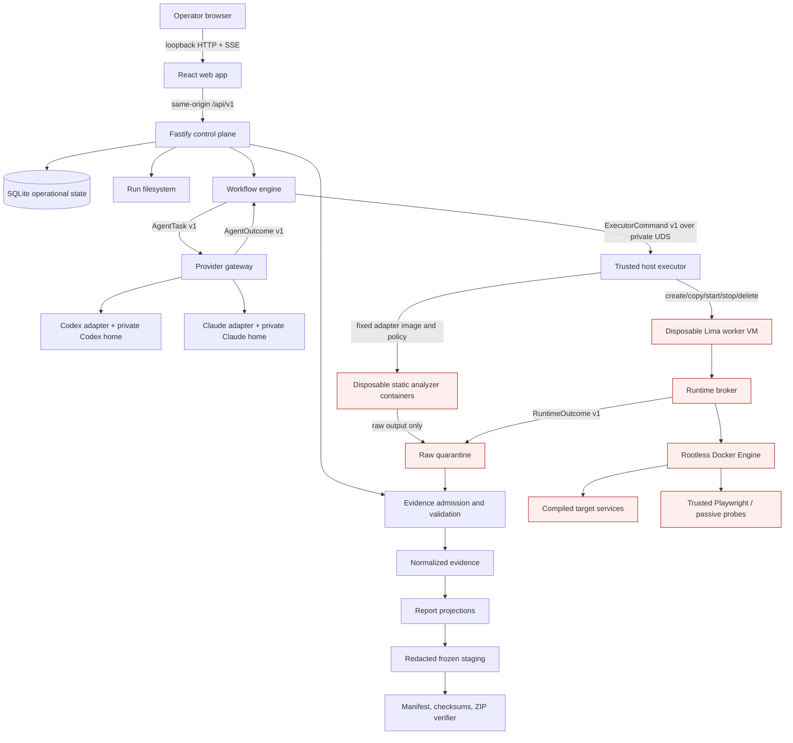

# Repository Assessment Kit Architecture

## 1. Status, scope, and architectural thesis

This specification defines the MVP architecture for the Repository Assessment Kit (RAK).
It is normative for the backend, frontend, DevOps, and QA lanes. Security controls may be
tightened by `safety.md`; they may not be weakened without an ADR change.

The architecture is **adapter/plugin-first**:

- Codex and Claude Code are interchangeable reasoning providers behind one `AgentAdapter`
  contract.
- Static and dynamic analyzers are replaceable plugins behind one versioned
  `AnalyzerAdapter` protocol.
- Each provider and analyzer declares capabilities; the trusted workflow engine calculates
  effective capabilities. A plugin cannot grant itself access.
- Required outcomes, schemas, validation gates, domain coverage, and package contents are
  identical across provider paths. Prose, tool-call order, and ZIP bytes need not be.
- The engine, not an agent or scanner, owns lifecycle, policy, evidence admission, coverage,
  redaction, and release validity.

This deliberately spends a little design effort on narrow plugin boundaries. It does not
build a general plugin marketplace, arbitrary executable extension system, remote worker
fleet, or support for providers beyond Codex and Claude Code.

## 2. System overview

### 2.1 Context and trust boundaries



Trust zones:

1. **Trusted control plane:** UI, server, workflow, persistence, schemas, policy, validators,
   reporting, and packaging.
2. **Provider zone:** one selected provider worker with only its provider home and
   task-specific read-only context. Assessed content is hostile input; provider output is
   untrusted until admitted.
3. **Static analyzer zone:** disposable, no-network, non-root containers. Scanner output is
   untrusted.
4. **Dynamic runtime zone:** disposable mount-free Lima VM. The broker is the only Docker
   client. Target Compose, images, builds, applications, and HTTP content are hostile.
5. **Release zone:** only validated and redacted files can enter the frozen staging tree.
   Neither providers nor target runtimes can write it.

The physical host, hypervisor, provider inference service, approved build endpoints, and
approved optional hosted analyzers remain outside RAK's full control. Their use and residual
risk must be disclosed.

### 2.2 Top-level repository and ownership

The pnpm workspace is:

```text
apps/
  web/                    React/Vite UI; frontend lane owns
  server/                 Fastify composition root and HTTP/SSE API; backend owns
packages/
  contracts/              RAK JSON Schemas, TypeScript types, API schemas
  workflow/               state machine, scheduler, capability resolution
  persistence/            Drizzle schema, repositories, generated migrations
  evidence/               admission, provenance, semantic validation, redaction
  agent-adapters/          provider-neutral SPI plus Codex and Claude adapters
  analyzers/               analyzer SPI, manifests, normalizers, built-in adapters
  runtime/                 capability gate, executor client, Compose compiler contracts
  reporting/               Markdown/HTML/CSV/SARIF/CycloneDX projections
  packaging/               staging, JCS manifest, checksums, ZIP, age wrapper
  test-contracts/          provider/analyzer conformance harness and fixtures
container/
  providers/              pinned Codex and Claude images
  analyzers/              pinned multi-arch analyzer images
  worker-vm/              Lima template, guest image lock, broker assets
config/
  policies/               safety, network, resource, and report-language policies
  rules/                  kit-owned Opengrep/PMD rules
  standards/              vendored schemas/catalog slices and standards-lock.json
toolchain.lock.json
generated/                gitignored run roots only
```

P4 owns root manifests, lockfile, container recipes, and empty boundaries. P5 owns the
server and shared packages. P6 owns only `apps/web`. The public schemas in
`packages/contracts` are frozen before P5 and P6 begin.

Host-side mutable paths are explicit:

```text
state/rak.sqlite                         operational DB; gitignored; never packaged
state/backups/**                         verified DB backups; gitignored; never packaged
generated/<project>-<commit>-<time>/
  internal/quarantine/<job-id>/**        untrusted plugin output
  internal/admitted/**                   immutable normalized/admitted files
  internal/operational-logs/**           never customer-visible by default
  staging/<revision>/**                  redacted tree, frozen during packaging
  package/<revision>/**                  ZIP, detached digests, validation report
```

All files specific to a run remain under its one `generated/` run root. Cross-run
operational state is limited to the database/backups and content-addressed, read-only
tool/standards caches. Run IDs prevent output from different attempts being confused.

## 3. Core components

| Component | Responsibility | Interfaces | May access |
|---|---|---|---|
| Web app | Guided discovery, approvals, capability display, progress, evidence navigation, decision and package review | HTTP API and SSE only | Same-origin API; never provider homes, source, SQLite, or raw files |
| API server | Authentication bootstrap, request validation, DTO mapping, pagination, downloads | `/api/v1`; strict JSON Schemas | Workflow/query services and approved final artifacts |
| Workflow engine | Durable state machine, phase DAG, leases, retry/resume/cancel, capability resolution, outcome completeness | repository ports, plugin SPIs, executor client | SQLite through repositories; no direct Docker/Lima/shell |
| Capability registry | Combines release support, host attestations, operator approvals, and task requirements | `CapabilitySnapshot v1` | Signed/locked manifests and recorded attestations |
| Provider gateway | Runs exactly one provider adapter task, captures provider stream and normalized outcome | `AgentTask v1` / `AgentOutcome v1` | Selected private provider home, task context, provider inference network |
| Source intake | Resolves Git/local input, records integrity, exports immutable snapshot | `TargetResolution v1` | Opt-in read-only SSH material during acquisition only; local source read-only |
| Host executor | Executes fixed analyzer adapters and Lima lifecycle commands | `ExecutorCommand v1` over private Unix socket | Physical Docker and Lima CLIs; never exposed to browser or provider |
| Analyzer runner | Starts a locked image with fixed entrypoint and resource/mount/network policy | analyzer manifest + `AnalyzerJob v1` | Read-only snapshot, tool assets, isolated output |
| Runtime broker | Preflights Compose, compiles allowed services, drives rootless Docker, controls build/runtime networks | `RuntimeCommand v1` / `RuntimeOutcome v1` | Worker Docker socket inside VM only |
| Evidence admission | Quarantines, hashes, parses, normalizes, cross-links, redacts, and admits plugin output | `EvidenceBundle v1` | Raw quarantine read-only; normalized store write-only by admission |
| Deterministic validator | Schema and semantic validation of native data and projections | `ValidationReport v1` | Admitted data and frozen staging |
| Reporting | Projects native data to Markdown, static HTML, CSV, SARIF, and CycloneDX | report templates with typed view models | Admitted redacted data only |
| Packager | Freezes staging, produces manifest/checksums/ZIP, reopens and verifies ZIP, optionally wraps with age | `PackageRequest v1` / `PackageOutcome v1` | Staging and final package directory; age secret by pipe/TTY only |

### 3.1 Provider adapter service-provider interface

The canonical interface is TypeScript, transported between workflow and provider gateway as
strict JSON:

```ts
interface AgentAdapter {
  readonly manifest: AgentAdapterManifest;
  probe(input: AgentProbeRequest): Promise<CapabilityAttestation>;
  execute(task: AgentTask, sink: AgentEventSink, signal: AbortSignal): Promise<AgentOutcome>;
  resume(task: ResumeAgentTask, sink: AgentEventSink, signal: AbortSignal): Promise<AgentOutcome>;
}
```

`AgentAdapterManifest` contains:

```json
{
  "adapterProtocol": "rak-agent-adapter/1.0.0",
  "adapterId": "codex|claude-code",
  "adapterVersion": "semver",
  "cliVersion": "exact",
  "imageDigest": "sha256:...",
  "supportedTaskKinds": [
    "repository-map",
    "product-code-trace",
    "architecture-analysis",
    "finding-review",
    "decision-synthesis",
    "plain-language-review"
  ],
  "supports": {"stream": true, "resume": true, "jsonSchemaOutput": true},
  "requiredCapabilities": ["network.provider-inference", "filesystem.task-context-ro"]
}
```

`AgentTask` contains `taskId`, `runId`, `revision`, `taskKind`, `contractVersion`,
`targetIdentity`, package-relative context paths, allowed evidence IDs, required output
schema ID, acceptance checklist, budget, deadline, and a sanitized policy summary. It never
contains provider credentials, arbitrary shell text, host paths, the host executor socket,
or runtime credentials.

`AgentOutcome` contains `taskId`, `provider`, provider session ID, start/end, exit
classification, output schema version, claims/findings/decision fragments, referenced
evidence IDs, limitations, token/usage metadata where available, and the raw-stream
evidence ID. Exit classifications are `succeeded`, `contract-invalid`, `permission-denied`,
`provider-unavailable`, `budget-exhausted`, `cancelled`, or `failed`.

Provider-specific instructions are thin generated/CI-compared wrappers around canonical
workflow sources. Codex uses `AGENTS.md`, `.agents/skills`, `codex exec`,
`workspace-write`, and `never`; Claude uses `CLAUDE.md` importing `AGENTS.md`,
`.claude/skills`, `claude -p`, `dontAsk`, and an explicit allowlist. Bypass modes are not
part of the product contract.

`start-codex.sh` and `start-cc.sh` expose the same launcher verbs:
`login`, `status`, `interactive`, `run`, and `resume`. They select a pinned provider image
and private engagement home, preserve exit/signal status, use a TTY only for interactive
verbs, record the exact image/CLI/instruction digests, start the same server/UI/executor
stack, and bind only the UI to host loopback. They accept structured flags defined by the
launcher contract; unknown provider CLI flags are rejected rather than forwarded.

An adapter is conformant only if the shared harness proves all required task kinds,
structured-output failure, permission failure, resume, cancellation, signal handling,
credential canaries, prompt injection, and outcome-schema validation. This, not common
prompt wording, defines cross-agent equivalence.

### 3.2 Analyzer plugin protocol

Analyzer plugins are checked-in manifests plus trusted normalizers. Users cannot install
arbitrary runtime code through the UI in MVP.

```json
{
  "pluginProtocol": "rak-analyzer/1.0.0",
  "pluginId": "org.rak.syft",
  "pluginVersion": "1.0.0",
  "engine": {"name": "syft", "version": "1.49.0"},
  "imageDigests": {"linux/amd64": "sha256:...", "linux/arm64": "sha256:..."},
  "domains": ["inventory", "sbom"],
  "ecosystems": ["node", "python", "go", "java", "dotnet", "ruby", "php"],
  "inputKinds": ["target-snapshot"],
  "outputKinds": ["syft-json"],
  "network": "none",
  "mounts": ["snapshot-ro", "output-rw", "tool-assets-ro"],
  "limitsProfile": "static-standard-v1",
  "fixedEntrypoint": ["/rak-adapter"],
  "normalizerId": "syft-normalizer/1.0.0"
}
```

The executor accepts only:

```ts
type ExecutorCommand =
  | {kind: "analyzer.run"; commandId; runId; snapshotId; pluginId; jobId; limitsProfile}
  | {kind: "runtime.create"; commandId; runId; snapshotId; runtimeProfile}
  | {kind: "runtime.status"|"runtime.stop"|"runtime.destroy"; commandId; runId; workerId};
```

No field accepts image names, argv, Compose text, shell, host paths, mounts, environment
variables, Docker options, or Lima options. The executor resolves those from digest-locked
manifests. Requests are idempotent by `commandId`, authenticated over a root-owned private
Unix socket mounted only into the server container, and logged with sensitive fields
excluded.

`AnalyzerJob` gives the adapter `/target` read-only, `/out` write-only for the job, a
read-only kit config, and no network. The container is numeric non-root, read-only rootfs,
all capabilities dropped, `no-new-privileges`, bounded CPU/RAM/PIDs/tmpfs/output/time, and
has no provider home, SSH, SQLite, Docker API, runtime secret, or generated tree.

Normalizers are part of the trusted kit, keyed to exact native output versions. Unknown,
malformed, truncated, or unsupported output becomes `partial` or `blocked` coverage and a
tool failure record; it never becomes zero findings. Native output is retained as raw
evidence. Plugin replacement requires the same domains, contract fixtures, architecture
matrix, licensing, and semantic output tests.

An optional hosted analyzer implements the same outcome/admission contract but declares
`network: "operator-approved-hosted"` plus immutable destination, data categories sent,
retention notice, credential purpose, and local fallback behavior. The capability registry
requires a matching unexpired approval before dispatch. Hosted plugins receive a
precomputed minimal upload bundle, never a repository path or provider/SSH credential, and
there is no automatic local-to-hosted fallback.

The built-in static set is kit walker, scc, Syft, OSV-Scanner, Gitleaks, Trivy, Opengrep
with kit-owned rules, and PMD/CPD. ZAP Baseline and Playwright are dynamic plugins and are
never invoked until the runtime gate succeeds.

### 3.3 Capability model

Capabilities are explicit records, not booleans scattered through code:

```json
{
  "capabilityId": "runtime.browser.chromium",
  "scope": "run",
  "declaredBy": ["rak-release/1.0.0", "org.rak.playwright"],
  "support": "supported|unsupported",
  "attestation": "passed|failed|missing|expired",
  "approval": "approved|denied|not-required|missing",
  "effective": "available|unavailable|blocked|denied|not-applicable",
  "reasonCode": "ARM64_BROWSER_NOT_ATTESTED",
  "reason": "plain language",
  "evidenceIds": ["ev_..."],
  "checkedAt": "RFC3339",
  "coverageEffects": ["runtime.browser.*"]
}
```

The registry computes `effective`; plugins may only declare requirements and observations.
Capability IDs include provider execution, source acquisition, every analyzer/domain,
worker VM, Compose features, cgroup enforcement, browser, passive scan, acquisition egress,
runtime endpoint exceptions, optional service egress, sandbox credentials, and age
encryption.

The runtime gate is deterministic and records native architecture, Lima/guest/rootless
Docker/Compose versions, cgroup v2 controllers, VM budgets, accepted/rejected Compose
features, source identity, required credentials, build destinations, runtime endpoints,
browser/probe support, attempted safe steps, reasons, and coverage effects. Static work
continues when runtime is unavailable.

## 4. Lifecycle, concurrency, and recovery

### 4.1 Run identity and target identity

`runId` is UUIDv7. A run directory name is
`generated/<sanitized-project>-<commit12>-<UTC-basic-timestamp>/`; the full SHA remains in
all native records. `revision` starts at 1 and increments only when a completed/packaged run
is reopened or the immutable inputs/profile change.

For Git URL input, RAK resolves a full commit and exports that commit. For local input it
records `HEAD`, the before/after live-tree manifest digest, and defaults to exporting the
commit only. If the operator explicitly selects working-tree assessment, RAK exports a
frozen snapshot and identifies it by base commit plus deterministic snapshot-manifest
SHA-256. It never represents dirty content as the commit alone and never scans the live
tree.

The snapshot manifest sorts normalized repository-relative paths by UTF-8 bytes and records
type, mode, byte length, and SHA-256. Symlink targets are recorded but never followed
outside the snapshot. Special files are excluded with a limitation. Intake re-reads the
source after export and compares the full manifest, including untracked files.

### 4.2 Run state machine

```text
draft -> resolving -> ready -> running -> awaiting-review -> packaging -> complete
                 \-> failed       |              |            \-> failed
running -> pausing -> paused -> running
running|paused|awaiting-review|packaging -> cancelling -> cancelled
failed -> ready (retry same immutable inputs) OR draft (new revision)
complete -> draft (new revision only)
```

All transitions are compare-and-swap on `stateVersion`. Invalid transitions return
`RUN_STATE_CONFLICT`. Packaging freezes the revision; no admitted data in that revision can
then be mutated. Corrections create a new revision with explicit `derivedFromRevision`.

The phase DAG is: discovery complete → target resolution → static inventory → parallel
static analyzers → normalization/coverage → optional runtime gate → optional build/runtime
and probes → product/code synthesis → independent security and decision review →
deterministic validation → human review → reports → package validation.

Phase attempt states are `queued`, `leased`, `running`, `succeeded`, `partial`, `blocked`,
`failed`, or `cancelled`. `partial` and `blocked` are successful scheduling outcomes only
where the phase policy permits them. Every planned control separately has exactly one of
`pass`, `fail`, `partial`, `blocked`, `not applicable`, or `not tested`.

Definitions:

- `not applicable`: the control's subject is absent and applicability was determined from
  evidence.
- `blocked`: applicable or potentially applicable, but a prerequisite, safety rule, or
  authorization prevented execution.
- `not tested`: applicable but deliberately omitted, timed out after an allowed attempt, or
  not selected; reason and owner are required.
- `partial`: only part of the control or scope was exercised.

Every state except `pass` requires `reasonCode`, explanation, coverage effect, and evidence
or limitation ID.

### 4.3 Leases, retries, cancellation, and recovery

One SQLite writer owns scheduling. A job lease has `ownerId`, `leasedAt`, `expiresAt`,
heartbeat, and attempt number. Expired leases return to `queued` only if the adapter's
operation is idempotent; otherwise they become failed and require cleanup evidence before
retry.

Every mutation and executor request has a caller-supplied idempotency key unique within
`runId + operation`. The server stores request hash and response. Reuse with a different
body returns `IDEMPOTENCY_CONFLICT`.

Retry creates a new attempt/activity and preserves earlier raw and normalized evidence. A
new accepted result may supersede an older result but never overwrites it. Resuming a
provider task uses its recorded session only when target, task contract, and context digest
match; otherwise it starts a fresh task.

Pause stops scheduling new work and lets safe admission finish. Cancel sets a durable
intent, signals providers/analyzers, asks the broker to stop, then destroys the VM. A
host-side emergency stop can kill/delete the worker without the API. Startup recovery:

1. verifies SQLite integrity and migration version;
2. expires stale leases;
3. reconciles executor/VM resources by run ID;
4. completes or rolls back atomic file moves;
5. marks interrupted non-idempotent jobs failed with evidence;
6. never deletes a validated package.

## 5. Data model

SQLite is operational state, not the customer truth. Canonical deliverables are versioned
native JSON and admitted files.

### 5.1 Driver, writer model, and migrations

Use **`better-sqlite3` behind Drizzle ORM**, pinned exactly. Its synchronous API runs only
in a dedicated persistence worker thread, giving one serialized writer and short explicit
transactions while Fastify remains responsive. Readers use the same worker through query
messages; UI read models are paginated. Configure WAL, `foreign_keys=ON`,
`busy_timeout=5000`, `synchronous=FULL` for state transitions and package freezes, and
checkpoint on clean shutdown/package completion.

Node 24 Linux ARM64/x86-64 native install, interrupt recovery, concurrency, backup/restore,
and migration behavior are mandatory release gates. If `better-sqlite3` cannot pass, P1
must be amended; implementers must not silently substitute a driver.

Schemas are defined in TypeScript. **Drizzle Kit generates committed migrations from the
schema/model; generated migrations are never hand-authored or hand-edited.** Startup makes
an online backup, verifies migration checksums, applies pending migrations before serving,
and refuses downgrade/unknown migrations. Backup files stay outside customer packages.

### 5.2 Relational entities

All IDs are UUIDv7 strings unless an external versioned ID is required. Times are UTC RFC
3339. JSON columns contain schema-validated small configuration only.

| Table | Key fields and constraints |
|---|---|
| `runs` | `id`, `project_slug`, `revision`, `derived_from_revision`, `state`, `state_version`, `profile_version`, `created_at`, `updated_at`, `frozen_at`; unique `(project_slug, revision, created_at)` |
| `target_snapshots` | `id`, `run_id`, `source_kind`, redacted source locator, `commit_sha` (40/64 hex), `base_commit_sha`, `snapshot_digest`, `manifest_path`, before/after digests, `dirty_mode`; one active per run revision |
| `product_assertions` | `id`, `run_id`, `topic`, `statement`, provenance enum, speaker role/time, reasoning, confidence, status; conflicting rows require conflict links |
| `assertion_links` | assertion-to-assertion/evidence links and relation type |
| `capabilities` | `id`, `run_id`, capability ID, support/attestation/approval/effective states, reason, checked time; unique `(run_id, capability_id)` |
| `approvals` | `id`, `run_id`, capability/egress/service scope, exact destinations/data categories, credential reference token, approver, expiry, revoked time; no secret value |
| `phases` | `id`, `run_id`, phase key, state, policy, start/end; unique `(run_id, phase_key)` |
| `jobs` | `id`, phase ID, plugin/task kind, state, attempt, idempotency key/hash, lease fields, deadline, outcome classification |
| `agents` | provenance agent records: kind operator/tool/provider, name, exact version/digest; no credential |
| `activities` | provenance activity records: kind, job, agent, sanitized config/command, start/end, outcome |
| `evidence` | `id`, run/snapshot/activity, type/title/media type, bytes as string, SHA-256, package-relative path or redacted locator, capture time, sensitivity, redaction, validation, limitation; unique `(run_id, path)` and `(run_id, sha256, type)` where safe |
| `evidence_derivations` | child, parent, transformation; unique pair; semantic validator forbids cycles |
| `findings` | `id`, run, stable fingerprint/version, title/category, technical severity, business priority, confidence, validation state, description, status; no aggregate score |
| `finding_links` | finding-to-evidence/control/CWE/framework links |
| `cvss_records` | finding, system/version, vector, score string, band, scorer, time, rationale evidence; imported and assessor records remain separate |
| `planned_controls` | `id`, run, profile/control versioned ID, title, applicability source, planned method |
| `control_results` | planned control unique FK, six-state result, reason, activity/evidence, completed time; exactly one result |
| `limitations` | `id`, run, domain, reason code/text, scope/effect, follow-up, evidence |
| `decision_options` | run + enum remediation/incremental-replacement/full-rebuild, criterion results, assumptions, evidence, confidence |
| `recommendations` | run, selected option or conditional sequence, rationale, confidence, reversal conditions; exactly one current before packaging |
| `reviews` | run, kind deterministic/security/technical/lay, reviewer agent, outcome, findings, evidence, time; reviewer independence metadata |
| `artifacts` | `id`, run, kind, path, media type, bytes, hash, schema/profile, sensitivity/redaction, state quarantine/admitted/staged/packaged |
| `events` | monotonic integer `seq`, run, type, time, phase/job, public payload; indexed `(run_id, seq)` |
| `idempotency_records` | run, operation, key, request hash, response/status, expiry; unique triple |
| `package_releases` | run, revision, state, staging digest, ZIP path/hash, optional encrypted path/hash, validation report, created time |

Secrets, SSH material, provider auth, repository source, raw screenshots, large logs, and
encryption passphrases are prohibited in SQLite.

### 5.3 Canonical native schemas

`packages/contracts/schemas/rak/1.0/` contains strict Draft 2020-12 schemas for:

`run`, `target-snapshot`, `product-assertion`, `agent`, `activity`, `evidence`, `finding`,
`control-plan`, `control-result`, `tool-invocation`, `capability-snapshot`, `coverage`,
`limitation`, `decision-comparison`, `review`, `artifact`, `manifest`, and
`export-profile`.

Every schema has an immutable absolute `$id`, SemVer `schemaVersion`, strict objects, a
reverse-DNS `extensions` object, and offline vendored references. JSON parsing rejects
duplicate keys and non-I-JSON values before schema validation. Semantic validation enforces
unique/resolvable IDs, target identity, acyclic derivation, safe paths, state/reason rules,
materiality, framework versions, and commit consistency.

Assertions use exactly `owner-stated`, `documented`, `observed`, `analytics-supported`,
`code-inferred`, `unverified`, or `conflicting`. `unverified` and `conflicting` are states,
not sources; conflicts name both sides. Material findings and every decision criterion
must resolve to evidence or be visibly unverified/conflicting.

## 6. HTTP and event contracts

### 6.1 Common rules

The server listens inside Docker; only the UI mapping is published to
`127.0.0.1`. CORS is disabled except exact same origin, `Origin` is checked on mutations,
content types are allowlisted, and response headers prevent framing/sniffing and caching of
sensitive pages.

The launcher generates a 256-bit one-time bootstrap token and prints
`http://127.0.0.1:<port>/#bootstrap=<token>`. The fragment is not sent by HTTP. The UI posts
it once, removes it from history, and receives an HttpOnly, Secure-when-applicable,
SameSite=Strict session cookie. The token is stored hashed and invalidated. Sessions expire
after 12 hours or launcher shutdown. This is local access control, not multi-user identity.

All JSON uses `application/json`. Mutations require `Idempotency-Key`; updates also require
`If-Match: "<stateVersion>"`. Responses include `X-Request-Id`. Lists use opaque cursor
pagination with maximum 200 items. Dates are RFC 3339.

Error shape:

```json
{
  "error": {
    "code": "RUN_STATE_CONFLICT",
    "message": "Plain-language explanation",
    "requestId": "uuid",
    "retryable": false,
    "details": [{"path": "/field", "reason": "expected ..."}]
  }
}
```

Status use: 400 schema/input, 401 session, 403 capability/policy, 404 unknown, 409
state/idempotency conflict, 412 ETag mismatch, 413 size, 422 semantically unsafe/unusable,
429 limits, 500 invariant fault, 503 provider/executor unavailable. No endpoint accepts a
shell command, raw Compose execution request, host path outside a validated source field,
Docker options, or provider flags.

### 6.2 Endpoints

| Method and path | Request | Success | Errors / notes |
|---|---|---|---|
| `POST /api/v1/session/bootstrap` | `{token}` | `204` + session cookie | 401 invalid/used/expired |
| `DELETE /api/v1/session` | none | `204` | Cancels cookie, not active run |
| `GET /api/v1/system` | none | `{version, profile, hostOs, hostArch, launcherProvider, prerequisites[], capabilities[]}` | 503 if executor probe failed; still returns reasons |
| `POST /api/v1/runs` | `{projectSlug, source:{kind:"ssh-git",url,ref?}|{kind:"local",path,dirtyMode:"commit-only"|"frozen-working-tree"}, selectedProvider, profiles[], optionalServices[]}` | `201 RunSummary`, state `draft` | Local path canonicalized/allowlisted; credentials never in body |
| `GET /api/v1/runs` | filters/cursor | `{items:RunSummary[],nextCursor}` | Run summaries only |
| `GET /api/v1/runs/{runId}` | none | `RunDetail` with stateVersion, phase and coverage summaries | 404 |
| `PATCH /api/v1/runs/{runId}/discovery` | `{assertions:[{id?,topic,statement,provenance,speakerRole?,capturedAt?,reasoning?,evidenceIds?,conflictsWith?}], unknownTopics[]}` | updated discovery + ETag | Only `draft`; validates all required topics |
| `PUT /api/v1/runs/{runId}/approvals` | `{approvals:[{capabilityId,decision,destinations?,dataCategories?,credentialHandle?,expiresAt?}]}` | effective capability snapshot | Credential handle references an ephemeral secret channel; no value |
| `POST /api/v1/runs/{runId}/resolve` | none | `202 {operationId}` | Moves draft→resolving; missing discovery returns 422 |
| `POST /api/v1/runs/{runId}/start` | `{expectedSnapshotId}` | `202 {operationId}` | Requires ready, immutable target, required approvals |
| `POST /api/v1/runs/{runId}/pause` | `{reason}` | `202` | Running only |
| `POST /api/v1/runs/{runId}/resume` | `{retryFailedJobIds?:[]}` | `202` | Paused/failed only; immutable inputs checked |
| `POST /api/v1/runs/{runId}/cancel` | `{reason}` | `202` | Durable cancellation and cleanup |
| `POST /api/v1/runs/{runId}/revisions` | `{reason,copyDiscovery:true}` | `201 RunSummary` | Complete/frozen input changes; never mutates old revision |
| `GET /api/v1/runs/{runId}/capabilities` | none | `CapabilitySnapshot` | Includes reasons, evidence, coverage effects |
| `POST /api/v1/runs/{runId}/runtime-gate` | none | `202` | Normally workflow-owned; explicit rerun allowed before freeze |
| `GET /api/v1/runs/{runId}/controls` | filters/cursor | planned controls and single result each | Allowed status vocabulary only |
| `GET /api/v1/runs/{runId}/findings` | severity/domain/validation/cursor | finding summaries | No raw secret matches |
| `GET /api/v1/runs/{runId}/findings/{id}` | none | finding, links, CVSS records, review | Source snippets redacted and bounded |
| `GET /api/v1/runs/{runId}/evidence` | filters/cursor | evidence metadata | Quarantine is never exposed |
| `GET /api/v1/runs/{runId}/evidence/{id}` | none | metadata plus safe preview/download link if admitted | 403 for restricted/non-redacted |
| `GET /api/v1/runs/{runId}/coverage` | none | domain matrix, limitations, capability effects | Canonical coverage view |
| `GET /api/v1/runs/{runId}/decision` | none | all three options, criteria, recommendation, confidence/reversal conditions | 409 until synthesis exists |
| `POST /api/v1/runs/{runId}/reviews` | `{kind:"technical"|"lay",reviewerRole,outcome,notes,issueIds[]}` | `201 Review` | Human gates; security agent review is workflow-owned |
| `POST /api/v1/runs/{runId}/package` | `{encrypt?:{mode:"x25519",recipient}|{mode:"scrypt"}}` | `202 {operationId}` | Requires deterministic, security, technical, and lay gates |
| `GET /api/v1/runs/{runId}/artifacts` | cursor | admitted customer artifact metadata | No operational DB/provider logs |
| `GET /api/v1/runs/{runId}/packages` | none | package validation, hashes, download links | Only validated packages downloadable |
| `GET /api/v1/runs/{runId}/packages/{packageId}/download` | none | ZIP/age byte stream, no-store | Range supported; detached hash separate |
| `GET /api/v1/runs/{runId}/events` | SSE, `Last-Event-ID` | replay then live stream | Heartbeat every 15s; 410 if cursor predates retained events |

`RunSummary`, `RunDetail`, and every endpoint payload have schemas in
`packages/contracts/schemas/api/v1`. Frontend mocks are generated from those fixtures; the
frontend must not import persistence types.

X25519 recipient strings are public material and may travel through the package API.
Scrypt mode is enabled only when the launcher has an attached protected interactive secret
channel: the packager generates or reads the passphrase on that channel and displays it
once for out-of-band delivery. A web-only scrypt request without that channel returns
`422 SECRET_CHANNEL_REQUIRED`; the passphrase is never returned by API or SSE.

### 6.3 SSE event model

Events are operational notifications, never canonical current state:

```text
run.state.changed
phase.state.changed
job.state.changed
capability.changed
coverage.changed
finding.admitted
review.required
artifact.admitted
package.state.changed
warning.raised
```

Each SSE record has integer `id`, named `event`, and
`{schemaVersion,runId,occurredAt,stateVersion,phaseKey?,jobId?,summary}`. It contains no
secret, raw model output, command output, or source body. Clients reconnect with
`Last-Event-ID`, de-duplicate by ID, then refetch canonical resources when `stateVersion`
advances. Events are retained through run completion plus 30 days or configured retention.

## 7. Source, network, and runtime contracts

### 7.1 Credential and access matrix

| Asset | Server | Provider | Static analyzer | Host executor | Worker target/probe | Packager |
|---|---:|---:|---:|---:|---:|---:|
| Provider home | no | selected provider only | no | no | no | no |
| SSH source | acquisition helper token only | no | no | acquisition action only | no | no |
| Immutable snapshot | index/read | task context read-only | read-only | transfer | read-only copy | no |
| Sandbox credential value | ephemeral broker only | no | no | scoped transfer | named target service only | no |
| SQLite | repository port | no | no | no | no | no |
| Raw quarantine | admission only | no | job output only | transfer | declared output only | no |
| Frozen staging/final | metadata | no | no | no | no | read/write then freeze |
| Physical Docker/Lima | no | no | no | fixed protocol only | no | no |
| Worker Docker socket | no | no | no | no | broker only | no |

Provider homes are separate by provider **and engagement ID**. A provider login seed may be
copied into a new private engagement volume by an explicit launcher action; sessions,
project indexes, and config do not cross engagements. Host instruction mounts are opt-in,
read-only, hashed and recorded, and disabled in release equivalence tests.

### 7.2 Static baseline

Source is a content-addressed read-only export. Baseline tools never run package managers,
builds, tests, hooks, plugins, target configuration/rules, autofix, custom reporters, or
dependency restoration. All databases/rules are pre-staged and locked.

`toolchain.lock.json` records engine version, source, SHA-256, signature, license/NOTICE
digest, image digest per architecture, rule commit, DB/check-bundle digest/time, adapter and
normalizer versions. Updates are explicit, fixture-tested, and never change completed runs.

### 7.3 Dynamic runtime

The host executor creates a native-architecture Lima VM in plain mode with fixed CPU, RAM,
disk, deadline, no mounts, no dynamic forwarding, no SSH-agent forwarding, and a pinned
guest image. It copies and verifies the snapshot over the loopback control channel.

Inside, the broker is the sole client of a directly installed rootless Docker Engine. It
requires cgroup v2/systemd and delegated CPU/memory/PID/I/O controllers. It parses Compose
references before resolution, rejects remote/escaping include/extends/build context, then
fully resolves in a no-network/no-secret parser and validates the merged model.

It rejects privilege, capabilities, devices, custom runtimes, Docker sockets,
host/service namespaces, disabled security labels, unsafe sysctls, providers/hooks, bind
mounts, external resources, host ports, host gateways, metadata/LAN routes, unsafe network
drivers, uncontrolled replicas/resources, and incompatible platforms. It compiles accepted
input into a new generated project with all capabilities dropped, no-new-privileges,
read-only roots, non-root users where supported, bounded scratch, per-service resource/PID
limits, and a random project name. Failure to tolerate controls is `blocked`, never a
reason to relax them.

Network states are distinct:

- `acquisition/build`: digest-pinned images and approved dependency destinations only,
  through a logged proxy. Approvals name destinations, data categories, expiry, and
  residual exfiltration risk.
- `runtime/test`: guest firewall denies new outbound IPv4/IPv6/DNS; services and probes use
  only a broker-created `internal: true` network. No port is published.
- endpoint exceptions: exact scheme/host/port/method/data class, separate approval and
  proxy policy. There is no "internet on" switch.

Playwright actions are `read-only-navigation` by default: GET/HEAD/OPTIONS to one approved
origin, bounded forms only when explicitly classified non-mutating, no upload/download,
no destructive verbs, no cross-origin navigation, and no active ZAP/API/full scan.
Screenshots/traces are captured only when evidentially useful, bounded, quarantined, and
redacted.

VM teardown occurs after declared evidence transfer. Orphan reconciliation and emergency
stop are host-side. The physical host Docker socket is never mounted into a kit, provider,
analyzer, or target container.

## 8. Evidence, standards, reporting, and packaging

### 8.1 One-way evidence flow

```text
plugin output -> raw quarantine -> hash/type/size checks -> native parse
-> exact-version normalizer -> schema + semantic validation -> sensitivity classification
-> admitted immutable evidence -> redacted projections -> frozen staging -> package
```

Every evidence entity follows W3C PROV Entity–Activity–Agent concepts and records immutable
ID, schema, media type, bytes, SHA-256, safe path/locator, target identity, source region,
capture time, activity, sanitized command/config, tool/provider version/digest, outcome,
derivation and redaction, sensitivity, limitation, validation, and linked
claim/finding/control IDs.

Raw scanner output is evidence, not canonical findings. Agent prose is a proposal, not
admitted evidence. Only the admission service writes native truth. Agents, analyzers,
runtime, and report templates cannot mutate admitted records.

### 8.2 Standards profile

`config/standards/standards-lock.json` freezes:

- RAK 1 native JSON: JSON Schema Draft 2020-12;
- SARIF 2.1.0 Plus Errata 01;
- CycloneDX 1.7 repository-discovery profile, composition default `unknown`;
- CWE 4.20/catalog schema 7.3; prohibited mappings rejected;
- OWASP ASVS 5.0.0 applicable Level 1 baseline;
- WSTG 4.2 only for authorized safe runtime techniques;
- OWASP Top 10:2025 for grouping only;
- NIST SP 800-218 SSDF 1.1 for supplied repository/process evidence only;
- CVSS 4.0 with vector and score only when facts suffice;
- RFC 8785 JCS and SHA-256;
- optional age CLI 1.3.1/age v1, X25519 preferred and scrypt fallback.

Applicability is only `not-assessed`, `customer-stated`, or `customer-confirmed`, never
auto-determined. Imported older CVSS records are preserved, not converted. Technical
severity, business priority, confidence, and validation state remain separate; there is no
aggregate repository score.

Independent review consists of deterministic validation plus a fresh, separately recorded
security/decision perspective that did not author the original conclusion. It may use the
same provider in a new isolated session if only one provider is authenticated; cross-
provider review is preferred but not required. Human technical and lay reviews are
mandatory for release. A model cannot approve its own output and deterministic validation
cannot substitute for judgment.

### 8.3 Required package inventory

The ZIP contains at least:

```text
index.html
reports/executive.html
reports/executive.md
reports/decision.html
reports/technical.html
reports/security.html
reports/coverage-limitations.html
data/run.json
data/target-snapshot.json
data/product-assertions.json
data/findings.json
data/controls.json
data/evidence-index.json
data/decision.json
data/reviews.json
exports/findings.sarif.json
exports/sbom.cdx.json
exports/findings.csv
evidence/**                 admitted, redacted evidence
screenshots/**              only when safely captured
logs/**                     redacted customer-relevant logs only
licenses/**
manifest.json
SHA256SUMS
```

Missing screenshots are valid only with a manifest/coverage explanation. Operational
SQLite, provider transcripts, credentials, unredacted evidence, and internal debug logs
are excluded.

Executive reports lead with scope, principal issue, business consequence, recommendation,
alternatives, confidence, and unknowns. Automated gates flag undefined acronyms, long
sentences/paragraphs, passive voice, unsupported absolutes, unexplained framework IDs, and
prohibited compliance/certification claims. High/Critical findings state what could happen,
who is affected, next action, evidence strength, and limitations. Human lay review remains
decisive.

### 8.4 Package algorithm

1. Copy only admitted/redacted artifacts into a new staging directory.
2. Freeze it; reject symlinks, hardlinks, special files, absolute/`..` paths, duplicates,
   and case or Unicode-normalization collisions.
3. Create JCS-canonical `manifest.json`, sorted by normalized UTF-8 path bytes. Declare
   every payload including manifest and `SHA256SUMS`; omit self-referential size/hash for
   those two special entries.
4. Create `SHA256SUMS` for every payload including manifest and excluding itself.
5. Fresh-read and validate schemas, semantic links, profiles, hashes, secret/host-path
   scans, placeholders, report-language rules, and required inventory.
6. Create the ZIP with safe normalized paths and bounded compression.
7. Reopen in a fresh process and reject unsafe/duplicate entries, mismatches, undeclared
   files, broken references, or decompression-limit violations.
8. Emit `<package>.zip.sha256`.
9. If requested, age-encrypt the validated plain ZIP, decrypt to a scratch stream, compare
   recovered ZIP hash, and emit `<package>.zip.age.sha256`. Secrets enter by protected
   descriptor/TTY, never argv, environment, logs, SQLite, manifest, or artifacts.

The validated plain ZIP is always retained. SHA-256 establishes integrity relative to a
trusted digest, not authorship or signature.

## 9. Non-functional requirements

### 9.1 Performance and scale

MVP supports one operator, up to three stored active run revisions, one active dynamic VM,
and four parallel static analyzer jobs by default. Limits are configuration profiles, not
user-supplied Docker values.

- API p95 under 250 ms for metadata queries on a 100,000-file/50,000-finding fixture,
  excluding job starts and downloads.
- SSE publishes durable progress within 1 second of commit and replays 10,000 events in
  under 5 seconds.
- Lists are cursor-paginated; evidence bodies and logs stream from disk.
- SQLite transactions stay under 100 ms normally; filesystem hashing/JSON normalization
  occurs outside the writer transaction.
- Default budgets: 4 concurrent static jobs, 30 minutes/tool, 2 GiB RAM and 2 CPUs/tool,
  100 MiB raw output/tool; VM 4 CPUs, 8 GiB RAM, 40 GiB disk, 2-hour wall clock. Operators
  may choose only reviewed named profiles.
- Evidence and ZIP readers enforce per-file, total-byte, entry-count, and compression-ratio
  limits.

Large repositories may receive partial coverage with explicit exclusions; resource limits
are never silently raised.

### 9.2 Security and privacy

Default deny applies to mounts, network, commands, plugins, credentials, Compose features,
and artifacts. Secrets are accepted only by purpose-specific ephemeral channels, never a
general `.env` pass-through. Optional services require per-run destination and data-category
consent; no silent upload/fallback is allowed.

Provider inference is external data flow and is disclosed separately from Git, tools,
build acquisition, target runtime, and optional hosted scanners. "Local-first" does not
mean repository context never leaves the machine.

Retention is operator-configurable. Deleting a run requires explicit confirmation and is
recoverable through ordinary filesystem trash where supported; validated packages are
never automatically deleted during recovery. Logs use structured allowlists, hash
credential handles, and redact source excerpts and host paths.

### 9.3 Observability

Fastify emits JSON logs with request/run/phase/job/activity IDs, event name, duration,
outcome, capability/reason code, and redaction count. It never logs bodies, cookies,
credentials, source content, raw scanner/model output, or passphrases.

Metrics include state transition counts, queue/lease age, plugin duration/outcomes,
capability failures, evidence bytes/admission failures, coverage states, validation gate
failures, SSE lag, VM cleanup, and package verification. A per-run audit export records
policy and approval decisions. Health endpoints are container-internal:
`/health/live` (process) and `/health/ready` (DB migrated, locks verified, executor
reachable or explicitly static-only).

### 9.4 Failure modes

- Provider unavailable/invalid contract: retry boundedly, then mark task failed/blocked;
  deterministic/static work remains.
- Analyzer crash/timeout/unknown version: retain failure evidence, mark affected coverage
  partial/blocked, never zero findings.
- Runtime prerequisite/policy failure: static assessment continues; controls receive
  blocked/not-applicable reasons.
- SQLite corruption: stop mutations, preserve files, restore last verified backup, replay
  only idempotent operations, and require operator acknowledgment.
- Disk pressure: stop new jobs before reserve threshold, preserve admitted evidence, clean
  disposable/quarantine data only, never final packages.
- Secret/redaction/semantic/package gate failure: fail closed; nothing is downloadable.
- Executor/VM loss: reconcile, mark attempt, preserve copied evidence only after admission,
  destroy orphan resources.
- Browser disconnect: work continues; SSE replay and canonical GET restore UI state.

## 10. Testing and conformance seams

Contract fixtures allow frontend, backend, provider, and analyzer work in parallel:

- API request/response/error/SSE golden fixtures;
- provider adapter conformance fake plus Codex and Claude real-image suites;
- analyzer manifest/normalizer golden and malformed fixtures;
- seven ecosystem fixtures and hostile source/parser fixtures;
- capability gate fixtures for every available/blocked/denied/not-applicable outcome;
- runtime broker policy corpus and fake executor for server tests;
- source integrity, dirty-tree, symlink/special-file fixtures;
- provenance graph, coverage, CVSS/CWE/framework, SARIF and CycloneDX semantic fixtures;
- seeded secret/host-path, ZIP traversal/collision/bomb/tamper fixtures;
- deterministic clock/ID/digest ports for repeatable tests.

Both launchers run the exact same acceptance harness and required domain/artifact matrix.
A provider-specific omission is a failure even if its prose is persuasive.

## 11. Sequencing and parallelization

### Milestone 1 — Freeze contracts

Implement `packages/contracts`, provider/analyzer manifests, capability vocabulary, state
machine, API fixtures, standards/toolchain lock schemas, and fake adapters. This unblocks
all other work.

### Milestone 2 — Trusted foundation

Scaffold the pnpm workspace, Fastify/React apps, SQLite worker with generated Drizzle
migrations, filesystem layout, session bootstrap, SSE, host executor protocol, pinned
multi-arch images, and CI. Prove the SQLite driver on Linux ARM64/x86-64.

### Milestone 3 — Parallel backend foundations

In path-separated lanes:

- workflow/persistence/API;
- source snapshot and static analyzer framework;
- evidence/semantic validation/redaction;
- provider gateway and both adapters;
- host executor/runtime broker and capability gate;
- reporting/packaging.

All consume Milestone 1 fixtures. No lane changes a contract unilaterally.

### Milestone 4 — Frontend in parallel

After Milestone 1 and the P4 scaffold, the frontend builds entirely against API fixtures
while backend lanes run. Integration begins only when the same contract tests pass.

### Milestone 5 — Integrated safe static vertical slice

Complete discovery → local/Git snapshot → all required static domains → evidence →
decision/review → validated ZIP through both fake provider adapters. This must work before
dynamic runtime is allowed to add complexity.

### Milestone 6 — Dynamic capability slice

Add Lima lifecycle, brokered Compose compiler, rootless daemon, network phases,
Playwright/ZAP/passive fallback, teardown, and blocked-runtime path. Static-only output
must remain identical in required structure.

### Milestone 7 — Release proof

Run real Codex and Claude paths; SSH/local, clean/dirty, runnable/blocked, all seven
ecosystems, malicious fixtures, secret/redaction, package tampering, and native macOS/Linux
ARM64/x86-64 matrices. Require independent security, technical, and lay reviews.

## 12. ADRs

### ADR-1 — Canonical outcomes above provider behavior

**Context:** Codex and Claude differ in instructions, permissions, sessions, and prose.
**Decision:** Thin provider adapters emit the same `AgentOutcome`; deterministic engine
contracts and acceptance matrices define equivalence.
**Consequences:** Providers are replaceable and failures are visible. Byte-identical prose
is not promised. Rejected: provider-specific end-to-end workflows, which would drift.

### ADR-2 — Checked-in plugin manifests, not arbitrary extensions

**Context:** Replaceable analyzers are valuable, but executing user plugins would expand the
hostile-code surface.
**Decision:** A small versioned analyzer protocol with release-owned manifests, fixed
images/entrypoints, and trusted normalizers.
**Consequences:** Low-friction maintainer extension without an unsafe marketplace. Rejected:
dynamic npm/plugin loading and shell adapters.

### ADR-3 — Engine-calculated capabilities

**Context:** Runtime, architecture, approvals, and tools vary by host and engagement.
**Decision:** Model declared, attested, approved, and effective capability states with
evidence and coverage effects.
**Consequences:** Honest degradation and predictable UI. Rejected: feature booleans and
best-effort fallback.

### ADR-4 — Disposable VM for hostile runtime

**Context:** Host sockets and privileged DinD give unacceptable host power; Compose is
trusted input by default.
**Decision:** Lima plain-mode VM, compiled Compose, broker-only rootless Docker access.
**Consequences:** Higher startup and four-host validation cost; strong boundary. Rejected:
host socket/proxy, privileged/rootless DinD, and direct Compose pass-through.

### ADR-5 — Native RAK JSON is canonical

**Context:** SARIF, CycloneDX, scanner output, and model text cannot represent the whole
assessment.
**Decision:** Strict native schemas plus semantic validation; standards formats are
projections and raw tool output is evidence.
**Consequences:** More normalization code, but complete provenance and stable contracts.
Rejected: scanner SARIF/SBOM as database.

### ADR-6 — SQLite with better-sqlite3 single writer

**Context:** Local resumable state needs transactions without a service database.
**Decision:** Drizzle plus pinned `better-sqlite3` in a dedicated persistence worker,
serialized writer, WAL.
**Consequences:** Simple operations and strong local consistency; native architecture/Node
24 support is a release gate. Rejected: Postgres and unconstrained multiple writers.

### ADR-7 — Host executor is a narrow command boundary

**Context:** the server must request disposable containers/VMs but cannot receive Docker or
Lima control.
**Decision:** Private authenticated UDS with a non-shell discriminated command protocol,
locked manifests, and idempotent IDs.
**Consequences:** Small privileged code surface and testable policy. Rejected: Docker socket,
generic socket proxy, and web-exposed lifecycle API.

### ADR-8 — Immutable revisions and one-way artifacts

**Context:** retries, agent variance, and packaging can otherwise obscure what supported a
decision.
**Decision:** Preserve attempts/evidence, supersede by links, freeze packaged revisions,
and require new revisions for corrections.
**Consequences:** More storage, clear audit history. Rejected: in-place report/evidence
edits.

### ADR-9 — SSE for progress

**Context:** progress is one-way and must replay after browser disconnect.
**Decision:** Cookie-authenticated SSE with durable monotonically sequenced events and
canonical GET refresh.
**Consequences:** Simpler than WebSockets; no client commands on stream. Rejected:
poll-only and bidirectional sockets.

### ADR-10 — Plain ZIP mandatory; age optional

**Context:** every customer needs a verifiable ZIP; some need transport protection.
**Decision:** validated plain ZIP plus detached SHA-256; optionally wrap with age v1 after
validation.
**Consequences:** Encryption never masks redaction failure. Rejected: legacy ZIP encryption
and encryption-only output.

## 13. Open risks and release blockers

1. **Four-host dynamic runtime is unproven.** Native macOS ARM64/x86-64 and Linux
   ARM64/x86-64 Lima/rootless Docker/broker/cgroup/egress/cleanup tests are mandatory.
   Missing hardware requires product-owner scope revision, not emulation substitution.
2. **Claude adapter is documentation-derived.** Real pinned-image login, resume,
   `dontAsk`, structured output, signals, and canary tests are mandatory.
3. **SQLite driver gate remains empirical.** Prove pinned `better-sqlite3` under Node 24 on
   Linux ARM64/x86-64. Failure requires an architecture amendment.
4. **Provider credential isolation is bounded.** The provider process handles a credential
   while interpreting hostile context. Managed deny rules, task contexts, engagement
   homes, and canaries reduce risk but do not defeat a compromised provider process. A
   stronger promise requires ephemeral workload identity/credential broker research.
5. **Linux ARM64 Chromium and ZAP are unproven.** Validate hardened Chromium/Playwright and
   a multi-arch ZAP Baseline image. If ZAP fails, the researched kit-controlled passive
   analyzer may replace it behind the same plugin contract with reduced technique coverage.
6. **Kit-owned SAST rules are product work.** A licensed, high-confidence fixture-tested
   rule pack across seven ecosystems is a release gate; Semgrep community rules cannot be
   silently redistributed.
7. **Offline dependencies can be incomplete.** Especially Maven transitives require an
   approved acquisition path or customer SBOM/lock. Report partial coverage.
8. **Checksums are not signatures.** A future authorship/non-repudiation requirement needs
   a separate signing/key-lifecycle profile.
9. **Allowed egress is an exfiltration channel.** Destination allowlists reduce scope, not
   data leakage to an allowed endpoint. UI disclosure and explicit approvals are required.
10. **Human comprehension cannot be automated.** Technical and lay sign-off remain release
    gates even when schemas/readability checks pass.

No blocker permits a host Docker socket, privileged DinD, production credential, silent
upload, floating tool/standard version, fabricated pass, or compliance claim as fallback.
