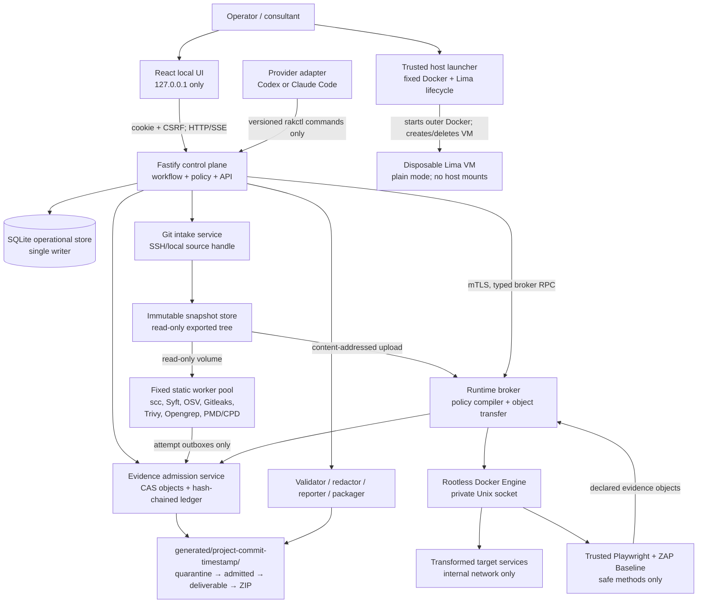

# Repository Assessment Kit Architecture

**Status:** Architecture tournament contender  
**Strategy:** Evidence-integrity and operability first  
**Profile:** RAK export profile 1.0.0  
**Target stack:** Node.js 24 LTS, TypeScript strict mode, React 19.2, Vite 8, Fastify 5, SQLite, Drizzle ORM/Drizzle Kit, pnpm

## 1. System overview

Repository Assessment Kit (RAK) is a local control plane for assessing one immutable repository snapshot and producing one auditable customer decision package. Its central invariant is:

> No model narrative, scanner output, database row, or report becomes a deliverable merely because it exists. Data enters the customer record only through evidence admission, provenance validation, redaction, independent review where required, and final package validation.

The product is not one privileged agent container. It is a capability-separated system:

- the trusted control plane owns run state, policy, evidence admission, validation, and packaging;
- Codex and Claude Code are replaceable reasoning adapters with the same constrained command contract;
- static analyzers are fixed, no-network workers that cannot read provider credentials or mutate admitted evidence;
- hostile target runtime activity occurs only inside a disposable, mount-free Lima VM behind a policy-enforcing broker;
- SQLite is the recoverable operational index, not the customer record;
- immutable content-addressed files and versioned native JSON are the evidence record;
- every degraded, blocked, failed, or untested path is a first-class limitation rather than an omitted result.

### 1.1 Context and component diagram



### 1.2 Trust zones

| Zone | Trusted for | Must never receive |
|---|---|---|
| Browser | Operator interaction; displaying admitted/redacted data | Provider homes, SSH material, raw credentials, raw quarantined evidence |
| Control plane | State transitions, policy, evidence admission, validation, report/package generation | Arbitrary host/Docker/Lima command execution |
| Provider adapter | Reasoning over the minimum supplied context; submitting typed outputs | Worker Docker socket, target runtime API, package signing/encryption secrets, SQLite file |
| Git intake | Resolving source and creating a snapshot | Provider credentials other than opt-in read-only SSH mount; generated deliverables |
| Static workers | One pinned analyzer operation | Network, provider homes, SSH, SQLite, target credentials, admitted evidence write access |
| Worker VM | Hostile builds and target processes within a disposable boundary | Physical-host mounts, provider homes, SSH, generated directory, host Docker API |
| Evidence/package plane | Hashing, redaction, semantic validation, immutable output | Target-controlled executable templates, arbitrary plugins, untrusted write access |

All edges not listed are denied. The assessed repository, its instructions, Dockerfiles, Compose files, images, parsers, build scripts, web content, and scanner inputs are hostile. A hypervisor/kernel escape and exfiltration through an explicitly approved egress channel remain residual risks and must be stated, not hidden.

### 1.3 Requirements-to-components map

| Brief requirement | Owning components |
|---|---|
| Guided product/customer discovery | Web UI, workflow engine, claim store |
| Immutable target and unchanged source | Git intake, snapshot store, integrity verifier |
| Static assessment across seven ecosystems | Static worker pool, tool adapters, coverage planner |
| Safe capability-gated runtime | Runtime capability evaluator, host launcher, VM broker, probes |
| Evidence provenance and honest coverage | Evidence admission, native contracts, semantic validator |
| Modernization decision support | Decision engine, independent reviewer, reporting |
| Security baseline and overlays | Control planner, security adapters, profile registry |
| Customer-ready package | Redactor, reporter, manifest/checksum builder, ZIP verifier |
| Codex and Claude compatibility | Provider-neutral workflow plus two thin adapters |
| Resume/failure transparency | State machine, attempt ledger, leases, event stream, limitation records |
| Portable operation | Pinned multi-architecture images, launcher preflight, release matrix |

## 2. Repository and deployment shape

The pnpm workspace is organized by ownership, not by generic layers:

```text
apps/
  web/                    React/Vite local UI
  server/                 Fastify API and single control-plane process
  runtime-broker/         Node/TypeScript broker installed in the worker VM
packages/
  contracts/              TypeScript types, JSON Schemas, schema fixtures
  db/                     Drizzle schema, generated migrations, repositories
  workflow/               run/phase/check state machines and policy
  evidence/               CAS, admission ledger, provenance and redaction
  assessment/             domain plans, normalization and decision contracts
  reporting/              Markdown/HTML/CSV/SARIF/CycloneDX projections
  packaging/              manifest, checksum, ZIP and optional age wrapper
  provider-adapters/      shared adapter interface and provider wrappers
  tool-adapters/          fixed scanner request/normalization definitions
  runtime-policy/         Compose pre-parser, compiler, and policy fixtures
config/
  locks/standards-lock.json
  locks/toolchain.lock.json
  profiles/rak-1/
containers/
  server/
  provider-codex/
  provider-claude/
  workers/<adapter>/
  runtime-vm/
scripts/
  start-codex.sh
  start-cc.sh
  runtime-host.sh
fixtures/
docs/
generated/                gitignored customer/run artifacts
state/                    gitignored SQLite, backups, local registrations
```

`apps/server` is one process and the sole SQLite writer. CPU-heavy hashing, report rendering, ZIP validation, and normalization run in Node worker threads behind bounded queues; they do not become separately writable database services. This deliberately avoids distributed coordination for a local MVP.

The outer Docker composition declares the server, web assets, selected provider adapter, and fixed static worker services. It never mounts the host Docker socket. Static workers are predeclared hardened services and communicate through Unix-domain sockets on a control volume, so the server does not need a container API.

Only `127.0.0.1:<ui-port>` is published. Target application ports are never published to the host.

## 3. Components

### 3.1 Web application

**Responsibility**

- guide discovery without inventing answers;
- show target identity before assessment starts;
- display durable current state, attempts, limitations, approvals, findings, evidence metadata, coverage, reviews, and package status;
- present plain-language decision results with progressive technical detail;
- reconnect to progress without losing state.

**Interfaces**

- versioned `/api/v1` HTTP API;
- server-sent events (SSE) for one-way progress;
- no direct filesystem, database, provider, worker, or broker access.

**Boundary**

The browser renders only escaped text or sanitized, generated HTML. Evidence downloads use attachment disposition and `nosniff`; raw HTML from a target is never rendered in the kit origin.

### 3.2 Fastify control plane

**Responsibility**

- authenticate the local operator session;
- own run state transitions and idempotency;
- schedule phases/checks, issue leases, and recover interrupted attempts;
- enforce capability, approval, and network policies;
- coordinate Git intake, provider commands, workers, evidence admission, review, reporting, and packaging;
- expose current state and append operational events.

**Dependencies**

- Drizzle/SQLite through one database repository;
- evidence admission service;
- fixed worker Unix sockets;
- optional runtime broker mTLS endpoint;
- filesystem roots resolved at startup.

**Boundary**

It exposes no general shell, Docker, Compose, Lima, path, URL-fetch, or subprocess endpoint. Every operation is an enumerated command with a strict schema.

### 3.3 Workflow and policy engine

The engine materializes a versioned assessment plan from:

- the RAK baseline;
- detected ecosystem capabilities;
- selected framework overlays;
- explicit operator approvals;
- discovery unknowns;
- runtime capability results.

It owns the run, phase, check, and attempt state machines in Section 5. It never infers success from missing output. Every planned control ends with exactly one coverage result.

### 3.4 Git intake and immutable snapshot service

**Inputs**

- SSH Git URL plus optional ref; or
- a launcher-registered local `sourceHandle`.

**Process**

1. Canonicalize and validate input without shell interpolation.
2. For SSH, use fixed Git argv and a read-only opt-in SSH mount available only to intake. Record the server host key decision and sanitized source locator; never copy SSH files.
3. Resolve the full commit SHA.
4. Inspect working-tree status for local inputs.
5. Apply explicit snapshot policy:
   - `commit-only`: export exactly the resolved commit; record excluded working changes.
   - `frozen-working-tree`: only after operator approval, create a deterministic file manifest and snapshot digest in addition to the base commit.
6. Export into a fresh snapshot directory, reject special files/path escapes, normalize manifest paths, and compute SHA-256 per file plus a JCS manifest digest.
7. Mark the snapshot read-only and verify it before and after every assessment class.

**Identity**

```text
targetId = "target_" + UUIDv7
commitSha = full lowercase Git object ID
snapshotId = "sha256:" + SHA256(JCS(snapshot-manifest))
```

The run directory is created only after this identity is known:

```text
generated/<projectSlug>-<fullCommitSha>-<runStartedUtcCompact>/
```

For a dirty-tree snapshot, the directory still uses the base commit; `snapshotId` prevents misrepresentation in every canonical record and report.

### 3.5 Evidence admission service

This is the integrity center of the design.

**Filesystem flow**

```text
working/quarantine/<attemptId>/       worker-owned, mutable, never deliverable
objects/sha256/<first2>/<digest>      immutable admitted bytes
ledger/entries/<sequence>-<id>.json   immutable metadata/audit entries
canonical/checkpoints/<revision>/     immutable phase/run projections
deliverable/                          redacted frozen customer tree
packages/                             ZIP, detached digest, optional age wrapper
```

**Admission transaction**

1. A producer closes an attempt outbox and supplies declared file name, media type, byte count, expected digest, and provenance.
2. Admission reopens the file with no symlink following, streams it under size/time limits, scans it for secrets and host paths, computes its digest, and validates its producer schema.
3. Sensitive raw data remains quarantined. A redaction activity produces a new derived object; the original is excluded from all customer projections.
4. The service writes the object to a temporary CAS path, fsyncs it, atomically renames it, and makes it read-only.
5. It writes a JCS-canonical ledger entry whose `previousEntryHash` links to the preceding entry, fsyncs and renames it.
6. In one SQLite transaction it records the object and ledger index, cross-references, validation state, and emitted event.
7. Recovery reconciles a crash between file and database commits: valid unindexed objects/entries are indexed; malformed or unreferenced temporary files return to quarantine. Existing ledger entries are never rewritten.

The hash chain detects deletion/reordering within the run ledger; it is not described as a digital signature or non-repudiation.

**Mutation rule**

Admitted evidence is immutable. Correction, redaction, supersession, dispute, or invalidation creates a new activity and ledger entry referencing the previous object. Findings and claims reference immutable evidence IDs, never mutable paths.

### 3.6 Static worker pool

There is one pinned adapter image/service per tool class: kit walker/scc, Syft, OSV-Scanner, Gitleaks, Trivy, Opengrep with kit-owned rules, and PMD/CPD. A worker:

- runs as a numeric non-root user;
- has a read-only root filesystem, all capabilities dropped, `no-new-privileges`, bounded tmpfs, CPU, memory, PIDs, wall time, and output;
- mounts snapshots read-only and only its current outbox writable;
- has `network_mode: none`;
- receives no provider home, SSH, secret store, database, generated deliverable, or other worker outbox;
- ignores target-owned scanner configuration and executable plugins;
- invokes a fixed binary with an argv array from a versioned adapter, never a shell;
- distinguishes findings exit codes from tool failure;
- emits native output and a signed-by-contract invocation result to quarantine.

Communication uses a Unix socket and the internal request contract in Section 7. Unknown tool/rule/database output versions become `partial` or `blocked`; they never normalize to an empty finding list.

### 3.7 Provider adapters and `rakctl`

Codex and Claude Code use separate pinned images, separate engagement-scoped `/home/node` volumes, provider-specific instruction/skill wrappers, and the same provider-neutral workflow sources.

- Codex unattended mode: `codex exec`, `workspace-write`, approval `never`, JSON events.
- Claude unattended mode: `claude -p`, permission mode `dontAsk`, stream JSON, explicit allow rules.
- permission-bypass flags are absent from normal and release paths;
- provider homes are never shared across providers or engagements;
- assessed source is read-only context, never the provider project root;
- provider output streams are operational logs, not evidence until explicitly admitted.

The model can invoke only `rakctl`, which sends typed commands over a Unix socket. It cannot access SQLite, the runtime broker, the package staging tree, or arbitrary scanner commands.

### 3.8 Runtime capability evaluator

The evaluator produces a deterministic `RuntimeCapability` record before any build, browser, or ZAP work. It assesses:

- native host/guest architecture and Lima availability;
- pinned VM image, rootless Docker/Compose, cgroup v2/systemd and controllers;
- snapshot and Compose/Dockerfile inputs;
- required services, ports, secrets, credentials, external dependencies, and architecture;
- every rejected Compose feature;
- resource-budget fit;
- build and runtime network requirements;
- browser and ZAP adapter availability.

The result is `available`, `available-with-approved-limitations`, `blocked`, or `not-applicable`, with attempted steps, evidence, coverage effects, and operator actions. It cannot silently relax a control.

### 3.9 Host launcher, disposable VM, and runtime broker

`start-codex.sh` and `start-cc.sh` call a fixed host-side `runtime-host.sh` lifecycle sequence before starting the outer Docker profile. The script:

- checks pinned Lima and VM image digests;
- creates a uniquely named plain-mode VM with no mounts, dynamic forwarding, SSH-agent forwarding, or guest-agent file sharing;
- establishes only a random authenticated loopback broker forward;
- records an attestation file for the control plane;
- traps normal shutdown to request broker cleanup and delete the VM;
- on next launch, detects tagged orphans and offers only safe resume-by-run-ID or cleanup, never arbitrary Lima commands.

The web API and provider do not invoke this host script. If preflight cannot create the boundary, dynamic runtime is `blocked`; static assessment remains valid.

Inside the VM, the Node/TypeScript runtime broker is the only rootless Docker client. It:

- accepts content-addressed snapshot objects over mTLS;
- pre-parses Compose without following remote/escaping references;
- rejects unsafe constructs before pull, build, or create;
- compiles accepted configuration into a new restricted Compose project;
- separates acquisition/build egress from offline runtime;
- injects CPU, memory, PID, replica, tmpfs, read-only-root, non-root, capability, and wall-time controls;
- starts target services and trusted probes on an `internal: true` network with no published ports;
- returns only declared, hashed evidence objects;
- destroys workspaces and reports residual assets.

It never accepts a shell string, arbitrary Docker argv, host path, raw Compose passthrough, generic internet flag, or unscoped URL.

### 3.10 Security control planner and independent reviewer

The default application baseline is applicable OWASP ASVS 5.0.0 Level 1. WSTG 4.2 supplies safe authorized runtime techniques; OWASP Top 10:2025 is grouping only; NIST SSDF 1.1 applies only to repository/process evidence. Applicability is `not-assessed`, `customer-stated`, or `customer-confirmed`, never inferred.

Deterministic validation handles schema, references, hashes, path safety, coverage completeness, state rules, taxonomy/profile resolution, CVSS vectors, and package integrity.

A distinct reviewer activity handles judgment:

- every Critical/High security finding;
- every disputed finding;
- every evidence item used by the recommended modernization path;
- the parity burden and reversal conditions.

The reviewer is a separate agent session or named human/analyst perspective, receives read-only admitted evidence and the draft conclusion, and cannot alter it. It emits a review record: `corroborated`, `independently-reproduced`, `disputed`, or `invalidated`, with evidence. Unreviewed decision-critical/security material blocks a customer-ready package; it may still produce a clearly marked diagnostic draft outside `deliverable/`.

### 3.11 Reporting, redaction, and packaging

The reporting engine renders from canonical native JSON only. Templates are checked-in, non-executable, and receive escaped values. Required output:

- executive report in Markdown and self-contained static HTML;
- detailed assessment and decision comparison;
- dedicated security report;
- feature/workflow parity matrix;
- coverage, exclusions, limitations, failed and blocked checks;
- evidence index and technical appendices;
- RAK native JSON;
- SARIF 2.1.0 Errata 01;
- CycloneDX 1.7 JSON;
- useful CSV projections;
- screenshots only when safely captured and evidentially useful;
- redacted logs;
- manifest and checksums.

Packaging follows the exact algorithm in Section 8. A validated plain ZIP is mandatory. Optional age 1.3.1 encryption wraps that ZIP; secrets/passphrases never enter argv, environment, SQLite, logs, manifest, or artifacts.

## 4. Canonical contracts and identity

### 4.1 Contract conventions

- JSON Schema Draft 2020-12, vendored and validated offline.
- Every public object has `schemaVersion`; strict objects reject unknown fields except `extensions` with reverse-DNS keys.
- IDs are opaque strings prefixed by entity kind plus UUIDv7, for example `run_...`, `evd_...`, `fnd_...`.
- Timestamps are RFC 3339 UTC with millisecond precision.
- Digests are `sha256:<64 lowercase hex>`.
- Git commit IDs are full lowercase hexadecimal strings and carry their Git object format.
- Paths are normalized package- or repository-relative POSIX paths; absolute paths and `..` are forbidden.
- All quantities that may exceed IEEE-754 safe integers are decimal strings.
- Duplicate JSON keys and invalid Unicode are rejected before parsing.

Schemas live at `packages/contracts/schemas/rak/1.0/`. The checked-in `config/locks/standards-lock.json` pins schemas, framework catalogs, validators, source URLs, digests, licenses, and retrieval dates. `config/locks/toolchain.lock.json` pins analyzer engines, rules, databases, images per architecture, licenses/notices, and digests. A digest mismatch fails closed.

### 4.2 Core native documents

The final `canonical/assessment.json` references these document classes:

| Document | Required content |
|---|---|
| `run` | run/revision identity, provider activities, profile, lifecycle, package status |
| `target-snapshot` | source kind, redacted locator, full commit, dirty-tree policy, snapshot manifest/digest, integrity checks |
| `product-assertion` | subject/predicate/value, allowed provenance label, materiality, evidence/conflict links |
| `provenance-agent` | tool/model/operator/reviewer identity, exact version/digest, role |
| `provenance-activity` | capture/transformation/review/redaction details, inputs, outputs, outcome |
| `evidence` | immutable ID, hash, size, media type, path/external locator, source locator, sensitivity/redaction, activity, derivation, validation |
| `finding` | domain, title, effect, locations, evidence, severity, priority, confidence, validation, taxonomy mappings |
| `control-plan` / `control-result` | versioned control, applicability, method, one allowed status, reason, evidence |
| `tool-invocation` | adapter/tool/rules/DB identity, sanitized config, resource limits, timing, exit interpretation, exclusions |
| `coverage` / `limitation` | domain totals, planned/executed methods, exclusions, impact, follow-up |
| `decision-comparison` | all three paths, common criteria, factors, evidence/unknowns, confidence, assumptions, reversal conditions |
| `artifact` | role, path, media type, digest, size, redaction/sensitivity, evidence links |
| `review` | reviewer identity, scope, outcome, evidence, disputes and disposition |
| `export-profile` | exact native/SARIF/CycloneDX/framework/validator versions |

### 4.3 Product assertion provenance

`provenanceClass` is exactly one of:

```text
owner-stated | documented | observed | analytics-supported |
code-inferred | unverified | conflicting
```

- `owner-stated` includes speaker role and capture time.
- `analytics-supported` includes dataset/query identity and time window, with sensitive locators redacted.
- `code-inferred` includes explicit reasoning and supporting evidence.
- `unverified` states why verification is absent and its confidence effect.
- `conflicting` names all competing claim/evidence IDs; no side is silently selected.

Every material positive assertion has evidence unless it is visibly `unverified` or `conflicting`.

### 4.4 Finding semantics

`technicalSeverity`, `businessPriority`, `confidence`, and `validationState` are separate fields. There is no aggregate repository score.

- CVSS 4.0 is used only when all required Base facts are supported; vector, calculated score, band, scorer, time, and rationale are stored.
- Insufficient facts produce `CVSS not scored — insufficient evidence`.
- Imported CVSS 2.0/3.x is preserved verbatim; an assessor-authored 4.0 score is a separate record.
- Non-vulnerability findings use named `critical|high|medium|low|informational` bands with rationale, never pseudo-CVSS.
- Validation is `unreviewed|corroborated|independently-reproduced|disputed|invalidated`.
- CWE uses catalog 4.20/schema 7.3 and rejects prohibited Category/View mappings.

### 4.5 Coverage semantics

Each planned control has exactly one:

| Status | Meaning |
|---|---|
| `pass` | The planned method produced positive technical verification in this scope. |
| `fail` | The method executed and evidence shows the control was not met. |
| `partial` | The method executed but did not cover the full planned scope. |
| `blocked` | The control was applicable but a safety, prerequisite, permission, or capability boundary prevented execution. |
| `not applicable` | The control does not apply to the assessed target/scope, with evidence or explicit rationale. |
| `not tested` | The control was in scope but was not executed for a stated operational or engagement reason. |

Every non-pass has `reasonCode`, plain-language `reason`, `coverageImpact`, and `followUp`. A scanner crash, timeout, stale database, unsupported parser, or malformed output cannot become `pass` or zero findings.

## 5. Operational data model and migrations

### 5.1 SQLite driver and writer model

Select `better-sqlite3` 12.10.0 behind Drizzle's stable `better-sqlite3` adapter, pinned exactly in the lockfile. It has a mature synchronous transaction model and avoids adopting the still-active-development `node:sqlite` plus a release-candidate Drizzle adapter on the evidence control path. The production image builds/installs the exact native artifact for Node 24 on Linux ARM64 and x86-64 and verifies it in CI; absence of a verified binary is a release blocker, not a fallback to a different driver.

One `apps/server` process owns one read/write connection. It uses:

- WAL mode;
- `foreign_keys=ON`;
- `busy_timeout=5000`;
- `synchronous=FULL` for ledger/admission/package transactions;
- bounded short transactions and prepared statements;
- no database access from provider, worker, VM, or browser processes.

Read APIs share the same process. Expensive file work occurs before a short commit or in a worker thread; a prepared admission record connects the two. This makes write ordering, event sequence, and crash recovery deterministic.

### 5.2 Tables

| Table | Key fields and constraints |
|---|---|
| `engagements` | `id` PK, unique `slug`, retention policy, created/closed times |
| `runs` | `id` PK, `engagement_id` FK, project slug, provider, profile version, state, revision, parent run FK, started/completed times, run path unique, row version |
| `targets` | `id` PK, run FK unique, source kind, redacted locator, Git object format/full commit, snapshot policy/digest, manifest digest, dirty-state summary, before/after digest, uniqueness on run |
| `discovery_answers` | `(run_id, topic)` PK, status `answered|unknown|declined`, value JSON, claim FK, impact, row version |
| `claims` | ID PK, run FK, subject, predicate, value JSON, provenance class, materiality, current revision, created time |
| `claim_revisions` | `(claim_id, revision)` PK, immutable previous revision FK, evidence/conflict JSON references |
| `phases` | ID PK, run FK, type, state, ordinal, required, dependency JSON, current attempt FK, unique `(run_id,type)` |
| `checks` | ID PK, phase FK, domain/control/profile refs, state, required, planned method, unique logical key |
| `attempts` | ID PK, phase/check FK, attempt number, state, lease owner/expiry, idempotency key, start/end, failure FK; unique `(owner,idempotency_key)` |
| `failures` | ID PK, run/phase/attempt FKs, code, retryable, summary, redacted detail, coverage effect, operator action, evidence refs |
| `tool_invocations` | ID PK, attempt FK, adapter/tool/rules/DB digests, sanitized config JSON, budgets, timestamps, exit/result, raw evidence FK |
| `evidence_index` | evidence ID PK, run FK, object digest, ledger sequence unique, metadata digest, activity ID, sensitivity, redaction, validation, immutable path |
| `activities` | ID PK, run FK, type, agent ID, start/end, outcome, input/output refs |
| `agents` | ID PK, kind, provider/tool/operator role, exact version/digest, session ID redacted |
| `findings` | ID PK, run FK, stable fingerprint/version, domain, current revision, severity/priority/confidence/validation, status |
| `finding_revisions` | `(finding_id,revision)` PK, immutable JSON, evidence refs, supersedes |
| `control_results` | ID PK, check FK unique, current revision, allowed status, reason code/text, coverage impact, follow-up |
| `control_result_revisions` | `(control_result_id,revision)` PK, immutable status/rationale/impact/follow-up/evidence refs and superseded revision |
| `limitations` | ID PK, run FK, domain, source, summary, impact, follow-up, status, evidence refs |
| `approvals` | ID PK, run FK, type, scope JSON, disclosure digest, approver, granted/expiry/revoked time; no secret values |
| `reviews` | ID PK, run FK, reviewer agent FK, scope type/ID, outcome, rationale, evidence refs, time |
| `decision_factors` | ID PK, run FK, criterion, option, value, weight class (non-numeric), claim/evidence refs, uncertainty |
| `decision_revisions` | `(run_id,revision)` PK, recommendation, confidence, assumptions, dependencies, reversal conditions, immutable JSON digest |
| `artifacts` | ID PK, run FK, role, stage, path unique per run, digest, size string, media type, sensitivity, redaction, validation |
| `packages` | ID PK, run FK, revision, state, manifest/artifact/ZIP digests, validator profile, timestamps; unique `(run_id,revision)` |
| `ledger_entries` | run FK, monotonically increasing sequence, entry ID/digest unique, previous digest, file path |
| `events` | run FK, monotonically increasing sequence, event type, data JSON, created time; PK `(run_id,sequence)` |
| `idempotency_records` | actor, key, request digest, response status/body digest, expiry; unique `(actor,key)` |
| `secret_handles` | handle metadata only: purpose, allowed scope, expiry, present flag; never the value |

JSON columns are validated at repository boundaries. Referential integrity that SQLite cannot express across JSON arrays is enforced by semantic validators before checkpoint/finalization.

### 5.3 Secrets

Secret values live only in a server-owned locked-memory/tmpfs vault. The database stores opaque handle metadata. Values:

- are never logged, serialized to events, or returned after creation;
- have explicit purpose, allowed target origin/service, and expiry;
- are delivered only to the isolated component named by policy;
- vanish on server/VM restart and must be re-entered for resume;
- are scanned as canaries at the package boundary.

Provider API credentials remain only in provider-specific home volumes and are never copied to this vault.

### 5.4 Migrations

Drizzle Kit is the sole migration framework. Migrations are generated from `packages/db/src/schema.ts` with `drizzle-kit generate`, committed with its snapshots, reviewed, and **never hand-authored or hand-edited**. CI fails if schema generation produces a diff or migration files differ from generated output.

Startup:

1. acquire a process lock;
2. verify database and migration-log integrity;
3. create an online SQLite backup under `state/backups/`;
4. apply committed migrations in order;
5. run `foreign_key_check`, schema fingerprint, and smoke queries;
6. start the API only on success.

On migration failure the original DB and backup remain; startup is blocked with recovery instructions. Completed canonical files are never rewritten by a DB migration. A newer application may import old canonical schemas through explicit readers and create a new run revision.

### 5.5 Backup and corruption recovery

- A Node/driver-supported online SQLite backup is created before migrations and before final packaging.
- `PRAGMA quick_check` runs at startup; `integrity_check` runs before backup/restore release tests.
- WAL/checkpoint and abrupt-termination fixtures are mandatory on ARM64 and x86-64.
- If SQLite is lost, the system can rebuild evidence/artifact/ledger indexes from immutable ledger entries and canonical checkpoints. Mutable UI preferences and uncheckpointed orchestration may be lost and are reported.
- A validated completed package never depends on the continued health of SQLite.

## 6. Lifecycle, resumability, and failure model

### 6.1 Run states

```text
draft
  → resolving-target
  → ready
  → executing
  ↔ awaiting-input
  ↔ paused
  → validating
  → review-required
  → packaging
  → completed

Any nonterminal state → cancelling → cancelled
Any active state → failed
failed → ready|executing only through explicit resume/retry after recovery evaluation
completed → immutable; rerun creates a new revision/run with parentRunId
```

Illegal transitions return `409 illegal_state_transition`. `completed`, `cancelled`, and superseded run revisions are immutable.

### 6.2 Phase/check/attempt states

Phase/check:

```text
pending → ready → running → succeeded
                    ↘ waiting
                    ↘ retryable-failed → ready
                    ↘ terminal-failed
pending|ready → skipped (policy reason required)
```

Attempt:

```text
leased → running → succeeded|failed|timed-out|cancelled|interrupted
```

Each retry creates a new attempt and outbox. Prior outputs, logs, failures, and evidence remain linked. A retry never clears coverage or overwrites artifacts.

### 6.3 Idempotency and leases

- Every mutation requires `Idempotency-Key` (UUID recommended).
- The server stores actor, normalized request digest, and response. Reuse with the same request replays the response; reuse with different content returns `409 idempotency_conflict`.
- Worker/provider/broker commands carry a `commandId` and attempt ID.
- A 30-second renewable lease protects running work; default expiry is 90 seconds.
- Expired work becomes `interrupted`, not failed/succeeded. Recovery probes the producer, closes the attempt if a terminal signed result exists, or creates a new attempt.
- Files are admitted only from a terminal, closed outbox.

### 6.4 Pause, cancel, and emergency stop

- Pause stops scheduling new attempts; running safe static work may finish. Runtime/build work is stopped at a checkpoint.
- Cancel sends bounded termination, records outcomes, closes outboxes, stops runtime services, and cleans temporary resources.
- The host launcher provides an emergency VM stop independent of the web/API.
- Cancellation never deletes admitted evidence or a validated package.
- Orphan cleanup is idempotent and records every residual container/network/volume/VM/disk it could not remove.

### 6.5 Failure transparency

Every failure has:

```json
{
  "failureId": "flr_...",
  "code": "TOOL_TIMEOUT",
  "phaseId": "phs_...",
  "attemptId": "att_...",
  "retryable": true,
  "summary": "Dependency scan exceeded its approved time budget.",
  "technicalDetail": "Redacted bounded diagnostic text",
  "coverageEffects": ["dependency-vulnerability coverage is partial"],
  "operatorAction": "Increase the explicit budget or provide a lockfile/SBOM.",
  "evidenceIds": ["evd_..."],
  "occurredAt": "2026-07-27T00:00:00.000Z"
}
```

Failure policy:

| Failure | Run effect |
|---|---|
| Target identity mismatch/source changed | Fatal; no assessment execution/package |
| Individual static tool crash/timeout/unsupported input | Domain becomes partial/blocked; other work continues |
| Runtime capability failure | Runtime controls blocked; static work continues |
| Provider interruption | Resume/retry with a new attempt; no accepted prose implied |
| Evidence schema/hash/reference failure | Reject object; affected check cannot pass |
| Missing independent critical review | Blocks customer-ready package |
| Redaction/secret scan failure | Blocks staging/package |
| Manifest/checksum/post-ZIP failure | Blocks package; preserves diagnostics outside deliverable |
| SQLite corruption | Stop mutations; recover from backup/ledger before continuing |
| VM cleanup residue | Run may produce static draft, but final operational status and limitation expose residue; release fixture fails |

## 7. API and internal interface contracts

### 7.1 HTTP conventions and local authentication

Base path: `/api/v1`. JSON request/response media type: `application/json`. Maximum normal body: 1 MiB; evidence is never uploaded through public HTTP.

At launcher startup, a random 256-bit bootstrap secret is printed once. The operator enters it in the local UI. `POST /session/bootstrap` exchanges it for:

- an opaque, `HttpOnly`, `SameSite=Strict`, `Secure` when TLS is enabled session cookie;
- a CSRF token returned in the body and kept in browser memory.

All endpoints except health/version/bootstrap require the session cookie. Mutations also require `X-RAK-CSRF`, exact `Origin` and `Host` allowlists, and `Idempotency-Key`. Bootstrap secrets expire after first use or 10 minutes and are not logged. The server rejects non-loopback forwarded client addresses and starts only when bound to loopback.

There are no user accounts or remote roles in MVP. Provider and worker internal callers use distinct Unix-socket capability tokens and cannot call operator routes.

### 7.2 Error envelope

All errors use:

```json
{
  "error": {
    "code": "illegal_state_transition",
    "message": "The run must be ready before it can start.",
    "retryable": false,
    "requestId": "req_...",
    "details": {
      "currentState": "resolving-target",
      "allowedStates": ["ready"]
    }
  }
}
```

| HTTP | Codes |
|---|---|
| 400 | `invalid_request`, `invalid_cursor`, `unsafe_path` |
| 401 | `authentication_required`, `bootstrap_invalid` |
| 403 | `csrf_invalid`, `capability_denied`, `approval_required` |
| 404 | `not_found` |
| 409 | `illegal_state_transition`, `etag_conflict`, `idempotency_conflict`, `resource_conflict` |
| 412 | `precondition_failed` |
| 413 | `payload_too_large` |
| 422 | `schema_validation_failed`, `policy_blocked`, `target_unresolvable` |
| 423 | `lease_conflict`, `run_locked` |
| 429 | `rate_limited` |
| 500 | `internal_error`, `integrity_error` |
| 503 | `capability_unavailable`, `worker_unavailable`, `runtime_broker_unavailable` |

No error body includes a secret, raw command output, host absolute path, or unredacted source.

### 7.3 Public endpoint inventory

Pagination responses are `{ "items": [...], "nextCursor": "opaque-or-null" }`; `limit` defaults to 50 and is capped at 100. Mutable resources return `ETag`; updates require `If-Match`.

#### Session and service

| Method/path | Request | Response |
|---|---|---|
| `GET /health/live` | none | `200 {"status":"live"}` |
| `GET /health/ready` | none | `200 {"status":"ready","db":"ok","contracts":"ok","workers":{...}}` or `503` |
| `GET /version` | none | exact kit, profile, Node, toolchain/standards lock digests |
| `POST /session/bootstrap` | `{"bootstrapSecret":"..."}` | `201 {"csrfToken":"...","expiresAt":"..."}` plus session cookie |
| `POST /session/logout` | empty | `204`, clears cookie and ephemeral secret vault |
| `GET /session/secrets` | none | metadata only: handle, purpose, scope, expiry, present |
| `POST /session/secrets` | `{"purpose":"target-login","label":"fixture user","value":"...","allowedOrigins":["http://app:3000"],"expiresAt":"..."}` | `201 {"secretHandle":"sec_...","purpose":...}` |
| `DELETE /session/secrets/:handle` | none | `204`; any dependent pending action becomes blocked |

Secret route bodies are excluded from access logs and request capture.

#### Runs and target

`POST /runs` request:

```json
{
  "projectSlug": "customer-product",
  "provider": "codex",
  "source": {
    "kind": "ssh-git",
    "url": "git@example.com:org/repo.git",
    "ref": "main"
  },
  "snapshotPolicy": "commit-only",
  "exportProfile": "rak-export-profile/1.0.0",
  "overlays": ["asvs-5.0.0-l1"]
}
```

For a local source, `source` is `{"kind":"local-repository","sourceHandle":"src_..."}`; source handles are registered by the launcher from explicit read-only mounts. `provider` is `codex|claude-code`. Unknown overlays fail validation.

| Method/path | Request | Response |
|---|---|---|
| `POST /runs` | shape above | `201 RunSummary` in `draft` |
| `GET /runs` | filters `state,projectSlug,cursor,limit` | page of `RunSummary` |
| `GET /runs/:runId` | none | `RunDetail` with target, state, phase/coverage/package summaries |
| `GET /runs/:runId/target` | none | immutable target identity/integrity/capability summary |
| `POST /runs/:runId/actions/resolve-target` | `{"workingTreeApprovalId":null}` | `202 Operation` |
| `POST /runs/:runId/actions/start` | `{"approvedPlanDigest":"sha256:..."}` | `202 Operation`; only from `ready` |
| `POST /runs/:runId/actions/pause` | `{"reason":"..."}` | `202 Operation` |
| `POST /runs/:runId/actions/resume` | `{"reenterSecretHandles":[]}` | `202 Operation` |
| `POST /runs/:runId/actions/cancel` | `{"reason":"...","stopRuntime":true}` | `202 Operation` |
| `POST /runs/:runId/actions/retry` | `{"phaseId":"phs_...","checkIds":[],"reason":"..."}` | `202 Operation`; creates attempts |
| `POST /runs/:runId/actions/validate` | `{"scope":"checkpoint|final"}` | `202 Operation` |
| `POST /runs/:runId/actions/package` | `{"encryption":{"mode":"none"}}` | `202 Operation`; only after review/validation gates |
| `POST /runs/:runId/revisions` | `{"reason":"new commit or changed scope"}` | `201` new run with `parentRunId`; completed run unchanged |
| `GET /operations/:operationId` | none | state, progress, failure, timestamps |

`RunSummary`:

```json
{
  "runId": "run_...",
  "projectSlug": "customer-product",
  "provider": "codex",
  "state": "executing",
  "revision": 1,
  "target": {
    "commitSha": "full-sha",
    "snapshotDigest": "sha256:..."
  },
  "progress": {"completedChecks": 25, "plannedChecks": 40},
  "limitationsCount": 3,
  "rowVersion": 12,
  "updatedAt": "..."
}
```

#### Discovery and claims

Required discovery topics are:

```text
target-customers, buyers, user-roles, customer-pain, valuable-workflows,
competitive-alternatives, differentiators, revenue-critical-behavior,
retention-critical-behavior, contractual-obligations, expected-scale,
feature-parity-expectations
```

| Method/path | Request | Response |
|---|---|---|
| `GET /runs/:runId/discovery` | none | all topics, answered/unknown state, confidence impact |
| `PUT /runs/:runId/discovery/:topic` | `{"status":"answered|unknown|declined","value":...,"provenanceClass":"owner-stated|...","speakerRole":"...","reason":null}` | `200 DiscoveryAnswer`; creates immutable claim revision |
| `GET /runs/:runId/claims` | provenance/materiality filters | page of claims |
| `GET /runs/:runId/claims/:claimId` | none | current claim plus revision/evidence/conflict links |
| `POST /runs/:runId/claims` | full product assertion shape | `201 Claim` |
| `PATCH /runs/:runId/claims/:claimId` | replacement fields plus reason | `200 Claim`; requires `If-Match`, appends revision |

An unanswered required topic may remain `unknown`; it affects coverage/confidence but does not block static assessment.

#### Plan, phases, checks, and coverage

| Method/path | Request | Response |
|---|---|---|
| `GET /runs/:runId/plan` | none | immutable current plan revision/digest, domains, dependencies |
| `GET /runs/:runId/phases` | none | phases with current attempt and failures |
| `GET /runs/:runId/checks` | filters `phase,domain,status` | page of planned checks/results |
| `GET /runs/:runId/coverage` | none | domain/control totals and explicit gaps |
| `GET /runs/:runId/limitations` | filters | page of limitation records |
| `GET /runs/:runId/runtime-capability` | none | latest deterministic capability record |
| `POST /runs/:runId/actions/evaluate-runtime` | `{"composeCandidates":[],"credentialHandles":[]}` | `202 Operation` |

#### Approvals

`POST /runs/:runId/approvals`:

```json
{
  "type": "build-egress",
  "scope": {
    "destinations": ["registry.npmjs.org:443"],
    "methods": ["CONNECT"],
    "maxBytes": "500000000",
    "expiresAt": "..."
  },
  "disclosureAcknowledged": true,
  "reason": "Fixture dependencies are not cached."
}
```

Allowed types: `working-tree-snapshot`, `build-egress`, `runtime-endpoint`, `optional-hosted-service`, `trusted-deep-scan`, `sandbox-credential`. A generic wildcard destination or “internet enabled” scope is invalid.

| Method/path | Request | Response |
|---|---|---|
| `GET /runs/:runId/approvals` | none | approval metadata, expiry/revocation; never secrets |
| `POST /runs/:runId/approvals` | typed shape | `201 Approval` |
| `POST /runs/:runId/approvals/:id/revoke` | `{"reason":"..."}` | `200 Approval`; future use denied |

#### Findings, controls, evidence, decisions, reviews

| Method/path | Request | Response |
|---|---|---|
| `GET /runs/:runId/findings` | domain/severity/validation/cursor | page of finding summaries |
| `GET /runs/:runId/findings/:findingId` | none | finding, revisions, evidence, mappings, reviews |
| `PATCH /runs/:runId/findings/:findingId` | status/business priority/dispute only; reason required | new immutable revision |
| `GET /runs/:runId/controls` | profile/status/domain filters | page of control results |
| `GET /runs/:runId/evidence` | type/validation/sensitivity filters | metadata page; no raw content |
| `GET /runs/:runId/evidence/:evidenceId` | none | metadata, provenance graph, links |
| `GET /runs/:runId/evidence/:evidenceId/preview` | none | sanitized bounded text/image preview only if policy permits; otherwise `403` |
| `GET /runs/:runId/decisions` | none | latest three-option comparison and history |
| `GET /runs/:runId/reviews` | scope/outcome filters | independent review records |
| `POST /runs/:runId/reviews` | named human review shape; no self-review of own activity | `201 Review` |

Finding edits never rewrite scanner evidence. They add analyst workflow revisions.

#### Artifacts and packages

| Method/path | Request | Response |
|---|---|---|
| `GET /runs/:runId/artifacts` | role/stage filters | manifest-like metadata page |
| `GET /runs/:runId/artifacts/:artifactId/content` | none | only admitted/redacted/deliverable content; attachment + `nosniff` |
| `GET /runs/:runId/packages` | none | package revisions and validation states |
| `GET /runs/:runId/packages/:packageId` | none | manifest/ZIP/detached digest metadata and gate results |
| `GET /runs/:runId/packages/:packageId/download` | none | validated ZIP or encrypted wrapper only |

Draft/quarantine files are not downloadable through the browser API.

### 7.4 Event stream

`GET /runs/:runId/events` uses SSE and session-cookie auth. It accepts `Last-Event-ID` or `after=<sequence>`.

```text
id: 184
event: check.completed
data: {"schemaVersion":"1.0.0","eventId":"evt_...","sequence":184,
       "runId":"run_...","occurredAt":"...","type":"check.completed",
       "resource":{"kind":"check","id":"chk_..."},
       "summary":"Dependency inventory completed.","data":{"status":"pass"}}
```

- sequence is monotonically increasing per run and committed with the state change;
- events are operational notifications, not canonical state;
- clients reconnect, replay, then refetch affected resources;
- heartbeat comments occur every 15 seconds;
- maximum replay page is 1,000 events; the server sends `replay.truncated` with a next sequence;
- completed-run events are retained with operational state; purged history returns `410 event_history_unavailable`;
- no event contains secrets, raw scanner output, or sensitive source excerpts.

### 7.5 `rakctl` provider command protocol

Command envelope over a provider-only Unix socket:

```json
{
  "schemaVersion": "1.0.0",
  "commandId": "cmd_...",
  "idempotencyKey": "...",
  "runId": "run_...",
  "attemptId": "att_...",
  "issuedAt": "...",
  "command": "evidence.submit",
  "body": {}
}
```

Response:

```json
{
  "commandId": "cmd_...",
  "accepted": true,
  "result": {},
  "error": null
}
```

Allowed commands only:

- `run.describe`
- `plan.describe`
- `discovery.read`
- `claim.submit`
- `evidence.submit`
- `finding.submit`
- `control-result.submit`
- `limitation.submit`
- `decision-draft.submit`
- `review.submit`
- `phase.complete`
- `phase.fail`

Submission bodies match the public native schemas and may reference only the current attempt outbox and admitted IDs visible to that attempt. The server revalidates all content and provenance. There is no `exec`, arbitrary file read/write, HTTP fetch, SQL, scanner, Docker, or lifecycle command.

### 7.6 Static worker protocol

Request:

```json
{
  "schemaVersion": "1.0.0",
  "commandId": "cmd_...",
  "idempotencyKey": "...",
  "attemptId": "att_...",
  "adapterId": "osv-source/1",
  "snapshotId": "sha256:...",
  "toolchainEntryDigest": "sha256:...",
  "configProfile": "rak-static-default/1",
  "resourceBudget": {
    "cpuMillis": "3600000",
    "memoryBytes": "2147483648",
    "outputBytes": "268435456",
    "wallClockSeconds": 1800
  }
}
```

Response:

```json
{
  "commandId": "cmd_...",
  "attemptId": "att_...",
  "outcome": "completed|findings|failed|timed-out|cancelled",
  "exit": {"code": 1, "interpretation": "findings"},
  "objects": [{
    "outboxName": "osv.json",
    "mediaType": "application/json",
    "byteLength": "1234",
    "sha256": "..."
  }],
  "coverage": {"status":"partial","reasonCode":"OFFLINE_TRANSITIVE_UNAVAILABLE"},
  "diagnostic": {"truncated":false,"redactedSummary":"..."}
}
```

The adapter, not the caller, owns argv, binary, config, and output names. The supervisor verifies the snapshot and toolchain digests before running.

### 7.7 Runtime broker protocol

The outer server calls an mTLS-authenticated broker bound to a launcher-created loopback forward. Certificates are ephemeral per kit session and not stored in generated output.

| RPC | Body | Result |
|---|---|---|
| `POST /broker/v1/workspaces` | run/attempt, snapshot/manifest digests, budgets | workspace ID and attestation |
| `PUT /broker/v1/workspaces/:id/objects/:sha256` | exact-length byte stream | verified object receipt |
| `POST /broker/v1/workspaces/:id/evaluate` | repository-relative Compose candidates, profile, architecture, approval IDs | accepted/rejected normalized policy report |
| `POST /broker/v1/workspaces/:id/build` | accepted policy digest, immutable image refs, scoped egress object | operation ID |
| `POST /broker/v1/workspaces/:id/start` | build result digest, credential handles resolved through one-use channel, runtime exceptions | operation ID |
| `POST /broker/v1/workspaces/:id/probes` | enumerated control IDs, safe flow IDs, budgets | operation ID |
| `POST /broker/v1/workspaces/:id/stop` | reason, deadline | cleanup report |
| `GET /broker/v1/operations/:id` | none | operation state, bounded progress/failure |
| `GET /broker/v1/workspaces/:id/objects/:sha256` | declared evidence object only | exact-length byte stream |
| `DELETE /broker/v1/workspaces/:id` | expected workspace digest | cleanup report |

Every mutation uses idempotency and expected policy/workspace digests. Compose evaluation rejects unsafe constructs before any pull/build/create. Evidence download is allowlisted by completed probe/build result; arbitrary guest file reads are impossible.

## 8. Validation and package algorithm

### 8.1 Checkpoint validation

At each phase boundary:

1. close all attempts;
2. admit or reject every declared outbox object;
3. verify target/snapshot identity;
4. validate native schemas and semantic references;
5. ensure every planned check has a legal current state;
6. create a JCS-canonical checkpoint index referencing immutable ledger/evidence;
7. record checkpoint digest in SQLite and the next ledger entry.

Resume begins from the latest valid checkpoint and reconciles only later attempts.

### 8.2 Final deterministic gates

Final validation rejects:

- duplicate IDs or JSON keys;
- broken finding/evidence/control/artifact references;
- evidence derivation cycles;
- mixed target identities without an explicit external relation;
- a material claim/decision factor without evidence or visible `unverified/conflicting` state;
- a non-pass control without reason/impact/follow-up;
- an unsupported or unlocked tool/schema/framework version;
- prohibited CWE mappings;
- malformed CVSS or mismatched score/vector;
- incomplete SBOM marked complete;
- host absolute paths or sensitive values;
- unexplained framework/legal compliance claims;
- missing independent review for critical/decision material;
- placeholders or deferred required content.

### 8.3 Packaging

1. Render all customer artifacts from canonical native JSON into a fresh staging tree.
2. Redact through recorded derivation activities; run seeded-secret, SSH/provider material, host-path, and placeholder scans across text, binary metadata, screenshots, traces, logs, and exports.
3. Freeze staging. Reject symlinks, hardlinks, devices, sockets, absolute paths, `..`, duplicate paths, and case/Unicode-normalization collisions.
4. Create RFC 8785 JCS `manifest.json`. It declares every payload, including itself and `SHA256SUMS`; the two self-referential entries omit their own digest/size. Ordinary entries include normalized path, role, media type, byte length, SHA-256, schema/profile, sensitivity/redaction, and evidence IDs. Sort by normalized UTF-8 path bytes.
5. Create `SHA256SUMS` over every payload including `manifest.json`, excluding itself, using lowercase SHA-256 and validated relative filenames.
6. Reopen every file fresh, recompute hashes, rerun semantic references and secret/placeholder scans.
7. Create the ZIP with normalized metadata and bounded compression.
8. In a fresh process, reopen the ZIP and reject unsafe/duplicate entries, undeclared files, size/path mismatches, decompression-limit violations, broken references, or checksum failures.
9. Write `<package>.zip.sha256` outside the ZIP.
10. If requested, stream the validated ZIP to pinned age 1.3.1 using confirmed X25519 recipient or native scrypt fallback; decrypt to scratch, compare the recovered ZIP digest, and write `<package>.zip.age.sha256`. Never keep the passphrase.

Checksums establish integrity relative to a trusted digest, not authorship.

## 9. Non-functional requirements

### 9.1 Security and privacy

- UI listens on physical-host loopback only; no host network mode.
- Exact Host/Origin checks, strict session cookie, CSRF token, CSP, frame denial, MIME sniffing denial.
- No host Docker socket anywhere.
- Provider homes are provider- and engagement-specific and mounted only to that adapter.
- SSH is opt-in, read-only, intake-only; output scans include SSH/provider canaries.
- Baseline scanning is offline and does not execute target configuration/build/test code.
- Runtime is a mount-free disposable VM; target services get no Docker API or external runtime network by default.
- Build egress is destination/bytes/time scoped, proxied, logged, and disclosed. Runtime endpoint exceptions are distinct approvals.
- Optional hosted services require destination, sent data categories, retention warning, scoped credential, and explicit per-run approval.
- Logs use allowlisted structured fields; request/response bodies are not logged by default.
- Raw quarantine permissions are `0700`; admitted objects are read-only; deliverable contains only redacted derivatives.
- Compliance/legal applicability is never inferred. Reports describe technical coverage against selected profiles.

### 9.2 Performance and scale

This is a single-operator local product, not a multi-tenant service.

- Read API p95 under 200 ms for 100,000 findings/evidence metadata rows on reference hardware; all lists are cursor-paginated.
- State mutation acknowledgement p95 under 500 ms excluding the scheduled work.
- An event is visible within one second of its committed state change.
- SQLite uses one writer; static work runs concurrently up to `min(4, max(1, hostCPU/2))`, further bounded by memory.
- Hashing, ZIP, and normalization stream files and do not load artifacts wholesale.
- Default policy gates: 1,000,000 files or 10 GiB snapshot, 256 MiB per evidence object, 100 MiB bounded diagnostic per attempt, 20 GiB generated run root, 10 GiB ZIP. Explicit overrides are recorded and cannot exceed host free-space safety margins.
- Default worker VM: 4 vCPU, 8 GiB RAM, 40 GiB disk, two-hour total deadline; per-service defaults are 1 vCPU, 2 GiB, 256 PIDs, then adjusted downward/upward only within the declared VM ceiling.
- A budget hit produces partial/blocked coverage and evidence; it does not silently truncate to success.

Benchmark fixtures must represent small, medium, and large repositories on both Linux architectures.

### 9.3 Availability and recovery

- A run survives browser disconnects and server restart at the latest admitted checkpoint.
- Mutable attempts use leases; recovery never assumes completion from a missing process.
- Static assessment can complete when provider reasoning, browser automation, ZAP, or runtime is blocked only if required static domains and decision evidence remain sufficient; limitations are explicit.
- SQLite backup, ledger reconstruction, process-kill, disk-full, WAL interruption, signal, and VM-orphan scenarios are release-tested.
- A completed package and its detached digest are immutable.

### 9.4 Observability

Operational JSON logs include `requestId`, `runId`, `phaseId`, `checkId`, `attemptId`, `operationId`, component, event, duration, outcome, and reason code. Values are allowlisted and redacted before serialization.

The server exposes authenticated local operational views for:

- queue depth and oldest wait;
- phase/check/attempt counts;
- worker/broker health and version attestations;
- bytes in quarantine/admitted/deliverable;
- admission, validation, redaction, and package failures;
- lease expiry/recovery;
- VM resource use, egress decisions, and cleanup residues.

No external telemetry is enabled by default. Optional telemetry is a separately consented egress class and cannot include repository paths/content, findings, claims, evidence, or secrets.

The customer package includes only a redacted run timeline and relevant bounded tool/runtime logs. Raw provider transcripts and operational server logs stay outside the deliverable.

### 9.5 Cross-agent equivalence

Both launch paths must produce:

- the same required discovery topic statuses;
- the same domain/control plan contract;
- valid native schemas and reference graph;
- the same required artifact classes;
- complete six-state coverage;
- independent security/decision review;
- a valid manifest/checksum/ZIP;
- no secret/placeholder violations.

Prose, tool-call order, evidence count, and ZIP bytes need not match. The deterministic acceptance harness, not a model judgment, establishes equivalence.

### 9.6 Accessibility and plain language

- shadcn/Radix interactions meet keyboard and screen-reader expectations; target WCAG 2.2 AA for the local UI.
- Status is never conveyed by color alone.
- Executive output expands acronyms on first use, flags sentences over 25 words and paragraphs over five sentences, and prohibits unsupported absolutes such as “secure,” “compliant,” or “no risk.”
- Critical/High issues state what could happen, who/what is affected, what to do next, evidence strength, and limitations.
- Readability scores are review signals, not a gate substitute for technical and lay review.

## 10. Sequencing and parallelization

### Milestone 0 — Freeze contracts and feasibility gates

**Deliver**

- RAK 1 schemas and negative/golden fixtures;
- state-transition tables and error/event envelopes;
- standards/toolchain lock schemas;
- selected `better-sqlite3` proof on Node 24 Linux ARM64/x86-64;
- broker and worker request schemas;
- package algorithm fixtures.

**Unblocks:** every other lane. No UI/backend lane invents shapes after this point.

### Milestone 1 — Operable control-plane skeleton

**Backend lane:** Fastify API, session/CSRF, Drizzle schema/generated migrations, single-writer repositories, idempotency, leases, events, state machines, secret-handle vault.

**Frontend lane in parallel:** UI shell against generated contract mocks; intake, discovery, run status, limitation, and reconnect states.

**DevOps lane in parallel:** pnpm workspace, pinned Node images, loopback-only composition, state/generated volumes, CI for schemas/migrations.

**Exit:** restart/resume and SSE replay work with synthetic phases; SQLite backup/recovery fixtures pass.

### Milestone 2 — Target identity and evidence integrity

**Backend/evidence lane:** Git/local intake, source handles, commit/dirty-tree policy, deterministic snapshots, CAS, admission ledger, checkpoints, provenance validator.

**Frontend lane:** target confirmation, dirty-tree choice, evidence/claim provenance views.

**QA lane:** immutability, symlink/special-file, crash-window, ledger tamper, seeded-secret fixtures.

**Exit:** an immutable target and evidence checkpoint can be created, recovered, and independently verified.

### Milestone 3 — Static assessment and provider parity

**Tool lane:** fixed hardened workers, tool adapters/normalizers, seven-ecosystem fixtures, coverage planner.

**Provider lane in parallel:** pinned Codex/Claude images, engagement homes, instructions/skills, `rakctl`, login/resume/permission tests.

**Product lane:** claims, workflow/parity mapping, security profile planner.

**Exit:** both providers complete the same static fixture package contract; unknown tool output cannot become zero findings.

### Milestone 4 — Dynamic runtime boundary

**Runtime lane:** fixed host launcher lifecycle, Lima plain VM, rootless Docker attestation, Compose pre-parser/compiler, broker RPC, egress proxy policy, resource enforcement, cleanup.

**Probe lane in parallel after broker stub:** Playwright safe-flow adapter and ZAP Baseline/passive fallback behind the same control contract.

**Frontend lane:** capability/approval/blocked coverage UX.

**Exit:** safe fixture runs; malicious Compose, egress, privilege, resource, source-write, port, and orphan fixtures fail closed on the required native matrix.

### Milestone 5 — Decision, review, reports, and package

**Assessment lane:** three-option comparison, materiality rules, confidence/assumption/reversal contracts.

**Security/review lane in parallel:** independent review workflow, SARIF/CycloneDX/CWE/CVSS/profile validation.

**Reporting lane:** plain-language Markdown/HTML, technical appendices, CSV, redaction.

**Packaging lane:** manifest, checksums, ZIP reopen validation, optional age wrapper.

**Exit:** tampering or seeded secrets fail; a validated customer ZIP is reproducible from canonical inputs.

### Milestone 6 — Release proof

- native macOS ARM64, macOS x86-64, Linux ARM64, Linux x86-64 smoke/adversarial matrix;
- both provider login/reuse/unattended/resume/equivalence paths;
- seven ecosystems, runnable and blocked runtime fixtures;
- technical reviewer and lay reviewer acceptance;
- operator/customer documentation and failure-recovery runbooks;
- no placeholder or deferred Must capability.

An unavailable required native host, Claude path, ARM64 browser/ZAP path, SQLite driver, or useful licensed Opengrep rule corpus remains a release blocker unless the product owner explicitly narrows the promise.

## 11. Architecture decision records

### ADR-001 — Native JSON plus immutable evidence admission is canonical

**Context:** Model prose, scanner formats, and SQLite each omit important provenance or are mutable/operational.  
**Decision:** Use RAK 1 native JSON, content-addressed objects, and a hash-chained append-only admission ledger; generate reports/SARIF/CycloneDX as projections.  
**Consequences:** Strong auditability and crash recovery; more normalization/semantic validation work. The chain detects internal tampering but is not a signature.  
**Rejected:** SQLite as customer truth; SARIF as the whole domain; raw model output as evidence.

### ADR-002 — SQLite is single-writer operational state

**Context:** Local resumability needs transactions without a service database. Concurrent writers and native-driver variance create operational risk.  
**Decision:** Pin `better-sqlite3` 12.10.0, use one Fastify writer process and WAL, and rebuild immutable indexes from the ledger if required.  
**Consequences:** Simple deterministic transactions and event order; CPU/file work must stay outside transactions. Driver binaries are a mandatory architecture-matrix gate.  
**Rejected:** `node:sqlite`/Drizzle RC on the evidence path; libSQL remote capability; multiple writer services.

### ADR-003 — Provider agents are constrained adapters, not orchestrators of trust boundaries

**Context:** Both providers must work, but provider credentials and nondeterminism cannot govern package validity.  
**Decision:** Separate pinned images/homes and a shared `rakctl` schema. The control plane owns state and validation.  
**Consequences:** Equivalent outcomes without byte identity; provider-specific wrappers require maintenance.  
**Rejected:** shared provider home; blanket bypass; direct database/filesystem orchestration by the model.

### ADR-004 — Scan an exported snapshot, never the live repository

**Context:** A commit does not describe dirty local content, and read-only mounts alone do not create a stable identity.  
**Decision:** Export commit-only by default; allow explicit frozen-working-tree snapshots with base commit plus manifest digest.  
**Consequences:** Honest identity and source integrity; extra disk/time.  
**Rejected:** scan live tree and label it by HEAD; silently include/exclude dirty content.

### ADR-005 — Fixed no-network workers replace dynamic outer-container spawning

**Context:** The outer control plane may not receive a Docker socket. Static tools still need isolation and limits.  
**Decision:** Predeclare hardened tool services, communicate over Unix sockets, mount snapshot read-only, and admit only closed outboxes.  
**Consequences:** No outer Docker control privilege; updates change images/composition and workers have bounded parallelism.  
**Rejected:** host socket/proxy, scanners in the provider process, arbitrary subprocess command API.

### ADR-006 — Hostile runtime uses a disposable Lima VM and compiled Compose policy

**Context:** Compose is trusted input and rootless DinD still needs a privileged outer container.  
**Decision:** Plain-mode Lima VM, direct rootless Docker, narrow broker, pre-parse then compile accepted Compose into a generated restricted project.  
**Consequences:** Stronger physical-host boundary; highest startup and platform-validation cost. Static-only remains valid when unavailable.  
**Rejected:** host socket, socket proxy, privileged/rootless DinD in outer Docker, raw Compose passthrough, Podman compatibility matrix.

### ADR-007 — Acquisition/build and runtime network are separate capabilities

**Context:** Dependency acquisition may need egress; target runtime should not contact production/arbitrary services.  
**Decision:** Proxy-scoped build destinations with audit; runtime starts offline on an internal network; endpoint exceptions are individually approved.  
**Consequences:** Some applications are blocked; allowed build destinations remain disclosed exfiltration channels.  
**Rejected:** one “internet enabled” flag; best-effort application self-restraint.

### ADR-008 — SSE is the progress transport

**Context:** UI needs one-way reconnectable progress, while current state remains HTTP resources.  
**Decision:** Persist monotonic per-run events and stream with SSE/Last-Event-ID.  
**Consequences:** Simple proxy/browser support and replay; clients must refetch canonical state.  
**Rejected:** WebSockets (unneeded bidirectionality), polling only (poor progress/latency), treating events as state truth.

### ADR-009 — Retry appends attempts; completed runs never mutate

**Context:** Resume/rerun must not confuse evidence from separate executions.  
**Decision:** Lease attempts, immutable attempt outboxes/checkpoints, new attempt on retry, and new linked run revision after completion/scope change.  
**Consequences:** More records and storage, but an auditable causal history.  
**Rejected:** overwrite phase folders, reset a failed run, edit a completed export in place.

### ADR-010 — Local loopback still requires session and CSRF controls

**Context:** Loopback binding prevents LAN access but not browser-based localhost requests or confused-deputy actions.  
**Decision:** One-time bootstrap, strict cookie, in-memory CSRF, exact Host/Origin, no remote bind.  
**Consequences:** One small first-run step; materially safer local mutations.  
**Rejected:** unauthenticated localhost API; long-lived token in URL/localStorage.

### ADR-011 — Deterministic gates and independent judgment are complementary

**Context:** Models cannot validate their own hashes/contracts; deterministic checks cannot judge business impact or nuanced security.  
**Decision:** Deterministic engine gates integrity/coverage; a distinct recorded perspective reviews security and decision-critical claims; product release also requires technical and lay human review.  
**Consequences:** More review latency, honest confidence.  
**Rejected:** second-model-only package validation; automated readability as comprehension proof; self-review.

### ADR-012 — No aggregate repository score

**Context:** Severity, priority, confidence, coverage, and recoverability are different dimensions.  
**Decision:** Keep them separate and compare all three modernization paths on the same evidence-linked criteria.  
**Consequences:** Executive reporting is more nuanced but avoids false precision.  
**Rejected:** weighted health/security score or automatic rebuild threshold.

## 12. Open risks and retirement plan

| Risk | Current consequence | Retirement test / decision |
|---|---|---|
| Lima/rootless Docker not yet proven on four native hosts | Dynamic runtime release blocker | Run the full prerequisite, policy, egress, resource, cleanup, and immutability suite on each required host/architecture |
| macOS x86-64 hardware availability | AC-10 blocker | Obtain native hardware/runner or have product owner explicitly revise platform promise; emulation is not substituted |
| Linux ARM64 Chromium/Playwright | Browser runtime release blocker | Build pinned glibc image; prove non-root sandbox, proxy, trace/redaction; otherwise architecture-specific runner behind same adapter and disclose reduced engines |
| ZAP multi-architecture support | Passive runtime coverage gap | Build/test pinned multi-arch ZAP; if unsuccessful, implement the researched kit-owned passive header/HTTP analyzer and label reduced techniques |
| Claude Code behavior was documentation-only | Cross-agent release blocker | Exact pinned CLI login, session, permission, JSON stream, signal, prompt-injection, and equivalence fixtures |
| `better-sqlite3` native compatibility | Control-plane release blocker | Install/build exact pinned patch in Node 24 Linux ARM64/x86-64 images; migration/concurrency/WAL/backup/kill tests |
| Provider process necessarily holds its own credential | Residual prompt-injection exposure | Credential canary adversarial tests and narrow tool policy; stronger hostile-agent guarantee would require provider-supported ephemeral identity or an independently validated credential broker |
| Kit-owned Opengrep rules require sustained quality | Possible shallow SAST | Licensed high-confidence positive/negative fixtures for all seven languages, coverage statement, security review; otherwise explicitly narrow the profile or make a commercial local engine a product decision |
| Offline dependency depth is incomplete for some manifests | Partial advisory coverage | Request customer lock/SBOM or scoped approved acquisition; never infer “no vulnerable dependencies” |
| Package hashes do not prove authorship | Integrity only relative to trusted digest | Add separately specified signing/key-lifecycle profile only if customer requires authenticity/non-repudiation |
| Large/binary repositories may exceed defaults | Partial coverage or disk pressure | Benchmark representative large repositories; tune explicit budgets and show exclusions/impact before run |
| Optional hosted services alter data boundary | Privacy/egress risk | Per-service data inventory, destination/retention disclosure, scoped credentials, explicit approval, egress canary tests |

## 13. Build handoff invariants

Backend, frontend, devops, and QA may proceed in parallel only while preserving these invariants:

1. The browser never writes artifacts or interprets event presence as current state.
2. The control plane is the only SQLite writer and only evidence admission can make immutable customer-record objects.
3. No worker/provider/target process can mutate admitted evidence or the final staging tree.
4. Every external/internal command is enumerated and schema-validated; no arbitrary shell/Docker/Compose/Lima forwarding exists.
5. A retry creates a new attempt; a changed completed assessment creates a new linked revision.
6. Every material finding and decision factor resolves to evidence or is visibly unverified/conflicting.
7. Every planned control has exactly one allowed status and every non-pass explains why, impact, and follow-up.
8. Runtime unavailability degrades runtime coverage, never source/evidence integrity and never safety policy.
9. The final package is generated only from canonical admitted/redacted inputs and is reopened and verified as a new artifact.
10. Codex and Claude Code pass the same contract/acceptance harness even when their prose and execution traces differ.
